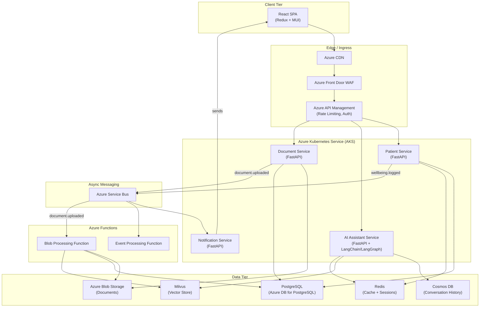

# High-Level Design
## Personalized Cancer Support Platform

## Table of Contents
- [Architecture Diagram](#architecture-diagram)
- [Service Definitions](#service-definitions)
- [API Design (Primary REST Endpoints)](#api-design-primary-rest-endpoints)
- [Technology Mapping](#technology-mapping)

---

## Architecture Diagram

---

## Service Definitions

| Service | Runtime | Responsibility |
|---------|---------|---------------|
| **Patient Service** | FastAPI on AKS | Patient profiles, appointments, prescriptions, wellbeing logs, provider messaging. Primary CRUD service. |
| **AI Assistant Service** | FastAPI on AKS | Conversational agent powered by LangChain/LangGraph. Manages conversation memory, performs RAG queries against Milvus, streams responses. |
| **Document Service** | FastAPI on AKS | Upload/download/list medical documents. Writes to Blob Storage, stores metadata in PostgreSQL. Publishes `document.uploaded` events. |
| **Notification Service** | FastAPI on AKS | Consumes events from Service Bus, delivers push/email notifications for appointments, medication reminders, and provider messages. |
| **Blob Processing Function** | Azure Functions | Triggered by `document.uploaded` events from Service Bus. Reads the uploaded blob, extracts text (OCR/parsing), generates embeddings, and indexes them into Milvus for RAG. |
| **Event Processing Function** | Azure Functions | Consumes Service Bus messages for analytics aggregation, wellbeing trend computation, and batch reporting. |

---

## API Design (Primary REST Endpoints)

### Patient Service

| Method | Endpoint | Input | Response | Description |
|--------|----------|-------|----------|-------------|
| POST | `/patients` | `{name, dob, diagnosis, stage, treatment_plan}` | `Patient` | Register a new patient |
| GET | `/patients/{id}` | — | `Patient` | Retrieve patient profile |
| POST | `/patients/{id}/wellbeing` | `{date, symptoms[], mood, vitals{}}` | `WellbeingEntry` | Log daily wellbeing |
| GET | `/patients/{id}/wellbeing?from=&to=` | Query params | `WellbeingEntry[]` | Retrieve wellbeing history |
| GET | `/patients/{id}/appointments` | — | `Appointment[]` | List appointments |
| POST | `/patients/{id}/appointments` | `{provider_id, datetime, type, notes}` | `Appointment` | Schedule appointment |
| GET | `/patients/{id}/prescriptions` | — | `Prescription[]` | List active prescriptions |
| POST | `/patients/{id}/messages` | `{to_provider_id, body, attachments[]}` | `Message` | Send message to provider |
| GET | `/patients/{id}/messages?thread=` | Query params | `Message[]` | Retrieve message thread |

### AI Assistant Service

| Method | Endpoint | Input | Response | Description |
|--------|----------|-------|----------|-------------|
| POST | `/assistant/conversations` | `{patient_id}` | `Conversation` | Start new conversation |
| POST | `/assistant/conversations/{id}/messages` | `{content}` | `SSE stream` | Send message, receive streamed response |
| GET | `/assistant/conversations/{id}/history` | — | `Message[]` | Retrieve conversation history |

### Document Service

| Method | Endpoint | Input | Response | Description |
|--------|----------|-------|----------|-------------|
| POST | `/documents/upload` | `multipart/form-data {patient_id, file, type}` | `DocumentMeta` | Upload medical document |
| GET | `/documents/{id}/download` | — | `binary stream` | Download document |
| GET | `/patients/{id}/documents` | — | `DocumentMeta[]` | List patient documents |

---

## Technology Mapping

| Technology | Role in Architecture | Justification |
|------------|---------------------|---------------|
| **FastAPI + Pydantic** | All backend services | Async-native, auto-generates OpenAPI specs, Pydantic enforces schema validation at API boundaries. High performance for I/O-bound healthcare workloads. |
| **SQLAlchemy + Alembic** | ORM and migrations for PostgreSQL | Mature Python ORM; Alembic provides versioned, auditable schema migrations — critical for HIPAA change tracking. |
| **LangChain + LangGraph** | AI Assistant orchestration | LangChain provides RAG pipeline abstractions (retriever + LLM chain). LangGraph adds stateful, graph-based conversation flows with branching logic (e.g., escalation to human support). |
| **Milvus** | Vector store for semantic search | Purpose-built for high-dimensional vector similarity search. Supports the RAG retrieval step against medical knowledge embeddings. |
| **Redis** | Session cache, rate limiting, application cache | Sub-millisecond reads for session tokens and frequently accessed patient data. Used by APIM for rate limiting counters. |
| **PostgreSQL (Azure Database for PostgreSQL)** | Primary relational store | ACID transactions for medical records, prescriptions, appointments. Strong consistency for PHI data. |
| **Cosmos DB** | Conversation history | Flexible schema for varied conversation structures. Automatic TTL for session data. Global distribution not needed at current scale but available for growth. |
| **Azure Blob Storage** | Medical document storage | Cost-effective object storage with tiered lifecycle policies (hot -> cool -> archive). Integrates natively with Azure Functions triggers. |
| **Azure Service Bus** | Async event messaging | Enterprise-grade message broker with dead-letter queues, at-least-once delivery, and session support. Decouples services for event-driven flows. |
| **Azure Functions** | Serverless event processing | Blob-triggered document processing and Service Bus-triggered analytics. Scales to zero when idle — cost-efficient for bursty workloads. |
| **AKS** | Container orchestration | Runs long-lived services (Patient, AI Assistant, Document, Notification). Provides auto-scaling, health checks, and service mesh capabilities. |
| **Azure API Management** | API gateway | Centralized auth enforcement, rate limiting, request transformation, and API versioning. Single entry point for all client traffic. |
| **React + Redux + MUI** | Frontend SPA | Component-based UI with centralized state management (Redux Toolkit). MUI provides accessible, healthcare-appropriate UI components. |
| **Docker + Docker Compose** | Local development and containerization | Consistent dev/prod parity. Compose orchestrates local multi-service development. |
| **GitHub Actions + Azure DevOps** | CI/CD | GitHub Actions for build/test; Azure DevOps Pipelines for AKS deployment with approval gates. |

### Alternatives Considered but Not Chosen

| Alternative | Rejected Because |
|-------------|-----------------|
| **GraphQL (instead of REST)** | REST is simpler for the well-defined CRUD operations in this domain. GraphQL's flexibility adds complexity without proportional benefit for this API surface. |
| **RabbitMQ (instead of Service Bus)** | Service Bus integrates natively with Azure Functions and provides enterprise features (dead-letter, sessions) without self-managed infrastructure. |
| **Pinecone (instead of Milvus)** | Milvus is specified in the tech stack and can be self-hosted on AKS, giving full control over PHI-containing embeddings — critical for HIPAA compliance. |
| **MongoDB (instead of Cosmos DB)** | Cosmos DB is already in the Azure ecosystem, offers turnkey geo-replication, and avoids managing a separate MongoDB cluster. |

> **Deep Dive Reference:** API versioning strategy — as the platform evolves, a clear versioning scheme (URL path vs. header-based) should be defined in APIM to avoid breaking mobile/web clients during updates.
