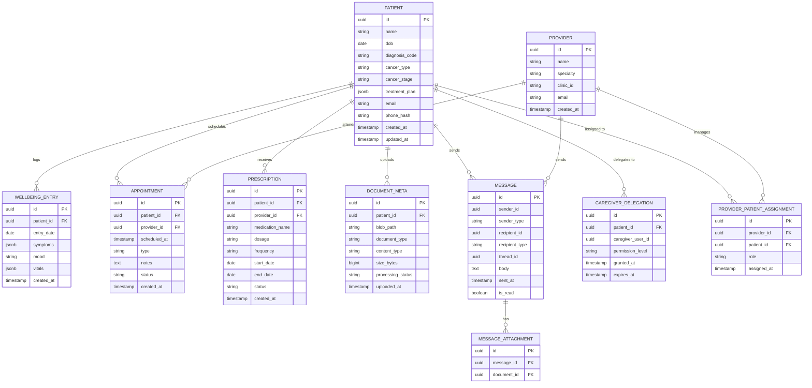

# Data Modeling & Storage
## Personalized Cancer Support Platform

## Table of Contents
- [Schema Design](#schema-design)
- [Storage Choice & Mapping](#storage-choice--mapping)
- [Partitioning & Sharding Strategy](#partitioning--sharding-strategy)

---

## Schema Design

### Entity-Relationship Diagram



---

## Storage Choice & Mapping

### PostgreSQL (Azure Database for PostgreSQL) — Relational Core

**Entities stored:** `Patient`, `Provider`, `WellbeingEntry`, `Appointment`, `Prescription`, `DocumentMeta`, `Message`, `MessageAttachment`

These entities require ACID transactions, referential integrity, and complex query support (e.g., joining prescriptions with appointments for treatment timeline views). PostgreSQL's `jsonb` columns handle semi-structured fields like `symptoms` and `vitals` without requiring schema changes for every new metric.

**Key design decisions:**
- UUIDs as primary keys to avoid sequential ID enumeration (security) and support distributed ID generation.
- `treatment_plan` stored as `jsonb` — treatment protocols vary significantly by cancer type; a rigid relational model would require constant schema changes.
- `sender_type` / `recipient_type` polymorphic columns on `Message` to support both patient-to-provider and provider-to-patient messaging without separate tables.
- Soft deletes via `status` fields rather than row deletion — HIPAA requires audit trails on PHI modifications.

### Cosmos DB — Conversation History

**Entities stored:** `Conversation` (with embedded `messages` array)

Conversation data is modeled as a single Cosmos DB document per conversation (not as relational entities). Messages are embedded within the conversation document, optimized for the access pattern of loading a full conversation by ID. This is intentionally not in the ER diagram above, which covers only the PostgreSQL relational schema.

```json
{
  "id": "conv-uuid",
  "patient_id": "patient-uuid",
  "status": "active",
  "messages": [
    {
      "role": "user",
      "content": "What are common side effects of carboplatin?",
      "timestamp": "2026-03-15T10:30:00Z"
    },
    {
      "role": "assistant",
      "content": "Common side effects include...",
      "citations": [{"source": "nci-doc-123", "chunk_id": 5}],
      "timestamp": "2026-03-15T10:30:02Z"
    }
  ],
  "created_at": "2026-03-15T10:29:55Z",
  "ttl": 7776000
}
```

**Partition key:** `patient_id` — ensures all conversations for a patient are co-located for efficient queries. At ~100K patients, partition fanout is sufficient to avoid hot partitions.

### Milvus — Vector Store

**Collections:**
- `medical_knowledge` — embeddings from curated medical articles, treatment guidelines, and drug information. Fields: `chunk_id`, `source_doc_id`, `embedding (1536-dim)`, `text_content`, `metadata{}`.
- `patient_documents` — embeddings from patient-uploaded documents (after OCR/extraction by Blob Processing Function). Fields: `chunk_id`, `patient_id`, `document_id`, `embedding`, `text_content`.

**Index type:** IVF_FLAT for `medical_knowledge` (moderate collection size, high recall needed); HNSW for `patient_documents` (faster approximate search for per-patient scoping).

### Redis — Cache Layer

| Key Pattern | TTL | Purpose |
|-------------|-----|---------|
| `session:{token}` | 30 min | Session data for authenticated users |
| `patient:{id}:profile` | 10 min | Cached patient profile to avoid repeated DB reads |
| `patient:{id}:wellbeing:latest` | 5 min | Latest wellbeing entry for dashboard rendering |
| `ratelimit:{client_ip}:{endpoint}` | 1 min | Sliding window rate limiting counters |

### Azure Blob Storage — Documents

**Container structure:**
- `medical-documents/{patient_id}/{document_id}/{filename}` — original uploads
- `processed/{patient_id}/{document_id}/extracted.json` — OCR/parsed text output

**Lifecycle policy:** Hot tier for 90 days -> Cool tier for 1 year -> Archive tier after 1 year. HIPAA requires minimum 6-year retention for medical records.

---

## Partitioning & Sharding Strategy

At the estimated scale (~100K patients, ~500 QPS peak), **PostgreSQL does not require sharding**. A single Azure SQL instance with read replicas handles this load comfortably. The evolution path:

1. **Current:** Single primary + 1 read replica. Wellbeing queries and reporting hit the replica.
2. **Trigger for change:** When write QPS consistently exceeds ~2,000 or storage exceeds 4 TB.
3. **Evolution:** Partition `wellbeing_entry` table by `entry_date` (range partitioning) to manage table size and enable efficient archival. If write throughput demands it, introduce Citus for distributed PostgreSQL.

Cosmos DB partitioning by `patient_id` is configured from day one — this is a Cosmos DB best practice and has no operational cost.

> **Deep Dive Reference:** PostgreSQL partitioning — the `wellbeing_entry` table will grow fastest (~100K patients x 365 entries/year). Implementing declarative range partitioning by month should be evaluated within the first year to maintain query performance on historical data.
