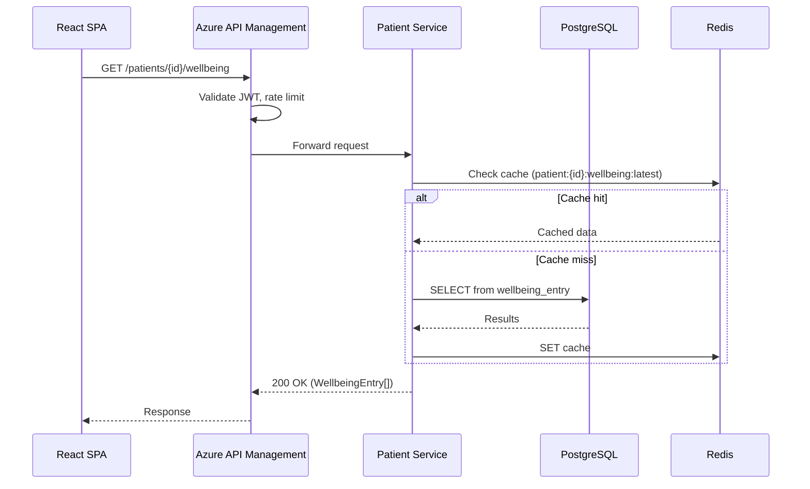
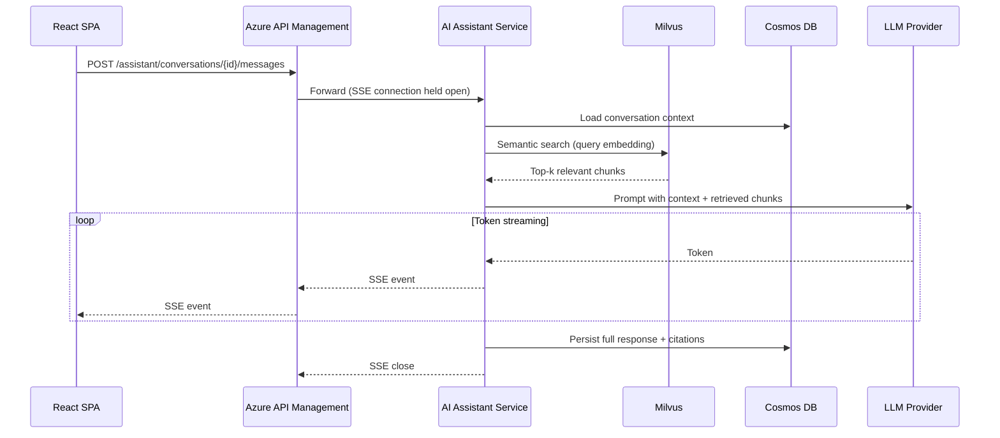

# Deep Dive & Bottlenecks
## Personalized Cancer Support Platform

## Table of Contents
- [Communication Patterns](#communication-patterns)
- [Failure Modes & Mitigation](#failure-modes--mitigation)
- [Trade-offs](#trade-offs)

---

## Communication Patterns

### Synchronous Flows (REST over HTTPS)

All client-initiated CRUD operations use synchronous REST. The API gateway (Azure API Management) handles JWT validation and rate limiting before traffic reaches services. This pattern applies to:
- Patient profile reads/writes (Patient Service <-> PostgreSQL)
- Appointment and prescription management (Patient Service <-> PostgreSQL)
- Document metadata listing (Document Service <-> PostgreSQL)
- Document upload/download (Document Service <-> Blob Storage)

### Streaming Flow (Server-Sent Events)

The AI Assistant uses SSE for streaming responses to the client. The LangGraph execution graph processes the query through retrieval, reasoning, and generation nodes, emitting tokens as they are produced. This keeps perceived latency under 2 seconds for first-token delivery.

### Asynchronous Flows (Azure Service Bus)

Event-driven patterns decouple time-intensive operations from the request path:

| Event | Publisher | Consumer | Action |
|-------|-----------|----------|--------|
| `document.uploaded` | Document Service | Blob Processing Function | Extract text via OCR, generate embeddings, index into Milvus |
| `wellbeing.logged` | Patient Service | Event Processing Function | Update trend analytics, check for alert thresholds |
| `wellbeing.alert` | Event Processing Function | Notification Service | Send alert to patient's care team if vitals exceed thresholds |
| `appointment.reminder` | Scheduled trigger (cron) | Notification Service | Send reminder 24h and 1h before appointments |
| `message.received` | Patient Service | Notification Service | Push notification to recipient |

**Service Bus configuration:** Topics with subscriptions (pub/sub model) rather than queues, allowing multiple consumers per event type. Dead-letter queues configured with a max delivery count of 5 and a 14-day retention for forensic analysis of failed messages.

---

## Failure Modes & Mitigation

### Single Points of Failure (SPOFs)

| SPOF | Impact | Mitigation |
|------|--------|------------|
| **PostgreSQL primary** | All CRUD operations fail | Azure Database for PostgreSQL automatic failover with zone-redundant deployment. RPO < 5 seconds, RTO < 30 seconds. Read replica promoted automatically. |
| **Redis instance** | Cache misses increase DB load; sessions lost | Azure Cache for Redis with zone redundancy. Fallback: services degrade gracefully to direct DB reads. Session tokens use sliding expiry to minimize re-authentication impact. |
| **Milvus cluster** | AI Assistant cannot perform RAG retrieval | Deploy Milvus on AKS with 2+ query nodes. Fallback: AI Assistant responds using conversation context only, with a disclaimer that knowledge base search is temporarily unavailable. |
| **Azure Service Bus** | Async events stall (notifications, document processing) | Service Bus has built-in geo-disaster recovery. For transient failures, publishers use exponential backoff with retry. Events are idempotent — safe to replay. |
| **AI Assistant Service** | Chatbot unavailable | AKS horizontal pod autoscaler (HPA) with min 2 replicas across availability zones. Circuit breaker on LLM provider calls (fallback: "Service temporarily unavailable, please try again"). |
| **Azure API Management** | All API traffic blocked | APIM runs in zone-redundant mode. Premium tier provides multi-region deployment if needed at scale. |

### Cascading Failure Prevention

- **Circuit breakers** (implemented via `tenacity` or `circuitbreaker` Python libraries) on all external calls: LLM provider, Milvus, Cosmos DB. Open circuit after 5 consecutive failures; half-open retry after 30 seconds.
- **Bulkhead isolation:** AI Assistant Service runs in a separate AKS node pool from Patient Service and Document Service. A resource-intensive RAG query cannot starve appointment booking of CPU/memory.
- **Backpressure:** Service Bus consumers use `max_concurrent_calls` configuration to limit parallel message processing, preventing downstream database overload during event spikes.

---

## Trade-offs

### Latency vs. Accuracy (AI Assistant)

The RAG pipeline retrieves the top-k (k=5) most relevant document chunks before generating a response. Increasing k improves answer accuracy but adds latency (each additional Milvus query + context window expansion). At k=5 with 1536-dim embeddings, retrieval adds ~50ms. This is an acceptable trade-off — medical accuracy is more important than shaving milliseconds, but k > 10 would push first-token latency beyond the 2-second SLO.

### Consistency vs. Availability (Data Stores)

- **PostgreSQL (CP):** Strong consistency for medical records. During a failover event (~30 seconds), writes are rejected rather than risk data corruption. This is the correct trade-off for PHI data.
- **Cosmos DB (tunable):** Session consistency level — a patient always sees their own latest messages, but a provider might see a few seconds of lag. Sufficient for conversational data; strong consistency would double RU costs.
- **Redis (AP):** Cache data is inherently best-effort. A stale cache entry for 5 minutes is acceptable; serving stale appointment data is not — hence short TTLs and explicit invalidation on writes (see 05-reliability.md).

### Throughput vs. Cost (Serverless vs. AKS)

Azure Functions are used for bursty, event-triggered workloads (document processing, analytics aggregation) because they scale to zero when idle. The core services run on AKS because they need persistent connections (SSE streaming), in-memory caches, and predictable latency. Running the AI Assistant on Functions would introduce cold-start latency (~2-5 seconds) that violates the streaming SLO.

### Build vs. Buy (Document Processing)

OCR and text extraction use Azure AI Document Intelligence (formerly Form Recognizer) rather than self-hosted Tesseract. The managed service costs more per page but avoids maintaining GPU infrastructure for OCR, which is disproportionate to the platform's scale (~20 documents/user). This follows from the cost-proportionality principle in the project's scale estimates (01-requirements.md).

> **Deep Dive Reference:** LLM provider failover — if the primary LLM provider experiences an outage, the AI Assistant should have a secondary provider configured. Evaluate Azure OpenAI Service as primary with a fallback to Anthropic Claude (or vice versa), including prompt compatibility and cost implications.
