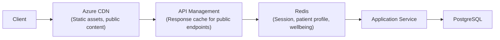
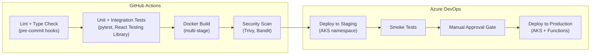

# Reliability & Observability
## Personalized Cancer Support Platform

## Table of Contents
- [Read/Write Optimizations](#readwrite-optimizations)
- [Caching Strategy](#caching-strategy)
- [Telemetry — Three Pillars](#telemetry--three-pillars)
- [Automation — CI/CD Pipeline](#automation--cicd-pipeline)

---

## Read/Write Optimizations

### Indexing Strategy

| Table | Index | Type | Query Pattern |
|-------|-------|------|---------------|
| `wellbeing_entry` | `(patient_id, entry_date DESC)` | Composite B-tree | Dashboard: fetch latest N entries for a patient. Covers the most frequent read query. |
| `wellbeing_entry` | `(entry_date)` | B-tree (partition key) | Range queries for trend analytics and batch reporting by date window. |
| `appointment` | `(patient_id, scheduled_at)` | Composite B-tree | Upcoming appointments list, sorted by date. |
| `appointment` | `(provider_id, scheduled_at)` | Composite B-tree | Provider schedule view — list all appointments for a provider in a time range. |
| `prescription` | `(patient_id, status)` | Composite B-tree | Active prescriptions filter — `WHERE status = 'active'`. |
| `message` | `(thread_id, sent_at)` | Composite B-tree | Conversation thread loading — messages in chronological order. |
| `message` | `(recipient_id, is_read)` | Composite B-tree | Unread message count for notification badges. |
| `document_meta` | `(patient_id, uploaded_at DESC)` | Composite B-tree | Patient document listing, most recent first. |
| `document_meta` | `(processing_status)` | Partial B-tree (`WHERE status = 'pending'`) | Blob Processing Function: find unprocessed documents. Partial index keeps size minimal. |

**SQL optimization notes** (aligned with responsibilities for optimizing complex SQL):
- Wellbeing trend queries use window functions (`LAG`, `AVG OVER`) rather than self-joins. Materialized views refresh hourly for dashboard aggregates (average mood, symptom frequency by week).
- Prescription queries use CTEs to avoid repeated subquery evaluation when joining with appointment data for treatment timeline views.
- `EXPLAIN ANALYZE` is run in CI for any migration that adds or modifies queries touching > 10K rows, catching regressions before deployment.

### Read Replicas

PostgreSQL read replica handles:
- Wellbeing trend analytics and reporting queries
- Provider dashboard aggregations (patient lists, schedule views)
- Document metadata searches

Write path remains on primary for all CRUD operations. Application-level routing via SQLAlchemy `bind_keys` configuration directs read-only queries to the replica.

---

## Caching Strategy

### Multi-Layer Approach



| Layer | What's Cached | TTL | Invalidation |
|-------|---------------|-----|-------------|
| **Azure CDN** | Static React SPA assets (JS/CSS bundles, images), public medical information pages | 24 hours | Cache-busted via Webpack content hashes in filenames. Purge API on deployment. |
| **APIM Response Cache** | Public, non-PHI endpoints (e.g., cancer type information, general FAQs) | 1 hour | Time-based expiry only. PHI endpoints are never cached at this layer. |
| **Redis — Application Cache** | Patient profiles, latest wellbeing entries, appointment lists | 5-10 min | **Cache-aside pattern with explicit invalidation.** On write, the service deletes the cache key. Next read repopulates from DB. |
| **Redis — Session Store** | JWT session data, CSRF tokens | 30 min sliding | Sliding expiry resets on each authenticated request. Explicit delete on logout. |

### Cache Invalidation Logic

The platform uses **cache-aside** (lazy-loading) as the primary pattern, with **explicit invalidation on writes** to prevent serving stale PHI data:

```python
# Write path (Patient Service)
async def update_patient_profile(patient_id, data):
    await db.update(Patient, patient_id, data)
    await redis.delete(f"patient:{patient_id}:profile")  # Invalidate

# Read path (Patient Service)
async def get_patient_profile(patient_id):
    cached = await redis.get(f"patient:{patient_id}:profile")
    if cached:
        return deserialize(cached)
    profile = await db.get(Patient, patient_id)
    await redis.setex(f"patient:{patient_id}:profile", 600, serialize(profile))
    return profile
```

**Why not write-through?** Write-through would update the cache on every write, but many writes (e.g., internal status changes, audit log entries) don't correspond to cached entities. Cache-aside avoids unnecessary cache writes and keeps the caching logic explicit. This aligns with the responsibility for developing cache invalidation strategies that ensure data consistency.

**Race condition mitigation:** For high-contention keys, use Redis `SET ... NX` with a short lock TTL to prevent thundering herd on cache miss. At current scale (~500 QPS peak), this is a precaution rather than an active concern.

---

## Telemetry — Three Pillars

### Metrics (SLIs / SLOs)

| SLI | SLO | Measurement |
|-----|-----|-------------|
| **API availability** | 99.9% of requests return non-5xx in any 30-day window | Azure Monitor + APIM analytics |
| **API latency** | p95 < 300 ms for CRUD endpoints | Application-level histogram (OpenTelemetry) |
| **AI first-token latency** | p95 < 2 seconds | Custom metric emitted by AI Assistant Service at first SSE event |
| **Document processing time** | p95 < 60 seconds from upload to indexed | Service Bus message age + Function execution duration |
| **Error budget burn rate** | Alert when 50% of monthly budget consumed in 24 hours | Azure Monitor alert rules |

**Implementation:** OpenTelemetry SDK integrated into each FastAPI service via middleware. Metrics exported to Azure Monitor (Application Insights) for dashboarding and alerting.

### Structured Logging

All services emit structured JSON logs with consistent fields:

```json
{
  "timestamp": "2026-03-15T10:30:00.123Z",
  "level": "INFO",
  "service": "patient-service",
  "trace_id": "abc123",
  "span_id": "def456",
  "patient_id": "REDACTED",
  "action": "wellbeing_entry_created",
  "duration_ms": 45
}
```

**Key policies:**
- PHI fields (`patient_id`, `name`, etc.) are **redacted or hashed** in logs. Full values are accessible only through the application with proper RBAC — never through log search. This is a HIPAA requirement.
- Logs ship to Azure Monitor Logs (Log Analytics workspace) with 90-day hot retention, 1-year cold retention.
- Log levels: `ERROR` triggers PagerDuty alert; `WARN` aggregated in daily ops digest; `INFO`/`DEBUG` for investigation.

### Distributed Tracing

OpenTelemetry traces propagate across all service boundaries:

- **React SPA** -> **APIM** -> **FastAPI services** -> **PostgreSQL / Redis / Cosmos DB / Milvus**
- Service Bus messages carry trace context in message properties, enabling end-to-end tracing from API call through async processing.
- Azure Functions extract trace context from Service Bus messages, maintaining trace continuity.

Trace sampling: 100% for errors, 10% for successful requests at steady state. Adjustable via environment variable without redeployment.

---

## Automation — CI/CD Pipeline

### Pipeline Architecture



### Deployment Strategy — Canary Releases

1. **Staging:** Full deployment to staging namespace in AKS. Automated smoke tests validate core flows (patient registration, wellbeing logging, AI assistant query).
2. **Canary (10%):** New version deployed alongside current production. APIM routes 10% of traffic to canary pods. Monitored for 15 minutes — automatic rollback if error rate exceeds 1% or p95 latency exceeds 500 ms.
3. **Progressive rollout:** 10% -> 50% -> 100% over ~30 minutes with automated health checks at each stage.
4. **Azure Functions:** Deployed via staging slots with swap-on-approval. No canary needed — Functions are stateless and event-driven.

**Pre-commit hooks** (aligned with responsibilities): `black` (formatting), `ruff` (linting), `mypy` (type checking), `bandit` (security), and `pytest` (unit tests for changed files). Prevents low-quality commits from entering the pipeline.

> **Deep Dive Reference:** Database migration rollback strategy — Alembic migrations run as a pre-deployment step. Investigate a "double-write" pattern for breaking schema changes to enable zero-downtime rollback without data loss.
