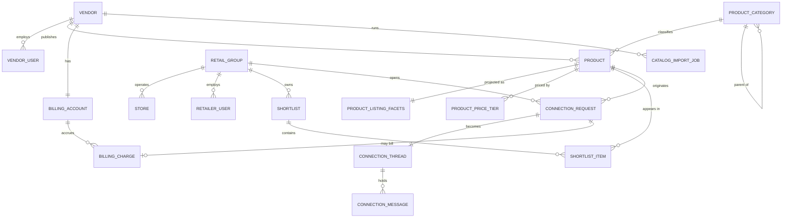

# Data Modeling & Storage

*Retail Software Aggregation Platform*

## Table of Contents

- [The Split: Spine in PostgreSQL, Body in MongoDB](#the-split-spine-in-postgresql-body-in-mongodb)
- [Entity-Relationship Model](#entity-relationship-model)
- [PostgreSQL Schema](#postgresql-schema)
- [MongoDB Collections](#mongodb-collections)
- [Blob Layout](#blob-layout)
- [Storage Choice, Partitioning and Sharding](#storage-choice-partitioning-and-sharding)
- [Consistency Between the Two Stores](#consistency-between-the-two-stores)
- [Retention and Deletion](#retention-and-deletion)

## The Split: Spine in PostgreSQL, Body in MongoDB

Two responsibilities in the brief look contradictory and are not: MongoDB holds product metadata "without a fixed column set", while PostgreSQL holds "product listings used by search, shortlists, and the admin workspace". The resolution is that a listing has two halves with different governance.

- The **spine** — identity, ownership, category, status, publication timestamp, and the handful of attributes every category shares — is relational. It has referential integrity to vendors and categories, it participates in shortlists and connections, and it is what search and the admin workspace query. It lives in `postgres-core`.
- The **body** — everything specific to being a POS, an inventory system or a loyalty engine — has no schema the platform can fix in advance without blocking the next category. It lives in `mongo-catalog` as a document validated against a per-category facet schema rather than a table definition.

Filterable attributes are the seam. A facet a retailer can filter on must be queryable relationally, so `indexer-worker` **projects** the facetable subset of the Mongo document into `product_listing_facets` in Postgres. That projection is the price of the split, and it is why catalog reads are AP in `01-requirements.md`: the projection trails the document by seconds.

## Entity-Relationship Model

## PostgreSQL Schema

Every table carries `id uuid PRIMARY KEY DEFAULT gen_random_uuid()`, `created_at timestamptz NOT NULL DEFAULT now()` and, where mutable, `updated_at timestamptz`. Monetary values are integer minor units with an explicit ISO-4217 `currency char(3)` — never floating point.

**Organisations and people**

| Table | Columns beyond the common set | Notes |
|---|---|---|
| `vendor` | `legal_name`, `slug UNIQUE`, `status` (`pending`,`active`,`suspended`), `hq_country char(2)`, `website` | Vetting state gates publication |
| `vendor_user` | `vendor_id FK`, `email CITEXT`, `auth_subject UNIQUE`, `role` (`owner`,`editor`,`viewer`), `status` | `auth_subject` is the JWT `sub`; no password material is stored here |
| `retail_group` | `legal_name`, `slug UNIQUE`, `country char(2)`, `store_count_band`, `status` | The buying organisation |
| `store` | `retail_group_id FK`, `external_ref`, `country char(2)`, `region`, `city`, `format` (`hypermarket`,`supermarket`,`convenience`,`specialty`), `is_active bool` | `UNIQUE (retail_group_id, external_ref)`. 250k rows at year 5; feeds coverage matching |
| `retailer_user` | `retail_group_id FK`, `email CITEXT`, `auth_subject UNIQUE`, `role` (`admin`,`category_manager`,`viewer`), `status` | |
| `platform_user` | `email CITEXT`, `auth_subject UNIQUE`, `role` (`operator`,`moderator`,`support`) | No `org_id`; carries `platform:admin` scope |

**Catalog spine**

| Table | Columns | Notes |
|---|---|---|
| `product_category` | `parent_id FK NULL`, `slug UNIQUE`, `name`, `facet_schema_ref` | `facet_schema_ref` names a document in `mongo-catalog.facet_schemas`; the only cross-store pointer in the schema |
| `product` | `vendor_id FK`, `category_id FK`, `slug`, `name`, `status` (`draft`,`in_review`,`published`,`archived`), `published_at timestamptz NULL`, `current_revision_id uuid NULL`, `withdrawn_reason` | `UNIQUE (vendor_id, slug)`. `current_revision_id` points at `mongo-catalog.product_metadata_revisions._id` |
| `product_price_tier` | `product_id FK`, `tier_name`, `price_minor bigint`, `currency`, `unit` (`per_store_month`,`per_lane_month`,`flat_year`), `min_stores int`, `max_stores int NULL` | Structured because the comparison view sorts and ranges over it; free-form pricing prose stays in Mongo |
| `product_listing_facets` | `product_id PK/FK`, `vendor_id`, `category_slug`, `status`, `country_coverage text[]`, `deployment_model` (`saas`,`on_prem`,`hybrid`), `price_model` (`subscription`,`perpetual`,`usage`), `price_from_minor bigint NULL`, `currency`, `integrations text[]`, `facets jsonb`, `search_vector tsvector`, `published_at`, `source_revision_id uuid`, `projected_at timestamptz` | **Denormalised read model.** Written only by `indexer-worker`, read only by `catalog-service`. `vendor_id`, `status` and `published_at` are copied from `product` deliberately so the search query never joins |

Indexes on `product_listing_facets`, which every access pattern in `05-reliability.md` refers to:

- `idx_plf_search` — `GIN (search_vector)`, free-text over name, summary and vendor name.
- `idx_plf_facets` — `GIN (facets jsonb_path_ops)`, arbitrary category-specific predicates.
- `idx_plf_arrays` — `GIN (country_coverage)` and `GIN (integrations)`, array containment.
- `idx_plf_browse` — `BTREE (category_slug, published_at DESC, product_id)` `WHERE status = 'published'`, the partial index serving the default browse ordering and keyset pagination.
- `idx_plf_price` — `BTREE (category_slug, price_from_minor)` `WHERE status = 'published' AND price_from_minor IS NOT NULL`, the price-sorted variant.

**Buyer working set**

| Table | Columns | Notes |
|---|---|---|
| `shortlist` | `retail_group_id FK`, `name`, `created_by FK retailer_user`, `visibility` (`group`,`private`) | |
| `shortlist_item` | `shortlist_id FK`, `product_id FK`, `added_by FK`, `note text`, `status` (`candidate`,`contacted`,`rejected`), `added_at` | `PRIMARY KEY (shortlist_id, product_id)`. `status` is the brief's "who is already in talks" — set to `contacted` by `connection-service` via an event, never by the retailer editing it by hand |

**Commercial**

| Table | Columns | Notes |
|---|---|---|
| `connection_request` | `product_id FK`, `vendor_id FK`, `retail_group_id FK`, `initiated_by FK retailer_user`, `status` (`open`,`responded`,`closed`,`withdrawn`), `store_scope text[] NULL`, `idempotency_key`, `first_response_at timestamptz NULL` | `UNIQUE (retail_group_id, idempotency_key)` — the database, not the cache, is what finally prevents a duplicate thread and a duplicate charge. `vendor_id` is denormalised from `product` so vendor-side listing queries need no join |
| `connection_thread` | `connection_request_id FK UNIQUE`, `subject`, `state` (`active`,`archived`), `last_message_at` | |
| `connection_message` | `thread_id FK`, `sender_subject`, `sender_side` (`vendor`,`retailer`,`system`), `body text`, `attachments jsonb`, `created_at` | **Partitioned monthly by `created_at`**; `BTREE (thread_id, created_at DESC)` per partition |
| `billing_account` | `vendor_id FK UNIQUE`, `plan_code`, `status`, `psp_customer_ref`, `current_period_end` | `psp_customer_ref` is an opaque external reference; no payment instrument is stored (`06-security.md`) |
| `billing_charge` | `billing_account_id FK`, `kind` (`subscription`,`connection`), `connection_request_id FK NULL`, `amount_minor`, `currency`, `status`, `psp_invoice_ref` | `UNIQUE (connection_request_id) WHERE kind = 'connection'` — a connection bills at most once, enforced in the schema rather than in retry logic |

Secondary indexes on the tables above, all referenced by the access patterns in `05-reliability.md`:

- `idx_shortlist_group` — `BTREE (retail_group_id)` on `shortlist`.
- `idx_conn_vendor` — `BTREE (vendor_id, status, created_at DESC)` on `connection_request`, served entirely by the denormalised `vendor_id` with no join to `product`.
- `idx_conn_group` — `BTREE (retail_group_id, status, created_at DESC)` on `connection_request`.
- `idx_msg_thread` — `BTREE (thread_id, created_at DESC)` on each monthly `connection_message` partition.

**Platform mechanics**

| Table | Columns | Notes |
|---|---|---|
| `oauth_client` | `client_id UNIQUE`, `client_secret_hash`, `org_type`, `org_id`, `grant_types text[]`, `redirect_uris text[]`, `scopes text[]` | |
| `refresh_token` | `subject`, `jti UNIQUE`, `org_type`, `org_id`, `issued_at`, `expires_at`, `revoked_at NULL`, `replaced_by uuid NULL` | Rotation chain; reuse of a revoked `jti` revokes the whole chain |
| `catalog_import_job` | `vendor_id FK`, `blob_uri`, `status` (`queued`,`running`,`partial`,`succeeded`,`failed`), `row_total`, `row_ok`, `row_failed`, `started_at`, `finished_at`, `error_digest jsonb` | Job state is relational so the vendor workspace can query it; row-level detail stays in Mongo staging |
| `outbox_event` | `aggregate_type`, `aggregate_id`, `type`, `payload jsonb`, `occurred_at`, `published_at timestamptz NULL` | `BTREE (occurred_at) WHERE published_at IS NULL` — the relay's only query |
| `audit_event` | `actor_subject`, `actor_side`, `action`, `object_type`, `object_id`, `request_id`, `occurred_at`, `payload jsonb` | **Partitioned monthly by `occurred_at`**, append-only, no update or delete grant. Written asynchronously off the outbox, never synchronously in the request path — a synchronous audit write would make replica-served catalog reads impossible |

## MongoDB Collections

Database `mongo-catalog`, four collections. Document `_id` for product metadata is the Postgres `product.id`, so the two stores join without a mapping table.

| Collection | Shape | Indexes |
|---|---|---|
| `product_metadata` | `{ _id: product_id, category_slug, revision int, schema_version, attributes: {…free form…}, modules: [], integrations: [], compliance: [], media: [{blob_key, kind, caption}], updated_at, updated_by }` | `{category_slug: 1}`, `{updated_at: -1}` |
| `product_metadata_revisions` | Immutable snapshot per publish: `{ _id: revision_id, product_id, revision, document, created_at, created_by }` | `{product_id: 1, revision: -1}` |
| `facet_schemas` | Per category: which `attributes` keys are typed, which are facetable, their value domains and display order. `product_category.facet_schema_ref` points here | `{_id: 1}`, `{category_slug: 1, version: -1}` |
| `import_staging` | One document per parsed import row, with the raw payload, the mapped result and per-row errors | `{job_id: 1}`, `{created_at: 1}` with a **TTL of 30 days** |

`facet_schemas` is what makes the schemaless store governable: Pydantic validates a vendor's submitted `attributes` against the category's schema at write time in `vendor-service`, so "no fixed column set" does not degrade into "no contract". Adding a category is a document insert plus a facet-projection mapping, not a migration.

Media and datasheets are **never** stored in Mongo. `media[].blob_key` references `blob-media`; the 16 MB document limit is not a constraint the design should ever approach.

## Blob Layout

| Prefix | Contents | Lifecycle |
|---|---|---|
| `listings/{product_id}/{revision}/…` | Vendor-supplied logos, screenshots, datasheets | Cool tier after 180 days |
| `listings/{product_id}/{revision}/derived/…` | Thumbnails and PDF previews written by `fn-media-process` | Regenerable; deleted with the revision |
| `imports/{vendor_id}/{job_id}.{csv,json}` | Raw import uploads | Deleted after 90 days |
| `admin-console/{build_sha}/…` | Static SPA bundle, served through Front Door | Last five builds retained |
| `tfstate/…` | Terraform state, versioning and lease locking enabled | Indefinite |

## Storage Choice, Partitioning and Sharding

**Neither database is sharded, and both should stay that way for the full five-year horizon.** `01-requirements.md` sizes `postgres-core` at ~110 GB and `mongo-catalog` at ~15 GB against a ~2 write/s peak. Sharding either would add a distributed-transaction problem and a rebalancing operation to buy capacity nothing needs.

What is used instead:

- **Vertical plus read replicas.** A zone-redundant Azure Database for PostgreSQL Flexible Server primary with one read replica. `catalog-service` reads the replica; every write path and every read that must be read-your-writes uses the primary. Replica lag is an SLI in `05-reliability.md`.
- **Declarative range partitioning by month** on the only two tables that grow without bound — `audit_event` and `connection_message`. Partitions older than the retention window detach in one metadata operation rather than a long-running `DELETE`.
- **MongoDB as a three-member replica set**, primary for writes and revisions, secondaries readable for the detail-page hydration path where a few hundred milliseconds of staleness is irrelevant.
- **Redis is not a store.** `redis-cache` holds nothing that cannot be rebuilt from Postgres and Mongo. `redis-broker` holds in-flight Celery tasks, which `04-deep-dive.md` treats as a durability question with a specific answer.

The evolution triggers from `01-requirements.md` restated as this file's own: shard `postgres-core` **only** above ~2,000 sustained write TPS or ~1 TB working set; the far likelier first move is moving `audit_event` out to Blob-backed cold storage, which removes ~25 GB and most of the growth.

> **Deep Dive Reference:** Facet schema evolution — when a category's `facet_schemas` document changes shape, existing `product_metadata` documents remain on the old `schema_version` and the projection must handle both. Whether that is a lazy migrate-on-read, a backfill job, or a hard version cutover per category determines how expensive category changes are for the rest of the platform's life, and it deserves a prototype before the first category ships.

## Consistency Between the Two Stores

The two stores are updated in one logical operation that cannot be one transaction. The rules that make it safe:

1. **Mongo first, Postgres commit second** (`02-high-level-design.md` shows the sequence). A revision document with no pointer is invisible garbage; a pointer to a missing document is a broken listing.
2. **Transactional outbox.** `outbox_event` is inserted in the same Postgres transaction as the state change. The relay publishes to `sb-catalog-events` or `sb-connection-events` afterwards and marks `published_at`. Delivery is therefore at-least-once, never zero-times.
3. **Idempotent projection.** `indexer-worker` upserts `product_listing_facets` keyed on `product_id` and ignores an event whose `source_revision_id` is older than the row's current value. Redelivery is a no-op; out-of-order delivery cannot roll a listing backwards.
4. **Orphan reconciliation.** A nightly Celery job on the `indexing` queue lists `product_metadata_revisions` created more than 24 hours ago with no matching `product.current_revision_id` and no successor revision, and deletes them. It also re-projects any `product` whose `projected_at` predates its `updated_at` by more than five minutes — the backstop for a lost event.

## Retention and Deletion

| Data | Retention | Mechanism |
|---|---|---|
| `audit_event` | 24 months | Detach and archive monthly partition to `blob-media` cool tier |
| `connection_message` | 36 months after thread close | Detach monthly partition |
| `product_metadata_revisions` | Latest 10 revisions per product, minimum 12 months | Compaction job on the `indexing` queue |
| `import_staging` | 30 days | Mongo TTL index |
| `refresh_token` | 30 days past `expires_at` | Nightly delete |
| Departed user | Immediate access revocation; `auth_subject` and `email` tombstoned | Message bodies are retained as the counterparty's business record — the GDPR reasoning and its cost are owned by `06-security.md` |
