# Reliability & Observability

*Retail Software Aggregation Platform*

## Table of Contents

- [Read/Write Optimizations](#readwrite-optimizations)
- [Caching Strategy](#caching-strategy)
- [Telemetry](#telemetry)
- [Alerting](#alerting)
- [Automation: CI/CD and Deployment](#automation-cicd-and-deployment)
- [Infrastructure as Code](#infrastructure-as-code)

## Read/Write Optimizations

Access patterns first; every index below exists to serve a named one, and every index named here is declared in `03-data-modeling.md`.

| Access pattern | Frequency | Index serving it |
|---|---|---|
| Browse a category, newest first, paged | Highest read | `idx_plf_browse` — partial `BTREE (category_slug, published_at DESC, product_id) WHERE status = 'published'` |
| Same, sorted by entry price | High | `idx_plf_price` — partial `BTREE (category_slug, price_from_minor)` |
| Free-text search over name, summary, vendor | High | `idx_plf_search` — `GIN (search_vector)` |
| Filter by country coverage or integration | High | `idx_plf_arrays` — `GIN` on `country_coverage` and on `integrations` |
| Filter by a category-specific attribute | Medium | `idx_plf_facets` — `GIN (facets jsonb_path_ops)` |
| Listing detail hydration | High | Primary keys in both stores; `product_metadata._id` **is** `product.id` |
| A group's shortlists and their items | Medium | `PRIMARY KEY (shortlist_id, product_id)`, plus `idx_shortlist_group` |
| A thread's messages, newest first | Medium | `idx_msg_thread` on each monthly `connection_message` partition |
| A vendor's open connections | Medium | `idx_conn_vendor` — served by the denormalised `vendor_id`, no join to `product`. `idx_conn_group` is its retailer-side mirror |
| Unpublished outbox rows | Constant, small | `BTREE (occurred_at) WHERE published_at IS NULL` |
| Import staging cleanup | Background | Mongo **TTL** index on `import_staging.created_at`, 30 days |

**Composite, partial, full-text and TTL are all present and each is doing distinct work**: composite for ordered browse, partial to keep unpublished and archived rows out of the hot indexes entirely, `GIN`/`tsvector` for text and containment, TTL for staging that must expire without a job.

Write-side optimizations:

- **`search_vector` is maintained by `indexer-worker`, not by a trigger.** A trigger would run inside the vendor's publish transaction, coupling write latency to text-search maintenance for a value only the projection needs.
- **Batched projection upserts** — 200 rows per statement during imports (`04-deep-dive.md`).
- **`connection_message` and `audit_event` inserts are append-only into the current monthly partition**, so index maintenance stays in a small, cache-resident B-tree.
- **Connection pooling** sized so the sum of all pod pool maxima stays below the Flexible Server connection limit; FastAPI's async handlers make a small pool per pod sufficient.

> **Deep Dive Reference:** Text search quality — `to_tsvector` with a single dictionary handles a monolingual catalog well and handles "Kassensystem" versus "POS" not at all. A multilingual European marketplace needs a language-per-listing configuration and probably trigram similarity for vendor-name fuzziness. Prototype against real vendor copy before assuming the `GIN` index is sufficient; this is also the most likely trigger for the dedicated search engine deferred in `01-requirements.md`.

## Caching Strategy

Three layers, each with an explicit invalidation rule. `redis-cache` is the only application cache in the system — no second cache technology appears anywhere in this design.

| Layer | Contents | TTL | Invalidation |
|---|---|---|---|
| **CDN (Front Door)** | Admin console bundle, listing media and derived thumbnails from `blob-media` | 7 days for immutable, build-SHA and revision-keyed paths | None needed — paths are content-addressed, a new revision is a new URL |
| **Redis — `cat:listing:{product_id}:v{rev}`** | Fully hydrated listing detail (spine + metadata + signed media URLs) | 15 min | **Cache-aside with event-driven purge.** `indexer-worker` deletes the key on `catalog.listing.updated`/`.published`. The `v{rev}` suffix means a stale key is unreachable even if the purge is lost |
| **Redis — `cat:search:{filter_hash}`** | Ordered `product_id` list for one filter+cursor combination | 60 s | TTL only. Enumerating every filter combination a listing change affects is intractable, so freshness is bought with a short TTL instead |
| **Redis — `cat:facets:{category_slug}`** | Facet value counts for a category | 5 min | Purged by `indexer-worker` on any projection write in that category |
| **Redis — `authz:jwks`** | Identity provider signing keys | 10 min | Refreshed on an unknown `kid`; the reason authorization costs 1 ms in the `04-deep-dive.md` budget |
| **Redis — `rl:*`, `idem:*`** | Rate-limit counters, idempotency keys | window / 24 h | Expiry only |
| **Application (in-process)** | `product_category` tree and `facet_schemas`, both tiny and near-static | 60 s | TTL only; a stale category label for a minute is harmless |

**Cache-aside, not write-through, and the choice is deliberate.** Write-through would put cache population inside the vendor's publish transaction, coupling a write path to a cache that `04-deep-dive.md` explicitly treats as expendable. Cache-aside keeps Redis strictly optional: if it is gone, everything still works, more slowly. The `v{rev}` key suffix is what makes cache-aside safe here — invalidation correctness does not depend on the purge message arriving, only on the revision pointer in `postgres-core` being current.

The stampede protections that make this survivable under concentrated traffic — single-flight locks and probabilistic early expiry — are owned by `04-deep-dive.md`.

## Telemetry

**Metrics — SLIs and SLOs.** Emitted in-process through the same OpenTelemetry SDK used for tracing and exported to Azure Monitor, so metrics, logs and traces share one instrumentation dependency and one set of resource attributes.

| SLI | SLO | Why it exists |
|---|---|---|
| `catalog_search_latency_seconds` (p95) | < 200 ms | The `01-requirements.md` target, decomposed in `04-deep-dive.md` |
| `catalog_read_availability` (non-5xx / total) | 99.9% monthly | Catalog read SLO |
| `write_path_availability` | 99.5% monthly | Connections, listings, billing |
| `indexer_lag_seconds` (event `occurred_at` → `projected_at`) | p95 < 5 s, p99 < 30 s | The staleness the AP choice bought; the number that tells you the projection died |
| `outbox_unpublished_age_seconds` | p99 < 30 s | Detects a stalled relay before consumers notice |
| `celery_queue_depth{queue}` | `imports` < 500, others < 100 | Also the HPA signal |
| `celery_task_failures_total{task}` | Alert on any sustained rate | The brief's "job failures" |
| `redis_cache_hit_ratio{keyspace}` | > 0.85 for `cat:search` | The latency budget assumes it |
| `postgres_replica_lag_seconds` | < 5 s | Above 30 s, `catalog-service` fails back to the primary |
| `connection_first_response_hours` (p50) | Tracked, not targeted | Whether the platform actually shortens sourcing — the liquidity metric flagged in `01-requirements.md` |

**Structured logging.** JSON to stdout, collected by Azure Monitor. Every line carries `request_id`, `trace_id`, `service`, `actor_side`, `org_id`, `route` and `status`. Two standing rules: **no log line contains a `connection_message.body`, a token, or a client secret**, and `org_id` is always present so a support query can be scoped to one tenant without a full-text sweep. Application logs are diagnostic and are not the audit trail — `audit_event` in `03-data-modeling.md` is, and it is written from the outbox rather than from a log pipeline.

**Distributed tracing.** OpenTelemetry auto-instrumentation for FastAPI, SQLAlchemy, the Mongo driver, Redis and Celery, exported to Application Insights. Trace context propagates through Service Bus message properties, so a trace spans the whole publish → project → invalidate → notify chain — which is precisely the chain nobody can debug from logs alone. Sampling: 100% of errors and of write-path requests, 5% of catalog reads.

> **Verify Before Build:** Trace continuity across Service Bus and Celery is the claim most likely to be false as written. Context propagation depends on the OpenTelemetry Python instrumentation versions for `azure-servicebus` and `celery` actually injecting and extracting the `traceparent` — both have been partly manual in the past. Pin the versions, then assert an end-to-end trace ID across a publish-to-notify flow in an integration test before relying on it during an incident.

## Alerting

The brief asks for API errors and job failures on catalog and connection flows specifically. Azure Monitor alert rules, each naming an owner and a runbook:

| Alert | Condition | Severity |
|---|---|---|
| Catalog read error budget burn | 14.4× burn rate over 1 h | Page |
| Connection create 5xx rate | > 1% over 5 min | Page |
| `indexer_lag_seconds` p95 > 60 s | 10 min | Page — silent failure, nothing else surfaces it |
| `outbox_unpublished_age_seconds` > 300 s | 5 min | Page |
| Service Bus dead-letter count > 0 on any subscription | Any | Ticket |
| `celery_task_failures_total` on `imports` > 5% of a job's rows | Per job | Ticket, plus the vendor sees `error_digest` |
| `postgres_replica_lag_seconds` > 30 s | 10 min | Ticket |
| Certificate or Key Vault secret expiring | 30 days out | Ticket |

## Automation: CI/CD and Deployment

GitLab CI is the only path to production. One repository, one pipeline, nine deployable images.

```mermaid
flowchart LR
    L["lint<br/>ruff + mypy"] --> U["unit<br/>pytest"]
    U --> I["integration<br/>pytest + Compose:<br/>postgres, mongo, redis"]
    I --> F["functional<br/>API contract tests<br/>vs OpenAPI"]
    F --> B["build<br/>docker, digest-pinned"]
    B --> S["scan<br/>image CVE + dependency audit"]
    S --> M["migrate<br/>alembic upgrade head<br/>(expand only)"]
    M --> D["deploy staging<br/>rolling"]
    D --> SM["smoke"]
    SM --> P["deploy production<br/>canary → rolling"]
    P --> C["contract<br/>alembic contract migration<br/>(separate, later MR)"]
```

- **Integration tests run against real data stores**, not mocks — Docker Compose brings up PostgreSQL, MongoDB and Redis at the pinned versions. The projection pipeline and the `GIN` query plans are exactly the things a mocked test would pass while broken.
- **Migrations are expand/contract and run before deploy.** `alembic upgrade head` only ever adds nullable columns, new tables and new indexes (`CONCURRENTLY`), so the previous image keeps running against the new schema throughout the rollout. Dropping a column is a separate merge request landed at least one release later. This is what makes rollback possible at all: the old image must be able to run against the new schema.
- **Canary for `catalog-service`, rolling for everything else.** `catalog-service` takes the traffic and carries the risky query plans, so it gets a second Deployment receiving ~10% via Ingress canary weighting, held for 15 minutes against its error rate and p95 before the weight advances. The other five services and three workers use a rolling update with readiness and liveness probes. **Blue/green was rejected**: it doubles the pod footprint and, because both colours share `postgres-core`, delivers no database-level isolation — which is the only part of the risk the expand/contract discipline does not already cover.
- **Rollback is a redeploy of the previous image digest**, safe by construction because the schema is compatible in both directions during the window.
- **Workers are drained, not killed.** `preStop` stops queue consumption and waits for the in-flight task, bounded by `terminationGracePeriodSeconds: 120`; long import chunks are sized to finish well inside it.
- **Autoscaling.** HPA on CPU for the six services (target 65%); HPA on `celery_queue_depth` via a custom metric adapter for the three worker pools, so a large import scales the importers without touching the web tier. Cluster autoscaler 3–8 nodes.

## Infrastructure as Code

Terraform owns every Azure resource named in `02-high-level-design.md`: AKS and its node pools, PostgreSQL Flexible Server and its replica, Azure Cache for Redis (both instances), the MongoDB deployment, Blob Storage containers and lifecycle rules, Service Bus namespace with its topics, subscriptions and dead-letter settings, the Function Apps, API Management, Front Door with WAF, Key Vault, and every Azure Monitor alert rule above.

State lives in the `tfstate/` container of `blob-media` with versioning and lease locking. Environments are separate workspaces over one module set, differing only in a variables file — so staging is the same topology at smaller instance sizes, which is what makes a staging smoke test meaningful. Applies run only from GitLab CI on the default branch, authenticated by workload identity rather than a stored service principal secret; `06-security.md` owns that decision.

**Alert rules are Terraform-managed and not editable in the portal.** An alert silenced by hand during an incident and never restored is the standard way monitoring rots.
