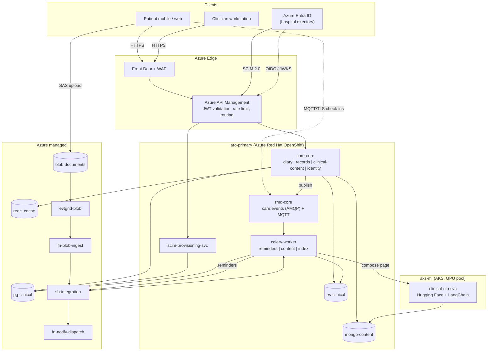

# High-Level Design
## Personalized Cancer Support Platform

**Table of Contents**

- [Service Topology and Naming](#service-topology-and-naming)
- [Architecture Diagram](#architecture-diagram)
- [API Design](#api-design)
- [Technology Mapping](#technology-mapping)
- [Alternatives Considered and Rejected](#alternatives-considered-and-rejected)
- [Stack Gaps Flagged](#stack-gaps-flagged)

---

This file is the **single source of truth for technology choice and component naming**. Files `03`–`06` use these names verbatim and introduce no substitutes.

## Service Topology and Naming

**Runtime components**

| Name | Shape | Responsibility |
|---|---|---|
| `care-core` | [FastAPI](https://fastapi.tiangolo.com/ "FastAPI — Python web framework for building HTTP APIs with async support and automatic schema generation") modular monolith, 4 modules | The product. Deployed and released as one unit |
| `scim-provisioning-svc` | FastAPI microservice | [SCIM](https://scim.cloud/ "System for Cross-domain Identity Management — Standardizes automated provisioning and deprovisioning of user identities between systems") 2.0 endpoints consumed by Azure Entra ID; clinician and care-team lifecycle |
| `clinical-nlp-svc` | FastAPI microservice, GPU-backed | Hugging Face inference + LangChain composition workflows |
| `fn-blob-ingest` | Azure Function, Event Grid trigger | Validates, scans, and text-extracts uploaded documents |
| `fn-notify-dispatch` | Azure Function, Service Bus trigger | Delivers push/email/[SMS](https://en.wikipedia.org/wiki/SMS "Short Message Service — Delivers short text messages over a mobile network") and records receipts |
| `celery-worker` | [Celery](https://docs.celeryq.dev/en/stable/ "Celery — Distributed task queue that runs background and scheduled jobs outside the request cycle") worker pool (3 queues) | Scheduled and retryable work owned by `care-core` |

**`care-core` modules** — separate packages, separate database schemas, no cross-module imports except through a published in-process interface:

- `diary` — check-in capture, schedules, adherence
- `records` — appointments, prescriptions, visit notes, document metadata, timeline assembly
- `clinical-content` — education page assignment, delivery, read-state
- `identity` — patient portal auth, care-relationship authorization, consent

> The brief names three modules (diary, clinical content, identity). `records` is separated here as a fourth because the clinical record is a distinct write model with different consistency and audit obligations from authored content — folding it into `clinical-content` would put a prescription and a leaflet behind the same code path. This is a deliberate addition to the brief, flagged rather than assumed.

**Data stores** — `pg-clinical` ([PostgreSQL](https://www.postgresql.org/docs/current/ "PostgreSQL — Relational database storing and querying structured data with strong transactional guarantees")), `mongo-content` ([MongoDB](https://www.mongodb.com/docs/ "MongoDB — Document database that stores schema-flexible JSON-like documents")), `es-clinical` (Elasticsearch), `redis-cache` ([Redis](https://redis.io/docs/latest/ "Redis — In-memory data store used as a cache and fast key-value store")), `blob-documents` (Azure Blob Storage).

**Messaging** — `rmq-core` ([RabbitMQ](https://www.rabbitmq.com/docs "RabbitMQ — Message broker that routes and queues messages between producers and consumers"): topic exchange `care.events` over [AMQP](https://www.amqp.org/ "Advanced Message Queuing Protocol — Standardizes reliable message queueing and routing between applications"), plus the [MQTT](https://mqtt.org/ "Message Queuing Telemetry Transport — Lightweight publish-subscribe protocol for constrained devices and unreliable networks") plugin for check-in ingress), `sb-integration` (Azure Service Bus: queues `sb.ingest`, `sb.notify`), `evtgrid-blob` (Event Grid, BlobCreated).

**Clusters** — `aro-primary` (Azure Red Hat OpenShift) hosts everything stateful and the two FastAPI services; `aks-ml` ([AKS](https://learn.microsoft.com/en-us/azure/aks/ "Azure Kubernetes Service — Managed Kubernetes hosting on Azure"), GPU node pool) hosts `clinical-nlp-svc` only.

## Architecture Diagram

## API Design

[REST](https://en.wikipedia.org/wiki/REST "Representational State Transfer — Architectural style for stateless, resource-oriented HTTP APIs") over [HTTPS](https://datatracker.ietf.org/doc/html/rfc9110 "HTTP Secure — HTTP encrypted with TLS to protect requests and responses in transit"), [JSON](https://www.json.org/json-en.html "JavaScript Object Notation — Lightweight text format for structured data exchange"), versioned at `/api/v1`. [Pydantic](https://docs.pydantic.dev/latest/ "Pydantic — Python library that validates and parses data against typed models at runtime") models define every request and response body; the [OpenAPI](https://www.openapis.org/ "OpenAPI Specification — Describes an HTTP API's endpoints, schemas and behavior in a machine readable format") document FastAPI emits is the published contract and is contract-tested in [CI](https://en.wikipedia.org/wiki/Continuous_integration "Continuous Integration — Automatically builds and tests code on every change").

**Patient plane** (patient [JWT](https://datatracker.ietf.org/doc/html/rfc7519 "JSON Web Token — Compact, signed token format for carrying claims between parties") audience only)

| Method & path | Input | Returns |
|---|---|---|
| `POST /api/v1/diary/check-ins` | `CheckInCreate{recorded_for, symptom_scores[], side_effects[], note, adherence}` | `202 Accepted` + `CheckInAccepted{check_in_id, status}` |
| `GET /api/v1/diary/check-ins` | `from`, `to`, `cursor`, `limit` | `Page[CheckIn]` |
| `GET /api/v1/timeline` | `from`, `to`, `types[]`, `cursor` | `Page[TimelineEntry]` (union of appointment, prescription, visit note, document, check-in) |
| `GET /api/v1/appointments` / `GET /api/v1/prescriptions` | `status`, `cursor` | `Page[Appointment]` / `Page[Prescription]` |
| `POST /api/v1/documents:upload-intent` | `DocumentIntent{filename, content_type, size_bytes, category}` | `UploadIntent{document_id, sas_url, expires_at}` |
| `GET /api/v1/documents/{document_id}` | — | `Document` + short-lived read [SAS](https://learn.microsoft.com/en-us/azure/storage/common/storage-sas-overview "Shared Access Signature — Time-limited token granting scoped access to an Azure Storage resource") |
| `GET /api/v1/content/pages` | `status`, `cursor` | `Page[AssignedPage]` |
| `GET /api/v1/content/pages/{page_id}` | `locale` | `ContentPage{body_html, citations[], approved_by, version}` |
| `GET /api/v1/search` | `q`, `types[]`, `from`, `to`, `cursor` | `Page[SearchHit]` — scope injected server-side |

**Clinician plane** (clinician JWT audience only; every path additionally checked against an active care relationship)

| Method & path | Input | Returns |
|---|---|---|
| `GET /api/v1/patients` | `care_team_id`, `q`, `cursor` | `Page[PatientSummary]` |
| `GET /api/v1/patients/{patient_id}/timeline` | as patient timeline | `Page[TimelineEntry]` |
| `POST /api/v1/patients/{patient_id}/visit-notes` | `VisitNoteCreate{encounter_date, body, tags[]}` | `201` + `VisitNote` |
| `POST /api/v1/patients/{patient_id}/appointments` | `AppointmentCreate{starts_at, location, kind, reminder_policy}` | `201` + `Appointment` |
| `GET /api/v1/patients/{patient_id}/checkin-trend` | `window` | `CheckInTrend{series[], flags[]}` |
| `POST /api/v1/content/generation-requests` | `GenerationRequest{patient_id, diagnosis_code, treatment_line, locale}` | `202` + `{request_id, status_url}` |
| `GET /api/v1/content/generation-requests/{request_id}` | — | `GenerationStatus{state, page_id?, review_state}` |
| `POST /api/v1/care-teams/{care_team_id}/members` | `MemberAssign{clinician_id, role}` | `201` |

**Machine planes**

- `scim-provisioning-svc`: `GET|POST /scim/v2/Users`, `GET|PATCH|DELETE /scim/v2/Users/{id}`, `GET|POST|PATCH /scim/v2/Groups`, `GET /scim/v2/ServiceProviderConfig` — SCIM 2.0 semantics, consumed by Entra ID only, never exposed through the patient plane.
- `clinical-nlp-svc` (cluster-internal, mTLS): `POST /internal/v1/nlp/extract` → `{entities[], codes[], summary}`; `POST /internal/v1/nlp/compose-page` → `{page_id, citations[], confidence}`.
- Every service: `GET /healthz`, `GET /readyz`, `GET /metrics` (Prometheus text format), unauthenticated but reachable only from inside the cluster.

**Conventions.** Cursor pagination everywhere (offset pagination on a 110M-row check-in table degrades badly); `Idempotency-Key` required on all `POST` mutations; [RFC](https://www.rfc-editor.org/ "Request For Comments — Numbered document series that defines internet standards and protocols") 9457 problem detail bodies; `W3C traceparent` propagated on every hop including message headers.

## Technology Mapping

| Technology | Role in this architecture | Why it fits |
|---|---|---|
| **Python 3.14 / FastAPI / Pydantic** | Runtime for `care-core`, `scim-provisioning-svc`, `clinical-nlp-svc` | One language across [API](https://en.wikipedia.org/wiki/API "Application Programming Interface — Defines the contract by which software components exchange requests and data"), async workers, and [ML](https://en.wikipedia.org/wiki/Machine_learning "Machine Learning — Algorithms that learn patterns from data rather than following explicit rules") inference; Pydantic makes the API contract and the SCIM schema executable rather than documented |
| **[SQLAlchemy](https://www.sqlalchemy.org/ "SQLAlchemy — Python SQL toolkit and ORM that maps objects to relational tables and builds queries") 2 / [Alembic](https://alembic.sqlalchemy.org/en/latest/ "Alembic — Applies and versions database schema migrations for SQLAlchemy")** | Data access and versioned migration for `pg-clinical` | The 2.x typed API is checkable by pyright, which matters on a record where a wrong join is a disclosure; Alembic drives expand/contract migrations from the [ArgoCD](https://argo-cd.readthedocs.io/en/stable/ "Argo CD — GitOps continuous delivery tool that syncs a Kubernetes cluster to a Git repository") pre-sync hook |
| **[Poetry](https://python-poetry.org/docs/ "Poetry — Python dependency and packaging tool that manages, builds and publishes projects")** | Dependency locking across all Python images | A single lockfile per service keeps runtime and packages consistent across modules — the drift this removes was previously a deploy-time surprise |
| **Celery** | Scheduled and retryable task work: `celery.reminders`, `celery.content`, `celery.index` | Mature scheduling (beat), retry/backoff, and visibility for work the platform owns and must retry — as opposed to facts it publishes |
| **RabbitMQ (`rmq-core`)** | `care.events` topic exchange for domain events; MQTT plugin for check-in ingress; Celery broker | The MQTT plugin is the reason this is not Service Bus: mobile check-in clients need [QoS](https://docs.oasis-open.org/mqtt/mqtt/v5.0/os/mqtt-v5.0-os.html "Quality of Service — Delivery guarantee level, such as MQTT's at-most-once, at-least-once and exactly-once modes") 1 with offline queueing on a lossy connection, and RabbitMQ bridges MQTT topics into the same AMQP exchange the rest of the platform consumes |
| **PostgreSQL (`pg-clinical`)** | System of record: patients, care relationships, appointments, prescriptions, visit notes, check-ins, consent, audit, outbox | Transactional integrity plus row-level security — the authorization boundary lives in the database, not only in application code |
| **MongoDB (`mongo-content`)** | Education pages, guidance sources, templates, [NLP](https://en.wikipedia.org/wiki/Natural_language_processing "Natural Language Processing — Computational techniques for analyzing and generating human language") extraction artifacts | Page shape varies by cancer type, treatment line, and locale, and every page is versioned with a review state; modelling that relationally means a wide sparse table or an [EAV](https://en.wikipedia.org/wiki/Entity%E2%80%93attribute%E2%80%93value_model "Entity Attribute Value — Schema pattern for storing entities whose attributes vary and are not known in advance") pattern |
| **Elasticsearch (`es-clinical`)** | Full-text and filtered search over notes, guidance, and visit history | The feature the brief measures a 35% latency improvement against; scoring, highlighting, and analyzers are what a `LIKE` scan over a 2.4M-row note table cannot do |
| **Redis (`redis-cache`)** | Session and [JWKS](https://datatracker.ietf.org/doc/html/rfc7517 "JSON Web Key Set — Publishes the public keys a party needs to verify a signed token") cache, timeline cache, rate-limit counters, idempotency keys, Celery result backend | One low-latency store for every ephemeral concern; nothing durable lives here |
| **Hugging Face** | Fine-tuned clinical entity extraction and passage reranking models, served by `clinical-nlp-svc` | Transfer learning on a domain corpus is what makes extraction usable on oncology notes; hosting the weights ourselves keeps patient text inside the tenancy |
| **LangChain** | Composition workflows that turn diagnosis and treatment context into an education page | Retrieval, reranking, templating, and citation assembly as a declared pipeline rather than bespoke glue |
| **Azure Blob Storage (`blob-documents`)** | Scans, letters, attachments, audit archive | Direct SAS upload keeps multi-megabyte files off the API pods entirely |
| **Azure Service Bus (`sb-integration`) + Event Grid (`evtgrid-blob`)** | The Azure-side integration edge: blob ingestion and outbound notification | Native triggering for Functions and durable dead-lettering at the boundary where the platform hands work to third-party delivery channels |
| **Azure Functions** | `fn-blob-ingest`, `fn-notify-dispatch` | Bursty, short, event-shaped work — paying for idle pods to wait for an upload is the wrong shape |
| **Azure API Management** | North-south gateway: JWT validation, audience separation, rate limiting, versioning | Rejects a clinician token on a patient path before it reaches application code |
| **Azure Entra ID + [OAuth2](https://datatracker.ietf.org/doc/html/rfc6749 "OAuth 2.0 — Authorization framework that lets an application access resources on a user's behalf")/SCIM 2.0** | Clinician identity and lifecycle | Access follows employment; deprovisioning is the directory's job, not a platform checkbox |
| **OpenShift (`aro-primary`) / [Kubernetes](https://kubernetes.io/ "Kubernetes — Automates deployment, scaling and management of containerized applications") / AKS (`aks-ml`)** | Container orchestration | OpenShift for the regulated core with its built-in policy, image-stream, and route model; AKS carries the GPU pool |
| **ArgoCD** | GitOps delivery to both clusters | One declared desired state, one rollback mechanism, no cluster-side imperative deploys |
| **GitLab / GitLab CI** | Source, CI, container registry, GitOps manifest repo | Single vendor across the path from commit to sync |
| **ruff / pyright / Pytest / SonarQube** | Blocking quality gates before any deploy | Detailed in [`05-reliability.md`](./05-reliability.md) |
| **[Terraform](https://developer.hashicorp.com/terraform/docs "Terraform — Infrastructure as code tool that declares and provisions cloud infrastructure from configuration files")** | All Azure and cluster infrastructure, state in Azure Storage | Every environment reproducible; the ingest and messaging topology is code, not console history |
| **Docker / Docker Compose** | Image build; local stack of `pg-clinical`, `mongo-content`, `es-clinical`, `redis-cache`, `rmq-core` | Developers run the real brokers and the real search engine, not fakes |
| **Elastic [APM](https://en.wikipedia.org/wiki/Application_performance_management "Application Performance Monitoring — Gives visibility into request latency, errors and traces in production") / Prometheus / Kibana** | Tracing, metrics, and the single observability pane | Detailed in [`05-reliability.md`](./05-reliability.md) |

## Alternatives Considered and Rejected

| Decision | Alternative | Why rejected |
|---|---|---|
| Modular monolith + 2 extracted services | Full microservice decomposition | At ~200 [QPS](https://en.wikipedia.org/wiki/Queries_per_second "Queries Per Second — Throughput measure of how many requests a system serves each second") peak with one team, a distributed transaction across `diary` and `records` buys latency and on-call load for no throughput gain. Only SCIM (external release cadence, hospital-driven) and NLP (GPU hardware, model release cycle) had a reason to leave, which is precisely why they left |
| `rmq-core` for internal events | `sb-integration` for everything | Service Bus has no MQTT ingress; the check-in path would need a separate bridge, adding the component that RabbitMQ already is |
| Celery **and** raw AMQP consumers | Celery alone | Celery models *work we schedule and retry for ourselves*; a topic exchange models *facts we publish for others*. Collapsing them makes every consumer a Celery task and couples independent services to one task registry. The boundary is stated once here and honoured throughout |
| `es-clinical` for search | PostgreSQL full-text search | Adequate at 100K notes, not at 2.4M with per-clause filtering, highlighting, and relevance tuning. This is the second store the design pays for; the cost is justified by a measured latency target, not by preference |
| `mongo-content` self-hosted on `aro-primary` | Cosmos DB for MongoDB | Cosmos' [RU](https://learn.microsoft.com/en-us/azure/cosmos-db/request-units "Request Unit — Azure Cosmos DB's currency for provisioned throughput, charged per request regardless of operation type") model prices poorly against large document reads, and the brief specifies MongoDB. Cost: a self-managed 3-node replica set |
| `pg-clinical` on Azure Database for PostgreSQL Flexible Server | Self-hosted Postgres operator on OpenShift | Zone-redundant [HA](https://en.wikipedia.org/wiki/High_availability "High Availability — System design goal of remaining operational despite component failure"), [PITR](https://www.postgresql.org/docs/current/continuous-archiving.html "Point in Time Recovery — Restores a database to a specific past moment using base backups and archived logs"), and automated minor upgrades are worth more to a small team than the tuning freedom they give up |
| Direct SAS upload to `blob-documents` | Proxying uploads through `care-core` | Proxying puts multi-megabyte scan uploads on the same pods serving a clinician's timeline. SAS shifts the bytes and keeps the metadata write transactional |
| Two clusters (`aro-primary` + `aks-ml`) | One OpenShift cluster with a GPU MachineSet | **This is the most expensive choice in the design.** It is justified only by GPU node-pool management and the independent NLP release cadence the brief calls for. If GPU inference later moves to a managed endpoint, `aks-ml` should be collapsed into `aro-primary` — the design keeps no state there to make that hard |

## Stack Gaps Flagged

Four components are needed that the brief's environment list does not name. Each is called out rather than quietly adopted:

1. **Azure Key Vault** — customer-managed keys and secret storage. Unavoidable for the encryption posture in [`06-security.md`](./06-security.md).
2. **Azure Front Door + [WAF](https://owasp.org/www-community/Web_Application_Firewall "Web Application Firewall — Filters and blocks malicious HTTP traffic before it reaches an application")** — [APIM](https://learn.microsoft.com/en-us/azure/api-management/ "Azure API Management — Publishes, secures and rate limits APIs behind a managed gateway") does rate limiting but is not a web application firewall, and the brief names no [L7](https://en.wikipedia.org/wiki/OSI_model "Layer 7 — The application layer of the OSI model, where content-aware filtering such as a web application firewall operates") filtering.
3. **Service-to-service mTLS.** OpenShift Service Mesh would provide it; at three services the cheaper alternative is NetworkPolicy isolation plus [TLS](https://datatracker.ietf.org/doc/html/rfc8446 "Transport Layer Security — Encrypts and authenticates data sent over a network connection") terminated per service, and that is what [`06-security.md`](./06-security.md) specifies. The mesh is a documented upgrade, not a day-one dependency.
4. **Azure Event Grid** — named in the project's responsibilities but absent from the environment list; used as described there for `BlobCreated` triggering.
5. **A certificate authority for service-to-service mTLS** — cert-manager or equivalent. Declining the service mesh in item 3 removed the component that would have issued and rotated these certificates, and the cross-cluster hop still needs them. Naming the mesh as optional without naming its replacement would have left the mTLS claim in [`06-security.md`](./06-security.md) unsupported.

> **Deep Dive Reference:** MQTT ingress authentication — RabbitMQ's MQTT plugin authenticates per connection, not per publish, so a long-lived mobile connection must be re-validated against token expiry out of band. Prototype this against real token lifetimes before committing to the check-in transport.
