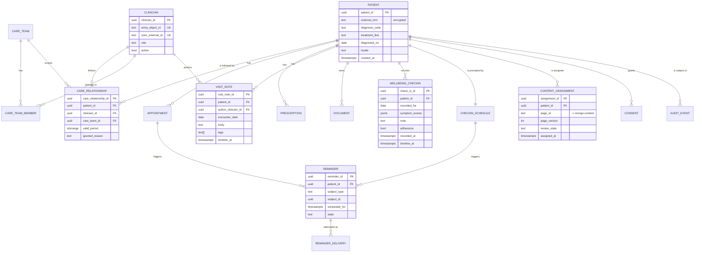

# 3. Data Modeling & Storage
## Personalized Cancer Support Platform

**Table of Contents**

- [Store Allocation](#store-allocation)
- [Entity-Relationship Model](#entity-relationship-model)
- [PostgreSQL Schema Design](#postgresql-schema-design)
- [MongoDB Content Model](#mongodb-content-model)
- [Elasticsearch Index Design](#elasticsearch-index-design)
- [Redis Keyspace](#redis-keyspace)
- [Blob Storage Layout](#blob-storage-layout)
- [Partitioning and Sharding Strategy](#partitioning-and-sharding-strategy)

---

Component names follow [`02-high-level-design.md`](./02-high-level-design.md) exactly. Every entity below is reachable through an API contract in `02` and has a declared access pattern in [`05-reliability.md`](./05-reliability.md).

## Store Allocation

| Store | Owns | Written by | Consistency |
|---|---|---|---|
| `pg-clinical` | The clinical record and everything authorization depends on | `care-core`, `scim-provisioning-svc`, `celery-worker` | Strong; the only store a client read can be served from without qualification |
| `mongo-content` | Education pages, guidance corpus, templates, NLP artifacts | `clinical-nlp-svc`, `care-core` (`clinical-content`) | Eventual; published versions are immutable |
| `es-clinical` | Derived search index — no data originates here | `celery-worker` (`celery.index` only) | Eventual; composed lag budget p95 < 15 s, itemised in [`05-reliability.md`](./05-reliability.md) |
| `redis-cache` | Nothing durable. Caches, counters, locks, idempotency keys | All services | Volatile by design; flushing it costs latency, and may permit one duplicate mutation — see below |
| `blob-documents` | Document bytes and the audit archive | Clients (SAS), `fn-blob-ingest`, `celery-worker` | Immutable once written |

**The rule that keeps this coherent:** a fact has exactly one owning store. `es-clinical` and `redis-cache` are projections and are rebuildable from `pg-clinical` and `mongo-content` at any time — a property the reindex job in `05` depends on.

**Two services write `pg-clinical`, and that is a real coupling.** `scim-provisioning-svc` writes the `identity` schema only — `clinician`, `care_team_member`, and the `care_relationship` rows a deprovisioning closes — and never touches `records`, `diary`, or `content`. The extraction is therefore deployment-level, not data-level: the service releases on the hospital directory's cadence, but it cannot evolve those tables without regard for `care-core`. Schema ownership is the constraint that keeps it honest, and the moment a second cross-schema writer is proposed, this is the paragraph to re-read.

## Entity-Relationship Model

## PostgreSQL Schema Design

One database, one PostgreSQL schema per `care-core` module — `identity`, `records`, `diary`, `content`, `audit`. Modules read their own schema directly and each other's only through the in-process interface, so the module boundary that exists in code also exists in the database and does not decay into a shared-table free-for-all.

**Design decisions worth stating**

- **`care_relationship` is the authorization table, and it is temporal.** `valid_period` is a `tstzrange` with a GiST exclusion constraint, so a clinician's access to a patient has a start and an end and history is not overwritten. Row-level security policies in [`06-security.md`](./06-security.md) join through exactly this table; there is no second definition of "may this clinician see this patient".
- **Every timeline-feeding table carries `timeline_at timestamptz`.** The five tables order by different natural columns — `starts_at`, `prescribed_on`, `encounter_date` (a `date`), `uploaded_at`, `recorded_at` — and a `UNION ALL` mixing `date` and `timestamptz` can neither be ordered deterministically nor served from one index shape. `timeline_at` is populated from each table's natural column and is the only column the timeline query orders on; the keyset cursor is the tuple `(timeline_at, source_table, id)`, so ties across sources break deterministically. The natural columns remain, because `encounter_date` is the clinical fact and `timeline_at` is only a presentation key.
- **`wellbeing_checkin` is unique on `(patient_id, recorded_for)`.** The MQTT ingest path is at-least-once, so the projection is an idempotent `INSERT ... ON CONFLICT DO UPDATE` keyed on that pair rather than an application-side dedupe.
- **`symptom_scores` is `jsonb`, not columns.** The symptom set differs by cancer type and evolves with the clinical protocol; a GIN index on the document supports the trend query without a migration per symptom.
- **`outbox_event`** — `(event_id, aggregate_type, aggregate_id, event_type, payload jsonb, occurred_at, published_at NULL)`. Written in the same transaction as the business change; the relay publishes to `care.events`. This is the only mechanism that writes to `es-clinical` or `sb-integration`, which is why dual-write drift cannot occur (see [`04-deep-dive.md`](./04-deep-dive.md)).
- **`reminder` / `reminder_delivery` are separate.** One reminder, many attempts, each with a channel, provider message id, and terminal state. Reporting on missed reminders is a query, not a log grep — the measurable claim in the brief depends on the delivery table existing.
- **`external_mrn` is encrypted but still searchable.** Hospital sync looks a patient up by MRN, which non-deterministic encryption would make impossible. The row stores the encrypted value alongside an HMAC-SHA256 blind index over the normalised MRN, keyed separately in Key Vault; lookups match the blind index and only the matched row is ever decrypted.
- **`document` holds metadata only**; bytes live in `blob-documents`. The row carries `blob_path`, `sha256`, `scan_state`, and `content_type`, and is not visible to a client until `scan_state = 'clean'`.
- **`audit_event` is append-only** — `REVOKE UPDATE, DELETE` from every application role, enforced additionally by a trigger. Columns: `(audit_event_id, actor_id, actor_kind, patient_id, action, resource_type, resource_id, reason, trace_id, occurred_at)`.
- **Soft deletion is not used on clinical rows.** Retention law governs the record; withdrawal of consent restricts processing through `consent`, it does not tombstone a prescription.

## MongoDB Content Model

Three collections in `mongo-content`, all versioned and immutable once published.

| Collection | Document shape | Key indexes |
|---|---|---|
| `content_pages` | `{_id, page_id, version, diagnosis_code, treatment_line, stage, locale, title, blocks[], citations[{source_id, passage_id, span}], review_state, approved_by, approved_at, generated_by{model, prompt_version}}` | `{page_id: 1, version: -1}` unique; `{diagnosis_code: 1, treatment_line: 1, locale: 1, review_state: 1}` |
| `guidance_sources` | Clinician-authored and curated source passages: `{source_id, passage_id, body, provenance, effective_from, retired_at}` | `{source_id: 1, passage_id: 1}` unique; `{retired_at: 1}` |
| `nlp_extractions` | Model output against a visit note: `{visit_note_id, model_version, entities[], codes[], summary, produced_at}` | `{visit_note_id: 1, model_version: -1}` |

**`review_state` is the safety-critical field.** A page is `draft` → `pending_review` → `approved` → `retired`. Only `approved` versions are ever assigned to a patient, and `content_assignment` in `pg-clinical` pins an exact `(page_id, page_version)` — a later revision never silently changes what a patient was shown, which matters when the shown text is the record of what advice they were given.

`nlp_extractions` never contains data absent from the source note; it is a derived artifact and is rebuildable by re-running the model, which is what makes a model upgrade a reindex rather than a migration.

## Elasticsearch Index Design

Three indices behind one read alias, `clinical-search`. Clients never query `es-clinical` directly — `care-core` builds every query and injects the scope filter.

| Index | Source | Notable mappings |
|---|---|---|
| `es-clinical-notes` | `records.visit_note` + `nlp_extractions` enrichment | `body` (`text`, English analyzer + clinical synonym filter), `tags` (`keyword`), `encounter_date` (`date`), `entities` (`keyword`), `patient_id` (`keyword`), `care_team_ids` (`keyword`) |
| `es-clinical-content` | `content_pages` where `review_state = approved` | `title`, `blocks.body` (`text`), `diagnosis_code`/`treatment_line`/`locale` (`keyword`), `version` (`integer`) |
| `es-clinical-history` | Appointments, prescriptions, document titles — the "visit history" surface | `summary` (`text`), `occurred_at` (`date`), `kind` (`keyword`), `patient_id` (`keyword`) |

Every document in every index carries **`patient_id` and `care_team_ids`**, and every query is wrapped in a `filter` clause on them derived from the caller's token and `care_relationship`. Search authorization is a mandatory index-level property here, not an application convention — a search engine that can return a document the record layer would refuse is a disclosure path.

**Scope changes must reindex, and the split matters.** A clinician's team membership is resolved fresh from `pg-clinical` on every query, so a clinician leaving a team loses search reach immediately. A *patient's* care-team reassignment is different: it changes `care_team_ids` on that patient's documents, so `celery.index` consumes `carerelationship.changed` and reindexes exactly that patient's documents. Until that completes — bounded by the same lag budget as any other index write — the outgoing team can still match, which is why reassignment also closes the `care_relationship` row that the record layer honours immediately.

3 primary shards, 1 replica per index. At ~150 GB total this is a three-data-node cluster; the index is small enough that a full rebuild from source is a routine operation rather than a disaster procedure.

## Redis Keyspace

| Key pattern | Contents | TTL |
|---|---|---|
| `sess:{session_id}` | Portal session metadata | 30 min sliding |
| `jwks:{tenant}` | Entra ID signing keys | 12 h |
| `tl:{patient_id}:{window_hash}` | Rendered timeline page | 60 s |
| `page:{page_id}:{version}:{locale}` | Rendered content page | 24 h, write-through on publish |
| `rl:{subject_id}:{bucket}` | Rate-limit token bucket | window-scoped |
| `idem:{idempotency_key}` | Stored response for a completed mutation | 24 h |
| `lock:scim:{entra_object_id}` | SCIM serialization lock | 30 s |
| `celery-result:{task_id}` | Celery result backend | 1 h |

Nothing here is authoritative and nothing here holds free-text clinical content beyond a rendered page a caller was already entitled to read. One honest qualification: `idem:` keys are the *optimisation* for duplicate suppression, not the guarantee. Losing them to a flush permits a duplicate `POST` to be reprocessed, so any mutation that must not double-apply carries a natural key in `pg-clinical` — `(patient_id, recorded_for)` for check-ins, `reminder_delivery_id` for dispatches — and the database, not the cache, is what makes it idempotent.

## Blob Storage Layout

| Container | Path convention | Lifecycle |
|---|---|---|
| `documents` | `{patient_id}/{document_id}/{sha256}` | Hot 90 d → Cool 1 y → Archive |
| `ingest-quarantine` | `{upload_id}` | Deleted on promotion or after 24 h |
| `audit-archive` | `{yyyy}/{mm}/audit-{partition}.parquet.zst` | Immutable (WORM policy), 7-year legal hold |

Uploads land in `ingest-quarantine` and are promoted to `documents` only after `fn-blob-ingest` reports a clean scan — an unscanned file is never addressable by a `document` row.

## Partitioning and Sharding Strategy

**`pg-clinical` is not sharded, and at this scale it should not be.** At ~200 QPS peak and ~1 TB hot, a single primary with two read replicas has ample headroom. What the design does do:

- **Declarative range partitioning by month** on `diary.wellbeing_checkin` (110M rows over 5 years) and `audit.audit_event` (1.8B). Both are written append-only and read by recent time window, so partition pruning removes almost all of the table from every query, and detaching an old partition is how archival happens — a metadata operation, not a 500 GB `DELETE`.
- **BRIN indexes** on the time column of both partitioned tables; the physical order matches insert order, so BRIN costs a fraction of a B-tree's size for the same range scan.
- **Composite B-tree `(patient_id, timeline_at DESC)`** on every timeline-feeding table, which is the single access pattern behind the record view.
- **Read replicas carry no audited patient reads.** Every PHI read writes an `audit_event` in the same transaction (see [`06-security.md`](./06-security.md)), and a replica cannot write, so patient-facing reads are served by the primary. At ~200 QPS peak that is comfortable, and it preserves read-your-writes for the CP guarantee in [`01-requirements.md`](./01-requirements.md). Replicas carry only unaudited work: index rebuilds, reporting aggregates, and backup verification. The cost is that read availability is coupled to the primary — recorded as such in [`04-deep-dive.md`](./04-deep-dive.md) rather than glossed.

`mongo-content` runs as a **single 3-node replica set, unsharded** — 120 GB with a read-mostly pattern does not warrant a shard key decision that would be hard to reverse. `es-clinical` shards as described above. `redis-cache` runs primary + replica, not Cluster, since no single key set approaches a node's capacity.

**Evolution triggers, in the order they should be taken:**

1. Sustained write throughput > 3K TPS, or hot volume > 4 TB → move `audit_event` to its own PostgreSQL instance (it is append-only, referenced by no foreign key, and read by nothing on the request path).
2. Still constrained → move `wellbeing_checkin` likewise.
3. Only then consider sharding the record by `patient_id`. Reaching this point means roughly 20× the modelled load.

> **Deep Dive Reference:** Clinical synonym analysis — search quality on oncology notes depends heavily on a synonym and abbreviation set (drug brand vs. generic names, staging notation). Building and maintaining that resource is clinical work, not engineering work, and needs an owner before the 35% latency claim can be paired with a relevance claim.
