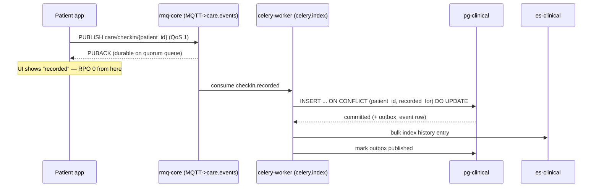
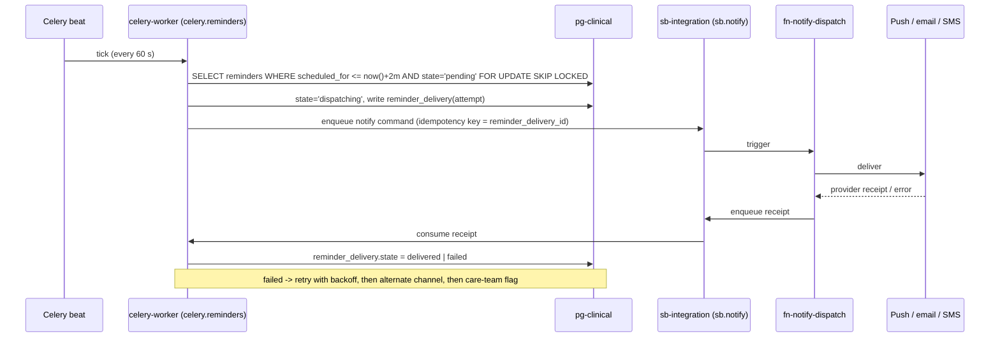
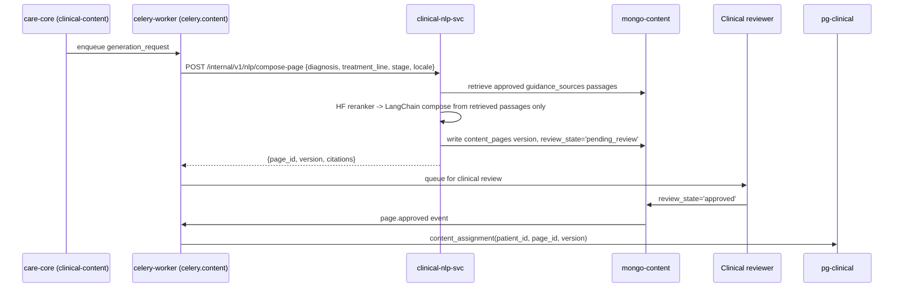

# 4. Deep Dive & Bottlenecks
## Personalized Cancer Support Platform

**Table of Contents**

- [Communication Patterns](#communication-patterns)
- [Check-In Ingest Path](#check-in-ingest-path)
- [Reminder Delivery Path](#reminder-delivery-path)
- [Education Page Generation Path](#education-page-generation-path)
- [Search Freshness](#search-freshness)
- [Failure Modes and Single Points of Failure](#failure-modes-and-single-points-of-failure)
- [Trade-Offs](#trade-offs)

---

## Communication Patterns

Component names follow [`02-high-level-design.md`](./02-high-level-design.md). Four transports, each with a stated jurisdiction — the boundaries below are the answer to "which one do I use", and no path crosses them ad hoc.

| Pattern | Transport | Used for | Why not the others |
|---|---|---|---|
| **Synchronous request/response** | REST/HTTPS through APIM → `care-core` | Anything a user waits for: timeline, record reads and writes, search, page delivery | A user-visible read has no business being eventually consistent |
| **Internal synchronous** | REST over mTLS, `care-core` ↔ `clinical-nlp-svc` | Extraction calls with a bounded deadline (2 s) inside a background task | gRPC would be marginally faster; at three services the shared FastAPI/Pydantic toolchain is worth more than the microseconds |
| **Async, at-least-once, fan-out** | `rmq-core`, topic exchange `care.events` | Domain facts other components react to: `checkin.recorded`, `visitnote.created`, `appointment.scheduled`, `carerelationship.changed` | Publishing a fact does not entitle the publisher to know who consumes it. Celery would couple every consumer to one task registry |
| **Async, scheduled and retryable** | Celery on `rmq-core`, queues `celery.reminders`, `celery.content`, `celery.index` | Work the platform owns and must retry: reminder windows, page generation, index projection, reindex | These have owners, deadlines, and retry policies — Celery's model, not a fire-and-forget event's |
| **Device ingress** | MQTT over TLS via the RabbitMQ MQTT plugin, `care/checkin/{patient_id}` | Mobile check-in submissions | QoS 1 with client-side offline queueing is the point: the phone holds the check-in through a tunnel or a dead spot and delivers it on reconnect |
| **Cloud integration edge** | `sb-integration` queues + `evtgrid-blob` | Blob ingestion and outbound notification dispatch | Native Function triggering and durable dead-lettering at the boundary where work leaves for third-party delivery providers |

## Check-In Ingest Path

The brief's requirement is that a check-in is never lost and never blocks. It is accepted on the broker before the record write happens.

The REST alternative (`POST /api/v1/diary/check-ins`) exists for the web client and returns `202` with the same semantics. **At-least-once redelivery is absorbed by the unique key on `(patient_id, recorded_for)`**, not by application dedupe — a design choice made in [`03-data-modeling.md`](./03-data-modeling.md) precisely so that a redelivered message is arithmetic rather than a bug.

**Three broker settings carry the RPO 0 claim, and none of them is a default.** `mqtt.exchange` must point at `care.events`, or the plugin publishes to `amq.topic` instead; MQTT's `/` separator is translated to AMQP's `.`, so `care/checkin/{patient_id}` binds as `care.checkin.{patient_id}`; and `care.events` needs an **alternate exchange**, because RabbitMQ returns PUBACK for a QoS 1 publish that routes to no queue. Without one, an unbound topic is acknowledged to the device and silently dropped — the exact loss this path exists to prevent. The alternate exchange turns it into a visible dead-letter instead.

> **Deep Dive Reference:** Celery on quorum queues — quorum queues are required here, since RabbitMQ 4 removed classic mirrored queues, but Celery's support for them is recent and interacts with `task_acks_late`, global QoS, and priority. Pin and test the Celery version against the broker before committing the reminder path to it; the fallback is raw AMQP consumers for `celery.reminders`, which the topic-exchange design already accommodates.

## Reminder Delivery Path

This is where the brief's 22% reduction in missed reminders comes from. The failure it removes is structural: reminders that were sent inline during a request died with the request, and nothing recorded that they had not arrived.

Three properties make the outcome measurable rather than hopeful: `FOR UPDATE SKIP LOCKED` lets workers scale without double-dispatch; every delivery attempt is a **row**, so "was it delivered" is a query; and a terminal failure escalates to the care team instead of ending in a log line. Duplicate delivery is possible under a receipt-loss race and is accepted — a patient seeing a reminder twice is a far better failure than not seeing it.

## Education Page Generation Path

Generation is asynchronous, capped, and never renders un-approved text to a patient.

**The constraint that defines this pipeline:** composition draws only from `guidance_sources` passages a clinician has approved, and every block carries a citation to the passage it came from. The model selects, ranks, and rewrites approved material for the patient's context; it does not author clinical claims. A page a reviewer has not approved is never assigned. This costs relevance — a freely generating model would produce more fluent, more specific pages — and the cost is accepted deliberately, because an unsourced sentence in cancer guidance is a patient-safety defect, not a quality regression.

Fine-tuned Hugging Face models are used at two points: **entity and code extraction** from visit notes (enriching `es-clinical-notes`) and **passage reranking** during retrieval. The brief's 28% relevance gain is attributable to these two together — reranking approved passages against the patient's diagnosis and treatment context, rather than serving one generic leaflet per cancer type. Both are evaluated against a held-out clinical set on every model version, and the model version is stamped on every artifact so a regression is attributable and a rollback is a reindex.

> **Deep Dive Reference:** Fine-tuning data governance — transfer learning on real visit notes means patient text in a training corpus. Whether that is lawful processing, what de-identification is required, and whether the resulting weights can leak training text all need resolution with the data controller before any tuning run, not after.

## Search Freshness

`care-core` never writes to `es-clinical` directly. Every write commits to `pg-clinical` with an `outbox_event` row in the same transaction; the relay publishes to `care.events`; `celery.index` consumes and bulk-indexes.

This costs latency — a note is searchable within the composed lag budget in [`05-reliability.md`](./05-reliability.md), p95 < 15 s — and buys the elimination of an entire class of defect: with a dual write, a `pg-clinical` commit followed by an `es-clinical` failure leaves the index permanently wrong with nothing to detect it. Here the outbox row is unpublished until the index succeeds, so the backlog is visible as a metric and drains on recovery. A nightly reconciliation compares document counts per patient between the two and reindexes divergent patients.

## Failure Modes and Single Points of Failure

| Component | Failure mode | Mitigation | Degraded behaviour |
|---|---|---|---|
| `pg-clinical` primary | Node loss | Flexible Server zone-redundant HA, automatic failover ~60 s; PITR, RPO 5 min | **Reads and writes both rejected `503` during failover.** Because every PHI read writes an audit row, read availability is coupled to the primary; a cached timeline is not served as a fallback, since it could not be audited. This is the accepted price of synchronous audit, and it fits the 99.9% budget at a ~60 s zone failover |
| `rmq-core` | Broker node loss | 3-node cluster, **quorum queues** for `care.events` and all Celery queues; publisher confirms mandatory | Check-ins buffer on the device via MQTT QoS 1; nothing is acknowledged that is not replicated |
| `celery-worker` | Consumer crash mid-task | Late acknowledgement, idempotent handlers, bounded retries then dead-letter queue | Backlog grows; `outbox_lag` alerts before it is user-visible |
| **Celery beat** | The scheduler is a singleton — if it stops, nothing sweeps for due reminders | Single-replica Deployment holding a Redis-backed lock (RedBeat) so a restart cannot double-schedule; liveness probe on last-tick age | **Reminders are delayed, not lost** — `reminder` rows stay `pending` in `pg-clinical` and the next sweep catches up. This is the payoff for keeping the state machine in the database rather than in the scheduler, and `reminder_dispatch_lateness_seconds` alerts long before a patient notices |
| `es-clinical` | Cluster degraded or lost | 3 nodes, 1 replica per shard; **fully rebuildable from `pg-clinical` + `mongo-content`** | Search returns a clearly-labelled fallback: chronological browse and filters served from `pg-clinical` |
| `clinical-nlp-svc` / `aks-ml` | Cluster or GPU pool unavailable | No synchronous user path depends on it; requests queue on `celery.content` | New page generation pauses; already-approved assigned pages serve normally |
| Azure Entra ID | IdP outage | JWKS cached in `redis-cache` for 12 h, so existing tokens keep validating; SCIM sync queues and replays | New clinician sign-in fails; active sessions are unaffected. This is the deliberate reason the JWKS TTL is long |
| `sb-integration` / Functions | Regional service degradation | Dead-letter queues with replay; reminders stay `pending` in `pg-clinical` and are re-dispatched | Reminders late, not lost — the state machine lives in the database, not in the queue |
| `blob-documents` | Storage unavailable | ZRS replication; metadata reads unaffected | Document download fails; the rest of the record loads |
| APIM / Front Door | Gateway failure | Multi-instance APIM, Front Door health probes | **Genuine SPOF for north-south traffic.** Accepted: the alternative is a second ingress path with its own authentication policy, and a divergent second copy of the auth policy is a worse risk than the outage it prevents |
| `redis-cache` | Total loss | Primary + replica; every read path has a source-of-truth fallback | Latency rises to cold-path figures; no data loss, no errors |
| **Two-cluster split** | Cross-cluster network partition | Same region, private networking | Only page generation is affected. This is why nothing on the user's request path lives on `aks-ml` |

## Trade-Offs

**Consistency vs. availability, resolved per path rather than globally.** The record is CP: a partition produces `503`, not a stale prescription. The diary ingest path is AP: a check-in is durable on the broker before the record write, because a lost symptom entry cannot be recovered by retrying. These two positions coexist because the boundary between them is a queue, and it is stated in [`01-requirements.md`](./01-requirements.md) rather than discovered per endpoint.

**Latency vs. accuracy in the NLP path.** Retrieval with a reranker and citation assembly takes seconds, not milliseconds. Rather than trim the pipeline to fit a request, generation was moved off the request path entirely — the user never waits, and the pipeline can afford the reranking pass that makes the output specific. The price is that a newly-requested page is not instantly available.

**Throughput vs. cost in the split messaging estate.** Running `rmq-core` and `sb-integration` means two brokers to operate. The alternative — Service Bus alone — cannot terminate MQTT, and the alternative of RabbitMQ alone forfeits native Function triggering and the managed dead-lettering at the third-party delivery boundary. The seam is drawn where the platform hands work to Azure, which keeps the rule memorable, but the operational cost is real and is the first thing to revisit if MQTT ingress is ever dropped.

**Correctness vs. relevance in generated content.** Stated above and worth repeating as a system-level trade-off: constraining generation to approved passages measurably narrows what a page can say. That is the intended outcome.

**Read availability vs. audit completeness.** Auditing every PHI read synchronously makes an audited read a write: it cannot be served from a replica, and it fails when the primary fails, so read availability is bounded by write availability. Queuing the audit rows instead would let reads survive a failover, at the cost of an audit trail with a hole in it. For a health record the hole is the worse outcome, so the coupling is accepted and paid for with zone-redundant HA and a ~60 s failover that fits the 99.9% budget. It is stated here because it is the least obvious consequence of a control chosen in [`06-security.md`](./06-security.md).

**Simplicity vs. capability in the search layer.** `es-clinical` is a second index to keep consistent, a rebuild procedure to rehearse, and a scope filter that must never be omitted. PostgreSQL full-text search would remove all three. It was chosen anyway because the latency target on 2.4M notes with filtering and highlighting is not reachable otherwise — a cost taken against a number, not a preference.

**Modular monolith vs. microservices.** Keeping `diary`, `records`, `clinical-content`, and `identity` in one deployable means one release blocks another's features. Extracting only SCIM and NLP removed the two components with genuinely independent release drivers — hospital directory changes and model versions — and left the rest able to share a transaction. At ~200 QPS, distributed transactions across four services would have bought latency and on-call burden for no throughput.
