# Reliability & Observability
## Personalized Cancer Support Platform

**Table of Contents**

- [Read/Write Optimizations](#readwrite-optimizations)
- [Caching Strategy](#caching-strategy)
- [Telemetry and the Three Pillars](#telemetry-and-the-three-pillars)
- [Service Level Objectives](#service-level-objectives)
- [CI/CD and Deployment Automation](#cicd-and-deployment-automation)
- [Backup, Restore, and Rehearsal](#backup-restore-and-rehearsal)

---

## Read/Write Optimizations

Every index below exists for a named access pattern from an [API](https://en.wikipedia.org/wiki/API "Application Programming Interface — Defines the contract by which software components exchange requests and data") contract in [`02-high-level-design.md`](./02-high-level-design.md). Indexes with no query behind them are write amplification on a 110M-row table, so the list is deliberately short.

**`pg-clinical`**

| Access pattern | Endpoint | Index |
|---|---|---|
| Patient timeline, most recent first | `GET /api/v1/timeline` | Composite B-tree `(patient_id, timeline_at DESC)` on `appointment`, `prescription`, `visit_note`, `document`, `wellbeing_checkin` — the normalised ordering column defined in [`03-data-modeling.md`](./03-data-modeling.md) |
| Check-ins over a date window | `GET /api/v1/diary/check-ins` | Monthly range partition + [BRIN](https://www.postgresql.org/docs/current/brin.html "Block Range Index — Compact PostgreSQL index type suited to large, sequentially correlated tables") on `recorded_at`; unique `(patient_id, recorded_for)` |
| Symptom trend across a window | `GET /api/v1/patients/{id}/checkin-trend` | [GIN](https://www.postgresql.org/docs/current/gin.html "Generalized Inverted Index — PostgreSQL index type suited to values containing multiple keys, such as arrays or text search") on `symptom_scores jsonb` |
| "May this clinician see this patient" — on every clinician request | all clinician paths | [GiST](https://www.postgresql.org/docs/current/gist.html "Generalized Search Tree — PostgreSQL index type supporting range and exclusion constraints") on `care_relationship (patient_id, clinician_id, valid_period)`; the exclusion constraint is the same index |
| Clinician's patient list | `GET /api/v1/patients` | `(care_team_id, patient_id)` on `care_relationship` filtered `WHERE upper(valid_period) IS NULL` (partial) |
| Due reminders | [Celery](https://docs.celeryq.dev/en/stable/ "Celery — Distributed task queue that runs background and scheduled jobs outside the request cycle") beat, every 60 s | Partial B-tree on `(scheduled_for)` `WHERE state = 'pending'` — keeps the hot index to the small pending set rather than all history |
| Outbox relay | continuous | Partial B-tree on `(occurred_at)` `WHERE published_at IS NULL` |
| Audit by subject | compliance and [DSAR](https://gdpr-info.eu/art-15-gdpr/ "Data Subject Access Request — Request by an individual to see the personal data an organization holds about them") | Monthly range partition + `(patient_id, occurred_at DESC)` |

**Write-path work already stated where it is owned:** partitioning and BRIN in [`03-data-modeling.md`](./03-data-modeling.md), `FOR UPDATE SKIP LOCKED` reminder claiming in [`04-deep-dive.md`](./04-deep-dive.md).

**[SQL](https://en.wikipedia.org/wiki/SQL "Structured Query Language — Queries and manipulates data in a relational database") discipline on the timeline query.** The timeline is a union across five tables and is the single most-executed clinician query. It is a keyset-paginated `UNION ALL` over per-table windows with `LIMIT` pushed into each branch, so [PostgreSQL](https://www.postgresql.org/docs/current/ "PostgreSQL — Relational database storing and querying structured data with strong transactional guarantees") reads at most `limit` rows per source instead of materialising and sorting the whole union. The cursor is the tuple `(timeline_at, source_table, id)`, which is why the ordering column is normalised across all five tables instead of each branch sorting on its own natural column. Offset pagination on this query is prohibited; it is what the composite indexes exist to avoid.

**`es-clinical`.** Bulk indexing with a 5 s / 1000-document flush; `refresh_interval` of 5 s rather than the 1 s default, which roughly halves segment-merge pressure. Searches use `filter` context for scope and date clauses (cacheable, unscored) and `must` only for the user's text, so the expensive scoring pass runs on a pre-filtered set.

**The freshness budget is composed, not asserted.** Outbox relay ≤ 2 s, plus a bulk flush ≤ 5 s, plus a 5 s `refresh_interval`, puts a newly-saved note in search results at **p50 < 8 s, p95 < 15 s, p99 < 30 s** — the figures carried in [`01-requirements.md`](./01-requirements.md). Tightening any one of the three alone buys nothing, which is why the target is stated as a sum rather than as a single knob.

**`mongo-content`.** Read-mostly; approved page versions are immutable, so reads hit the covering index on `{page_id, version}` and never contend with a writer.

## Caching Strategy

Four layers, each with a stated invalidation rule. `redis-cache` key patterns are defined once in [`03-data-modeling.md`](./03-data-modeling.md).

| Layer | Contents | Strategy | Invalidation |
|---|---|---|---|
| **[CDN](https://en.wikipedia.org/wiki/Content_delivery_network "Content Delivery Network — Distributes cached content across edge locations to reduce latency") (Front Door)** | Static app bundle, images, public non-personalised guidance | Edge cache, 1 h | Content-hashed asset filenames; explicit purge on guidance retirement |
| **[APIM](https://learn.microsoft.com/en-us/azure/api-management/ "Azure API Management — Publishes, secures and rate limits APIs behind a managed gateway")** | Nothing patient-scoped | Response cache disabled on all `/api/v1` paths | n/a — a gateway cache keyed on a [URL](https://datatracker.ietf.org/doc/html/rfc3986 "Uniform Resource Locator — Addresses the location and access method of a resource on the web") that omits the subject is a cross-patient disclosure waiting to happen, so it is off by policy, not by omission |
| **`redis-cache` — timeline** | Rendered timeline page, `tl:{patient_id}:{window_hash}` | **Cache-aside**, 60 s [TTL](https://en.wikipedia.org/wiki/Time_to_live "Time To Live — Duration after which a cached or stored value expires") | Explicit `DEL tl:{patient_id}:*` driven by the `care.events` consumer on any record write for that patient. TTL is the backstop, the event is the mechanism |
| **`redis-cache` — content pages** | Rendered page, `page:{page_id}:{version}:{locale}` | **Write-through** on approval | None needed — the key includes the version and approved versions are immutable. This is why write-through is safe here and cache-aside is used everywhere else |
| **`redis-cache` — [JWKS](https://datatracker.ietf.org/doc/html/rfc7517 "JSON Web Key Set — Publishes the public keys a party needs to verify a signed token")** | Entra ID signing keys | Cache-aside, 12 h | Refreshed on validation failure against an unknown `kid`. The long TTL is the [IdP](https://en.wikipedia.org/wiki/Identity_provider "Identity Provider — Service that authenticates users and issues identity assertions to relying applications")-outage mitigation in [`04-deep-dive.md`](./04-deep-dive.md) |
| **Application-level** | Compiled [Pydantic](https://docs.pydantic.dev/latest/ "Pydantic — Python library that validates and parses data against typed models at runtime") validators, [ES](https://www.elastic.co/elasticsearch "Elasticsearch — Distributed search and analytics engine used to index and query documents") query templates, care-team membership for the request's duration | Per-process / per-request | Process lifetime; membership never outlives one request |

**The rule.** Cache-aside is the default because most cached data has a mutation path; write-through applies only to immutable versioned content. **Nothing patient-identifiable is cached at a layer that cannot see the requester's identity** — that single sentence is why APIM response caching is off and why timeline keys are patient-scoped rather than query-scoped.

## Telemetry and the Three Pillars

Two telemetry planes exist because the estate spans OpenShift/[AKS](https://learn.microsoft.com/en-us/azure/aks/ "Azure Kubernetes Service — Managed Kubernetes hosting on Azure") and Azure-native services. They are joined, not left separate: **[W3C](https://www.w3.org/ "World Wide Web Consortium — Develops open web standards such as trace context propagation") `traceparent` propagates on every hop including [AMQP](https://www.amqp.org/ "Advanced Message Queuing Protocol — Standardizes reliable message queueing and routing between applications"), [MQTT](https://mqtt.org/ "Message Queuing Telemetry Transport — Lightweight publish-subscribe protocol for constrained devices and unreliable networks"), and Service Bus message headers**, and Azure Monitor diagnostic logs are shipped into `es-clinical`'s Elastic deployment so **Kibana is the single pane**. Without that join, a reminder that fails between `celery.reminders` and `fn-notify-dispatch` is two unconnected half-stories.

**Metrics — Prometheus, dashboards in Kibana**

| [SLI](https://sre.google/sre-book/service-level-objectives/ "Service Level Indicator — Measured metric, such as latency or error rate, used to judge service health") | Metric | Alert |
|---|---|---|
| Record read latency | `http_request_duration_seconds` p95 by route | p95 > 250 ms for 10 min |
| Search latency | ES query duration p95 | p95 > 400 ms for 10 min |
| Write availability | 5xx rate on mutating routes | > 0.1% over 5 min |
| Index freshness | `outbox_unpublished_age_seconds` | > 30 s for 5 min |
| Reminder timeliness | `reminder_dispatch_lateness_seconds` p99 | > 5 min |
| Reminder outcome | `reminder_delivery_total{state}` | `failed` ratio > 2% over 1 h |
| Consumer processing latency | `consumer_task_duration_seconds` p95 by queue | p95 > 5 s on `celery.reminders` or `celery.index` |
| Consumer error rate | `consumer_task_failed_total` / `consumer_task_total` by queue | > 1% over 15 min |
| Broker health | `rmq_queue_depth`, unacked messages | depth > 10K or rising 15 min |
| [NLP](https://en.wikipedia.org/wiki/Natural_language_processing "Natural Language Processing — Computational techniques for analyzing and generating human language") pipeline | generation queue depth, model p95, `nlp_low_confidence_total` | queue > 500, or confidence dip on a new model version |
| Auth | [JWT](https://datatracker.ietf.org/doc/html/rfc7519 "JSON Web Token — Compact, signed token format for carrying claims between parties") validation failures by reason, [SCIM](https://scim.cloud/ "System for Cross-domain Identity Management — Standardizes automated provisioning and deprovisioning of user identities between systems") sync failures | any sustained rise; SCIM failure is paged — a deprovisioning that did not land is a security event |

**Structured logging.** [JSON](https://www.json.org/json-en.html "JavaScript Object Notation — Lightweight text format for structured data exchange") to stdout, shipped to Elasticsearch, queryable in Kibana. Every line carries `trace_id`, `span_id`, `service`, `module`, `actor_kind`, and — where applicable — `patient_id`. **No clinical free text, no symptom values, no document contents are ever logged**; a Pydantic-driven redaction filter drops known-sensitive fields at the formatter, and a [CI](https://en.wikipedia.org/wiki/Continuous_integration "Continuous Integration — Automatically builds and tests code on every change") check fails the build if a log call passes a model containing a field marked sensitive. Audit is a database table (`audit.audit_event`), never a log stream — logs are for operators, audit is for the regulator, and conflating them means log retention policy silently becomes audit policy.

**Distributed tracing — Elastic [APM](https://en.wikipedia.org/wiki/Application_performance_management "Application Performance Monitoring — Gives visibility into request latency, errors and traces in production").** The Python agent auto-instruments [FastAPI](https://fastapi.tiangolo.com/ "FastAPI — Python web framework for building HTTP APIs with async support and automatic schema generation"), [SQLAlchemy](https://www.sqlalchemy.org/ "SQLAlchemy — Python SQL toolkit and ORM that maps objects to relational tables and builds queries"), Celery, [RabbitMQ](https://www.rabbitmq.com/docs "RabbitMQ — Message broker that routes and queues messages between producers and consumers"), and outbound [HTTP](https://datatracker.ietf.org/doc/html/rfc9110 "Hypertext Transfer Protocol — Application protocol used to request and transfer web resources"). Traces span the async boundary because `traceparent` travels in message headers, so a single trace covers `POST /diary/check-ins` → `care.events` → `celery.index` → `es-clinical`. Sampling: 100% of errors and of all reminder and NLP traffic, 10% of routine reads. Azure Monitor covers APIM, Functions, Service Bus, and Blob, correlated by the same trace id.

> **Deep Dive Reference:** Trace continuity through MQTT — MQTT 3.1.1 has no user-property header for context propagation. Either move check-in clients to MQTT 5 or carry `traceparent` inside the payload envelope; decide before instrumenting, because retrofitting it breaks every published client.

## Service Level Objectives

| Service | [SLO](https://sre.google/sre-book/service-level-objectives/ "Service Level Objective — Target value for a service level indicator that a service commits to meet") | Error budget | Consequence of exhaustion |
|---|---|---|---|
| Record read/write, diary capture | 99.9% monthly | ~43 min | Feature work stops; reliability work takes the sprint |
| Search | 99.5% monthly | ~3.6 h | Degrades to the `pg-clinical` chronological fallback rather than erroring |
| Content generation | 99.5% monthly | ~3.6 h | Backlog drains; assigned pages unaffected |
| Reminder delivery within window | 99.5% of reminders | — | Paged. This is the clinical-safety SLO and it is not traded for feature velocity |

## CI/CD and Deployment Automation

GitLab CI builds and gates; **[ArgoCD](https://argo-cd.readthedocs.io/en/stable/ "Argo CD — GitOps continuous delivery tool that syncs a Kubernetes cluster to a Git repository") deploys**. No pipeline job holds cluster credentials — CI's final act is a commit to the GitOps manifest repository, which ArgoCD reconciles onto `aro-primary` and `aks-ml`.

```mermaid
flowchart LR
    MR["Merge request"] --> LINT["ruff"]
    LINT --> TYPE["pyright --strict"]
    TYPE --> UNIT["pytest unit + contract"]
    UNIT --> INTEG["pytest integration<br/>(compose: pg, mongo, es, redis, rabbitmq)"]
    INTEG --> SONAR["SonarQube quality gate"]
    SONAR --> BUILD["Docker build + image scan"]
    BUILD --> SIGN["Push to GitLab registry (digest-pinned)"]
    SIGN --> GITOPS["Commit digest to GitOps repo"]
    GITOPS --> ARGO["ArgoCD sync"]
    ARGO --> MIG["PreSync hook: alembic upgrade head"]
    MIG --> ROLL["care-core: blue-green via Route<br/>clinical-nlp-svc: canary 5% -> 25% -> 100%"]
    ROLL --> VERIFY["PostSync: smoke + SLO check"]
```

**Gates are blocking, and each can actually fail the pipeline** — `ruff` on lint, `pyright --strict` on types, `pytest` on unit, contract, and integration suites, SonarQube on coverage and new-code quality. Integration tests run against real `pg-clinical`, `mongo-content`, `es-clinical`, `redis-cache`, and `rmq-core` containers via Docker Compose, because a mocked broker cannot fail the way a real one does. Test coverage targets the contracts the brief names: API schemas, identity and SCIM flows, and clinical content services — the paths where a regression removes a patient's access.

**Migrations use expand/contract, and this is what makes blue-green possible.** A release adds columns and backfills; the next removes what is no longer read. Because every migration is backwards-compatible with the previous image, both colours run against the same schema during a cut-over, and a rollback is an ArgoCD revision revert with no down-migration. A migration that cannot be written this way is split across two releases.

**Deployment strategies differ by service and by reason:** `care-core` is blue-green (a single instantaneous Route switch, cleanest rollback for the service holding the record); `clinical-nlp-svc` is canary (model quality shows up statistically, so a percentage rollout with confidence and latency comparison is the only way to see a regression before everyone gets it); `scim-provisioning-svc` is a rolling update (external caller, idempotent operations, no user-visible surface). Azure Functions deploy via slot swap.

**[Terraform](https://developer.hashicorp.com/terraform/docs "Terraform — Infrastructure as code tool that declares and provisions cloud infrastructure from configuration files")** provisions all Azure and cluster infrastructure with state in Azure Storage, applied from CI with a plan-review gate on production. Environments are the same code with different variable files; a resource created by hand is drift and is reported as a failure.

## Backup, Restore, and Rehearsal

| Store | Backup | Target |
|---|---|---|
| `pg-clinical` | Automated backups + [PITR](https://www.postgresql.org/docs/current/continuous-archiving.html "Point in Time Recovery — Restores a database to a specific past moment using base backups and archived logs"), 35-day window, geo-redundant | [RPO](https://en.wikipedia.org/wiki/Disaster_recovery "Recovery Point Objective — Maximum acceptable amount of data loss, measured in time since the last recovery point") 5 min, [RTO](https://en.wikipedia.org/wiki/Disaster_recovery "Recovery Time Objective — Maximum acceptable duration to restore a system after a disruption") 30 min |
| `mongo-content` | Nightly snapshot + oplog | RPO 1 h |
| `es-clinical` | Snapshot to `blob-documents`; also **fully rebuildable from source** | RPO 24 h, or a rebuild |
| `blob-documents` | [ZRS](https://learn.microsoft.com/en-us/azure/storage/common/storage-redundancy "Zone Redundant Storage — Replicates Azure storage data synchronously across multiple availability zones") + soft delete + immutable audit container | RPO 0 |
| `redis-cache` | None by design | Rebuilt from source stores |

**Restore is rehearsed quarterly against a scratch environment, and the rehearsal includes the two paths that are easy to get wrong**: a PITR restore of `pg-clinical` to a chosen timestamp, and a full `es-clinical` rebuild from `pg-clinical` + `mongo-content` with a document-count reconciliation afterwards. A backup that has never been restored is an assumption, not a control — and the `es-clinical` rebuild is also the mitigation relied on in [`04-deep-dive.md`](./04-deep-dive.md), so leaving it untested would leave that mitigation unproven.
