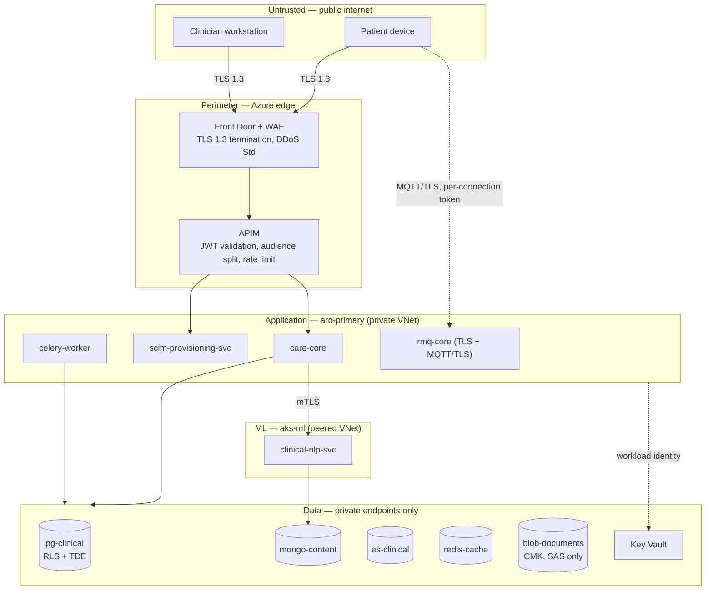

# 6. Security & Compliance
## Personalized Cancer Support Platform

**Table of Contents**

- [Trust Boundaries](#trust-boundaries)
- [Identity and Authentication](#identity-and-authentication)
- [Authorization](#authorization)
- [Data Protection](#data-protection)
- [Regulatory Compliance](#regulatory-compliance)
- [Perimeter Defense](#perimeter-defense)
- [Auditing and Detection](#auditing-and-detection)

---

Boundaries below correspond to the topology in [`02-high-level-design.md`](./02-high-level-design.md) and the communication paths in [`04-deep-dive.md`](./04-deep-dive.md); no security control here assumes a component or a call that those files do not describe.

## Trust Boundaries

**No data store carries a public endpoint.** Every store is reached over a private endpoint from the application VNet; `aks-ml` is peered, not open. The only paths from the internet into the estate are Front Door → APIM and the MQTT listener, and both authenticate before anything is processed.

## Identity and Authentication

**Two identity planes, separated by design and enforced at the gateway.** The brief's requirement that clinician accounts "stay off the patient portal" is not a UI rule — it is an audience check that fails closed before application code runs.

| Plane | Provider | Registration | Token audience | MFA |
|---|---|---|---|---|
| Patient portal | Entra External ID (patient tenant) | Self-registration with identity proofing at enrolment | `api://care-platform/patient` | Required at enrolment and on sensitive operations |
| Clinician / care team | Azure Entra ID (hospital tenant) | **Never self-service** — provisioned via SCIM 2.0 only | `api://care-platform/clinician` | Enforced by hospital conditional access; the platform does not weaken it |

- **OAuth 2.0 authorization code flow with PKCE**, OIDC for identity. Access tokens are short-lived (15 min); refresh tokens are rotated and bound to the client.
- **APIM validates the JWT** — signature against cached JWKS, issuer, expiry, and **audience against the route's plane**. A clinician token presented on `/api/v1/diary/check-ins` is rejected at the gateway with `403`, and vice versa. `care-core` re-validates rather than trusting a header, so a bypass of APIM is not a bypass of authentication.
- **SCIM 2.0 lifecycle.** `scim-provisioning-svc` implements `Users` and `Groups`; Entra ID is the sole authorized caller, authenticated with its own client credential and network-restricted. Create, update, and `active: false` map to `clinician` rows and `care_team_member` rows. **A deprovisioning closes every open `care_relationship` for that clinician in the same transaction** — access ends when employment does, without a platform-side action. SCIM sync failure is a paged alert (see [`05-reliability.md`](./05-reliability.md)) because a silent failure here means access that should have ended has not.
- **MQTT authentication.** The check-in listener authenticates the connection with the patient's access token and authorizes publishes only to `care/checkin/{patient_id}` matching the token subject. Because RabbitMQ authenticates per connection rather than per publish, connections carry a maximum lifetime shorter than the refresh-token window and are forced to re-authenticate — the gap flagged in [`02-high-level-design.md`](./02-high-level-design.md).
- **Service identity.** Workload identity federation for Azure resource access; no static credentials in images or manifests. Secrets live in Key Vault and are projected as files, never as environment variables baked into an image.

## Authorization

**RBAC for capability, ABAC for reach, and the reach check lives in the database.**

| Role | May do |
|---|---|
| `patient` | Read and write only their own record and diary; read pages assigned to them |
| `clinician` | Read the record of, and write visit notes for, patients they hold an active care relationship with |
| `care_team_admin` | Manage care-team membership and appointments within their team; no clinical write |
| `content_author` | Author and submit guidance; **cannot approve their own content** |
| `content_approver` | Approve content; no patient-record access |
| `platform_operator` | Infrastructure only; **no routine patient-data access** |

The attribute check — *does an active `care_relationship` exist between this clinician and this patient at this instant* — is enforced by **PostgreSQL row-level security**. Each request sets a session GUC (`app.actor_id`, `app.actor_kind`) inside the transaction, and RLS policies on every patient-scoped table join through `care_relationship`'s temporal range. Application-layer checks exist too, but they are the second line: **a query a developer forgets to scope returns zero rows rather than another patient's record.** This is the single most important control in the design, because it converts the most common class of application bug into an empty result set.

**Three implementation details decide whether that control is real, and each is asserted by a test rather than left to review:**

- The GUC is set with **`SET LOCAL`** inside the request transaction, never a plain `SET`. Azure Flexible Server fronted by a transaction-mode pooler reuses a backend across requests, and a session-scoped `SET` would leak one caller's identity into the next caller's query — turning the strongest control in the design into its exact opposite. A pooled-connection leakage test asserts this.
- The application role is `NOSUPERUSER` and lacks `BYPASSRLS`; migrations run as a separate owning role that never serves a request. A role-privilege assertion runs in CI.
- Policies are written so the `patient_id` predicate still reaches the planner, keeping partition pruning intact on the monthly-partitioned `wellbeing_checkin` and `audit_event`. A policy that hides `patient_id` behind an opaque subquery silently converts a pruned index scan into a full partition sweep, so an `EXPLAIN` assertion guards the plan shape.

The same scope is projected into `es-clinical` as the mandatory `patient_id` / `care_team_ids` filter described in [`03-data-modeling.md`](./03-data-modeling.md), so search cannot become the path around RLS.

**Break-glass.** Emergency access requires an explicit reason string, grants a time-boxed `care_relationship`, notifies the patient's named team, and raises a high-priority audit event reviewed within 24 h. It is a recorded, reviewed exception, not a role.

**Separation of duties in content.** `content_author` and `content_approver` are distinct roles precisely because the generated-page pipeline in [`04-deep-dive.md`](./04-deep-dive.md) depends on approval being a real second pair of eyes; if one person could author and approve, the safety property that pipeline claims would be nominal.

## Data Protection

**In transit**

- TLS 1.3 from client to Front Door, and from Front Door to APIM to `care-core`. TLS 1.2 is the floor for legacy mobile clients; nothing below it is negotiated.
- **mTLS** on `care-core` ↔ `clinical-nlp-svc` — the one cross-cluster hop, and the one carrying clinical free text. Certificates are issued and rotated by cert-manager from a private issuer in each cluster; OpenShift's built-in service-serving certificates do not span clusters, so this is an explicit dependency rather than a platform freebie (flagged in [`02-high-level-design.md`](./02-high-level-design.md)).
- TLS on every store connection (`pg-clinical` with `verify-full`, `mongo-content`, `es-clinical`, `redis-cache`, `rmq-core` AMQPS and MQTT/TLS).
- **East-west isolation without a service mesh.** OpenShift NetworkPolicy default-denies pod-to-pod traffic; each service permits only its declared callers. This is the cheaper alternative flagged in [`02-high-level-design.md`](./02-high-level-design.md); OpenShift Service Mesh is the documented upgrade if the service count grows past a handful. NetworkPolicy governs traffic **inside** a cluster only, so the one hop it cannot see is `care-core` → `clinical-nlp-svc`, which crosses the VNet peering into `aks-ml`. That hop is governed by network security groups and a private endpoint, with mTLS as the identity check — three mechanisms where one would do, and part of the two-cluster cost named in [`02-high-level-design.md`](./02-high-level-design.md).

**At rest**

| Store | Encryption |
|---|---|
| `pg-clinical` | AES-256 at rest with a **customer-managed key** in Key Vault; automated backups inherit the key |
| `blob-documents` | AES-256, CMK, HTTPS-only, public access disabled, **immutability policy on `audit-archive`** |
| `mongo-content`, `es-clinical`, `redis-cache` | Encrypted persistent volumes (AES-256), CMK-backed |
| Key material | Key Vault with soft-delete and purge protection; annual rotation; access via workload identity, logged |

**Field-level encryption** with `pgcrypto` applies to direct identifiers whose exposure is not needed for clinical function — `external_mrn`, contact details, next-of-kin — with keys in Key Vault. `external_mrn` additionally carries a keyed blind index so hospital sync can still find a patient without decrypting the column, the mechanism recorded in [`03-data-modeling.md`](./03-data-modeling.md). Diagnosis and treatment data are **not** field-encrypted: they are the working substance of every query and index, and encrypting them would either break search or be defeated by a decryption path the application must hold anyway. The honest control for that data is RLS, audit, and least privilege — stated plainly rather than dressed up as encryption.

**Data minimisation in transit to the model.** `clinical-nlp-svc` receives diagnosis code, treatment line, stage, and locale for page composition — not the patient's identity, name, or contact details. Extraction calls that must see note text receive the text and a correlation id, never the patient identifier.

## Regulatory Compliance

The design targets **GDPR (UK/EU) with health data treated as Article 9 special-category** as the primary framework, plus ISO 27001/27701 controls. Deployment into a US setting maps the same controls to HIPAA — the technical safeguards below satisfy both; only the paperwork differs.

| Obligation | How the design meets it |
|---|---|
| Lawful basis for special-category data | Explicit consent captured in `consent`, versioned and withdrawable; processing purposes bound to consent scope |
| Data minimisation | Model calls receive clinical context, not identity; logs exclude clinical content |
| Purpose limitation | `platform_operator` has no routine record access; break-glass is reasoned and reviewed |
| Right of access (DSAR) | Export assembled from `pg-clinical` + `blob-documents` + assigned `content_pages`, delivered within statutory time |
| **Right to erasure vs. retention** | **These conflict, and retention wins.** A medical record is retained under health-records law for its statutory period; erasure applies to non-record data (marketing preferences, optional profile fields, derived analytics) and to withdrawal of further processing. The platform states this to the patient at consent rather than promising a deletion it cannot lawfully perform |
| Storage limitation | `audit_event` 7 years then purge; documents per the trust's retention schedule; `nlp_extractions` rebuildable and freely purgeable |
| Data residency | All Azure resources, both clusters, and all backups in a single region; no cross-border transfer; no third-party model API |
| Breach notification | Detection through the audit anomaly rules below; 72-hour reporting path documented in the runbook |
| Processor obligations | Terraform-declared infrastructure gives an auditable record of what exists and where; DPIA maintained for the NLP pipeline specifically |

> **Deep Dive Reference:** DPIA for model fine-tuning — training on real clinical notes is the highest-risk processing in this system. Legal basis, de-identification standard, and memorisation/extraction risk in the resulting weights all need a completed assessment before the first tuning run, not a retrospective one.

## Perimeter Defense

- **WAF** on Azure Front Door with the OWASP core rule set in prevention mode, plus custom rules for the SCIM and MQTT surfaces. Managed rules are staged in detection mode for a week before enforcement, because a false positive here blocks a clinician mid-consultation.
- **DDoS Protection Standard** on the public IP; Front Door absorbs volumetric traffic ahead of the origin.
- **Rate limiting, layered by what it protects:** APIM applies a coarse per-subscription and per-IP limit; `care-core` applies a fine-grained per-subject token bucket in `redis-cache` (`rl:{subject_id}:{bucket}`). Authentication, search, and document-download endpoints get tighter buckets than reads, since those are the endpoints worth abusing. Limits are per authenticated subject, not per IP alone — a hospital behind one NAT address must not rate-limit itself.
- **Bot and enumeration defence:** account-enumeration-safe error responses on the patient portal, exponential lockout on repeated failures, and no patient identifier ever in a URL path that is not already scoped by the token.
- **Supply chain:** images built from pinned digests, scanned at build, SonarQube quality gate blocking, dependency audit in CI, and ArgoCD deploying only digest-pinned images from the GitLab registry — a mutable tag cannot be swapped underneath a running cluster.

## Auditing and Detection

Every read and write of patient data writes an `audit.audit_event` row inside the same transaction as the access — not asynchronously, because an audit trail that can be lost in a queue is not an audit trail. Each row carries actor, actor kind, patient, action, resource, reason where applicable, and the `trace_id` that joins it to the Elastic APM trace.

**A cache hit is still an access.** Serving a timeline from `redis-cache` writes the same audit row as serving it from `pg-clinical`; caching reduces read cost, never audit coverage. Because that row is a write, audited reads are served by the primary and never by a replica — the consequence recorded in [`03-data-modeling.md`](./03-data-modeling.md).

The table is append-only at the database level (`UPDATE` and `DELETE` revoked from all application roles plus a blocking trigger), partitioned monthly, retained 13 months hot, then archived to the immutable `audit-archive` container for the full 7 years.

**Detection rules run over the audit stream in Kibana**, and each names a specific misuse rather than a generic anomaly: a clinician reading records outside their care team, an access volume far above that clinician's baseline, break-glass use, bulk document downloads, SCIM deprovisioning that did not close its care relationships, and any direct query against `pg-clinical` from a non-application principal. Alerts route to the security team; break-glass and out-of-team access are reviewed within 24 h.
