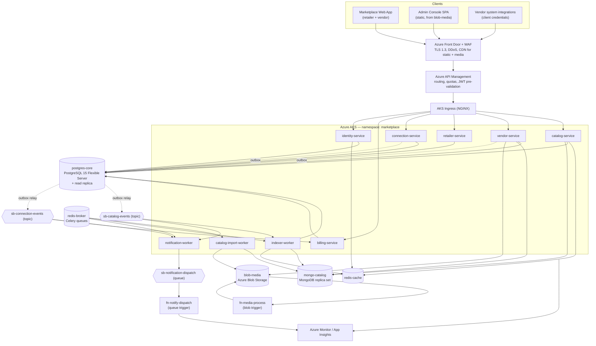
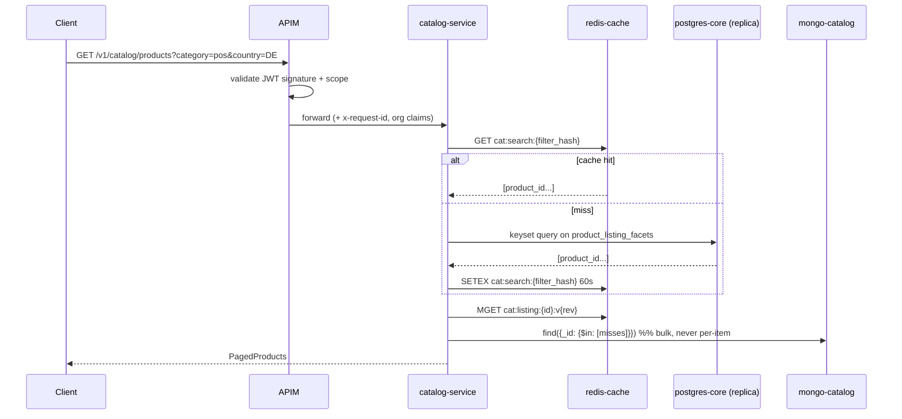

# High-Level Design

*Retail Software Aggregation Platform*

## Table of Contents

- [Service Decomposition](#service-decomposition)
- [Architecture Diagram](#architecture-diagram)
- [API Design](#api-design)
- [Request Flows](#request-flows)
- [Technology Mapping](#technology-mapping)
- [Alternatives Considered and Rejected](#alternatives-considered-and-rejected)

This file is the **single source of truth for technology choices and component names**. Every name used here — services, stores, queues, topics — is used unchanged in `03`–`06`.

## Service Decomposition

The brief's first responsibility is the architectural spine: catalog, vendor and retailer concerns are split so that listing changes do not reach connection and billing flows. That is a **clean-architecture module boundary first and a deployment boundary second**. Six services are deployed, each owning its tables and exposing no database to any other; a peer needs data it does not own, it calls an [API](https://en.wikipedia.org/wiki/API "Application Programming Interface — Defines the contract by which software components exchange requests and data") or consumes an event.

| Service | Owns | Why it is separate |
|---|---|---|
| `catalog-service` | Read-side of listings: search, facets, detail, compare | Highest traffic, purely read, and the only service that may be scaled or degraded independently of everything else |
| `vendor-service` | Vendors, vendor users, listing authoring, publish, imports | Write-side of the catalog; its release cadence follows vendor tooling, not shopper-side browse |
| `retailer-service` | Retail groups, stores, retailer users, shortlists | Owns the buyer's private working set — the data vendors must never read |
| `connection-service` | Connection requests, threads, messages | The platform's commercial event. Isolating it is what stops a listing edit from touching a live conversation |
| `billing-service` | Vendor plans, charges | Named in the brief as a flow that listing changes must not spill into; separation is the mechanism |
| `identity-service` | [OAuth2](https://datatracker.ietf.org/doc/html/rfc6749 "OAuth 2.0 — Authorization framework that lets an application access resources on a user's behalf") authorization server, [JWT](https://datatracker.ietf.org/doc/html/rfc7519 "JSON Web Token — Compact, signed token format for carrying claims between parties") issuance, refresh rotation, [JWKS](https://datatracker.ietf.org/doc/html/rfc7517 "JSON Web Key Set — Publishes the public keys a party needs to verify a signed token") | A distinct trust boundary; compromise here is categorically worse than elsewhere |

Three [Celery](https://docs.celeryq.dev/en/stable/ "Celery — Distributed task queue that runs background and scheduled jobs outside the request cycle") worker deployments run alongside them: `catalog-import-worker`, `indexer-worker` and `notification-worker`. They share the application codebase but not the request path, so a large import cannot exhaust web-tier capacity.

**Operational cost, stated plainly.** Six services plus three worker pools is more than 35 [QPS](https://en.wikipedia.org/wiki/Queries_per_second "Queries Per Second — Throughput measure of how many requests a system serves each second") requires. The justification is isolation of blast radius and of tenant data, not throughput — and it is only affordable because all nine share one repository, one [Alembic](https://alembic.sqlalchemy.org/en/latest/ "Alembic — Applies and versions database schema migrations for SQLAlchemy") migration history, one [CI](https://en.wikipedia.org/wiki/Continuous_integration "Continuous Integration — Automatically builds and tests code on every change") pipeline and one [AKS](https://learn.microsoft.com/en-us/azure/aks/ "Azure Kubernetes Service — Managed Kubernetes hosting on Azure") cluster. A team that split these into separate repositories at this scale would spend more on coordination than the boundaries are worth.

## Architecture Diagram



## API Design

[REST](https://en.wikipedia.org/wiki/REST "Representational State Transfer — Architectural style for stateless, resource-oriented HTTP APIs") over [HTTPS](https://datatracker.ietf.org/doc/html/rfc9110 "HTTP Secure — HTTP encrypted with TLS to protect requests and responses in transit"), [JSON](https://www.json.org/json-en.html "JavaScript Object Notation — Lightweight text format for structured data exchange"), versioned at `/v1`. [Pydantic](https://docs.pydantic.dev/latest/ "Pydantic — Python library that validates and parses data against typed models at runtime") models define every request and response body and generate the [OpenAPI](https://www.openapis.org/ "OpenAPI Specification — Describes an HTTP API's endpoints, schemas and behavior in a machine readable format") document that the admin console and vendor integrations build against. Pagination is **keyset (cursor)** everywhere — offset pagination degrades badly on the deep result pages a comparison workflow produces.

**Catalog (public to any authenticated account type)**

| Method & path | Input | Returns |
|---|---|---|
| `GET /v1/catalog/products` | `q`, `category`, `country`, `deployment_model`, `price_max`, `integrations[]`, `sort`, `cursor`, `limit≤50` | `PagedProducts { items[ProductSummary], next_cursor, total_estimate }` |
| `GET /v1/catalog/products/{product_id}` | path | `ProductDetail` — spine from `postgres-core`, metadata document from `mongo-catalog`, media URLs signed against `blob-media` |
| `GET /v1/catalog/categories/{slug}/facets` | active filter set | `FacetCounts { facet_name: [{value, count}] }` |
| `POST /v1/catalog/compare` | `{ product_ids[2..5] }` | `ComparisonMatrix` — union of the categories' facet schemas, cells null where a vendor did not supply the attribute |

**Vendor workspace (scope `vendor:write`, org-scoped to `vendor_id` in the token)**

| Method & path | Input | Returns |
|---|---|---|
| `POST /v1/vendor/products` | `ProductDraft` | `ProductDetail` (status `draft`) |
| `PATCH /v1/vendor/products/{id}` | partial `ProductDraft` | `ProductDetail`, new `revision` |
| `POST /v1/vendor/products/{id}:publish` | — | `ProductDetail` (status `published`), emits `catalog.listing.published` |
| `POST /v1/vendor/imports` | multipart [CSV](https://datatracker.ietf.org/doc/html/rfc4180 "Comma Separated Values — Plain text format for exchanging tabular data")/JSON → `blob-media` | `ImportJob { id, status: queued }` |
| `GET /v1/vendor/imports/{id}` | path | `ImportJob { status, row_total, row_ok, row_failed, error_digest }` |

**Retailer workspace (scope `retailer:write`, org-scoped to `retail_group_id`)**

`GET|POST /v1/retailer/shortlists`, `POST /v1/retailer/shortlists/{id}/items`, `PATCH /v1/retailer/shortlists/{id}/items/{product_id}` (moves `status` between `candidate`, `contacted`, `rejected`). `GET /v1/retailer/stores` and `POST /v1/retailer/stores:bulk` maintain the chain's store footprint, which feeds coverage matching.

**Connections (both account types, asymmetric visibility)**

`POST /v1/connections` — `{ product_id, message, store_scope? }` plus a required `Idempotency-Key` header; returns `ConnectionRequest`. A double-submitted request from a category manager must not create two threads and must not bill the vendor twice. `GET /v1/connections`, `GET /v1/connections/{id}/messages`, `POST /v1/connections/{id}/messages`.

**Identity** — `POST /oauth2/token`, `GET /oauth2/authorize`, `POST /oauth2/revoke`, `GET /.well-known/jwks.json`.

**Admin (scope `platform:admin`, no org scoping)** — `/v1/admin/vendors`, `/v1/admin/retail-groups`, `/v1/admin/stores`, `/v1/admin/products`, each with list/detail/patch and a state-transition endpoint. The admin console is a static [SPA](https://en.wikipedia.org/wiki/Single-page_application "Single Page Application — Web application that updates its content in place without full page reloads") served from `blob-media` through Front Door; it calls these same versioned APIs rather than a private backend. The cost is a chattier UI on entity screens that join across services; the benefit is that no admin capability exists which the public API contract does not already describe and test.

## Request Flows

**Catalog search — the hot path.**



**Listing publish — the write path that must not touch conversations.**

```mermaid
sequenceDiagram
    participant V as vendor-service
    participant P as postgres-core
    participant M as mongo-catalog
    participant O as outbox relay
    participant B as sb-catalog-events
    participant X as indexer-worker
    participant R as redis-cache

    V->>M: insert product_metadata_revisions (immutable)
    V->>P: BEGIN; update product.current_revision_id; insert outbox_event; COMMIT
    O->>B: publish catalog.listing.published
    B->>X: deliver
    X->>M: read current revision
    X->>P: upsert product_listing_facets (+ search_vector)
    X->>R: DEL cat:listing:{id}:*, cat:facets:{category}
```

The Mongo write precedes the Postgres commit deliberately: an orphaned revision document that no `product` row points at is invisible and reclaimable, whereas a committed pointer to a document that does not exist is a broken listing. `03-data-modeling.md` owns the reconciliation job that sweeps orphans.

## Technology Mapping

Every technology in the brief maps to exactly one role. Detail for each decision lives in the file that owns it; this table is the index.

| Technology | Role in this architecture | Owning file |
|---|---|---|
| **Python / [FastAPI](https://fastapi.tiangolo.com/ "FastAPI — Python web framework for building HTTP APIs with async support and automatic schema generation")** | All six services and the worker entrypoints. Async request handling suits a workload dominated by waiting on Postgres, Mongo and [Redis](https://redis.io/docs/latest/ "Redis — In-memory data store used as a cache and fast key-value store"); native Pydantic integration makes the OpenAPI contract a build artefact rather than documentation | `02` |
| **Pydantic** | Request/response contracts, config loading, and validation of vendor-supplied metadata against the per-category facet schema | `03` |
| **[SQLAlchemy](https://www.sqlalchemy.org/ "SQLAlchemy — Python SQL toolkit and ORM that maps objects to relational tables and builds queries")** | [ORM](https://en.wikipedia.org/wiki/Object%E2%80%93relational_mapping "Object Relational Mapper — Maps application objects to relational database rows and queries") and Core for `postgres-core`. Core (not ORM) for the catalog search query, where the generated plan matters | `05` |
| **Alembic** | Migration history, expand/contract only, decoupled from deploy | `05` |
| **Pytest** | Unit, integration (real Postgres/Mongo/Redis in CI services) and functional API tests; the CI gate | `05` |
| **Celery** | Intra-Python work queues: `imports`, `indexing`, `notifications` | `04` |
| **[PostgreSQL](https://www.postgresql.org/docs/current/ "PostgreSQL — Relational database storing and querying structured data with strong transactional guarantees")** | `postgres-core` — the system of record for every entity with relational integrity: vendors, retailers, stores, listing spine, shortlists, connections, billing, audit. Also the search projection | `03` |
| **[MongoDB](https://www.mongodb.com/docs/ "MongoDB — Document database that stores schema-flexible JSON-like documents")** | `mongo-catalog` — per-category product metadata with no fixed column set, plus immutable revisions and import staging | `03` |
| **Redis** | Two instances. `redis-cache`: hot listings, search pages, facet counts, JWKS, rate-limit counters, idempotency keys. `redis-broker`: Celery transport | `05` |
| **OAuth2** | Authorization code + [PKCE](https://datatracker.ietf.org/doc/html/rfc7636 "Proof Key for Code Exchange — Protects an OAuth authorization code exchange for clients that cannot hold a secret") for humans, client credentials for vendor integrations; JWT [RS256](https://datatracker.ietf.org/doc/html/rfc7518 "RSA Signature with SHA-256 — Asymmetric signing algorithm commonly used to sign JWTs") access tokens with `act` (account type) and `org_id` claims | `06` |
| **Docker / Docker Compose** | Image build; Compose reproduces the full data-store set for local development and CI integration tests | `05` |
| **[Kubernetes](https://kubernetes.io/ "Kubernetes — Automates deployment, scaling and management of containerized applications") (AKS)** | Runtime for all services and workers; [HPA](https://kubernetes.io/docs/tasks/run-application/horizontal-pod-autoscale/ "Horizontal Pod Autoscaler — Automatically adjusts the number of Kubernetes pod replicas to match load") on CPU and on Celery queue depth | `05` |
| **[Terraform](https://developer.hashicorp.com/terraform/docs "Terraform — Infrastructure as code tool that declares and provisions cloud infrastructure from configuration files")** | All Azure infrastructure — AKS, Postgres, Redis, Blob, Service Bus, Front Door, [APIM](https://learn.microsoft.com/en-us/azure/api-management/ "Azure API Management — Publishes, secures and rate limits APIs behind a managed gateway"), Key Vault — with state in a locked Blob container | `05` |
| **GitLab / GitLab CI** | Source of truth and the only path to production; pipeline stages in `05` | `05` |
| **Azure Blob Storage** | `blob-media` — listing media, datasheets, import files, admin console static bundle, Terraform state | `03` |
| **Azure Service Bus** | Durable event fan-out: `sb-catalog-events`, `sb-connection-events`, `sb-notification-dispatch` | `04` |
| **Azure Functions** | `fn-media-process` (blob-triggered thumbnail/[PDF](https://en.wikipedia.org/wiki/PDF "Portable Document Format — Fixed-layout document format for reliable printing and viewing") preview generation) and `fn-notify-dispatch` (queue-triggered email/webhook delivery) | `04` |
| **Azure Monitor / App Insights** | Metrics, logs, traces, and the alerts on API errors and job failures the brief calls for | `05` |
| **Azure API Management** | Edge routing, per-subscription quotas, JWT pre-validation | `06` |
| **Linux** | Container base images and AKS node pools; patch cadence is an operations practice, not an architectural element | — |

**Why two messaging systems.** Celery and Service Bus are not redundant and the split is a rule, not a preference: **Celery moves work between Python processes we own; Service Bus moves events across a boundary** — to Azure Functions, to `billing-service`, and to any future consumer. Notification ownership follows the same rule: `notification-worker` decides *whether and what* to notify (a Python policy decision needing database context), and `fn-notify-dispatch` performs *delivery* to the email provider. One owner per step, no overlap. The operational cost is two broker technologies to monitor; the alternative — Celery reaching Functions, or Service Bus scheduling in-process Python work — puts one system in a role it is bad at.

**Two flagged additions outside the brief's stack.** *Azure Key Vault* for [CMK](https://learn.microsoft.com/en-us/azure/key-vault/keys/about-keys "Customer Managed Key — An encryption key the customer controls rather than the cloud provider") and secret material, because "Azure … etc." cannot reasonably be read to exclude it and no listed component can hold a key safely. *Azure Front Door with [WAF](https://owasp.org/www-community/Web_Application_Firewall "Web Application Firewall — Filters and blocks malicious HTTP traffic before it reaches an application")*, because APIM provides quotas and routing but not a web application firewall or [L7](https://en.wikipedia.org/wiki/OSI_model "Layer 7 — The application layer of the OSI model, where content-aware filtering such as a web application firewall operates") [DDoS](https://en.wikipedia.org/wiki/Denial-of-service_attack "Distributed Denial of Service — Attack that floods a system with traffic from many sources to make it unavailable") absorption; `06-security.md` depends on it. Both are named here so no later file introduces them silently.

## Alternatives Considered and Rejected

| Considered | Chosen instead | Reasoning |
|---|---|---|
| Elasticsearch / Azure [AI](https://en.wikipedia.org/wiki/Artificial_intelligence "Artificial Intelligence — Software that generates or assists with tasks such as writing code") Search for catalog search | PostgreSQL projection table with [GIN](https://www.postgresql.org/docs/current/gin.html "Generalized Inverted Index — PostgreSQL index type suited to values containing multiple keys, such as arrays or text search") indexes | 40,000 listings with structured facets is far inside what Postgres handles well. A search cluster adds a third data store, a second consistency lag and real operational expertise for relevance ranking nobody has asked for. The evolution trigger is stated in `01-requirements.md` |
| Single service (modular monolith) | Six services | The monolith is genuinely defensible at 35 QPS, and it is the right call for a smaller team. It is rejected on **isolation**: the brief's explicit requirement that listing changes not reach connection and billing flows is enforced by a process boundary and merely documented by a module boundary |
| Everything in PostgreSQL (`JSONB` for metadata) | Postgres + MongoDB | Also defensible, and a real trade-off rather than an obvious win. Mongo is chosen for the vendor-facing authoring surface — per-category schema validation, document revisions and staged imports are its native shape. The cost is a second store and the projection lag in `04-deep-dive.md`; the Postgres-only variant would trade that lag for heavier `JSONB` write amplification on the same table serving search |
| Azure Cosmos DB for [NoSQL](https://en.wikipedia.org/wiki/NoSQL "Not Only SQL — Describes non-relational databases optimized for flexible schemas or horizontal scale") | MongoDB (deployable as a replica set or as Cosmos DB for MongoDB vCore) | The brief specifies MongoDB. Cosmos DB for NoSQL is a different API and would rewrite every query |
| [gRPC](https://grpc.io/docs/ "gRPC Remote Procedure Calls — Contract-first remote procedure call framework running over HTTP/2 with protocol buffer payloads") between services | REST + JSON internally | Nine deployments at this traffic level gain nothing from binary framing, and REST keeps one contract style and one test approach across internal and external surfaces |
| [Kafka](https://kafka.apache.org/documentation/ "Apache Kafka — Distributed log that stores partitioned, replicated streams of records for publish-subscribe and stream processing") / Event Hubs | Azure Service Bus | Event volume is ~0.2/s. Service Bus topics give competing consumers, dead-lettering and native Functions triggers with no cluster to run |
| Service mesh (Istio/Linkerd) for mTLS | NetworkPolicy plus [TLS](https://datatracker.ietf.org/doc/html/rfc8446 "Transport Layer Security — Encrypts and authenticates data sent over a network connection") to data stores | Discussed with its trigger in `06-security.md` — the mesh's operational cost is disproportionate to nine workloads in one namespace |

> **Verify Before Build:** If `mongo-catalog` is deployed as Azure Cosmos DB for MongoDB vCore rather than a self-managed replica set, confirm that the aggregation stages and index types used by `catalog-import-worker` and `indexer-worker` are supported on the target vCore tier — text indexes and some aggregation operators differ from community MongoDB, and the difference surfaces at runtime rather than at deploy. Check against the vCore feature matrix for the pinned server version before committing to the query shapes in `03-data-modeling.md`.
