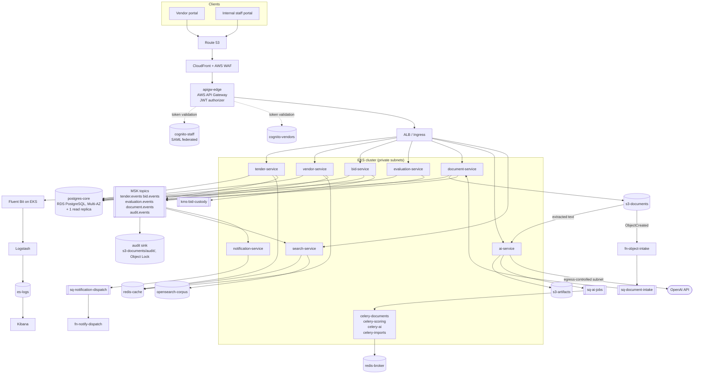
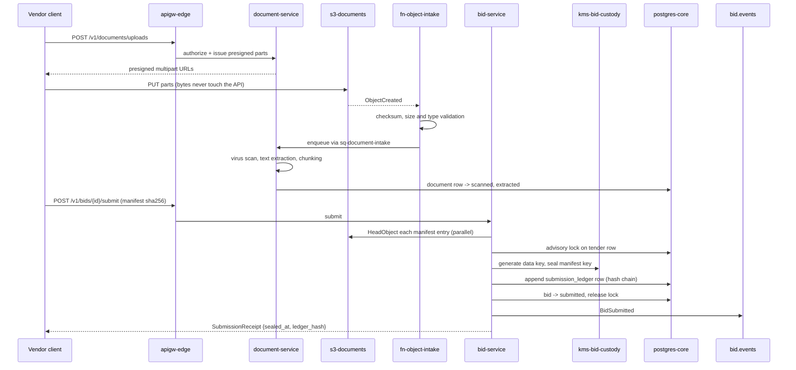

# High-Level Design

**Tender Platform for a MENA Police Department**

## Table of Contents

- [Service Decomposition](#service-decomposition)
- [Architecture Diagram](#architecture-diagram)
- [API Design](#api-design)
- [Request Flows](#request-flows)
- [Technology Mapping](#technology-mapping)
- [Alternatives Considered and Rejected](#alternatives-considered-and-rejected)

This file is the single source of truth for component names and technology choices. Files `03`–`06` refine what is declared here and never substitute an alternative for it.

## Service Decomposition

Eight services on EKS. The boundaries follow one rule: **anything that can decide or destroy a submission is separated from anything that merely reads, searches or generates.** That is why bid custody is its own service and the [AI](https://en.wikipedia.org/wiki/Artificial_intelligence "Artificial Intelligence — Software that generates or assists with tasks such as writing code") work is its own service with its own egress path.

| Service | Owns | Why it is separate |
|---|---|---|
| `tender-service` | Tender lifecycle, requirement pack versions, criteria and weights, clarification board | The state machine every other service reads; keeping it thin keeps the transitions auditable |
| `vendor-service` | Vendor organizations, contacts, qualification documents and expiry, debarment list, CRM activity timeline | The CRM half; changes here are frequent and unrelated to a live tender window |
| `bid-service` | Bid drafts, upload manifests, the sealing commit, the submission ledger, unsealing | The only component holding bid custody. Isolated so no other deployment's blast radius touches sealed content |
| `evaluation-service` | Evaluation sessions, evaluator assignment, recusal, per-criterion scores, consensus, weighted totals, award | Segregation of duties is an architectural boundary, not a role check inside the tender service |
| `document-service` | Upload orchestration, presigned [URL](https://datatracker.ietf.org/doc/html/rfc3986 "Uniform Resource Locator — Addresses the location and access method of a resource on the web") issue, manifest validation, virus-scan verdicts, text extraction, chunking | Fans out to workers; its failure must not stop a vendor from committing an already-uploaded pack |
| `ai-service` | LangGraph pipelines for requirement extraction, proposal summarization and evaluator report generation | The **only** deployment with network egress to the OpenAI endpoint, so the egress boundary is enforceable as a network policy rather than as code review |
| `search-service` | Hybrid keyword + vector query façade over `opensearch-corpus`, and the analytics aggregations | Query shapes change far more often than domain rules; nothing behind it can write |
| `notification-service` | Templating, recipient resolution, dispatch scheduling, delivery receipts | Deadline notices fan out to thousands of vendors and must not compete with the submission path for capacity |

Four [Celery](https://docs.celeryq.dev/en/stable/ "Celery — Distributed task queue that runs background and scheduled jobs outside the request cycle") worker deployments run beside them: `celery-documents` (parsing, chunking, thumbnailing), `celery-scoring` (weighted total computation, scorecard exports), `celery-ai` (pipeline steps handed off by `ai-service`), `celery-imports` (bulk vendor and reference-data loads).

## Architecture Diagram

## API Design

[REST](https://en.wikipedia.org/wiki/REST "Representational State Transfer — Architectural style for stateless, resource-oriented HTTP APIs") over [HTTPS](https://datatracker.ietf.org/doc/html/rfc9110 "HTTP Secure — HTTP encrypted with TLS to protect requests and responses in transit"), versioned at `/v1`, [JSON](https://www.json.org/json-en.html "JavaScript Object Notation — Lightweight text format for structured data exchange") bodies validated by [Pydantic](https://docs.pydantic.dev/latest/ "Pydantic — Python library that validates and parses data against typed models at runtime") models that also generate the [OpenAPI](https://www.openapis.org/ "OpenAPI Specification — Describes an HTTP API's endpoints, schemas and behavior in a machine readable format") document. Every mutating endpoint takes an `Idempotency-Key` header; keys are held in `redis-cache` for 24 hours.

**Tenders** — `tender-service`

| Method & path | Input | Returns |
|---|---|---|
| `POST /v1/tenders` | title, category, budget envelope, procurement type | `TenderDraft` |
| `PUT /v1/tenders/{id}/criteria` | list of `{code, label, weight, scoring_scale}` | `CriteriaSet`; rejected with `409` once published |
| `POST /v1/tenders/{id}/publish` | closing timestamp, notice text | `TenderVersion` — freezes the requirement pack and criteria |
| `GET /v1/tenders` | filters: status, category, closing window, cursor | `Page[TenderSummary]` |
| `GET /v1/tenders/{id}` | — | `TenderDetail` including current version and document manifest |
| `POST /v1/tenders/{id}/clarifications` | question text (vendor) or answer (officer) | `Clarification`, anonymised on broadcast |

**Vendors and CRM** — `vendor-service`

| Method & path | Input | Returns |
|---|---|---|
| `POST /v1/vendors` | legal name, registration number, categories, contacts | `VendorOrg` in `pending_qualification` |
| `POST /v1/vendors/{id}/qualifications` | document reference, type, expiry date | `Qualification` |
| `GET /v1/vendors/{id}/eligibility?tender_id=` | — | `EligibilityVerdict` — **read from the primary, never a replica** |
| `GET /v1/vendors/{id}/timeline` | cursor | `Page[CrmActivity]` |
| `POST /v1/vendors/{id}/debarment` | reason, effective window | `Debarment`; platform-admin scope only |

**Documents** — `document-service`

| Method & path | Input | Returns |
|---|---|---|
| `POST /v1/documents/uploads` | owner reference, filename, byte size, sha256, content type | `{upload_id, presigned_parts[], expires_at}` |
| `POST /v1/documents/uploads/{id}/complete` | part etags | `Document` in `scanning` |
| `GET /v1/documents/{id}` | — | `Document` with scan verdict, extraction state, page count |
| `GET /v1/documents/{id}/content` | — | `302` to a short-lived presigned GET, subject to the custody check in `06` |

**Bids** — `bid-service`

| Method & path | Input | Returns |
|---|---|---|
| `POST /v1/tenders/{id}/bids` | — | `BidDraft`, one per vendor org per tender |
| `PUT /v1/bids/{id}/manifest` | ordered list of `{document_id, role}` | `BidManifest` |
| `POST /v1/bids/{id}/submit` | manifest sha256 acknowledged by the client | `SubmissionReceipt` — the sealing commit, the only timestamp that decides lateness |
| `GET /v1/bids/{id}` | — | `Bid` metadata; content links return `403` until unsealing |
| `POST /v1/tenders/{id}/unseal` | evaluation session id | `UnsealResult`; chair scope, post-deadline only |

**Evaluation** — `evaluation-service`

| Method & path | Input | Returns |
|---|---|---|
| `POST /v1/tenders/{id}/evaluation-sessions` | evaluator ids, quorum | `EvaluationSession` |
| `POST /v1/evaluation-sessions/{id}/recusals` | evaluator id, reason | `Recusal` |
| `PUT /v1/bids/{bid_id}/scores` | list of `{criterion_code, raw_score, justification}` | `Scorecard`; locked once the session closes |
| `POST /v1/evaluation-sessions/{id}/consensus` | per-criterion agreed score | `ConsensusScorecard` with the computed weighted total and `formula_version` |
| `POST /v1/tenders/{id}/award` | winning bid id, justification | `Award`; rejected unless every non-recused evaluator has a locked scorecard |

**AI assistance** — `ai-service` (all asynchronous; every response carries a job handle, never a synthesised answer)

| Method & path | Input | Returns |
|---|---|---|
| `POST /v1/ai/requirement-extraction` | tender version id | `AiJob` |
| `POST /v1/ai/proposal-summary` | bid id, criterion codes | `AiJob`; `409` while the bid is sealed |
| `POST /v1/ai/evaluator-report` | evaluation session id | `AiJob` |
| `GET /v1/ai/jobs/{id}` | — | `AiJob` with state, and on success an `AiArtifact` whose every claim carries `{document_id, page, char_range}` |

**Search and analytics** — `search-service`

| Method & path | Input | Returns |
|---|---|---|
| `GET /v1/search` | `q`, `mode=keyword\|semantic\|hybrid`, scope filters, cursor | `Page[SearchHit]` with highlight and score breakdown |
| `GET /v1/analytics/tender-cycle` | period, category | `CycleTimeReport` |
| `GET /v1/analytics/vendor-participation` | period, category | `ParticipationReport` |

## Request Flows

**Sealing a bid** — the one flow where correctness outranks everything else.

The vendor's clock is never consulted. `sealed_at` is set inside the transaction that appends the ledger row, and that transaction is the definition of "on time".

**Requirement extraction** runs the other way round: `document-service` publishes `DocumentExtracted` to `document.events` once a requirement pack is parsed, `ai-service` consumes it, drives a LangGraph run through `sq-ai-jobs` and `celery-ai`, writes the artifact to `s3-artifacts` with its citation index in `postgres-core`, and emits `AiArtifactReady`. The drafting officer sees proposed criteria as suggestions to accept or discard — the tender's criteria are only ever written by the `PUT /v1/tenders/{id}/criteria` call above.

## Technology Mapping

| Technology | Role in this architecture |
|---|---|
| **Python / [FastAPI](https://fastapi.tiangolo.com/ "FastAPI — Python web framework for building HTTP APIs with async support and automatic schema generation")** | All eight services; async request handling suits a workload that is almost entirely I/O against Postgres, S3, OpenSearch and the model endpoint |
| **Pydantic** | Request/response contracts, OpenAPI generation, settings, and validation of model output against a strict schema before any artifact is stored |
| **[SQLAlchemy](https://www.sqlalchemy.org/ "SQLAlchemy — Python SQL toolkit and ORM that maps objects to relational tables and builds queries")** | [ORM](https://en.wikipedia.org/wiki/Object%E2%80%93relational_mapping "Object Relational Mapper — Maps application objects to relational database rows and queries") for domain writes; Core for the search-adjacent and reporting queries where the plan matters |
| **[Alembic](https://alembic.sqlalchemy.org/en/latest/ "Alembic — Applies and versions database schema migrations for SQLAlchemy")** | Migration history, expand/contract only, applied as a pre-deploy Job so a rollback never faces a narrowed schema |
| **Celery** | Worker runtime for the four worker deployments. `celery-documents`, `celery-scoring` and `celery-imports` are brokered by `redis-broker`; `celery-ai` uses `sq-ai-jobs` as its broker, because a model job runs for minutes and needs SQS's visibility timeout and dead-letter queue rather than a [Redis](https://redis.io/docs/latest/ "Redis — In-memory data store used as a cache and fast key-value store") list |
| **LangChain** | Document loaders, splitters, embedding and retrieval plumbing for the extraction and summarization stages |
| **LangGraph** | The pipeline itself — extraction and report generation are multi-step with validation and retry branches, and LangGraph makes each step's state a checkpoint that can be resumed rather than rerun from the first token |
| **OpenAI [API](https://en.wikipedia.org/wiki/API "Application Programming Interface — Defines the contract by which software components exchange requests and data")** | Embeddings for the vector index, map-stage chunk summarization, reduce-stage report composition |
| **[PostgreSQL](https://www.postgresql.org/docs/current/ "PostgreSQL — Relational database storing and querying structured data with strong transactional guarantees")** (`postgres-core`, RDS Multi-AZ + 1 read replica) | System of record: tenders, versions, criteria, vendors, CRM, bids, manifests, submission ledger, scores, awards, AI citation index, partitioned audit |
| **Redis** (`redis-cache`) | Tender listings, vendor lookups, [JWKS](https://datatracker.ietf.org/doc/html/rfc7517 "JSON Web Key Set — Publishes the public keys a party needs to verify a signed token"), rate-limit counters, idempotency keys, query-embedding cache — entirely expendable |
| **Redis** (`redis-broker`) | Celery transport for the three Redis-brokered worker deployments; a separate instance so a task backlog cannot evict the cache |
| **Amazon OpenSearch** (`opensearch-corpus`) | Domain search: [BM25](https://en.wikipedia.org/wiki/Okapi_BM25 "Best Matching 25 — Ranking function that scores how relevant a document is to a search query") over extracted text plus `knn_vector` fields for semantic retrieval, and the aggregation source for tender analytics |
| **Elasticsearch / Logstash / Kibana** (`es-logs`) | Operational log analytics only — Fluent Bit ships container logs to Logstash, Kibana is where an incident is investigated. Deliberately a different cluster from `opensearch-corpus`: a log flood must not degrade tender search |
| **[Kafka](https://kafka.apache.org/documentation/ "Apache Kafka — Distributed log that stores partitioned, replicated streams of records for publish-subscribe and stream processing") (Amazon MSK)** | Ordered, replayable domain event log — the source for search projections, notifications and the immutable audit sink |
| **AWS SQS** | Point-to-point command delivery with per-message visibility timeouts and dead-letter queues: `fn-object-intake` → `document-service`, `ai-service` → workers, `notification-service` → `fn-notify-dispatch` |
| **AWS Lambda** | `fn-object-intake` (S3 `ObjectCreated` validation and metadata extraction) and `fn-notify-dispatch` (SQS-triggered delivery), both short, stateless and outside the request path |
| **AWS S3** | `s3-documents` (requirement packs, bid packs, extracted text, audit sink under Object Lock), `s3-artifacts` (AI outputs), `s3-tfstate` |
| **AWS Cognito** | `cognito-staff` federated by SAML to the department identity provider; `cognito-vendors` for self-registered external users. Two pools, never one |
| **AWS API Gateway** (`apigw-edge`) | Edge routing, [JWT](https://datatracker.ietf.org/doc/html/rfc7519 "JSON Web Token — Compact, signed token format for carrying claims between parties") authorizer, per-stage throttling and usage plans |
| **AWS IAM** | Fine-grained service-to-service authorization via IRSA — each service's pod identity holds only the S3 prefixes, SQS queues and secrets it needs |
| **AWS Secrets Manager** | Model API keys, database credentials with rotation, third-party integration secrets |
| **AWS VPC** | Private subnets for EKS and all data stores; a single egress-controlled subnet is the only route to the model endpoint |
| **AWS Route 53** | Public zone, health-checked records, and the validation records for the ACM certificates terminating [TLS](https://datatracker.ietf.org/doc/html/rfc8446 "Transport Layer Security — Encrypts and authenticates data sent over a network connection") at CloudFront and the ALB |
| **AWS RDS** | Managed PostgreSQL with Multi-AZ failover, automated backups and point-in-time recovery |
| **Docker / Docker Compose** | Image build; Compose reproduces Postgres, Redis, OpenSearch, LocalStack and a model stub for local development and [CI](https://en.wikipedia.org/wiki/Continuous_integration "Continuous Integration — Automatically builds and tests code on every change") integration tests |
| **[Kubernetes](https://kubernetes.io/ "Kubernetes — Automates deployment, scaling and management of containerized applications") / EKS** | Runtime for twelve deployments; [HPA](https://kubernetes.io/docs/tasks/run-application/horizontal-pod-autoscale/ "Horizontal Pod Autoscaler — Automatically adjusts the number of Kubernetes pod replicas to match load") on CPU for the services, on `sq-ai-jobs` depth for `celery-ai`, and on broker queue length for the other workers |
| **Amazon ECR** | Image registry with scan-on-push; the only registry the cluster is allowed to pull from |
| **[Terraform](https://developer.hashicorp.com/terraform/docs "Terraform — Infrastructure as code tool that declares and provisions cloud infrastructure from configuration files")** | Every AWS resource, state in `s3-tfstate` with DynamoDB state locking, applied only from CI |
| **GitHub / GitHub Actions** | Source of truth and the only path to production; [OIDC](https://openid.net/developers/how-connect-works/ "OpenID Connect — Identity layer on top of OAuth 2.0 for authenticating users") federation to AWS so no long-lived deploy key exists |
| **Bash** | Migration and deployment wrappers, the local development entry point, and the operational scripts invoked from CI |

**Additions beyond the brief's stack**, each flagged where it appears: **CloudFront + AWS [WAF](https://owasp.org/www-community/Web_Application_Firewall "Web Application Firewall — Filters and blocks malicious HTTP traffic before it reaches an application")** (TLS termination, caching of the public tender notice board, [OWASP](https://owasp.org/ "Open Worldwide Application Security Project — Community effort publishing practices and tools for building secure software") rule set, [L7](https://en.wikipedia.org/wiki/OSI_model "Layer 7 — The application layer of the OSI model, where content-aware filtering such as a web application firewall operates") [DDoS](https://en.wikipedia.org/wiki/Denial-of-service_attack "Distributed Denial of Service — Attack that floods a system with traffic from many sources to make it unavailable") absorption — API Gateway alone gives throttling but no managed rule set); **AWS KMS** (`kms-bid-custody`, `kms-data` — Secrets Manager holds secrets, but envelope encryption of bid content needs a key service with grant-based release); **DynamoDB** (Terraform state locking only); **AWS X-Ray** (trace backend for the OpenTelemetry collector); **ClamAV** running as a sidecar in `celery-documents` (an untrusted upload from an external vendor is the platform's widest attack surface and the brief's stack contains no scanner).

## Alternatives Considered and Rejected

**A single asynchronous mechanism instead of three.** Kafka, SQS and Celery all carry work here, which is more machinery than 70 [QPS](https://en.wikipedia.org/wiki/Queries_per_second "Queries Per Second — Throughput measure of how many requests a system serves each second") needs. Each was kept for a reason the others cannot serve: Kafka for an ordered, replayable, long-retention log that the audit trail and the search projection both rebuild from; SQS for the Lambda-to-service handoff, where per-message visibility timeouts and a DLQ are the natural semantics and MSK would mean giving a Lambda broker credentials; Celery because it is the worker runtime the Python services already use. The honest cost is three sets of failure modes and three dashboards, recorded as a trade-off in `04`. If the audit log were moved into partitioned Postgres tables with a transactional outbox, Kafka could be removed outright — that is the first simplification to reach for if operational load becomes the binding constraint.

**One OpenSearch cluster for both documents and logs.** Rejected. Log volume is bursty and unbounded during an incident, and tender search is on the internal critical path exactly when incidents happen. Two clusters cost more; sharing one couples the two failures.

**Storing bid content in PostgreSQL large objects for custody.** Rejected — it makes the sealed-bid guarantee depend on database access control alone, forces multi-gigabyte packs through the connection pool, and would put the deadline surge on the same node as the submission ledger. S3 with per-tender envelope encryption keeps custody in a key grant rather than a row permission.

**Synchronous model calls inside the request path.** Rejected on both latency and availability grounds: a p95 of minutes cannot sit behind a 250 ms read [SLO](https://sre.google/sre-book/service-level-objectives/ "Service Level Objective — Target value for a service level indicator that a service commits to meet"), and a model outage would then take the tender pages down with it. Every model call is a job with a handle, and the platform is fully usable with the AI features switched off.

**Self-managed Kafka on EKS instead of MSK.** Rejected. Broker operations — rebalancing, storage growth, version upgrades — are a full-time concern, and the team is a backend team, not a platform team. MSK's cost is the price of not owning that.
