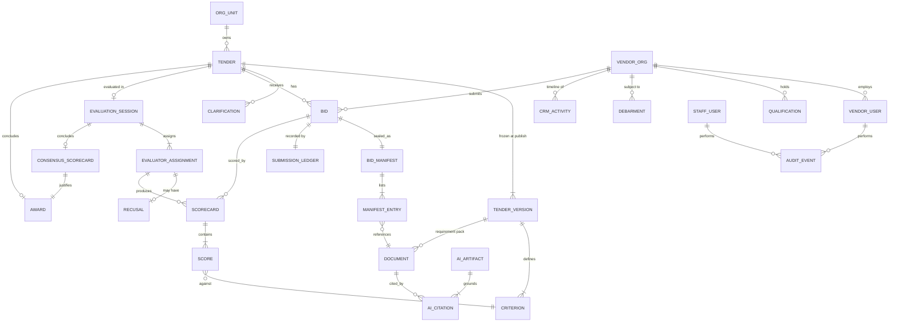

# Data Modeling & Storage

**Tender Platform for a MENA Police Department**

## Table of Contents

- [Where Each Kind of Data Lives](#where-each-kind-of-data-lives)
- [Entity-Relationship Model](#entity-relationship-model)
- [PostgreSQL Schema](#postgresql-schema)
- [The Submission Ledger](#the-submission-ledger)
- [OpenSearch Corpus](#opensearch-corpus)
- [Object Storage Layout](#object-storage-layout)
- [Partitioning and Sharding](#partitioning-and-sharding)
- [Consistency Between the Stores](#consistency-between-the-stores)
- [Retention and Deletion](#retention-and-deletion)

## Where Each Kind of Data Lives

| Data | Store | Why |
|---|---|---|
| Everything that decides an outcome | `postgres-core` | Needs transactions, foreign keys and a single writer |
| Document bytes and extracted text | `s3-documents` | Multi-gigabyte packs must never cross the [API](https://en.wikipedia.org/wiki/API "Application Programming Interface — Defines the contract by which software components exchange requests and data") or the connection pool |
| Searchable chunks and their embeddings | `opensearch-corpus` | A projection, rebuildable from `document.events` and the extracted text in S3 |
| [AI](https://en.wikipedia.org/wiki/Artificial_intelligence "Artificial Intelligence — Software that generates or assists with tasks such as writing code") outputs | `s3-artifacts` for the body, `postgres-core` for the citation index | The body is large and immutable; the citations must join to bids and documents |
| Cached reads, rate counters, idempotency keys | `redis-cache` | Expendable by construction — every key has a source of truth elsewhere |
| Operational logs | `es-logs` | Not application data; separate cluster, separate lifecycle |

## Entity-Relationship Model



## PostgreSQL Schema

Declared here in full, because `05` builds its indexing strategy on these columns and nothing in `05` may reference a column this file does not define. Primary keys are `uuid` generated by the application so a row identity exists before insert; every table carries `created_at timestamptz not null default now()`.

**Tender domain**

- `org_unit` — `id`, `name`, `parent_id`, `cost_centre`.
- `tender` — `id`, `reference_no text unique` (human-facing, format `T-YYYY-NNNNN`), `org_unit_id`, `category_id`, `title`, `procurement_type` (`open`, `restricted`, `direct`), `status` (`draft`, `pending_approval`, `published`, `clarification_closed`, `closed`, `under_evaluation`, `awarded`, `cancelled`), `budget_minor bigint`, `currency char(3)`, `published_at`, `closes_at`, `current_version_id`, `created_by`.
- `tender_version` — `id`, `tender_id`, `version_no int`, `notice_text`, `closes_at`, `frozen_at`, `pack_sha256` (hash over the ordered requirement document hashes). Unique on `(tender_id, version_no)`.
- `criterion` — `id`, `tender_version_id`, `code text`, `label`, `weight numeric(6,4)`, `scoring_scale` (`0-5`, `0-10`, `pass_fail`), `is_mandatory bool`, `display_order int`. Unique on `(tender_version_id, code)`; a deferred constraint trigger asserts the weights of non-`pass_fail` criteria sum to `1.0000` at publish.
- `clarification` — `id`, `tender_id`, `asked_by_vendor_org_id`, `question_text`, `answer_text`, `answered_by`, `published_at`, `is_anonymised bool`.

**Vendor and CRM domain**

- `vendor_org` — `id`, `legal_name`, `registration_no text unique`, `country char(2)`, `status` (`pending_qualification`, `qualified`, `suspended`, `debarred`), `categories uuid[]`, `primary_contact_id`.
- `vendor_user` — `id`, `vendor_org_id`, `cognito_sub text unique`, `email citext`, `role` (`admin`, `submitter`, `viewer`), `disabled_at`.
- `qualification` — `id`, `vendor_org_id`, `qualification_type`, `document_id`, `issued_at`, `expires_at`, `verified_by`, `verified_at`.
- `debarment` — `id`, `vendor_org_id`, `reason`, `effective_from`, `effective_to`, `ordered_by`.
- `crm_activity` — `id`, `vendor_org_id`, `activity_type` (`call`, `meeting`, `email`, `site_visit`, `system`), `summary`, `occurred_at`, `recorded_by`, `related_tender_id`.

**Document domain**

- `document` — `id`, `owner_kind` (`tender_version`, `bid`, `qualification`, `crm_activity`), `owner_id`, `filename`, `content_type`, `byte_size bigint`, `sha256 char(64)`, `s3_key`, `kms_key_id`, `scan_state` (`pending`, `clean`, `infected`, `failed`), `scan_verdict_at`, `extract_state` (`pending`, `extracted`, `unsupported`, `failed`), `page_count int`, `uploaded_by`.

**Bid domain**

- `bid` — `id`, `tender_id`, `vendor_org_id`, `state` (`draft`, `submitted`, `withdrawn`, `unsealed`, `disqualified`), `submitted_at`, `withdrawn_at`, `unsealed_at`. Unique on `(tender_id, vendor_org_id)`.
- `bid_manifest` — `id`, `bid_id unique`, `manifest_sha256 char(64)`, `entry_count int`, `sealed_data_key bytea` (the per-bid data key, encrypted under `kms-bid-custody`), `sealed_at`.
- `manifest_entry` — `id`, `bid_manifest_id`, `document_id`, `role` (`technical`, `financial`, `compliance`), `display_order int`, `sha256 char(64)` copied at seal time so a later object mutation is detectable.

**Evaluation domain**

- `evaluation_session` — `id`, `tender_id unique`, `chair_user_id`, `quorum int`, `state` (`open`, `scoring`, `consensus`, `closed`), `opened_at`, `closed_at`.
- `evaluator_assignment` — `id`, `evaluation_session_id`, `staff_user_id`, `assigned_at`. Unique on `(evaluation_session_id, staff_user_id)`.
- `recusal` — `id`, `evaluator_assignment_id unique`, `reason`, `declared_at`.
- `scorecard` — `id`, `evaluator_assignment_id`, `bid_id`, `state` (`open`, `locked`), `locked_at`. Unique on `(evaluator_assignment_id, bid_id)`.
- `score` — `id`, `scorecard_id`, `criterion_id`, `raw_score numeric(5,2)`, `justification text`. Unique on `(scorecard_id, criterion_id)`.
- `consensus_scorecard` — `id`, `evaluation_session_id`, `bid_id`, `weighted_total numeric(7,4)`, `formula_version text`, `agreed_at`, `agreed_by`. Unique on `(evaluation_session_id, bid_id)`.
- `award` — `id`, `tender_id unique`, `winning_bid_id`, `consensus_scorecard_id`, `justification text`, `signed_by`, `signed_at`, `contract_reference`.

**AI and audit**

- `ai_artifact` — `id`, `subject_kind` (`tender_version`, `bid`, `evaluation_session`), `subject_id`, `artifact_kind` (`requirement_extraction`, `proposal_summary`, `evaluator_report`), `s3_key`, `model_id`, `prompt_version`, `pipeline_version`, `input_sha256`, `token_usage jsonb`, `state` (`running`, `ready`, `failed`, `suppressed`), `created_at`. Artifacts are never updated; a rerun writes a new row.
- `ai_citation` — `id`, `ai_artifact_id`, `claim_ref text` (the artifact-internal anchor), `document_id`, `page int`, `char_start int`, `char_end int`. An artifact with any claim lacking a citation is rejected by the [Pydantic](https://docs.pydantic.dev/latest/ "Pydantic — Python library that validates and parses data against typed models at runtime") validator before it reaches `ready`.
- `audit_event` — `id`, `occurred_at timestamptz not null`, `actor_kind` (`staff`, `vendor`, `service`), `actor_id`, `action text`, `subject_kind`, `subject_id`, `request_id`, `source_ip inet`, `detail jsonb`. Declaratively range-partitioned by month.
- `event_outbox` — `id`, `topic text`, `event_type text`, `aggregate_kind`, `aggregate_id`, `aggregate_version bigint`, `payload jsonb`, `published_at timestamptz` (null until the relay confirms). Written in the same transaction as the domain change; unique on `(aggregate_kind, aggregate_id, aggregate_version)`.
- `notification_outbox` — `id`, `channel` (`email`, `sms`, `in_app`), `recipient_ref`, `template_code`, `payload jsonb`, `state` (`pending`, `dispatched`, `failed`), `scheduled_for`, `dispatched_at`, `attempts int`.

## The Submission Ledger

`submission_ledger` is the table the whole sealed-bid guarantee rests on, and it is append-only: no `UPDATE` or `DELETE` grant exists for any application role.

- `id`, `tender_id`, `seq bigint`, `bid_id`, `manifest_sha256`, `sealed_at timestamptz`, `prev_hash char(64)`, `entry_hash char(64)`.
- `entry_hash = sha256(prev_hash || tender_id || seq || bid_id || manifest_sha256 || sealed_at)`.
- Unique on `(tender_id, seq)`; `seq` is allocated under the per-tender advisory lock taken in the sealing transaction, which is what makes the chain totally ordered per tender.
- The chain head is published to `audit.events` on every append, and the audit sink in `s3-documents/audit/` is written under S3 Object Lock in compliance mode. Verifying an award therefore means recomputing the chain from the ledger and comparing the head against a record that not even a database administrator can rewrite.

A late submission is not a policy question: the transaction that would append a row with `sealed_at > tender.closes_at` is rejected by a check against the tender row read in the same transaction.

## OpenSearch Corpus

One index per quarter, `corpus-YYYY-Qn`, behind the read alias `corpus-hot` and the write alias `corpus-current`. Per document chunk:

| Field | Type | Use |
|---|---|---|
| `chunk_id` | `keyword` | `{document_id}:{ordinal}` |
| `document_id`, `owner_kind`, `owner_id`, `tender_id`, `vendor_org_id` | `keyword` | Scope filters, and the tenancy filter applied on every query |
| `sensitivity` | `keyword` | `public`, `internal`, `sealed` — a `sealed` chunk is filtered out for every principal until unsealing |
| `text` | `text`, analyzer with Arabic and English sub-fields | [BM25](https://en.wikipedia.org/wiki/Okapi_BM25 "Best Matching 25 — Ranking function that scores how relevant a document is to a search query") scoring and highlighting |
| `embedding` | `knn_vector`, 768 dimensions, [HNSW](https://arxiv.org/abs/1603.09320 "Hierarchical Navigable Small World — Graph index for approximate nearest-neighbour search over vectors") / cosine | Semantic retrieval |
| `page`, `char_start`, `char_end` | `integer` | Citation anchors, so a hit resolves to a page in the source |
| `indexed_at`, `pipeline_version` | `date`, `keyword` | Reindex targeting after an embedding-model change |

Embeddings are produced at 768 dimensions rather than the model's full width; the accuracy cost is small for retrieval over procurement prose, and the index footprint estimate in `01` assumes it.

> **Verify Before Build:** dimension reduction is only safe if the chosen embedding model supports truncation natively rather than by naive slicing — confirm against the model card, and re-measure recall on a sample of real tender packs before committing the index mapping.

## Object Storage Layout

```
s3-documents/
  tenders/{tender_id}/versions/{version_id}/{document_id}/{filename}
  bids/{tender_id}/{bid_id}/{document_id}/{filename}          <- SSE-KMS, kms-bid-custody
  qualifications/{vendor_org_id}/{document_id}/{filename}
  extracted/{document_id}/text.json                            <- page-anchored extraction
  audit/{yyyy}/{mm}/{dd}/{hour}.jsonl.gz                       <- Object Lock, compliance mode
s3-artifacts/
  ai/{artifact_kind}/{artifact_id}.json
```

Versioning is on for every prefix. The `bids/` prefix has its own bucket policy denying `s3:GetObject` to every principal except `bid-service`'s role, and `bid-service` issues a presigned GET only after the unsealing check in `06`.

## Partitioning and Sharding

**Nothing is sharded, and that is a decision, not an omission.** At the volumes in `01` — ~130 GB over five years and a peak well under 300 [QPS](https://en.wikipedia.org/wiki/Queries_per_second "Queries Per Second — Throughput measure of how many requests a system serves each second") — a single Multi-AZ RDS instance with one read replica is the correct size, and sharding would buy nothing while making the submission ledger's ordering guarantee substantially harder.

What is partitioned:

- `audit_event` — monthly `RANGE` partitions on `occurred_at`. Partitions older than 12 months are detached and exported to the audit sink; the retention floor in `06` governs when, if ever, they are dropped.
- `notification_outbox` — monthly partitions on `created_at`, dropped after 90 days.
- `opensearch-corpus` — quarterly indices, so ageing the corpus out is an alias change rather than a delete-by-query.

**Evolution triggers**, in the order they would be reached:

1. Read replica saturation on analytics queries → move the reporting aggregations off Postgres entirely onto `opensearch-corpus`, which already holds the dimensions.
2. Sustained primary write throughput above ~2,000 [TPS](https://en.wikipedia.org/wiki/Transaction_processing "Transactions Per Second — Throughput measure of how many transactions a system completes each second"), or a Postgres data volume past ~1.5 TB → partition `score` and `crm_activity` by year before considering anything else.
3. Only if a second department is ever onboarded — explicitly out of scope in `01` — would horizontal partitioning by `org_unit_id` become the right answer.

## Consistency Between the Stores

Postgres is written first, always, inside the request transaction. Everything else follows from the event log.

| Pair | Mechanism | Lag budget | What happens on divergence |
|---|---|---|---|
| `postgres-core` → `opensearch-corpus` | `document.events` / `tender.events` consumed by `search-service` | ≤ 30 s | A nightly reconciliation compares row counts and `updated_at` watermarks per tender and re-emits the gap |
| `postgres-core` → `s3-documents` | The document row is only marked `clean`/`extracted` after the object is verified present with a matching `sha256` | n/a — same-path | An object present with no row is orphaned and swept after 7 days; a row with no object is a hard failure and alerts |
| `postgres-core` → audit sink | `audit.events` with the ledger head on every append | ≤ 10 s | The chain head mismatch alert in `05` fires; this is treated as a security incident, not a lag |
| `postgres-core` → `redis-cache` | Cache-aside with explicit invalidation on the event, [TTL](https://en.wikipedia.org/wiki/Time_to_live "Time To Live — Duration after which a cached or stored value expires") as the backstop | ≤ TTL | Irrelevant — a stale cached listing is acceptable, and no cached value is ever read on the eligibility, sealing or scoring paths |

The transactional outbox pattern carries the Postgres-to-[Kafka](https://kafka.apache.org/documentation/ "Apache Kafka — Distributed log that stores partitioned, replicated streams of records for publish-subscribe and stream processing") step: domain events are written to an `event_outbox` row in the same transaction as the domain change, and a relay publishes and marks them. A crash between the two yields a duplicate delivery, never a lost one, and every consumer is keyed on `(aggregate_id, aggregate_version)` so duplicates are idempotent.

## Retention and Deletion

- **Tenders, bids, scores, awards and the ledger are never deleted.** Government procurement records carry a statutory retention period, and the design treats deletion of an award trail as impossible rather than restricted.
- **Vendor personal data** — contact names, emails and phone numbers — is erasable on request, by tombstoning `vendor_user` and redacting `crm_activity.summary`, while leaving the vendor organization and every bid intact. The distinction that makes this work: the award trail references the organization, never the individual.
- **AI artifacts** are deleted 180 days after the tender is awarded. They are advisory, reproducible from the stored `input_sha256`, `model_id` and `prompt_version`, and keeping them longer only widens the surface of a document no one is accountable for.
- **Documents from cancelled tenders** are deleted after 90 days; the tender row and its audit trail remain.
- **`es-logs`** follows a 30-day hot / 90-day warm / delete lifecycle, and carries no bid content by the redaction rules in `06`.

> **Verify Before Build:** the statutory retention period for police procurement records is set by national law in the deploying country and may exceed the five-year storage model in `01`. Confirm the figure with the department's legal office before sizing the archive tier — the design assumes retention is long, not that it is five years.
