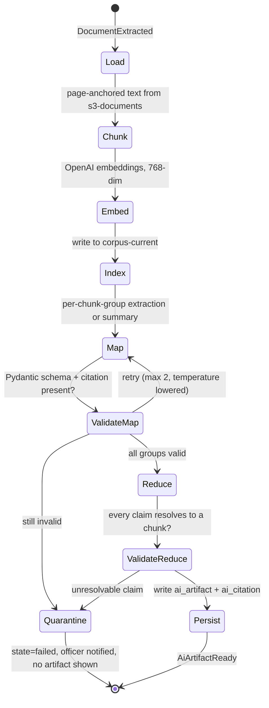

# Deep Dive & Bottlenecks

**Tender Platform for a MENA Police Department**

## Table of Contents

- [Communication Patterns](#communication-patterns)
- [Event Catalogue](#event-catalogue)
- [The AI Pipeline](#the-ai-pipeline)
- [The Latency Budget](#the-latency-budget)
- [Bottleneck 1: The Deadline Surge](#bottleneck-1-the-deadline-surge)
- [Bottleneck 2: Summarizing a Large Bid Pack](#bottleneck-2-summarizing-a-large-bid-pack)
- [Bottleneck 3: Hybrid Search at Committee Time](#bottleneck-3-hybrid-search-at-committee-time)
- [Bottleneck 4: Bulk Vendor and Reference Imports](#bottleneck-4-bulk-vendor-and-reference-imports)
- [Failure Modes and Single Points of Failure](#failure-modes-and-single-points-of-failure)
- [Trade-offs](#trade-offs)

## Communication Patterns

| Path | Style | Why |
|---|---|---|
| Client → `apigw-edge` → any service | Sync [REST](https://en.wikipedia.org/wiki/REST "Representational State Transfer — Architectural style for stateless, resource-oriented HTTP APIs") | The user is waiting and the answer is small |
| Client → `s3-documents` (presigned multipart) | Sync, direct | Bytes must not traverse the [API](https://en.wikipedia.org/wiki/API "Application Programming Interface — Defines the contract by which software components exchange requests and data"); this is what makes a 10× upload surge survivable |
| `bid-service` → `postgres-core` → `kms-bid-custody` | Sync, in one transaction boundary | The sealing commit has to be atomic with the ledger append, so nothing here may be deferred |
| `vendor-service` eligibility check | Sync, **primary read** | An eventually consistent answer to "may this vendor bid" is a wrong answer |
| Any service → MSK topic | Async, transactional outbox | Domain facts, fanned out to consumers the writer does not know about |
| `s3-documents` → `fn-object-intake` → `sq-document-intake` → `document-service` | Async, at-least-once | Upload completion is a notification, not a request; the DLQ is what makes a poison file visible |
| `ai-service` → `sq-ai-jobs` → `celery-ai` | Async, at-least-once, idempotent on `input_sha256` | Model calls take minutes and must be resumable |
| `notification-service` → `sq-notification-dispatch` → `fn-notify-dispatch` | Async, at-least-once | Deadline notices fan out to thousands; delivery is retried, never blocking |
| `search-service` ← `document.events` / `tender.events` | Async projection | The 30-second lag budget from `01` |

Synchronous service-to-service calls are used in exactly one place — `bid-service` asking `vendor-service` for an eligibility verdict during sealing — and it is deliberate: the answer must be current, and a cached or eventually consistent one would let a debarred vendor submit. Everywhere else, a service that needs another service's data consumes its events and keeps its own copy.

## Event Catalogue

| Topic | Event | Key | Consumers |
|---|---|---|---|
| `tender.events` | `TenderPublished`, `TenderClosed`, `TenderCancelled`, `ClarificationAnswered` | `tender_id` | `search-service`, `notification-service`, `ai-service`, audit sink |
| `bid.events` | `BidSubmitted`, `BidWithdrawn`, `BidUnsealed`, `BidDisqualified` | `tender_id` | `evaluation-service`, `notification-service`, audit sink |
| `document.events` | `DocumentScanned`, `DocumentExtracted`, `DocumentChunked`, `DocumentQuarantined` | `document_id` | `search-service`, `ai-service`, `bid-service` |
| `evaluation.events` | `SessionOpened`, `ScorecardLocked`, `ConsensusAgreed`, `AwardSigned` | `tender_id` | `notification-service`, `search-service`, audit sink |
| `audit.events` | `AuditRecorded` carrying the ledger head on every submission | `tender_id` | Audit sink only |

Keying `bid.events` and `evaluation.events` by `tender_id` rather than by the entity id is deliberate: a partition then carries one tender's whole history in order, which is what lets the audit sink and the evaluation projection replay a single tender without reordering.

## The AI Pipeline

Both LangGraph pipelines share a shape: retrieve, map, validate, reduce, validate again, and refuse rather than guess.

Three properties matter more than the model choice.

**Every claim carries a citation or the artifact does not exist.** The reduce stage emits structured claims, each naming a `chunk_id`; `ValidateReduce` resolves every one back to a real chunk of a real document belonging to the subject. A claim that does not resolve fails the whole artifact. This is the structural version of the rule stated in `01` — the model cannot decide anything, because an unsupported sentence never reaches a human.

**Checkpointing is why LangGraph is here rather than a plain chain.** A 60-page requirement pack is dozens of model calls; a transient rate-limit error two thirds of the way through must resume, not restart. LangGraph state is checkpointed to `postgres-core` after each node, keyed by `(job_id, node)`.

**The map stage is cached by content.** The cache key is `sha256(chunk_text || prompt_version || model_id)`, stored in `redis-cache` with a 30-day [TTL](https://en.wikipedia.org/wiki/Time_to_live "Time To Live — Duration after which a cached or stored value expires") and backed by `s3-artifacts`. Vendors reuse boilerplate across bids heavily — company profiles, certifications, standard terms — so this is the single largest lever on the token cost modelled in `01`.

## The Latency Budget

Each figure is the p95 contribution measured at its own hop; the sum is compared against the [SLO](https://sre.google/sre-book/service-level-objectives/ "Service Level Objective — Target value for a service level indicator that a service commits to meet") from `01` rather than asserted to fit.

**Tender browse — SLO p95 < 250 ms**

| Hop | Cold | Cached |
|---|---|---|
| CloudFront → API Gateway → ALB | 25 ms | 25 ms |
| [JWT](https://datatracker.ietf.org/doc/html/rfc7519 "JSON Web Token — Compact, signed token format for carrying claims between parties") verification ([JWKS](https://datatracker.ietf.org/doc/html/rfc7517 "JSON Web Key Set — Publishes the public keys a party needs to verify a signed token") from `redis-cache`) | 8 ms | 8 ms |
| Listing query on `postgres-core` replica | 35 ms | — |
| `redis-cache` hit | — | 4 ms |
| Serialization and response | 25 ms | 20 ms |
| **Total** | **93 ms** | **57 ms** |

**Hybrid search — SLO p95 < 700 ms**

| Hop | Cold query | Repeat query |
|---|---|---|
| Edge and authorization | 33 ms | 33 ms |
| Query embedding via the OpenAI API | 220 ms | 3 ms (embedding cached in `redis-cache`) |
| OpenSearch hybrid [BM25](https://en.wikipedia.org/wiki/Okapi_BM25 "Best Matching 25 — Ranking function that scores how relevant a document is to a search query") + kNN over `corpus-hot` | 180 ms | 180 ms |
| Result assembly, tenancy and `sensitivity` filtering, highlight | 40 ms | 40 ms |
| Serialization | 15 ms | 15 ms |
| **Total** | **488 ms** | **271 ms** |

The 212 ms of headroom is deliberate: the embedding hop is a third-party call across the egress path, and it is the one term here that can degrade without warning. If it does, `search-service` falls back to keyword-only and returns a `degraded: true` flag rather than exceeding the SLO.

**Bid sealing — SLO p95 < 1.2 s**

| Hop | Typical (12 documents) | Worst case (60 documents, lock contention) |
|---|---|---|
| Edge and authorization | 33 ms | 33 ms |
| Eligibility check against `vendor-service` (primary read) | 30 ms | 45 ms |
| `HeadObject` on every manifest entry, parallel, 16 at a time | 60 ms | 210 ms |
| Advisory lock acquisition on the tender row | 5 ms | 380 ms |
| `kms-bid-custody` data-key generation and seal | 40 ms | 40 ms |
| Ledger append, hash chain, bid state transition | 25 ms | 60 ms |
| Outbox write and commit | 15 ms | 30 ms |
| **Total** | **208 ms** | **798 ms** |

The worst case is what the surge below produces, and it still clears the SLO with 400 ms to spare. The lock is the only serialized resource, and it is held for the ledger append alone — tens of milliseconds — not for the `HeadObject` fan-out, which happens before it is taken.

## Bottleneck 1: The Deadline Surge

Several hundred vendors finish against the same closing minute: ~260 [QPS](https://en.wikipedia.org/wiki/Queries_per_second "Queries Per Second — Throughput measure of how many requests a system serves each second") for 10–20 minutes, against a 25 QPS baseline.

- **Bytes never reach the platform.** Uploads are presigned multipart PUTs straight to `s3-documents`, so the surge costs the API nothing but the presign call.
- **The presign path is stateless and cached.** `document-service` scales on CPU with an [HPA](https://kubernetes.io/docs/tasks/run-application/horizontal-pod-autoscale/ "Horizontal Pod Autoscaler — Automatically adjusts the number of Kubernetes pod replicas to match load") floor raised on a schedule derived from `tender.closes_at` — the closing times are known days ahead, so this is pre-scaling, not reactive autoscaling. Reactive scaling alone would add pods after the surge had already produced errors.
- **Progress polling is pushed to the edge.** `GET /v1/documents/{id}` is cached at CloudFront for 5 seconds; a client polling every 2 seconds therefore reaches the origin at most once per 5.
- **The lock is per tender, not global.** Ten tenders closing at the same instant contend on ten different advisory locks.
- **A grace window is explicit, not accidental.** Sealing accepts a commit whose transaction *started* before `closes_at`, recording both timestamps in the ledger. Without this, a submission that began at 23:59:59.8 and committed at 00:00:00.1 would be rejected for a reason the vendor cannot see or control.

## Bottleneck 2: Summarizing a Large Bid Pack

A 55 MB bid pack is ~120 K tokens of extracted text, and eleven of them arrive at once when a tender closes.

- Summarization never starts before unsealing, which puts it after the deadline surge rather than during it — the two peaks do not overlap by construction.
- The map stage fans out across `celery-ai` with a concurrency ceiling set by the account's model rate limit, not by pod count; exceeding it converts one slow job into eleven failing ones.
- Map results are content-addressed, so the boilerplate that repeats across a vendor's bids is summarized once.
- The whole feature is behind a kill switch. With `ai.enabled=false`, evaluators read the source documents and score exactly as they would without the platform's assistance. Nothing downstream of an [AI](https://en.wikipedia.org/wiki/Artificial_intelligence "Artificial Intelligence — Software that generates or assists with tasks such as writing code") artifact is load-bearing.

> **Deep Dive Reference:** map-reduce summarization quality over Arabic and English procurement prose in the same pack — chunk boundaries that split a bilingual table degrade both the summary and its citations. Worth a proof of concept on real packs before choosing a splitter.

## Bottleneck 3: Hybrid Search at Committee Time

Evaluators search across bids during a session, when the corpus is largest and the queries are least cacheable.

- `sensitivity` filtering runs as a **filter clause, not a post-filter**, so a sealed chunk never enters scoring and cannot leak through a highlight fragment.
- kNN is restricted to `corpus-hot`; anything older is a deliberate opt-in that re-indexes from the extracted text in S3 first.
- Query embeddings are cached on the normalised query string, which is effective because a committee converges on the same handful of phrases.
- The fallback to keyword-only search is the availability answer for the embedding hop, as recorded in the latency budget.

## Bottleneck 4: Bulk Vendor and Reference Imports

A supplier-registry import can carry tens of thousands of rows.

- The file is uploaded to S3 and processed by `celery-imports` in batches of 500 inside separate transactions, so a bad row fails a batch rather than the import.
- Every row is validated against a [Pydantic](https://docs.pydantic.dev/latest/ "Pydantic — Python library that validates and parses data against typed models at runtime") model first and rejected rows are written to a downloadable error report — the import is never partially applied without a record of what was skipped.
- Imports emit ordinary domain events, so the search projection follows the same path as an interactive change and no second write path into OpenSearch exists.

## Failure Modes and Single Points of Failure

| Component | Failure | Mitigation | Residual |
|---|---|---|---|
| `postgres-core` primary | Instance or AZ loss | Multi-AZ automatic failover, ~60–120 s | Writes rejected during failover; sealing returns `503` with `Retry-After`, and the grace window above covers a deadline that falls inside it |
| `postgres-core` | Data corruption or bad migration | [PITR](https://www.postgresql.org/docs/current/continuous-archiving.html "Point in Time Recovery — Restores a database to a specific past moment using base backups and archived logs") to any second in the 35-day window; expand/contract migrations only | Restore is an hour, matching the [RTO](https://en.wikipedia.org/wiki/Disaster_recovery "Recovery Time Objective — Maximum acceptable duration to restore a system after a disruption") in `01` |
| `kms-bid-custody` | Regional KMS degradation | Retries with backoff; sealing fails closed | **A real [SPOF](https://en.wikipedia.org/wiki/Single_point_of_failure "Single Point of Failure — A component whose failure alone can bring down the whole system").** A bid cannot be sealed while KMS is unavailable. Accepted deliberately — sealing a bid without custody would be worse than not sealing it |
| `s3-documents` | Object unavailable | Cross-AZ by default, versioning on, Object Lock on the audit prefix | Regional outage stops uploads; no mitigation short of cross-region replication, which is a cost decision not yet taken |
| MSK | Broker or cluster loss | 3 brokers across AZs, RF 3, `min.insync.replicas=2`; the outbox retains unpublished events | Projections and notifications lag; **no domain write fails**, which is the point of the outbox |
| `opensearch-corpus` | Cluster loss | 3 data nodes across AZs; fully rebuildable from `document.events` plus S3 text | Search degraded to unavailable; nothing that decides an outcome depends on it |
| `redis-cache` | Instance loss | Cache-aside; every key has a source of truth | Cold-cache latency, no correctness impact |
| `redis-broker` | Instance loss | [AOF](https://redis.io/docs/latest/operate/oss_and_stack/management/persistence/ "Append Only File — Redis persistence mode that logs every write for durability") persistence, Multi-AZ replication | In-flight [Celery](https://docs.celeryq.dev/en/stable/ "Celery — Distributed task queue that runs background and scheduled jobs outside the request cycle") tasks re-delivered; every task is idempotent |
| OpenAI API | Outage, rate limiting, or a policy change | Jobs retried with backoff; kill switch; keyword-only search fallback | AI features unavailable; the platform remains fully operable |
| `cognito-staff` / the department [IdP](https://en.wikipedia.org/wiki/Identity_provider "Identity Provider — Service that authenticates users and issues identity assertions to relying applications") | Federation outage | Break-glass local administrator accounts with hardware [MFA](https://en.wikipedia.org/wiki/Multi-factor_authentication "Multi Factor Authentication — Requires more than one form of evidence to verify a user's identity"), audited on every use | Staff sign-in blocked; vendor submission unaffected, since it uses the separate pool |
| EKS node group | Node or AZ loss | Pod anti-affinity across AZs, PDBs, cluster autoscaler | Brief capacity dip |
| `es-logs` | Cluster loss | Fluent Bit buffers to disk | Logs delayed; production is unaffected, which is exactly why it is a separate cluster |

## Trade-offs

| Decision | Chosen | Cost accepted | Why |
|---|---|---|---|
| Three async mechanisms ([Kafka](https://kafka.apache.org/documentation/ "Apache Kafka — Distributed log that stores partitioned, replicated streams of records for publish-subscribe and stream processing"), SQS, Celery) | Keep all three | Three sets of failure modes, dashboards and on-call knowledge, at a scale none of them is stretched by | Each serves a need the others cannot: replayable ordered log, Lambda handoff with DLQ semantics, in-process worker runtime. The first simplification if operational load binds is to move the audit log into partitioned Postgres and drop Kafka |
| Sealing fails closed on KMS unavailability | Fail closed | An acknowledged SPOF on the submission path | A bid accepted without custody is an unprovable award. The grace window and `Retry-After` make the failure recoverable by the vendor rather than silent |
| Eligibility read from the primary | Primary | Extra load on the write node, and no ability to serve it from the replica | Eventual consistency here means a debarred vendor bidding, which is a legal defect, not a stale page |
| Model calls outside the request path | Always async | A worse user experience — a job handle instead of an answer | A minutes-long p95 cannot live behind a 250 ms SLO, and a model outage would otherwise take the tender pages with it |
| AI artifacts advisory, citation-validated, never inputs | Advisory only | Real work discarded when validation fails; no "AI-assisted scoring" feature | An award that a model influenced and no one can trace is indefensible in a procurement audit |
| Two search clusters | Separate `opensearch-corpus` and `es-logs` | A second cluster to run and pay for | A log flood during an incident must not degrade search during the same incident |
| Single region | One region, no cross-region DR | RTO depends on one region's health | Data residency in `06` constrains where a replica may live, and the department has not funded a second site. Recorded as an open decision, not as a solved problem |
| Presigned direct-to-S3 uploads | Direct | The API cannot inspect bytes at upload time | Scanning and extraction happen after the object lands; this is what keeps a 10× surge off the platform |
