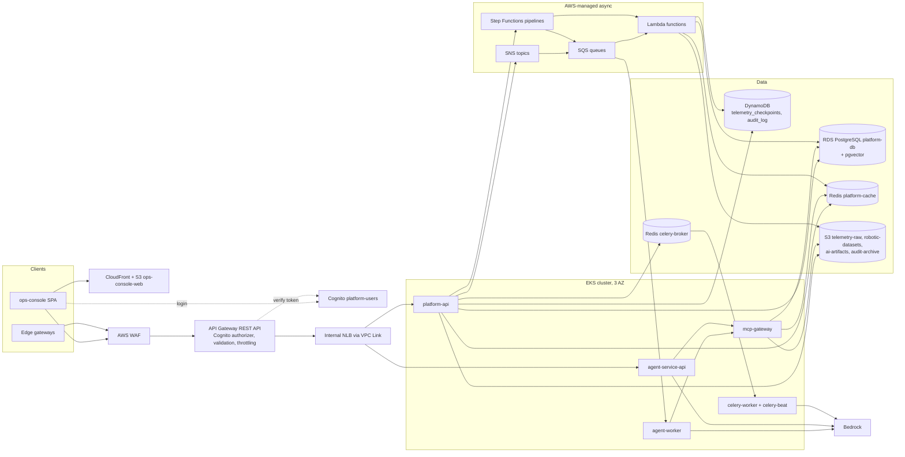
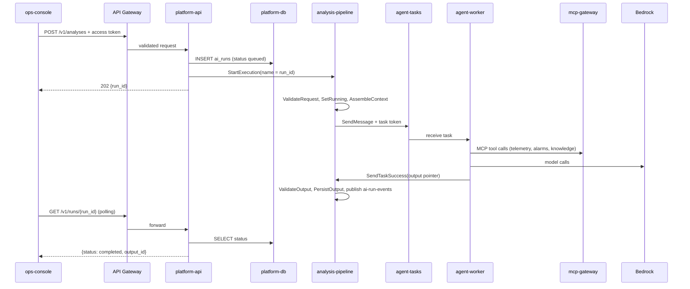

# High-Level Design

*Robotic & Industrial [AI](https://en.wikipedia.org/wiki/Artificial_intelligence "Artificial Intelligence — Software that generates or assists with tasks such as writing code") Intelligence Platform*

**Table of Contents**
- [Architecture Overview](#architecture-overview)
- [Component Catalogue](#component-catalogue)
- [API Design](#api-design)
- [End-to-End Request Flow](#end-to-end-request-flow)
- [Technology Mapping](#technology-mapping)
- [Stack Gaps and Additions](#stack-gaps-and-additions)

## Architecture Overview

Two entry points share one edge. Users reach the `ops-console` single-page app through CloudFront and call the [REST](https://en.wikipedia.org/wiki/REST "Representational State Transfer — Architectural style for stateless, resource-oriented HTTP APIs") [API](https://en.wikipedia.org/wiki/API "Application Programming Interface — Defines the contract by which software components exchange requests and data"); edge gateways call the same REST API with machine credentials. API Gateway authenticates, validates and throttles every request, then forwards it over a [VPC](https://aws.amazon.com/vpc/ "Virtual Private Cloud — Isolated private network in which cloud resources run") Link to [FastAPI](https://fastapi.tiangolo.com/ "FastAPI — Python web framework for building HTTP APIs with async support and automatic schema generation") services on [EKS](https://aws.amazon.com/eks/ "Amazon Elastic Kubernetes Service — Managed Kubernetes hosting on AWS"). Anything slower than a request — telemetry fan-out, AI runs, document ingestion — leaves the request path through [SNS](https://aws.amazon.com/sns/ "Amazon Simple Notification Service — Managed publish-subscribe topics that fan one message out to many subscribers"), [SQS](https://aws.amazon.com/sqs/ "Amazon Simple Queue Service — Managed message queue that decouples producers from consumers"), Step Functions or [Celery](https://docs.celeryq.dev/en/stable/ "Celery — Distributed task queue that runs background and scheduled jobs outside the request cycle").

- **Load balancing.** API Gateway (Regional, REST) forwards through a VPC Link to an internal Network Load Balancer, whose IP target groups point straight at pods. `mcp-gateway`, `celery-worker` and `agent-worker` have no public route.
- **Stateless compute.** Every EKS service is stateless; all state lives in the data stores, so a pod can be killed at any time. The same rule applies to Lambda.
- **One region, three Availability Zones.** Nodes, the database standby, both [Redis](https://redis.io/docs/latest/ "Redis — In-memory data store used as a cache and fast key-value store") replication groups and the load balancer span three zones (04).

## Component Catalogue

This table owns every component name; 01 and 03–06 use them unchanged.

| Kind | Name | Role |
|---|---|---|
| Web client | `ops-console` | React [SPA](https://en.wikipedia.org/wiki/Single-page_application "Single Page Application — Web application that updates its content in place without full page reloads"): fleet, alarms, analyses, inspections, review queue, datasets |
| EKS service | `platform-api` | Core REST API: devices, telemetry ingest and query, runs, outputs, reviews, datasets, audit lookup |
| EKS service | `agent-service-api` | Synchronous assist endpoint; same image as `agent-worker` |
| EKS worker | `agent-worker` | Consumes `agent-tasks`; runs LangGraph workflows and returns results to Step Functions |
| EKS service | `mcp-gateway` | [MCP](https://modelcontextprotocol.io/ "Model Context Protocol — Open protocol that exposes tools and data to AI agents through a standard interface") server exposing telemetry, operational data and knowledge search as agent tools; cluster-internal |
| EKS worker | `celery-worker`, `celery-beat` | Background jobs: document ingestion, image thumbnails, partition upkeep, hourly rollups, sweepers |
| Lambda | `telemetry-archiver`, `telemetry-rollup`, `telemetry-rules` | The three telemetry consumers |
| Lambda | `run-validate-request`, `run-set-status`, `run-assemble-context`, `run-validate-output`, `run-persist-output`, `image-preprocess` | Step Functions task steps |
| Lambda | `webhook-dispatcher`, `followup-trigger`, `audit-archiver`, `token-enricher` | Run-event subscribers, audit archive, Cognito token customisation |
| State machine | `analysis-pipeline`, `inspection-pipeline`, `generation-pipeline` | Standard workflows orchestrating AI runs (04) |
| SNS topic | `telemetry-batches.fifo`, `ai-run-events`, `ops-alerts` | Telemetry fan-out, run lifecycle fan-out, alarm notifications |
| SQS queue | `telemetry-archive.fifo`, `telemetry-rollup.fifo`, `telemetry-rules.fifo` | One per telemetry consumer, ordered per gateway |
| SQS queue | `agent-tasks`, `run-events-webhooks`, `run-events-followups` | Agent work items; run-event subscribers. Each queue has a `-dlq` twin |
| [PostgreSQL](https://www.postgresql.org/docs/current/ "PostgreSQL — Relational database storing and querying structured data with strong transactional guarantees") | `platform-db` ([RDS](https://aws.amazon.com/rds/ "Amazon Relational Database Service — Managed hosting for relational databases such as PostgreSQL, with backups and failover")), database `platform` | Schemas `core`, `telemetry`, `ai`, `agent_state` (03) |
| Redis | `platform-cache`, `celery-broker` | Two ElastiCache replication groups: cache and limits; Celery broker |
| DynamoDB | `telemetry_checkpoints`, `audit_log` | Consumer checkpoints; audit events (03) |
| [S3](https://aws.amazon.com/s3/ "Amazon Simple Storage Service — Durable object storage for files, datasets and archives") bucket | `telemetry-raw`, `robotic-datasets`, `ai-artifacts`, `audit-archive`, `ops-console-web` | Each prefixed with the environment, e.g. `prod-telemetry-raw` |
| Cognito | user pool `platform-users` | Users and machine clients; resource server `platform` |
| [IAM](https://aws.amazon.com/iam/ "AWS Identity and Access Management — Controls which principals may perform which actions on which AWS resources") role | `tenant-data-access` | Assumed per request with a tenant session tag (06) |
| [KMS](https://aws.amazon.com/kms/ "AWS Key Management Service — Creates and controls the keys that encrypt data at rest, and logs every use") key | `platform-db-key`, `data-objects-key`, `ai-artifacts-key`, `audit-key`, `messaging-key` | One customer-managed key per data class (06) |

## API Design

REST over [HTTPS](https://datatracker.ietf.org/doc/html/rfc9110 "HTTP Secure — HTTP encrypted with TLS to protect requests and responses in transit"), [JSON](https://www.json.org/json-en.html "JavaScript Object Notation — Lightweight text format for structured data exchange") bodies, versioned under `/v1`. Errors use [RFC](https://www.rfc-editor.org/ "Request For Comments — Numbered document series that defines internet standards and protocols") 9457 problem details. List endpoints use opaque cursors. Every `POST` that starts work accepts an `Idempotency-Key` header and returns `202` with a `run_id`; the client then polls `GET /v1/runs/{run_id}`.

| Method and path | Scope | Input | Returns |
|---|---|---|---|
| `POST /v1/telemetry/batches` | `platform/telemetry.write` | `gateway_id`, `seq`, `batch_id`, `window_start`, `window_end`, `payload` (gzip, base64) | `202 {batch_id, seq}` |
| `GET /v1/telemetry/checkpoints/{gateway_id}` | `platform/telemetry.write` | — | `{archived_seq, gaps[]}` for replay after an outage |
| `GET /v1/devices` | `platform/api` | `site_id`, `kind`, `status`, `cursor` | `{items[], next_cursor}` |
| `GET /v1/devices/{id}/status` | `platform/api` | — | Live status: `{ts, state, signals{}, age_s}` |
| `GET /v1/devices/{id}/telemetry` | `platform/api` | `signals[]`, `from`, `to`, `resolution` (`5m` or `1h`) | `{series[{signal, points[]}]}` |
| `GET /v1/alarms` | `platform/api` | `state`, `severity`, `site_id`, `since`, `cursor` | `{items[], next_cursor}` |
| `POST /v1/analyses` | `platform/api` | `device_id` or `alarm_id`, `question`, `window{from,to}` | `202 {run_id, status}` |
| `POST /v1/inspections` | `platform/api` | `site_id`, `device_id?`, `images[{name, size, sha256}]` (≤ 20), `checklist` | `201 {inspection_id, upload_urls[]}` (pre-signed) |
| `POST /v1/inspections/{id}/start` | `platform/api` | — | `202 {run_id, status}` once every image is uploaded |
| `POST /v1/generations` | `platform/api` | `kind` (`maintenance_report`, `procedure`, `shift_summary`), `source_run_ids[]`, `params` | `202 {run_id}` |
| `GET /v1/runs/{run_id}` | `platform/api` | — | `{status, run_type, output_id?, error_code?, created_at, finished_at?}` |
| `POST /v1/runs/{run_id}/cancel` | `platform/api` | — | `202 {status}` |
| `GET /v1/outputs/{output_id}` | `platform/api` | — | `{kind, content, citations[], validation, validation_state, review_status, artifact_url?}` |
| `POST /v1/outputs/{output_id}/reviews` | `platform/api` | `decision`, `comments`, `edited_content?` | `201 {review_id, review_status}` |
| `POST /v1/datasets` | `platform/api` | `name`, `kind`, `files[{name, size, sha256}]` | `201 {dataset_id, upload_urls[]}` (pre-signed multipart) |
| `POST /v1/datasets/{id}/complete` | `platform/api` | — | `202 {status}` |
| `GET /v1/audit-events` | `platform/api` | `resource_type`+`resource_id`, or `actor_id`, or `day`; `from`, `to`, `cursor` | `{items[], next_cursor}` |
| `POST /v1/assist` | `platform/api` | `question`, `device_id?`, `window?` | `200 {answer, citations[], tool_calls[]}` |

- **Role checks** happen in `platform-api`, not in the scope: `platform/api` only says "a console user". Which roles may call which endpoint is owned by 06.
- **Request validation** is enforced twice. API Gateway models reject malformed bodies before they reach a pod, and [Pydantic](https://docs.pydantic.dev/latest/ "Pydantic — Python library that validates and parses data against typed models at runtime") models in the service remain the authority. The gateway models are generated from the Pydantic models in [CI](https://en.wikipedia.org/wiki/Continuous_integration "Continuous Integration — Automatically builds and tests code on every change"), so there is one source.

> **Verify Before Build:** API Gateway request models use JSON Schema draft 4, while Pydantic v2 emits JSON Schema 2020-12 — the export needs a conversion step, and constructs such as `anyOf` with `null` may need rewriting. Check the generated models against a failing and a passing request in CI.

- **Internal interfaces.** `mcp-gateway` serves the MCP Streamable [HTTP](https://datatracker.ietf.org/doc/html/rfc9110 "Hypertext Transfer Protocol — Application protocol used to request and transfer web resources") transport at `/mcp` inside the cluster. `agent-worker` receives work only through `agent-tasks` and answers Step Functions with `SendTaskSuccess` or `SendTaskFailure`.

## End-to-End Request Flow

An analysis request shows how the synchronous and asynchronous halves meet.

Using `run_id` as the execution name makes the start idempotent: a retried `StartExecution` with the same name and input returns the existing execution instead of starting a second one (04).

## Technology Mapping

| Technology | Role in this design | Alternative not chosen, and why |
|---|---|---|
| Python, AsyncIO | All backend services, workers and Lambdas; AsyncIO keeps hundreds of concurrent I/O waits — model calls, database, [AWS](https://aws.amazon.com/ "Amazon Web Services — Cloud provider whose managed compute, storage and messaging services host a system") APIs — on few threads | Go: faster, but LangChain, LangGraph and the MCP [SDK](https://en.wikipedia.org/wiki/Software_development_kit "Software Development Kit — Packaged set of tools and libraries for building against a platform") are Python-first |
| TypeScript, JavaScript, [HTML](https://html.spec.whatwg.org/ "HyperText Markup Language — Markup format that structures content for web browsers")/[CSS](https://developer.mozilla.org/en-US/docs/Web/CSS "Cascading Style Sheets — Describes how HTML elements are laid out and styled in a browser") | `ops-console` in strict TypeScript; JavaScript only for build configuration | — |
| FastAPI | `platform-api`, `agent-service-api`, `mcp-gateway`; `Depends` injects sessions, tenant context and service modules | Django REST: heavier, sync-first [ORM](https://en.wikipedia.org/wiki/Object%E2%80%93relational_mapping "Object Relational Mapper — Maps application objects to relational database rows and queries") |
| Pydantic | Request and response models, [LLM](https://en.wikipedia.org/wiki/Large_language_model "Large Language Model — Neural network trained on text that generates and interprets natural language") structured-output schemas, the output-validation contract | Hand-written JSON Schema: drifts from code |
| [SQLAlchemy](https://www.sqlalchemy.org/ "SQLAlchemy — Python SQL toolkit and ORM that maps objects to relational tables and builds queries") (async) + [Alembic](https://alembic.sqlalchemy.org/en/latest/ "Alembic — Applies and versions database schema migrations for SQLAlchemy") | Data access with asyncpg; versioned migrations run as a [Kubernetes](https://kubernetes.io/ "Kubernetes — Automates deployment, scaling and management of containerized applications") Job before each deploy (05) | Raw [SQL](https://en.wikipedia.org/wiki/SQL "Structured Query Language — Queries and manipulates data in a relational database") only: loses typed models and migration history |
| Celery (Redis broker) | App-initiated background jobs under 10 min that need the app's code and ORM (04) | Only SQS consumers: more code for simple fire-and-forget jobs |
| Step Functions | Multi-step AI pipelines with retries, branching, timeouts and a per-run execution history | Celery chains: no durable state or visual history for long runs |
| Lambda | Telemetry consumers and short pipeline steps; scales with queue depth | EKS consumers: always-on cost for bursty, event-driven work |
| SQS / SNS | Durable decoupling; SNS [FIFO](https://docs.aws.amazon.com/AWSSimpleQueueService/latest/SQSDeveloperGuide/sqs-fifo-queues.html "First In, First Out — Queue and topic mode that preserves message order within a group and removes duplicates") fan-out of each telemetry batch to three ordered consumers; run-event fan-out | [Kafka](https://kafka.apache.org/documentation/ "Apache Kafka — Distributed log that stores partitioned, replicated streams of records for publish-subscribe and stream processing"): stronger replay, but a cluster to run for 80 msg/s |
| API Gateway | Public edge: Cognito authorizer, request validation, stage and method throttling, usage plans | Only a load balancer: no built-in validation or per-method throttling |
| Cognito, [OAuth2](https://datatracker.ietf.org/doc/html/rfc6749 "OAuth 2.0 — Authorization framework that lets an application access resources on a user's behalf") | User login with Authorization Code + [PKCE](https://datatracker.ietf.org/doc/html/rfc7636 "Proof Key for Code Exchange — Protects an OAuth authorization code exchange for clients that cannot hold a secret"); machine clients with client credentials; groups carry roles | Self-hosted [IdP](https://en.wikipedia.org/wiki/Identity_provider "Identity Provider — Service that authenticates users and issues identity assertions to relying applications"): more to operate and secure |
| IAM, Secrets Manager | Per-workload roles via EKS Pod Identity; tenant-scoped sessions; credentials with rotation (06) | Static keys in Kubernetes secrets: no rotation or audit |
| PostgreSQL (RDS) | System of record for operational and AI data; pgvector for retrieval; row-level security for tenants | Aurora PostgreSQL: faster failover, higher base cost — the upgrade path |
| DynamoDB | `telemetry_checkpoints` (conditional writes at 81/s) and `audit_log` (key-value lookups, [TTL](https://en.wikipedia.org/wiki/Time_to_live "Time To Live — Duration after which a cached or stored value expires"), streams) | PostgreSQL tables: would put audit writes on the database they audit |
| Redis (ElastiCache) | `platform-cache`: live status, cache-aside entries, rate limits, token budgets. `celery-broker`: Celery queues | One cluster: the cache needs eviction, the broker must never evict (03) |
| S3 | Raw telemetry, robotic datasets, run intermediates and outputs, audit archive, SPA hosting | A shared file system: no lifecycle tiering or pre-signed uploads |
| Bedrock | Claude-family models for reasoning and vision, a smaller model for checks, Titan embeddings; data stays in the AWS account boundary | Direct vendor APIs: separate data agreements and credentials |
| LangChain | Model and tool bindings, retrievers, structured output, the synchronous assist chain | Bare Bedrock SDK: more glue for tools and retrieval |
| LangGraph | Multi-step agent graph with explicit state, loops, validation nodes and a PostgreSQL checkpointer (04) | A hand-written loop: no resumable state after a crash |
| MCP | `mcp-gateway` exposes tools once for every agent, with one policy layer (06) | Tools written into each agent: policy repeated per agent |
| React, React Router, React Query, Redux, TailwindCSS, Vite | SPA; React Query owns server state and polling; Redux owns client-only state such as the annotation canvas and review drafts; Vite builds | Next.js: server rendering adds a runtime the app does not need |
| Docker, Docker Compose, EKS, Kubernetes, [ECR](https://aws.amazon.com/ecr/ "Amazon Elastic Container Registry — Stores, scans and serves container images for deployment") | Images built once, stored in ECR, run on EKS; Docker Compose runs the local stack | Amazon Elastic Container Service on Fargate: simpler, but the team runs Kubernetes and needs Jobs, [HPA](https://kubernetes.io/docs/tasks/run-application/horizontal-pod-autoscale/ "Horizontal Pod Autoscaler — Automatically adjusts the number of Kubernetes pod replicas to match load") and PodDisruptionBudgets |
| [Terraform](https://developer.hashicorp.com/terraform/docs "Terraform — Infrastructure as code tool that declares and provisions cloud infrastructure from configuration files") | All AWS resources: network, EKS, data stores, queues, state machines, Lambdas, IAM | CloudFormation: AWS-only, weaker module reuse |
| GitLab CI/[CD](https://en.wikipedia.org/wiki/Continuous_deployment "Continuous Deployment — Automatically releases every build that passes the pipeline's gates to production without a manual step"), Bash, Linux | Pipeline on self-managed Linux runners inside the VPC; Bash deploy and verification scripts (05) | — |
| Pytest, moto, React Testing Library | Unit and integration tests; moto stands in for SQS, SNS, DynamoDB, S3 and Step Functions (05) | LocalStack: broader emulation, a heavier service in CI |
| CloudWatch | Metrics, logs, alarms and dashboards for every component (05) | Prometheus and Grafana: another stack to run |
| Cursor | Development environment only | No architectural implication |

## Stack Gaps and Additions

The brief lists "AWS (…, etc.)". The following are not named and are added deliberately; each fills a clear gap.

- **pgvector** — the brief's "vector retrieval" on PostgreSQL needs this extension; it is available on RDS.
- **RDS, RDS Proxy** — managed PostgreSQL hosting, and connection pooling for Lambdas that write to the database (04).
- **ElastiCache** — managed Redis; running Redis on EKS would add a stateful workload.
- **CloudFront** — the [CDN](https://en.wikipedia.org/wiki/Content_delivery_network "Content Delivery Network — Distributes cached content across edge locations to reduce latency") in front of the SPA (05).
- **Network Load Balancer + AWS Load Balancer Controller** — the VPC Link target for API Gateway.
- **AWS [WAF](https://owasp.org/www-community/Web_Application_Firewall "Web Application Firewall — Filters and blocks malicious HTTP traffic before it reaches an application"), Shield Standard** — perimeter defence (06).
- **KMS, [STS](https://docs.aws.amazon.com/STS/latest/APIReference/welcome.html "AWS Security Token Service — Issues short-lived credentials for assumed roles")** — encryption keys and tenant-scoped sessions (06).
- **X-Ray through the AWS Distro for OpenTelemetry collector** — distributed tracing (05).
- **VPC endpoints** — keep AWS API traffic off the [NAT](https://datatracker.ietf.org/doc/html/rfc3022 "Network Address Translation — Maps multiple private addresses to a shared public address") gateway (06).
- **A [PDF](https://en.wikipedia.org/wiki/PDF "Portable Document Format — Fixed-layout document format for reliable printing and viewing") text extractor** for document ingestion, and **Vitest** as the runner React Testing Library needs. Neither is named in the brief.
