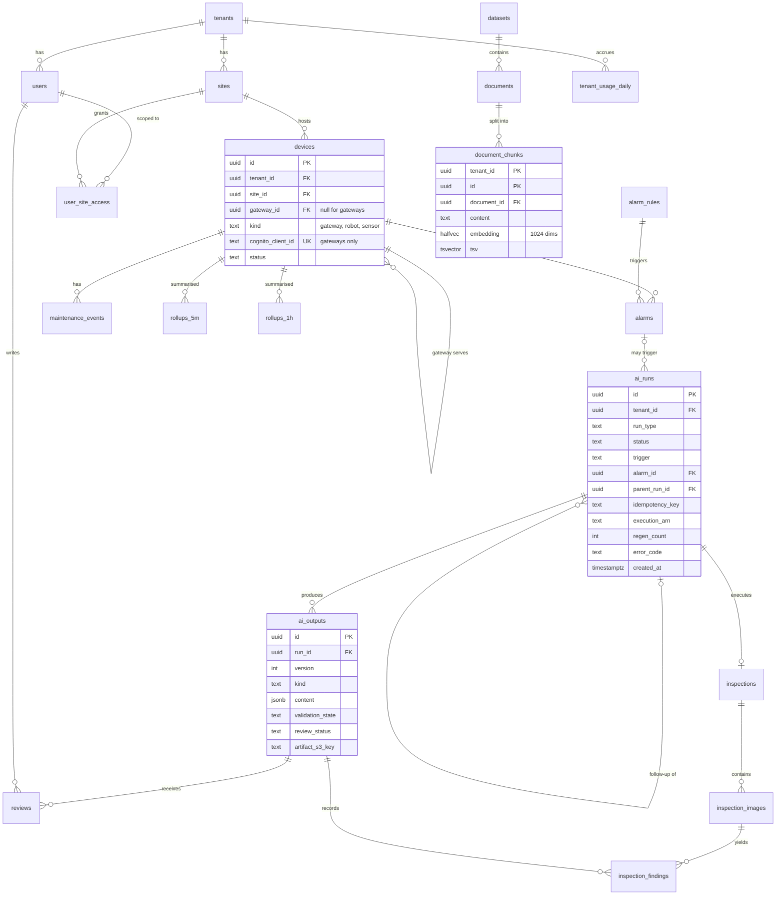

# Data Modeling & Storage

*Robotic & Industrial [AI](https://en.wikipedia.org/wiki/Artificial_intelligence "Artificial Intelligence — Software that generates or assists with tasks such as writing code") Intelligence Platform*

**Table of Contents**
- [Storage Overview](#storage-overview)
- [PostgreSQL Schema](#postgresql-schema)
- [DynamoDB Tables](#dynamodb-tables)
- [S3 Layout](#s3-layout)
- [Redis Keyspace](#redis-keyspace)
- [Partitioning and Sharding Strategy](#partitioning-and-sharding-strategy)
- [Migrations](#migrations)

## Storage Overview

Each store holds the data whose access pattern it serves best. The rule: **relational, transactional or tenant-filtered data goes to [PostgreSQL](https://www.postgresql.org/docs/current/ "PostgreSQL — Relational database storing and querying structured data with strong transactional guarantees"); high-rate key-value writes and append-only lookups go to DynamoDB; bytes go to [S3](https://aws.amazon.com/s3/ "Amazon Simple Storage Service — Durable object storage for files, datasets and archives"); anything that may be lost goes to [Redis](https://redis.io/docs/latest/ "Redis — In-memory data store used as a cache and fast key-value store").**

| Store | Holds | Why this store |
|---|---|---|
| PostgreSQL `platform-db` | Tenants, devices, alarms, maintenance history, rollups, runs, outputs, reviews, inspections, documents and their embeddings, LangGraph state | Joins, transactions, row-level security, pgvector next to the rows it describes |
| DynamoDB `telemetry_checkpoints` | Per-gateway, per-consumer high-watermark sequence and gaps | 81 conditional writes/s, single-item consistency, no load on PostgreSQL |
| DynamoDB `audit_log` | Every mutation, sensitive read and AI tool call | Append-only, looked up by key, expired by [TTL](https://en.wikipedia.org/wiki/Time_to_live "Time To Live — Duration after which a cached or stored value expires"), streamed to the archive |
| S3 | Raw telemetry, robotic datasets, inspection images, run intermediates and outputs, audit archive | Hundreds of terabytes, lifecycle tiering, pre-signed direct uploads |
| Redis `platform-cache` | Live status, cache-aside entries, rate limits, token budgets | Sub-millisecond reads; every key can be rebuilt or safely lost |
| Redis `celery-broker` | [Celery](https://docs.celeryq.dev/en/stable/ "Celery — Distributed task queue that runs background and scheduled jobs outside the request cycle") queues only | Isolated so cache eviction can never delete a queued job |

Two things here are both called "checkpoints" and are unrelated. **Telemetry checkpoints** (DynamoDB) record how far each consumer has processed a gateway's sequence. **LangGraph checkpoints** (PostgreSQL `agent_state`) record an agent's graph state between steps. Every file uses the qualified name.

## PostgreSQL Schema

PostgreSQL 16 on [RDS](https://aws.amazon.com/rds/ "Amazon Relational Database Service — Managed hosting for relational databases such as PostgreSQL, with backups and failover") with the `vector` extension. Every tenant-owned table carries `tenant_id` and has a row-level security policy `tenant_id = current_setting('app.tenant_id')::uuid`. The session variable is set with `SET LOCAL` at the start of every transaction by the tenant-context dependency (06).

**Schema `core`** — operational data

| Table | Key columns | Notes |
|---|---|---|
| `tenants` | `id`, `slug` unique, `status`, `ai_daily_token_budget`, `auto_followups` | Not under [RLS](https://www.postgresql.org/docs/current/ddl-rowsecurity.html "Row Level Security — Restricts which rows a database query can see or modify based on the current user"); read only through the tenant-context dependency |
| `sites` | `id`, `tenant_id`, `name`, `timezone` | |
| `users` | `id` (= Cognito `sub`), `tenant_id`, `display_name`, `role`, `status` | Email and phone stay in Cognito only (06) |
| `user_site_access` | primary key (`user_id`, `site_id`), `tenant_id` | Attribute-based site scoping inside a tenant (06) |
| `devices` | `id`, `tenant_id`, `site_id`, `gateway_id`, `kind`, `model`, `serial`, `cognito_client_id` unique, `status` | A gateway maps to exactly one Cognito machine client |
| `alarm_rules` | `id`, `tenant_id`, `signal`, `condition` [JSONB](https://www.postgresql.org/docs/current/datatype-json.html "JSON Binary — PostgreSQL type storing JSON documents in a decomposed binary form that can be indexed"), `severity`, `auto_analyze`, `enabled` | |
| `alarms` | `id`, `tenant_id`, `device_id`, `rule_id`, `severity`, `state` (`open`, `acknowledged`, `closed`), `opened_at`, `closed_at`, `context` JSONB | |
| `maintenance_events` | `id`, `tenant_id`, `device_id`, `source` (`cmms`, `manual`), `event_type`, `summary`, `occurred_at`, `external_ref` | Context for agents and for retrieval |
| `integrations` | `id`, `tenant_id`, `kind`, `endpoint_url`, `secret_arn`, `enabled` | Holds a Secrets Manager [ARN](https://docs.aws.amazon.com/IAM/latest/UserGuide/reference-arns.html "Amazon Resource Name — Globally unique identifier of an AWS resource, used in policies and cross-service references"), never the secret |
| `datasets` | `id`, `tenant_id`, `name`, `kind` (`recording`, `image_set`, `document_set`), `s3_prefix`, `status`, `size_bytes`, `created_by`, `status_updated_at` | `status`: `uploading`, `processing`, `ready`, `failed` |

**Schema `telemetry`** — [KPI](https://en.wikipedia.org/wiki/Performance_indicator "Key Performance Indicator — Measurable value that tracks how well an operation meets its targets") rollups

| Table | Key columns | Notes |
|---|---|---|
| `rollups_5m` | primary key (`device_id`, `signal`, `bucket_start`), `tenant_id`, `min`, `max`, `sum`, `count`, `last_seq` | Upserted by `telemetry-rollup`; daily range partitions, 30 kept |
| `rollups_1h` | same shape, without `last_seq` | Built hourly from `rollups_5m` by a task that `celery-beat` schedules on `celery-worker`; monthly partitions, 24 kept |

Storing `sum` and `count` instead of an average lets partial aggregates for one bucket merge correctly. `last_seq` is the gateway sequence number of the last batch applied to the row; the upsert only changes a row `WHERE rollups_5m.last_seq < EXCLUDED.last_seq`, so a redelivered batch is a no-op inside the same transaction that would have double-counted it.

**Schema `ai`** — runs, outputs and knowledge

| Table | Key columns | Notes |
|---|---|---|
| `ai_runs` | `id`, `tenant_id`, `run_type` (`analysis`, `inspection`, `generation`, `assist`), `status`, `trigger` (`manual`, `alarm`, `followup`), `alarm_id`, `device_id`, `parent_run_id`, `requested_by`, `idempotency_key`, `input` JSONB, `execution_arn`, `regen_count`, `model_id`, `prompt_version`, `tokens_in`, `tokens_out`, `error_code`, `created_at`, `started_at`, `finished_at` | unique (`tenant_id`, `idempotency_key`); `assist` rows have no `execution_arn` |
| `ai_outputs` | `id`, `run_id`, `tenant_id`, `version`, `kind`, `content` JSONB, `citations` JSONB, `validation` JSONB, `validation_state` (`passed`, `failed`), `review_status` (`not_required`, `pending`, `approved`, `rejected`), `artifact_s3_key`, `created_at` | unique (`run_id`, `version`); an edit creates a new version |
| `reviews` | `id`, `tenant_id`, `output_id`, `reviewer_id`, `decision` (`approved`, `rejected`, `edited`), `comments`, `edited_content` JSONB, `decided_at` | |
| `inspections` | `id`, `tenant_id`, `site_id`, `device_id`, `run_id` unique, `checklist` JSONB, `created_by`, `created_at` | |
| `inspection_images` | `id`, `tenant_id`, `inspection_id`, `s3_key`, `sha256`, `width`, `height`, `preprocessed_s3_key` | |
| `inspection_findings` | `id`, `tenant_id`, `inspection_id`, `image_id`, `output_id`, `defect_type`, `severity`, `bbox` JSONB, `confidence`, `rationale`, `created_at` | |
| `documents` | `id`, `tenant_id`, `dataset_id`, `source_type` (`manual`, `sop`, `incident_report`, `maintenance_log`), `title`, `s3_key`, `content_sha256`, `ingest_status` (`pending`, `embedded`, `failed`), `ingested_at` | |
| `document_chunks` | primary key (`tenant_id`, `id`), `document_id`, `chunk_index`, `content`, `content_sha256`, `embedding` `halfvec(1024)`, `tsv` (generated), `metadata` JSONB | List-partitioned by `tenant_id` |
| `tenant_usage_daily` | primary key (`tenant_id`, `day`), `runs`, `tokens_in`, `tokens_out`, `failures` | Reporting; the live budget counter is in Redis |

**Run status.** `queued` → `running` → `validating` → one of `completed`, `completed_unvalidated`, `failed`, `cancelled`. `completed_unvalidated` means the output failed validation after two regenerations: it is kept and shown to a reviewer with the failures, but it can never be exported. `review_status` starts as `not_required` for analyses and `pending` for inspection results, generated documents and work-order drafts.

**Schema `agent_state`.** The LangGraph PostgreSQL checkpointer's own tables, keyed by `thread_id` = `<run_id>:<regen_count>`. They carry no `tenant_id` and are not under row-level security. Only the `agent_worker` database role can reach them, and `celery-beat` deletes threads 7 days after their run ends.

> **Verify Before Build:** the checkpointer creates its tables through its own `setup()` call and may change them between library versions. Pin the library version and capture its [DDL](https://en.wikipedia.org/wiki/Data_definition_language "Data Definition Language — The SQL statements that create and alter database objects") in an [Alembic](https://alembic.sqlalchemy.org/en/latest/ "Alembic — Applies and versions database schema migrations for SQLAlchemy") migration, so schema changes go through review like every other table.

## DynamoDB Tables

Both tables use on-demand capacity, point-in-time recovery and encryption with a customer-managed [KMS](https://aws.amazon.com/kms/ "AWS Key Management Service — Creates and controls the keys that encrypt data at rest, and logs every use") key.

**`telemetry_checkpoints`**

| Attribute | Value |
|---|---|
| `pk` | `<gateway_id>` |
| `sk` | consumer name: `archiver`, `rollup`, `rules` |
| Attributes | `tenant_id`, `high_watermark_seq`, `last_batch_id`, `last_s3_key` (archiver only), `gaps` (at most 20 `[from, to]` ranges), `updated_at` |

Each consumer follows the same three steps. It skips a batch whose `seq` is at or below `high_watermark_seq`; it applies the batch with an effect that is itself idempotent — a deterministic S3 key for the archiver, the `last_seq` guard for rollups, a unique open alarm for rules (05); then it advances the checkpoint with a conditional update, `high_watermark_seq < :seq` or the attribute does not yet exist. A crash between applying and advancing causes a redelivery that the idempotent effect absorbs; the checkpoint and the effect are in different stores, so neither alone could guarantee this. The result is exactly-once effect on top of at-least-once delivery. If `:seq > high_watermark_seq + 1`, the missing range is appended to `gaps`. `GET /v1/telemetry/checkpoints/{gateway_id}` reads the `archiver` item with a strongly consistent read, so a reconnecting gateway replays from exactly the right place.

**`audit_log`**

| Attribute | Value |
|---|---|
| `pk` | `T#<tenant_id>#R#<resource_type>#<resource_id>` |
| `sk` | `<ts ISO-8601>#<event_id>` |
| [GSI](https://docs.aws.amazon.com/amazondynamodb/latest/developerguide/GSI.html "Global Secondary Index — DynamoDB index with its own partition key that serves an alternative access pattern") `by_actor` | `actor_key` = `T#<tenant_id>#A#<actor_id>`, sort `ts_event` |
| GSI `by_day` | `day_key` = `T#<tenant_id>#D#<yyyy-mm-dd>#<shard 0–3>`, sort `ts_event` |
| Attributes | `tenant_id`, `event_id`, `actor_type` (`user`, `service`, `agent`), `actor_id`, `action`, `resource_type`, `resource_id`, `run_id`, `outcome`, `source_ip`, `details` (≤ 4 KB), `expires_at` |

`expires_at` is the TTL attribute, set 400 days ahead. DynamoDB Streams (new image) feed `audit-archiver`, which writes batches to `audit-archive` before TTL removes the item. Every key starts with `T#<tenant_id>#` so [IAM](https://aws.amazon.com/iam/ "AWS Identity and Access Management — Controls which principals may perform which actions on which AWS resources") can restrict a tenant-scoped session to its own keys (06). `by_day` is sharded 4 ways, so a busy day does not concentrate on one partition.

## S3 Layout

All buckets block public access, enforce [TLS](https://datatracker.ietf.org/doc/html/rfc8446 "Transport Layer Security — Encrypts and authenticates data sent over a network connection"), and use server-side encryption with a customer-managed KMS key plus S3 Bucket Keys. Every object key starts with the tenant, so IAM policies can scope a session by prefix (06).

| Bucket | Key pattern | Lifecycle |
|---|---|---|
| `telemetry-raw` | `tenant=<tenant_id>/gateway=<gateway_id>/date=<yyyy-mm-dd>/<first_seq>-<last_seq>.ndjson.gz` | `STANDARD_IA` at 30 days, Glacier Instant Retrieval at 90, Deep Archive at 365, delete at 5 years |
| `robotic-datasets` | `tenant=<tenant_id>/datasets/<dataset_id>/<path>`; `tenant=<tenant_id>/inspections/<inspection_id>/original/<image_id>.<ext>` | Versioned; `STANDARD_IA` at 60 days. Inspection originals are uploaded with the object tag `has_finding=false`, and `run-persist-output` retags images that have findings; a lifecycle rule on that tag deletes finding-free originals at 1 year (06) |
| `ai-artifacts` | `tenant=<tenant_id>/runs/<run_id>/intermediate/<state>/<attempt>.json`; `tenant=<tenant_id>/runs/<run_id>/outputs/<output_id>/v<version>.<ext>` | `intermediate/` expires at 14 days; `outputs/` retained |
| `audit-archive` | `tenant=<tenant_id>/year=<y>/month=<m>/day=<d>/<batch_id>.ndjson.gz` | Object Lock in compliance mode, 5-year retention |
| `ops-console-web` | Hashed static assets and `index.html` | Served only through CloudFront origin access control |

Step Functions caps state payloads at 256 KB, so pipeline states pass S3 pointers to `intermediate/` objects rather than content. This claim-check pattern also leaves an inspectable record of each step for 14 days.

## Redis Keyspace

**`platform-cache`** runs with `allkeys-lru`. Every key has a TTL, so losing the cluster costs latency, never correctness. The invalidation rule for each key is owned by 05.

| Key | Content | TTL |
|---|---|---|
| `status:{device_id}` | Hash: `ts`, `state`, latest KPI values | 60 s; a missing key means no batch for 60 s and shows as "offline" — or "unknown" while `platform-cache` itself is failing over (04) |
| `device:{device_id}` | Device registry entry | 300 s |
| `gwclient:{cognito_client_id}` | `gateway_id`, `tenant_id` | 3,600 s |
| `tenantcfg:{tenant_id}` | Budget, feature flags, alarm-rule version | 300 s |
| `kpi:{tenant_id}:{site_id}` | Dashboard aggregates | 30 s |
| `ratelimit:runs:{tenant_id}:{minute}` | Counter | 120 s |
| `budget:tokens:{tenant_id}:{yyyy-mm-dd}` | Counter | 48 h |

**`celery-broker`** runs with `noeviction` and holds three Celery queues: `ingest` (document parsing and embedding), `media` (thumbnails, dataset manifests) and `maintenance` (partition upkeep, hourly rollups, sweepers). Celery results are ignored; job state lives in PostgreSQL rows such as `datasets.status` and `documents.ingest_status`.

## Partitioning and Sharding Strategy

- **No sharding.** About 650 GB over five years and under 2,000 row writes per second at peak (01) fit one `db.r6g.xlarge` Multi-[AZ](https://aws.amazon.com/about-aws/global-infrastructure/regions_az/ "Availability Zone — Isolated group of data centres within an AWS Region, used to survive a single-site failure") primary with 1 TB of gp3 storage. Sharding would add cross-shard queries and migrations for no current benefit.
- **Time partitions for rollups.** `rollups_5m` uses daily range partitions and `rollups_1h` monthly ones. Retention is a `DROP` of the oldest partition — no mass `DELETE`, no vacuum debt. `celery-beat` creates partitions 7 days (5-minute) and 3 months (hourly) ahead, so one missed run is harmless, and an alarm fires if tomorrow's partition is missing (05).
- **Tenant partitions for vectors.** `document_chunks` is list-partitioned by `tenant_id`, one partition and one [HNSW](https://arxiv.org/abs/1603.09320 "Hierarchical Navigable Small World — Graph index for approximate nearest-neighbour search over vectors") index per tenant. A query that names its tenant touches only that tenant's index, which avoids filtered vector search losing recall when other tenants' neighbours crowd the candidate list. A default partition catches a new tenant until its own is created.
- **Keys in DynamoDB.** `telemetry_checkpoints` spreads over 400 gateways; `audit_log` over resources, with `by_day` sharded.
- **Ordering partitions.** The [SQS](https://aws.amazon.com/sqs/ "Amazon Simple Queue Service — Managed message queue that decouples producers from consumers") [FIFO](https://docs.aws.amazon.com/AWSSimpleQueueService/latest/SQSDeveloperGuide/sqs-fifo-queues.html "First In, First Out — Queue and topic mode that preserves message order within a group and removes duplicates") message group is the gateway ID, so ordering is per gateway and one slow gateway never blocks another (04).

**Evolution triggers**

| Trigger | Change |
|---|---|
| Primary CPU above 60% for a week, or read p95 above 300 ms | Add a read replica for rollup and retrieval reads; accept replica lag on those endpoints only |
| KPI series above 100,000, or rollup upserts above 5,000 rows/s | Move rollups to a dedicated time-series store |
| A tenant above 10M chunks, or retrieval p95 above 300 ms | Move that tenant's vectors to a dedicated index service |
| Failover time becomes the availability constraint | Move to Aurora PostgreSQL |

## Migrations

Alembic owns every table, index, extension and row-level security policy. Migrations run as a [Kubernetes](https://kubernetes.io/ "Kubernetes — Automates deployment, scaling and management of containerized applications") Job in the deploy pipeline before new pods roll out (05).

- **Expand, then contract.** A column is added as nullable, backfilled, then made required in a later release. Old pods keep working during a rollout, and a code rollback never needs a down-migration.
- **Indexes are built concurrently.** `CREATE INDEX CONCURRENTLY` runs in an autocommit block. On partitioned tables it is built per partition and then attached to the parent index.
- **Partitions are not migrations.** Alembic creates the parent tables and a `create_partition()` function; `celery-beat` calls that function on a schedule.
- **Extensions need elevated rights.** `CREATE EXTENSION vector` runs under the migration role, which holds `rds_superuser`; application roles do not.
