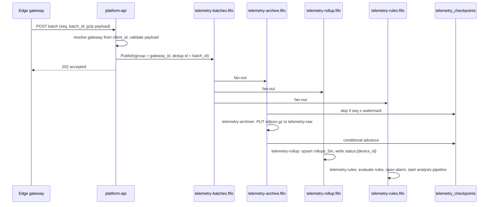
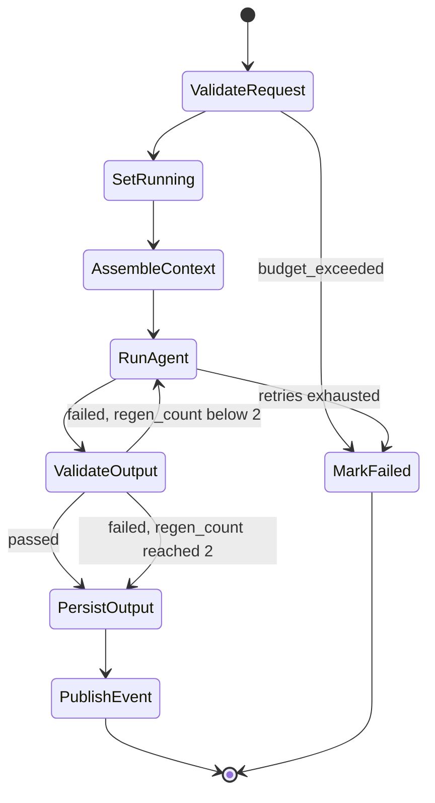

# Deep Dive & Bottlenecks

*Robotic & Industrial [AI](https://en.wikipedia.org/wiki/Artificial_intelligence "Artificial Intelligence — Software that generates or assists with tasks such as writing code") Intelligence Platform*

**Table of Contents**
- [Communication Patterns](#communication-patterns)
- [Telemetry Pipeline](#telemetry-pipeline)
- [Asynchronous Execution Model](#asynchronous-execution-model)
- [AI Pipelines](#ai-pipelines)
- [Latency Budgets and Responsiveness](#latency-budgets-and-responsiveness)
- [Failure Modes](#failure-modes)
- [Trade-offs](#trade-offs)

## Communication Patterns

The rule: **a request waits only for work that finishes in well under a second, or that the user has chosen to wait for.** Everything else is acknowledged and continues asynchronously.

| Flow | Style | Mechanism | Why |
|---|---|---|---|
| `ops-console` → `platform-api` | Sync | [REST](https://en.wikipedia.org/wiki/REST "Representational State Transfer — Architectural style for stateless, resource-oriented HTTP APIs") through [API](https://en.wikipedia.org/wiki/API "Application Programming Interface — Defines the contract by which software components exchange requests and data") Gateway | Reads and small writes |
| Gateway → `POST /v1/telemetry/batches` | Sync acknowledgement, async processing | REST, then [SNS](https://aws.amazon.com/sns/ "Amazon Simple Notification Service — Managed publish-subscribe topics that fan one message out to many subscribers") [FIFO](https://docs.aws.amazon.com/AWSSimpleQueueService/latest/SQSDeveloperGuide/sqs-fifo-queues.html "First In, First Out — Queue and topic mode that preserves message order within a group and removes duplicates") publish | The gateway needs a durable "accepted" to free its buffer |
| `telemetry-batches.fifo` → three consumers | Async fan-out | SNS FIFO → [SQS](https://aws.amazon.com/sqs/ "Amazon Simple Queue Service — Managed message queue that decouples producers from consumers") FIFO → Lambda | Each consumer fails, retries and scales on its own |
| `platform-api` → pipelines | Async | `StartExecution`, run polled by the client | Runs take minutes |
| Pipeline → step Lambdas | Sync inside the workflow | Step Functions `lambda:invoke` | Short, deterministic steps |
| Pipeline → `agent-worker` | Async callback | `sqs:sendMessage.waitForTaskToken` on `agent-tasks` | Agent steps can exceed Lambda's 15-minute limit and need the Python AI stack |
| Agents → `mcp-gateway` | Sync | [MCP](https://modelcontextprotocol.io/ "Model Context Protocol — Open protocol that exposes tools and data to AI agents through a standard interface") over Streamable [HTTP](https://datatracker.ietf.org/doc/html/rfc9110 "Hypertext Transfer Protocol — Application protocol used to request and transfer web resources"), inside the cluster | A tool call is part of the agent's reasoning step |
| Agents → Bedrock | Sync | [HTTPS](https://datatracker.ietf.org/doc/html/rfc9110 "HTTP Secure — HTTP encrypted with TLS to protect requests and responses in transit") through a [VPC](https://aws.amazon.com/vpc/ "Virtual Private Cloud — Isolated private network in which cloud resources run") endpoint | — |
| `platform-api` → background jobs | Async | [Celery](https://docs.celeryq.dev/en/stable/ "Celery — Distributed task queue that runs background and scheduled jobs outside the request cycle") over `celery-broker` | Document ingestion, thumbnails |
| Pipelines → run subscribers | Async fan-out | SNS `ai-run-events` → `run-events-webhooks`, `run-events-followups` | Adding a subscriber does not change the pipelines |
| `audit_log` → archive | Async | DynamoDB Streams → `audit-archiver` | Off the request path |

Run status reaches the browser by **polling**: React Query polls `GET /v1/runs/{run_id}` every 3 s while the run is active and stops on a terminal status. At design load that is at most 50 [QPS](https://en.wikipedia.org/wiki/Queries_per_second "Queries Per Second — Throughput measure of how many requests a system serves each second") (01). The alternative is examined under trade-offs.

## Telemetry Pipeline

- **Gateway contract.** A gateway sends batches in sequence order and never skips one: after a failure it retries the oldest unacknowledged batch, and after a long outage it reads `GET /v1/telemetry/checkpoints/{gateway_id}` and replays from `archived_seq + 1`. A gap in a checkpoint therefore means data the gateway itself lost when its 24-hour buffer overflowed, and it is reported, not waited for.
- **Validation at the edge of the platform.** `platform-api` decompresses and validates each payload (about 15 ms for 3,200 samples) and rejects anything over 192 KB compressed, which stays under the SNS message limit after base64 encoding. A malformed batch is rejected with `422` and never reaches an ordered queue, where it would block its gateway's message group.
- **Ordering and deduplication.** The message group is the gateway ID and the deduplication ID is the `batch_id`, so a retry within 5 minutes is dropped by SNS. Longer-range duplicates are absorbed by the checkpoint and the idempotent effects (03).
- **Consumers.** Lambda reads FIFO queues in batches of up to 10 with concurrency spread across message groups. `telemetry-rollup` and `telemetry-rules` reach [PostgreSQL](https://www.postgresql.org/docs/current/ "PostgreSQL — Relational database storing and querying structured data with strong transactional guarantees") through [RDS](https://aws.amazon.com/rds/ "Amazon Relational Database Service — Managed hosting for relational databases such as PostgreSQL, with backups and failover") Proxy, with reserved concurrency of 20 each so they cannot exhaust connections. Each consumer sets `app.tenant_id` from the batch's gateway, so row-level security applies to them like any other writer.
- **Alarms to analyses.** `telemetry-rules` inserts an alarm; a partial unique index (05) allows only one active alarm per device and rule, so a flapping signal cannot open hundreds. If the rule has `auto_analyze`, it inserts an `ai_runs` row with `idempotency_key = alarm:<alarm_id>` and starts `analysis-pipeline` named after the run.

> **Verify Before Build:** SNS FIFO topic throughput and the per-message-group limits have changed several times; check current quotas against 80 publishes/s at peak (01). Also confirm how RDS Proxy treats `SET LOCAL` — if it pins the session, use `set_config('app.tenant_id', …, true)`, and measure pinning with the proxy's `DatabaseConnectionsCurrentlySessionPinned` metric.

## Asynchronous Execution Model

Four async mechanisms exist because they answer to different constraints. Choosing among them follows one rule.

| Use | When the work is… | Examples |
|---|---|---|
| Celery on `celery-broker` | Started by the app, under 10 minutes, needs the app's [ORM](https://en.wikipedia.org/wiki/Object%E2%80%93relational_mapping "Object Relational Mapper — Maps application objects to relational database rows and queries") and code, and can be restarted from a PostgreSQL status row | Document parsing and embedding, thumbnails, partition upkeep, hourly rollups, sweepers |
| Lambda behind SQS | Event-driven, stateless, under 15 minutes, triggered by [AWS](https://aws.amazon.com/ "Amazon Web Services — Cloud provider whose managed compute, storage and messaging services host a system") | Telemetry consumers, webhooks, follow-ups, audit archive |
| Step Functions | Multi-step, may take longer than 15 minutes in total, needs retries per step, timeouts and a per-run history | The three AI pipelines |
| SQS callback to `agent-worker` | A pipeline step that needs the LangGraph stack and may run for minutes | Agent reasoning, vision analysis, section drafting |

**`agent-worker` callback protocol**

- It long-polls `agent-tasks` and **deletes each message as soon as it has recorded the task token**. Retrying belongs to Step Functions alone; if SQS also redelivered, one failure could run twice.
- While working it calls `SendTaskHeartbeat` every 60 s. The task state sets `HeartbeatSeconds: 180` and `TimeoutSeconds: 900`. A crashed pod is noticed within 3 minutes and the step is retried with a new token.
- The retried attempt uses the same LangGraph `thread_id` (`<run_id>:<regen_count>`), so it resumes from the last LangGraph checkpoint instead of repeating completed model and tool calls.
- **Capacity is sized to the Bedrock quota, not CPU.** Each pod runs up to 16 tasks concurrently on AsyncIO; 4 replicas give 64 slots against about 25 concurrent tasks at peak (2.5 calls/s × 8 s per call, plus tool time). Adding pods beyond the model quota only produces throttling, so the replica count changes when the quota changes, and bursts wait in `agent-tasks`.

**Celery settings.** `acks_late=True`, `task_time_limit=600`, broker `visibility_timeout=3600` — longer than any task, so a slow task is never delivered twice. Results are ignored. A `celery-beat` sweeper re-enqueues any dataset or document that has stayed in `processing` or `pending` for more than 15 minutes, which covers messages lost in a broker failover.

## AI Pipelines

**`analysis-pipeline`** (above). `run-validate-request` checks the input, the run's tenant and the token budget in `budget:tokens:{tenant_id}:{day}`. One shared budget module owns that check; `run-validate-request` is where it is enforced for pipeline runs, `agent-service-api` calls it before each assist answer, and `platform-api` calls it only to reject early. `run-assemble-context` gathers the alarm, recent rollups and maintenance events into an [S3](https://aws.amazon.com/s3/ "Amazon Simple Storage Service — Durable object storage for files, datasets and archives") context bundle. `RunAgent` is the callback step. `run-persist-output` writes `ai_outputs`, token counts and the final status — `completed` or `completed_unvalidated` (03). A `Catch` on every state routes to `MarkFailed` (`run-set-status`), which records `error_code` and emits the `GenerationFailures` metric (05).

**`inspection-pipeline`** replaces `AssembleContext` and `RunAgent` with two Map states: `image-preprocess` (MaxConcurrency 10) resizes to the model's input limit, strips image metadata and writes to `intermediate/`; then vision tasks run on `agent-worker` (MaxConcurrency 5), followed by one aggregation task that writes findings. **`generation-pipeline`** runs an outline task, drafts sections in a Map (MaxConcurrency 4) and assembles them; `run-persist-output` renders Markdown and [HTML](https://html.spec.whatwg.org/ "HyperText Markup Language — Markup format that structures content for web browsers") to `outputs/`.

| Retry policy | Errors | Interval, backoff, attempts |
|---|---|---|
| Step Lambdas | `Lambda.ServiceException`, `Lambda.TooManyRequestsException`, database errors | 5 s, ×2, 5 attempts — spans 155 s, longer than a database failover |
| `RunAgent` | `States.HeartbeatTimeout`, `States.Timeout` | 30 s, ×2, 2 attempts |
| `RunAgent` | `Agent.Throttled` | 60 s, ×2, 4 attempts — about 15 minutes of waiting before the run fails |

**LangGraph workflow** — the graph that `RunAgent` executes:

1. `plan` — a Sonnet-class model turns the question and context bundle into a short plan and the tools it needs.
2. `retrieve` — hybrid retrieval over the tenant's `document_chunks`: [HNSW](https://arxiv.org/abs/1603.09320 "Hierarchical Navigable Small World — Graph index for approximate nearest-neighbour search over vectors") top 40 by cosine distance and full-text top 40 on `tsv`, merged by reciprocal rank fusion into the best 8 chunks.
3. `act` — tool calls through `mcp-gateway`, at most 6 per attempt; independent calls run concurrently with `asyncio.gather`.
4. `draft` — a structured output validated against the [Pydantic](https://docs.pydantic.dev/latest/ "Pydantic — Python library that validates and parses data against typed models at runtime") schema for the run's output kind.
5. `self_check` — the model reviews its own draft against the evidence once, and may loop back to `act` once.

**MCP tools** exposed by `mcp-gateway`: `get_device_status`, `query_telemetry` (rollups; raw S3 windows capped at 15 minutes), `list_alarms`, `get_maintenance_history`, `search_knowledge`, `get_inspection_findings`, and one write tool, `draft_work_order`, which only creates a pending `ai_outputs` row for a person to approve. Tool results are capped at 16 KB. How a tool call is scoped to a tenant is owned by 06.

**Validation** (`run-validate-output`) runs cheapest first and stops at the first failure: schema validation (about 50 ms); a citation check that every cited chunk and tool result was actually retrieved during the run; a numeric grounding check that each number in the output appears in the evidence within tolerance; and only then a Haiku-class grounding review of the claims (about 2 s). The failures are passed back into `RunAgent` as feedback for regeneration. LangGraph's `self_check` is the model checking itself; this step is the authority, and it is deterministic where it can be.

## Latency Budgets and Responsiveness

Each target from 01, with the path that has to fit inside it.

| Target | Contributions | Sum |
|---|---|---|
| Ingest acknowledgement p95 < 500 ms | Gateway and [WAF](https://owasp.org/www-community/Web_Application_Firewall "Web Application Firewall — Filters and blocks malicious HTTP traffic before it reaches an application") 30 ms + VPC Link and [NLB](https://docs.aws.amazon.com/elasticloadbalancing/latest/network/introduction.html "Network Load Balancer — Layer 4 load balancer that forwards TCP and TLS connections to targets") 5 ms + client lookup ([Redis](https://redis.io/docs/latest/ "Redis — In-memory data store used as a cache and fast key-value store")) 2 ms + decompress and validate 15 ms + SNS publish 50 ms | ≈ 100 ms; headroom for retries on publish |
| Live status p95 < 30 s | Oldest sample waits for its batch ≤ 15 s + ingest 0.1 s + SNS to SQS to Lambda ≤ 2 s + rollup and Redis write 0.3 s | ≤ 18 s; one 10 s Lambda retry still fits |
| Read endpoints p95 < 300 ms | Edge 40 ms + indexed query 5–30 ms, or Redis 1 ms + serialisation 10 ms | ≈ 90 ms |
| Assist p95 < 8 s | Edge 40 ms + retrieval 300 ms + 2 model calls ≈ 5 s + 1 tool call 300 ms | ≈ 6 s; hard timeout 25 s, under API Gateway's 29 s default |
| Analysis p95 < 5 min | Queue wait ≤ 30 s + 3 step Lambdas incl. cold start ≤ 6 s + context 5 s + agent: 7 model calls × 8–10 s + 4 tool calls ≈ 75 s + validation 3 s + persist 1 s | ≈ 2 min nominal; about 4.5 min with two regenerations, which must stay under 5% of runs |
| Inspection of 20 images p95 < 8 min | Preprocess 2 waves × 5 s + vision 4 waves × 15 s + aggregation 20 s + validation 5 s | ≈ 1.5 min nominal; room for throttling retries |
| Generation p95 < 15 min | Context 10 s + outline 20 s + 10 sections in 3 waves × 40 s + assembly 30 s + validation 5 s | ≈ 3 min nominal; ≈ 9 min with two regenerations |

**Responsiveness mechanisms** — what keeps the [FastAPI](https://fastapi.tiangolo.com/ "FastAPI — Python web framework for building HTTP APIs with async support and automatic schema generation") and async paths fast:

- **Acknowledge, then work.** Every model-backed endpoint except assist returns `202` in under 100 ms instead of holding a connection for minutes.
- **No blocking in the event loop.** Database access uses [SQLAlchemy](https://www.sqlalchemy.org/ "SQLAlchemy — Python SQL toolkit and ORM that maps objects to relational tables and builds queries") async over asyncpg; AWS calls use async clients; the few sync-only libraries run in a thread pool. A single blocking call would stall every request on that worker.
- **Sized connection pools.** 4 Uvicorn workers per pod, each with an asyncpg pool of 10; with 6 `platform-api` pods that is 240 connections, well under the instance's limit of about 3,400, while Lambdas are pooled separately by RDS Proxy.
- **Parallel fan-out.** Tool calls, retrieval queries and Map iterations run concurrently.
- **Cheaper tokens.** A long, stable system prompt benefits from Bedrock prompt caching; small tasks use the Haiku-class model.

> **Verify Before Build:** Bedrock on-demand quotas for tokens and requests per minute differ by model and region and are often far below 600k input tokens per minute (01). Request increases before launch, consider a cross-region inference profile within the tenant's geography (06), and confirm that prompt caching is supported for the chosen model version.

## Failure Modes

| Component | Failure | Mitigation |
|---|---|---|
| `platform-db` primary | Instance or [AZ](https://aws.amazon.com/about-aws/global-infrastructure/regions_az/ "Availability Zone — Isolated group of data centres within an AWS Region, used to survive a single-site failure") loss; writes fail for 60–120 s | Multi-AZ synchronous standby; APIs return `503` with `Retry-After`; SQS consumers retry through visibility timeouts; step Lambdas retry for 155 s |
| `platform-db` data or region | Corruption or regional outage | [PITR](https://www.postgresql.org/docs/current/continuous-archiving.html "Point in Time Recovery — Restores a database to a specific past moment using base backups and archived logs") for 35 days; snapshots copied to a second region daily — [RPO](https://en.wikipedia.org/wiki/Disaster_recovery "Recovery Point Objective — Maximum acceptable amount of data loss, measured in time since the last recovery point") 24 h and [RTO](https://en.wikipedia.org/wiki/Disaster_recovery "Recovery Time Objective — Maximum acceptable duration to restore a system after a disruption") 8 h for a region, by [Terraform](https://developer.hashicorp.com/terraform/docs "Terraform — Infrastructure as code tool that declares and provisions cloud infrastructure from configuration files") rebuild |
| `platform-cache` | Primary node loss | Replica promoted in about 30 s; reads fall through to PostgreSQL; rate limits fall back to a per-pod in-memory limit; missing status shows "unknown" for up to 60 s |
| `celery-broker` | Failover loses queued messages (asynchronous replication) | Status rows in PostgreSQL plus the 15-minute sweeper |
| `celery-beat` | Singleton pod dies | Restarts within a minute; partitions exist days ahead; missing-partition alarm (05) |
| [EKS](https://aws.amazon.com/eks/ "Amazon Elastic Kubernetes Service — Managed Kubernetes hosting on AWS") node or AZ | Pods lost | At least 3 replicas per service spread across zones; PodDisruptionBudget `minAvailable: 2`; NLB cross-zone |
| `agent-worker` | Pod crash mid-task | Heartbeat timeout, retry, resume from LangGraph checkpoint |
| `mcp-gateway` | Unavailable | 3 replicas; agent retries a tool call twice, then the task fails and the pipeline retries |
| Bedrock | Throttling or regional incident | [SDK](https://en.wikipedia.org/wiki/Software_development_kit "Software Development Kit — Packaged set of tools and libraries for building against a platform") adaptive retry, then `Agent.Throttled` retries; runs wait in `agent-tasks`; after about 15 minutes the run fails with `model_unavailable` |
| Telemetry consumer | Poison message or bug | Moved to the [DLQ](https://docs.aws.amazon.com/AWSSimpleQueueService/latest/SQSDeveloperGuide/sqs-dead-letter-queues.html "Dead-Letter Queue — Holds messages that failed processing repeatedly so they can be inspected and redriven") after 5 receives — about 5 minutes during which only that gateway's group is blocked; alarm on any DLQ message; redrive after the fix |
| Managed regional services | API Gateway, SQS, SNS, Step Functions, DynamoDB outage | Multi-AZ by design; gateways buffer 24 h; a regional outage follows the database recovery plan |
| Cognito | Outage | Access tokens stay valid up to 1 h; gateways cache tokens; new logins fail |
| [NAT](https://datatracker.ietf.org/doc/html/rfc3022 "Network Address Translation — Maps multiple private addresses to a shared public address") gateway | Loss of one AZ's NAT | One NAT per AZ; AWS calls use VPC endpoints, so only webhooks depend on NAT |
| Tenant webhook endpoint | Down | `webhook-dispatcher` retries with growing visibility timeouts, DLQ after 8 attempts, tenant notified |

## Trade-offs

- **Step Functions + callback vs Celery for AI runs.** Durable per-step retries, timeouts and an execution history for every run, at the cost of two systems and about 50–100 ms per state transition. Celery stays for jobs where that is overhead (under 10 minutes, restartable from a status row).
- **Throughput vs cost of FIFO ordering.** FIFO gives per-gateway order and 5-minute deduplication, which the watermark depends on. It costs a Lambda batch size of at most 10 and lower quotas than standard queues — acceptable at 80 msg/s.
- **At-least-once + idempotent effects vs exactly-once infrastructure.** No component of this stack delivers exactly once across stores, so every consumer is written to be safe to repeat (03).
- **Latency vs accuracy in validation.** Deterministic checks always run; the model-based grounding check adds about 2 s and about 10% of tokens, and regeneration up to twice adds minutes in the worst case. A wrong maintenance instruction costs more than a slower one.
- **Model tier: accuracy vs cost.** Sonnet-class for reasoning and vision, Haiku-class for checks and summaries; the split is configuration and recorded per run in `model_id`.
- **Polling vs push.** 3-second polling through the existing REST edge is simple and bounded at 50 QPS. An API Gateway WebSocket API would add connection state and a second authorizer path; it becomes worth it above about 1,000 concurrently active runs.
- **pgvector vs a dedicated vector store.** One fewer system, transactions and row-level security for vectors, and joins with operational data, in exchange for less headroom per tenant (evolution trigger in 03).
- **Raw telemetry as compressed [NDJSON](https://github.com/ndjson/ndjson-spec "Newline-Delimited JSON — Stores one JSON record per line so files can be streamed and appended").** Cheap to write and simple to replay; ad hoc queries over months of raw data need loading first. A columnar format and a query engine are the upgrade when such queries become routine.
- **Bounded synchronous assist.** Assist answers directly within 25 s, under the gateway's default integration timeout; anything larger becomes an analysis run. Each answer is still recorded as an `ai_runs` row of type `assist` with no execution, so tokens, audit and tool binding work the same way as for pipeline runs (06).

> **Deep Dive Reference:** Evaluation of AI output quality — validation catches malformed and ungrounded output, not subtly wrong reasoning. An offline evaluation set built from reviewed runs in `robotic-datasets`, scored on every prompt or model change (05), is what shows whether a change made answers better or worse.
