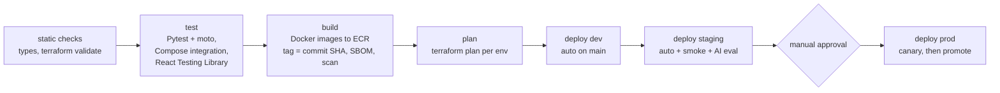

# Reliability & Observability

*Robotic & Industrial [AI](https://en.wikipedia.org/wiki/Artificial_intelligence "Artificial Intelligence — Software that generates or assists with tasks such as writing code") Intelligence Platform*

**Table of Contents**
- [Read and Write Optimizations](#read-and-write-optimizations)
- [Caching Strategy](#caching-strategy)
- [Telemetry: Metrics, Logs and Traces](#telemetry-metrics-logs-and-traces)
- [Alarms](#alarms)
- [Automation: CI/CD and Deployment](#automation-cicd-and-deployment)

## Read and Write Optimizations

Every index below answers a named query. Tables and columns are defined in 03.

| Table | Index | Query it serves |
|---|---|---|
| `core.devices` | `(tenant_id, site_id, kind, status)` | Fleet list filtered by site and kind |
| `core.devices` | unique `(cognito_client_id)` | Gateway resolution on ingest, behind the `gwclient:` cache |
| `core.alarms` | `(tenant_id, device_id, opened_at DESC)` | Alarm history for one device |
| `core.alarms` | `(tenant_id, state, severity, opened_at DESC)` | Alarm dashboard: active alarms by severity, joined to `devices` for the site filter |
| `core.alarms` | partial unique `(device_id, rule_id) WHERE state IN ('open', 'acknowledged')` | Guarantees one active alarm per device and rule (04) |
| `core.maintenance_events` | `(tenant_id, device_id, occurred_at DESC)` | Maintenance history tool and context bundle |
| `telemetry.rollups_5m`, `rollups_1h` | primary key `(device_id, signal, bucket_start)` | Series for one device and time range — a range scan per signal |
| `ai.ai_runs` | unique `(tenant_id, idempotency_key)` | Idempotent run creation |
| `ai.ai_runs` | `(tenant_id, created_at DESC)` | Run history lists |
| `ai.ai_runs` | partial `(tenant_id, created_at) WHERE status IN ('queued', 'running', 'validating')` | Stale-run sweeper, which walks tenants one by one (06), and "active runs" views; stays small because finished runs leave it |
| `ai.ai_outputs` | partial `(tenant_id, created_at) WHERE review_status = 'pending'` | The review queue |
| `ai.inspection_findings` | `(inspection_id)`; `(tenant_id, defect_type, created_at DESC)` | Findings per inspection; defect trends |
| `ai.document_chunks` | [HNSW](https://arxiv.org/abs/1603.09320 "Hierarchical Navigable Small World — Graph index for approximate nearest-neighbour search over vectors") on `embedding` with `halfvec_cosine_ops`, `m = 16`, `ef_construction = 64`, per tenant partition | Vector half of retrieval; `hnsw.ef_search = 80` at query time |
| `ai.document_chunks` | [GIN](https://www.postgresql.org/docs/current/gin.html "Generalized Inverted Index — PostgreSQL index type suited to values containing multiple keys, such as arrays or text search") on `tsv` | Full-text half of retrieval |
| `ai.document_chunks` | `(document_id, chunk_index)` | Re-ingestion replaces a document's chunks |

- **[TTL](https://en.wikipedia.org/wiki/Time_to_live "Time To Live — Duration after which a cached or stored value expires") indexes live in the stores that support them.** DynamoDB `audit_log.expires_at` and [Redis](https://redis.io/docs/latest/ "Redis — In-memory data store used as a cache and fast key-value store") key TTLs handle expiry; [PostgreSQL](https://www.postgresql.org/docs/current/ "PostgreSQL — Relational database storing and querying structured data with strong transactional guarantees") retention is a partition `DROP` (03), never a TTL-style `DELETE`.
- **Write path for rollups.** About 1,500 rollup rows change per second (22,000 series every 15 s). Each batch is one multi-row `INSERT … ON CONFLICT DO UPDATE` per gateway, about 27 statements/s. `fillfactor = 70` on rollup partitions and no index on the aggregate columns keep those updates heap-only ([HOT](https://www.postgresql.org/docs/current/storage-hot.html "Heap Only Tuple — PostgreSQL update path that keeps the new row version on the same page and touches no index")), so they do not rewrite indexes.
- **Resolution follows the window.** The telemetry endpoint serves `5m` for windows up to 2 days and `1h` beyond; a 30-day chart is 720 points per signal, not 8,640.
- **Vector footprint.** `halfvec(1024)` halves embedding storage against `vector(1024)` with negligible recall loss for retrieval of this kind; duplicate chunks are skipped by `content_sha256` before an embedding is requested.

> **Verify Before Build:** row-level security adds `tenant_id = current_setting(…)` to every query, and a policy expression the planner cannot treat as leakproof can stop an index from being used. Run `EXPLAIN (ANALYZE)` as the application role — not as the owner, which bypasses row-level security — for the retrieval query and the telemetry range query, and confirm partition pruning on `document_chunks` and an HNSW index scan.

## Caching Strategy

Four layers, each with an explicit invalidation rule. Keys and TTLs are defined in 03.

| Layer | What | Invalidation |
|---|---|---|
| [CDN](https://en.wikipedia.org/wiki/Content_delivery_network "Content Delivery Network — Distributes cached content across edge locations to reduce latency") — CloudFront | `ops-console` static assets | Hashed file names cached for 1 year; `index.html` with `no-cache`; the deploy job invalidates `/index.html` only |
| CDN — [API](https://en.wikipedia.org/wiki/API "Application Programming Interface — Defines the contract by which software components exchange requests and data") responses | Nothing | Every response is tenant-specific and authenticated; caching at the edge would risk cross-tenant leaks |
| Redis — live status `status:{device_id}` | Latest status | **Write-through** by `telemetry-rollup` on every batch; TTL 60 s; expiry means "offline" |
| Redis — registry `device:`, `gwclient:`, `tenantcfg:` | Rarely changing reference data | **Cache-aside**: read, on miss load from PostgreSQL and set with TTL; `platform-api` **deletes** the key after the transaction that changes the row commits |
| Redis — dashboards `kpi:{tenant_id}:{site_id}` | Aggregates | Cache-aside with a 30 s TTL and no explicit invalidation; 30 s staleness is within the freshness target |
| Redis — limits `ratelimit:`, `budget:` | Counters | Not a cache; `INCR` with expiry. The budget counter is reconciled nightly into `tenant_usage_daily` |
| Application — in process | Cognito [JWKS](https://datatracker.ietf.org/doc/html/rfc7517 "JSON Web Key Set — Publishes the public keys a party needs to verify a signed token"), prompt templates, model configuration | JWKS refreshed hourly and on an unknown key ID; templates versioned by `prompt_version`, reloaded on deploy |
| Application — model provider | Stable system-prompt prefix | Bedrock prompt caching (04); nothing to invalidate — the prefix changes only with `prompt_version` |
| Client — React Query | Server state in the browser | `staleTime`: devices 60 s, alarms 15 s, run status 0 with 3 s polling while active, outputs `Infinity` because a version never changes; mutations invalidate the matching query keys |

**Why delete instead of update on write.** Deleting after commit cannot leave a stale value behind if two writers race; the next reader repopulates from the committed row. The worst case is one extra database read.

**Why write-through for live status.** Status is written far more often than it is read, by exactly one writer per device (the rollup consumer for its gateway's ordered group), so there is no race to resolve.

## Telemetry: Metrics, Logs and Traces

**Metrics (SLIs and SLOs).** Services emit custom metrics through the CloudWatch Embedded Metric Format; [AWS](https://aws.amazon.com/ "Amazon Web Services — Cloud provider whose managed compute, storage and messaging services host a system") services publish their own. [SLO](https://sre.google/sre-book/service-level-objectives/ "Service Level Objective — Target value for a service level indicator that a service commits to meet") targets are those of 01.

| [SLI](https://sre.google/sre-book/service-level-objectives/ "Service Level Indicator — Measured metric, such as latency or error rate, used to judge service health") | How it is measured | SLO (30 days) |
|---|---|---|
| API availability | Share of non-5xx responses at API Gateway, excluding `/v1/assist` | 99.9% |
| Read latency | API Gateway `Latency` p95 for `GET` methods | < 300 ms |
| Ingest latency | p95 of `POST /v1/telemetry/batches` | < 500 ms |
| Status freshness | `StatusLagSeconds`, emitted by `telemetry-rollup` as now minus newest sample time | p95 < 30 s |
| Run completion | `RunDurationSeconds` by `run_type`, emitted by `run-persist-output` | p95: 5 / 8 / 15 min |
| Run success | Share of pipeline runs ending in `completed` or `completed_unvalidated`, excluding `budget_exceeded` failures and `cancelled` runs | ≥ 99% |
| Assist latency | p95 at `agent-service-api` | < 8 s |

Error-budget burn alarms follow the multi-window pattern: page when 2% of the monthly budget burns in 1 hour (14.4× rate), open a ticket when 5% burns in 6 hours (6× rate).

AI-specific metrics: `GenerationFailures` (dimensions `run_type`, `error_code`), `ValidationFailures` (by check), `RegenerationCount`, `TokensIn` and `TokensOut` per tenant and model, `ToolCallLatency` and `ToolCallErrors` per [MCP](https://modelcontextprotocol.io/ "Model Context Protocol — Open protocol that exposes tools and data to AI agents through a standard interface") tool, and `ReviewRejectionRate` per output kind — the closest live signal of output quality.

**Structured logging.** Every service and Lambda logs one [JSON](https://www.json.org/json-en.html "JavaScript Object Notation — Lightweight text format for structured data exchange") object per line with `ts`, `level`, `service`, `env`, `tenant_id`, `request_id`, `run_id`, `execution_arn` and `trace_id`. The Amazon CloudWatch Observability [EKS](https://aws.amazon.com/eks/ "Amazon Elastic Kubernetes Service — Managed Kubernetes hosting on AWS") add-on ships container logs; Lambdas log natively. Retention is 30 days for application logs.

- **No prompts or outputs in logs by default.** They contain tenant data. Logs carry token counts, hashes and IDs; the content is in `ai_outputs` and `intermediate/`, under access control. A tenant can enable prompt logging for debugging into a separate [KMS](https://aws.amazon.com/kms/ "AWS Key Management Service — Creates and controls the keys that encrypt data at rest, and logs every use")-encrypted log group kept for 14 days.
- **`run_id` joins everything:** the run row, the Step Functions execution, the agent's logs and traces, and the audit trail.

**Distributed tracing.** OpenTelemetry SDKs instrument [FastAPI](https://fastapi.tiangolo.com/ "FastAPI — Python web framework for building HTTP APIs with async support and automatic schema generation"), [SQLAlchemy](https://www.sqlalchemy.org/ "SQLAlchemy — Python SQL toolkit and ORM that maps objects to relational tables and builds queries"), the AWS [SDK](https://en.wikipedia.org/wiki/Software_development_kit "Software Development Kit — Packaged set of tools and libraries for building against a platform"), [Celery](https://docs.celeryq.dev/en/stable/ "Celery — Distributed task queue that runs background and scheduled jobs outside the request cycle") and [HTTP](https://datatracker.ietf.org/doc/html/rfc9110 "Hypertext Transfer Protocol — Application protocol used to request and transfer web resources") clients; the AWS Distro for OpenTelemetry collector exports to X-Ray, viewed through CloudWatch.

- **Context crosses every hop.** [W3C](https://www.w3.org/ "World Wide Web Consortium — Develops open web standards such as trace context propagation") `traceparent` over HTTP, including agent calls to `mcp-gateway`; the `AWSTraceHeader` attribute through [SQS](https://aws.amazon.com/sqs/ "Amazon Simple Queue Service — Managed message queue that decouples producers from consumers"); X-Ray tracing enabled on API Gateway, Lambda and the three state machines.
- **[LLM](https://en.wikipedia.org/wiki/Large_language_model "Large Language Model — Neural network trained on text that generates and interprets natural language") spans.** A LangChain callback opens a span per model call and per tool call, with model ID, token counts and latency as attributes, so a slow run shows which step was slow.
- **Sampling.** 5% of ordinary requests, 100% of AI runs and of any request that errors.

## Alarms

All alarms publish to `ops-alerts`; its subscriptions reach the on-call engineer.

| Alarm | Threshold |
|---|---|
| API 5xx rate | > 1% for 5 minutes, per method group |
| Queue age | `ApproximateAgeOfOldestMessage` > 120 s on telemetry queues; > 600 s on `agent-tasks` |
| Any [DLQ](https://docs.aws.amazon.com/AWSSimpleQueueService/latest/SQSDeveloperGuide/sqs-dead-letter-queues.html "Dead-Letter Queue — Holds messages that failed processing repeatedly so they can be inspected and redriven") | `ApproximateNumberOfMessagesVisible` > 0 |
| Pipelines | `ExecutionsFailed` or `ExecutionsTimedOut` > 0 for 5 minutes; `ExecutionThrottled` > 0 |
| Generation failures | `GenerationFailures` > 5 in 15 minutes for any `error_code`, or any `budget_exceeded` |
| Lambda | `Errors` > 1% or any `Throttles` on telemetry consumers |
| Bedrock | `InvocationThrottles` > 0 for 5 minutes |
| `platform-db` | CPU > 80% for 15 minutes; free storage < 20%; connections > 80% of max |
| Redis | Memory > 80% on `platform-cache`; any evictions on `celery-broker` |
| DynamoDB | `ThrottledRequests` > 0 |
| Partitions | Tomorrow's `rollups_5m` partition missing at 12:00 [UTC](https://en.wikipedia.org/wiki/Coordinated_Universal_Time "Coordinated Universal Time — The time standard that instants are stored and compared against") |
| Checkpoints | New gap recorded in `telemetry_checkpoints` — a gateway lost data |
| EKS | Pod restarts > 3 in 10 minutes; any node `NotReady` |

## Automation: CI/CD and Deployment

GitLab [CI](https://en.wikipedia.org/wiki/Continuous_integration "Continuous Integration — Automatically builds and tests code on every change")/[CD](https://en.wikipedia.org/wiki/Continuous_deployment "Continuous Deployment — Automatically releases every build that passes the pipeline's gates to production without a manual step") runs on self-managed Linux runners inside the [VPC](https://aws.amazon.com/vpc/ "Virtual Private Cloud — Isolated private network in which cloud resources run"); Bash scripts carry the deploy and verification steps. Runners reach AWS through GitLab [OIDC](https://openid.net/developers/how-connect-works/ "OpenID Connect — Identity layer on top of OAuth 2.0 for authenticating users") federation into one [IAM](https://aws.amazon.com/iam/ "AWS Identity and Access Management — Controls which principals may perform which actions on which AWS resources") role per environment, so no long-lived AWS keys exist in GitLab (06).

**Tests**

- **Unit:** Pytest for services and every Lambda handler. moto fakes SQS, [SNS](https://aws.amazon.com/sns/ "Amazon Simple Notification Service — Managed publish-subscribe topics that fan one message out to many subscribers"), DynamoDB, [S3](https://aws.amazon.com/s3/ "Amazon Simple Storage Service — Durable object storage for files, datasets and archives") and Step Functions, so handlers take their AWS clients by injection and never build them at import time.
- **Integration:** Docker Compose in CI brings up PostgreSQL with pgvector and both Redis roles; tests run migrations, then exercise row-level security, rollup idempotency and retrieval against real databases. Bedrock is replaced by a fake chat model that replays recorded responses.
- **Frontend:** React Testing Library tests for the inspection, analysis and review workflows, with the API mocked at the network layer.
- **AI evaluation:** in staging, a fixed evaluation set drawn from reviewed runs (04) runs whenever `prompt_version` or `model_id` changes; promotion is blocked if the pass rate drops more than 5 points.

**Deployment order** — each step must succeed before the next:

1. `terraform apply` of the saved plan — queues, state machines, Lambdas, IAM.
2. [Alembic](https://alembic.sqlalchemy.org/en/latest/ "Alembic — Applies and versions database schema migrations for SQLAlchemy") migrations as a [Kubernetes](https://kubernetes.io/ "Kubernetes — Automates deployment, scaling and management of containerized applications") Job; expand-only changes, so the running version keeps working (03).
3. EKS workloads via `kubectl apply` of Kustomize overlays.
4. Lambda and Step Functions aliases shifted to the new versions.
5. `ops-console` assets synced to `ops-console-web`, then `/index.html` invalidated.

**Strategy per workload**

| Workload | Strategy | Rollback |
|---|---|---|
| `platform-api`, `agent-service-api`, `mcp-gateway` | Rolling update, `maxUnavailable: 0`, `maxSurge: 25%`, readiness probe on database and Redis reachability | `kubectl rollout undo` |
| `agent-worker`, `celery-worker` | Canary: a one-replica `-canary` Deployment takes a share of the queue for 30 minutes; the pipeline compares `GenerationFailures` and `ValidationFailures` with the stable pods before promoting | Delete the canary Deployment |
| Lambdas | Weighted alias: 10% for 15 minutes, then 100%; a Bash step checks the function's error alarms before promoting | Re-point the alias |
| State machines | New version published; alias routes 10% for 30 minutes, then 100% | Re-point the alias |
| `ops-console` | Atomic switch of `index.html`; old hashed assets stay for 7 days so open tabs keep working | Re-upload the previous `index.html` |

**Environments.** `dev`, `staging` and `prod` are separate AWS accounts built from the same [Terraform](https://developer.hashicorp.com/terraform/docs "Terraform — Infrastructure as code tool that declares and provisions cloud infrastructure from configuration files") modules with per-environment variables. Terraform state is in S3 with locking, one state per environment and module group (network, cluster, data, messaging, workflows, identity, observability). Docker Compose runs the same stack locally, with moto in server mode standing in for AWS.
