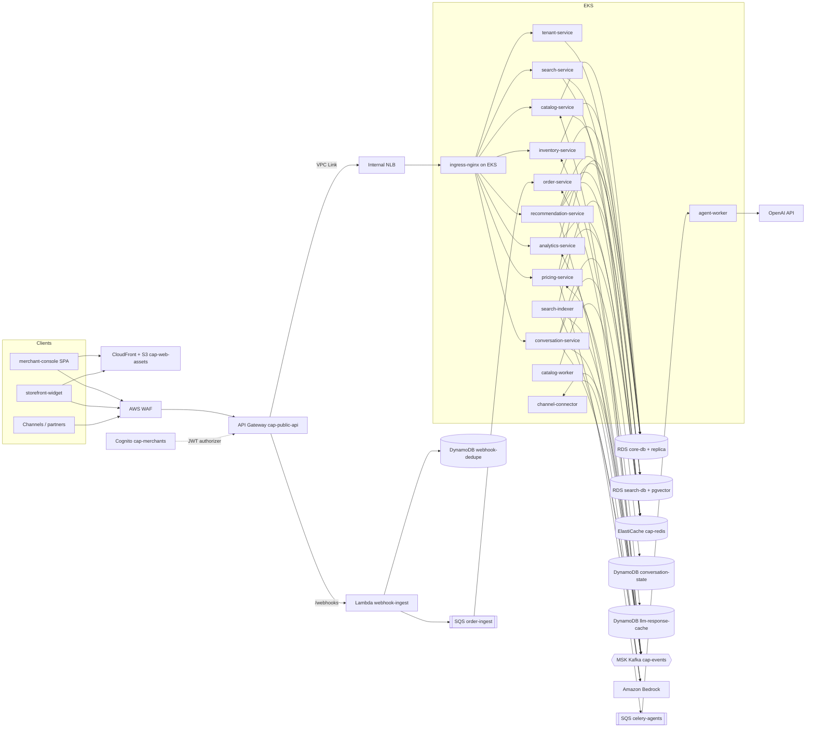
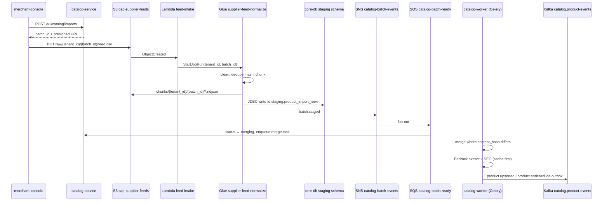

# High-Level Design

*Intelligent Commerce Automation Platform*

## Table of Contents

- [Service Topology](#service-topology)
- [API Design](#api-design)
- [Architecture Diagram](#architecture-diagram)
- [Catalog Ingestion Flow](#catalog-ingestion-flow)
- [Technology Mapping](#technology-mapping)
- [Additions Outside the Stated Stack](#additions-outside-the-stated-stack)

## Service Topology

The platform has ten [FastAPI](https://fastapi.tiangolo.com/ "FastAPI — Python web framework for building HTTP APIs with async support and automatic schema generation") services on Amazon [EKS](https://aws.amazon.com/eks/ "Amazon Elastic Kubernetes Service — Managed Kubernetes hosting on AWS"), one namespace per domain. Services own their data, and state changes cross service boundaries as [Kafka](https://kafka.apache.org/documentation/ "Apache Kafka — Distributed log that stores partitioned, replicated streams of records for publish-subscribe and stream processing") events. Synchronous calls happen only where a user is waiting for the answer. All services share one internal chassis library for auth middleware, the transactional outbox, metrics and logging, so a new service does not have to re-implement these.

| Service | Owns | Async role |
|---|---|---|
| `tenant-service` | Tenants, channel connections, onboarding sessions | Publishes tenant lifecycle events |
| `catalog-service` + `catalog-worker` | Products, variants, categories, import batches, [SEO](https://developers.google.com/search/docs/fundamentals/seo-starter-guide "Search Engine Optimization — Shapes page content so that search engines rank it higher") copy | Publishes `catalog.product-events`; consumes `pricing.decisions` and its own events (cache invalidation); runs [Celery](https://docs.celeryq.dev/en/stable/ "Celery — Distributed task queue that runs background and scheduled jobs outside the request cycle") import and enrichment tasks |
| `search-service` + `search-indexer` | `search-db` product documents and embeddings | Consumes `catalog.product-events` and `inventory.events` |
| `inventory-service` | Stock levels and adjustments | Publishes `inventory.events`; consumes `orders.events` |
| `order-service` | Normalised channel orders | Consumes the `order-ingest` queue; publishes `orders.events` |
| `pricing-service` + `agent-worker` | Pricing rules, market signals, price decisions, agent runs, trend reports | Consumes `market.signals`, `orders.events`, `inventory.events`; runs Celery agent tasks; publishes `pricing.decisions` |
| `conversation-service` | Chat threads ([DynamoDB](https://aws.amazon.com/dynamodb/ "Amazon DynamoDB — Managed key-value and document database with single-digit-millisecond reads and writes")) | Publishes `conversation.intents` |
| `recommendation-service` | Product affinities (`reco` schema), session candidates | Consumes `shopper.interactions`; loads nightly affinities from Glue `affinity-builder` |
| `analytics-service` | Sales and behaviour rollups; the interaction event collector | Consumes `orders.events`, `shopper.interactions`, `conversation.intents` |
| `channel-connector` | Channel listing sync, competitor price polling | Consumes `pricing.decisions`, `catalog.product-events` and `inventory.events`; publishes `market.signals` |

## API Design

All APIs are [REST](https://en.wikipedia.org/wiki/REST "Representational State Transfer — Architectural style for stateless, resource-oriented HTTP APIs")/[JSON](https://www.json.org/json-en.html "JavaScript Object Notation — Lightweight text format for structured data exchange"). Every request and response body is a [Pydantic](https://docs.pydantic.dev/latest/ "Pydantic — Python library that validates and parses data against typed models at runtime") model, and FastAPI generates the [OpenAPI](https://www.openapis.org/ "OpenAPI Specification — Describes an HTTP API's endpoints, schemas and behavior in a machine readable format") document that the TypeScript client types come from. Lists use cursor pagination (`?cursor=&limit=`). Writes accept an `Idempotency-Key` header. Updates use `If-Match` on the row `version`.

**Merchant and partner APIs** (Cognito [JWT](https://datatracker.ietf.org/doc/html/rfc7519 "JSON Web Token — Compact, signed token format for carrying claims between parties"); scopes in `06-security.md`)

| Method and path | Input | Returns |
|---|---|---|
| `POST /v1/catalog/imports` | `supplier_id`, `filename`, `content_type` | `{batch_id, upload_url, expires_at}`: a presigned [S3](https://aws.amazon.com/s3/ "Amazon Simple Storage Service — Durable object storage for files, datasets and archives") upload [URL](https://datatracker.ietf.org/doc/html/rfc3986 "Uniform Resource Locator — Addresses the location and access method of a resource on the web") |
| `GET /v1/catalog/imports/{batch_id}` | none | `ImportBatch {status, rows_total, rows_changed, rows_rejected}` |
| `GET /v1/catalog/products` | `status`, `category_id`, cursor | `Page[ProductSummary]` |
| `PATCH /v1/catalog/products/{product_id}` | partial `ProductUpdate`, `If-Match` | `Product` |
| `GET /v1/catalog/variants/{sku}` | none | `VariantCard {sku, product_id, title, price_amount, currency, status}`, the high-concurrency lookup |
| `GET /v1/inventory/{sku}` | `location_id?` | `StockLevel[] {location_id, on_hand, reserved, version}` |
| `POST /v1/inventory/adjustments` | `{sku, location_id, delta, reason}`, `Idempotency-Key` | `StockAdjustment` |
| `GET /v1/pricing/decisions` | `status=pending_approval`, cursor | `Page[PriceDecision]` |
| `POST /v1/pricing/decisions/{decision_id}:approve` / `:reject` | `{note?}` | `PriceDecision` |
| `PUT /v1/pricing/rules/{rule_id}` | `PricingRule` | `PricingRule` |
| `GET /v1/pricing/trends` | `category_id?`, `from`, `to` | `Page[TrendReport]` |
| `GET /v1/analytics/category-sales` | `from`, `to`, `channel?` | `CategorySalesTree`: a nested `{name, revenue, units, children[]}` for the treemap |
| `GET /v1/analytics/behavior-flows` | `from`, `to`, `category_id?` | `BehaviorMatrix {stages[], hours[], cells[{stage_from, stage_to, hour, transitions}]}` for the heatmap |
| `PUT /v1/onboarding/steps/{step}` | step payload | `OnboardingSession {current_step, status}` |
| `POST /v1/copilot/messages` | `{thread_id?, message}` | Server-sent event stream of tokens, tool results and confirmation requests |

**Storefront APIs** (publishable [API](https://en.wikipedia.org/wiki/API "Application Programming Interface — Defines the contract by which software components exchange requests and data") key plus a pseudonymous `shopper_ref`)

| Method and path | Input | Returns |
|---|---|---|
| `GET /v1/storefront/search` | `q`, `session_id`, `filters`, `limit ≤ 50` | `SearchResult[] {product_id, title, score, price_amount, in_stock}` |
| `GET /v1/storefront/recommendations` | `shopper_ref`, `context=product:{id}\|cart\|home` | `Recommendation[] {product_id, reason}` |
| `POST /v1/storefront/chat/messages` | `{thread_id?, shopper_ref, message}` | Server-sent event stream of tokens and product cards |
| `POST /v1/storefront/events` | a batch of ≤ 100 interaction events | `202 Accepted` |

**Channel webhooks:** `POST /webhooks/{channel}` goes to Lambda `webhook-ingest` and returns `202` after an [HMAC](https://datatracker.ietf.org/doc/html/rfc2104 "Hash-based Message Authentication Code — Verifies both the integrity and authenticity of a message using a shared secret key") check and de-duplication.

**Internal only** (inside the cluster, never exposed through API Gateway): `POST /internal/catalog/variants:batchGet` and `POST /internal/search/retrieve`. `conversation-service`, `recommendation-service` and `channel-connector` call these.

## Architecture Diagram

Requests flow from the client to [AWS](https://aws.amazon.com/ "Amazon Web Services — Cloud provider whose managed compute, storage and messaging services host a system") [WAF](https://owasp.org/www-community/Web_Application_Firewall "Web Application Firewall — Filters and blocks malicious HTTP traffic before it reaches an application") and API Gateway `cap-public-api`, then through a [VPC](https://aws.amazon.com/vpc/ "Virtual Private Cloud — Isolated private network in which cloud resources run") Link to an internal [NLB](https://docs.aws.amazon.com/elasticloadbalancing/latest/network/introduction.html "Network Load Balancer — Layer 4 load balancer that forwards TCP and TLS connections to targets") and ingress-nginx, and on to the services and their data stores. Static assets are served separately from CloudFront.

## Catalog Ingestion Flow

The bulk pipeline is the one flow that crosses most of the managed AWS services. Each hand-off is a durable artifact (an S3 object, a staging row or a queue message), so any step can be retried without repeating the one before it.

## Technology Mapping

| Technology | Role in this design | Alternative not chosen, and why |
|---|---|---|
| Python | All backend services, Celery workers, Glue PySpark jobs, Lambdas | Go: faster, but the LangChain, LangGraph and Bedrock ecosystem is Python-first |
| TypeScript / JavaScript | `merchant-console` (TypeScript strict); `storefront-widget` (TypeScript compiled to a small plain JavaScript bundle) | Separate JavaScript codebase for the widget: duplicate types for the same API |
| FastAPI | Every [HTTP](https://datatracker.ietf.org/doc/html/rfc9110 "Hypertext Transfer Protocol — Application protocol used to request and transfer web resources") service; async I/O for [LLM](https://en.wikipedia.org/wiki/Large_language_model "Large Language Model — Neural network trained on text that generates and interprets natural language") and database calls; automatic OpenAPI | Django REST: heavier [ORM](https://en.wikipedia.org/wiki/Object%E2%80%93relational_mapping "Object Relational Mapper — Maps application objects to relational database rows and queries") coupling and synchronous by default |
| [SQLAlchemy](https://www.sqlalchemy.org/ "SQLAlchemy — Python SQL toolkit and ORM that maps objects to relational tables and builds queries") | Async ORM and Core; Core for bulk `INSERT … ON CONFLICT` merges and partition-aware queries | Raw asyncpg: faster but loses the unit-of-work and model reuse |
| Pydantic | API schemas, event payloads, LLM structured output, tool argument schemas | dataclasses: no validation at the trust boundary |
| [Alembic](https://alembic.sqlalchemy.org/en/latest/ "Alembic — Applies and versions database schema migrations for SQLAlchemy") | Versioned migrations per service schema, run as a pre-deploy [Kubernetes](https://kubernetes.io/ "Kubernetes — Automates deployment, scaling and management of containerized applications") Job | Hand-applied [SQL](https://en.wikipedia.org/wiki/SQL "Structured Query Language — Queries and manipulates data in a relational database"): no ordering or history |
| [OAuth2](https://datatracker.ietf.org/doc/html/rfc6749 "OAuth 2.0 — Authorization framework that lets an application access resources on a user's behalf") | Authorization code with [PKCE](https://datatracker.ietf.org/doc/html/rfc7636 "Proof Key for Code Exchange — Protects an OAuth authorization code exchange for clients that cannot hold a secret") for the console; client credentials for partners | API keys only: no user identity and no scopes |
| React, React Router | Console [SPA](https://en.wikipedia.org/wiki/Single-page_application "Single Page Application — Web application that updates its content in place without full page reloads"); routes are lazy-loaded so [D3](https://d3js.org/ "D3.js — JavaScript library that binds data to SVG and HTML for custom visualisations") loads only on analytics pages | Next.js: server-side rendering adds nothing to an authenticated console |
| [MobX](https://mobx.js.org/ "MobX — Makes application state observable so that views update when the data they read changes") | Observable stores per dashboard and per onboarding step; custom containers keep D3 chart state outside React renders | Redux: more boilerplate for heavily derived dashboard state |
| [TailwindCSS](https://tailwindcss.com/ "Tailwind CSS — Utility-first CSS framework for styling components directly in markup"), shadcn/ui, [HTML](https://html.spec.whatwg.org/ "HyperText Markup Language — Markup format that structures content for web browsers")/[CSS](https://developer.mozilla.org/en-US/docs/Web/CSS "Cascading Style Sheets — Describes how HTML elements are laid out and styled in a browser") | Shared `@cap/ui` component library; the onboarding wizard steps | Material UI: harder to theme per tenant |
| Webpack | Bundling with code splitting; the widget bundle is budgeted at ≤ 60 KB gzip | Vite: faster in development, but the existing build config is Webpack |
| D3.js, Treemaps | `d3-hierarchy` treemap for category sales; a D3 heatmap for behaviour flows | Chart libraries: no treemap layout control |
| React Testing Library, Pytest | UI behaviour tests; unit and integration tests (details in `05-reliability.md`) | Enzyme: tests implementation details |
| Celery | `catalog-worker` and `agent-worker`; [SQS](https://aws.amazon.com/sqs/ "Amazon Simple Queue Service — Managed message queue that decouples producers from consumers") broker with retries and late ack | Custom SQS consumers: re-implement retries, routing and rate limits |
| LangChain | Retriever for search, tool definitions, model abstraction over Bedrock and [OpenAI](https://platform.openai.com/docs/ "OpenAI — Provides GPT models through an API and official SDKs") | Direct [SDK](https://en.wikipedia.org/wiki/Software_development_kit "Software Development Kit — Packaged set of tools and libraries for building against a platform") calls only: tool schemas duplicated per provider |
| LangGraph | Pricing, trend and chat agents as state graphs with checkpoints and human-approval interrupts | A free-form agent loop: no bounded steps, no resumable approval |
| OpenAI SDK | Model calls for the pricing and trend agents (no personal data in their inputs) | Bedrock only: this design keeps the stronger function-calling model for the agents that set prices |
| Amazon Bedrock | Attribute extraction, SEO copy, embeddings, and the chat model (shopper text stays inside AWS) | OpenAI for everything: shopper [PII](https://csrc.nist.gov/glossary/term/personally_identifiable_information "Personally Identifiable Information — Data that can identify a person and must be minimised and protected") would leave the AWS boundary |
| EKS, Kubernetes, Docker, [ECR](https://aws.amazon.com/ecr/ "Amazon Elastic Container Registry — Stores, scans and serves container images for deployment") | Runs all services and workers; images in ECR | Lambda-only runtime: the 15-minute limit and cold starts do not suit agent runs or Kafka consumers |
| SQS, [SNS](https://aws.amazon.com/sns/ "Amazon Simple Notification Service — Managed publish-subscribe topics that fan one message out to many subscribers") | Work queues (Celery, `order-ingest`) with DLQs; SNS fans out batch and ops events | Kafka for everything: no per-message visibility timeout or [DLQ](https://docs.aws.amazon.com/AWSSimpleQueueService/latest/SQSDeveloperGuide/sqs-dead-letter-queues.html "Dead-Letter Queue — Holds messages that failed processing repeatedly so they can be inspected and redriven") |
| Kafka | Domain event backbone: ordered per key, replayable, many consumer groups | SNS→SQS for everything: no replay, costly at 3,500 events/s |
| S3, Glue | Raw, curated and chunked feeds; Glue PySpark for cleaning and chunking at scale, plus nightly `affinity-builder` and `orders-archive` jobs | Self-managed Spark clusters: more control, more operations |
| Lambda | `feed-intake`, `webhook-ingest`, `cognito-pre-token`: short event-triggered glue code | Pods: always-on cost for bursty, rare triggers |
| API Gateway | Public front door: Cognito authorizer, usage plans per API key, webhook routes | NLB straight to ingress: rate limiting and authorization would have to be built |
| DynamoDB | Key-value data with [TTL](https://en.wikipedia.org/wiki/Time_to_live "Time To Live — Duration after which a cached or stored value expires"): webhook de-dup, LLM response cache, chat checkpoints | [PostgreSQL](https://www.postgresql.org/docs/current/ "PostgreSQL — Relational database storing and querying structured data with strong transactional guarantees"): would add high-churn writes to the [OLTP](https://en.wikipedia.org/wiki/Online_transaction_processing "Online Transaction Processing — Workload of many short read and write transactions serving an application") primary |
| Cognito, [IAM](https://aws.amazon.com/iam/ "AWS Identity and Access Management — Controls which principals may perform which actions on which AWS resources") | Merchant identity; pod permissions through IAM roles for service accounts | A third-party identity vendor: another data processor to contract with |
| [RDS](https://aws.amazon.com/rds/ "Amazon Relational Database Service — Managed hosting for relational databases such as PostgreSQL, with backups and failover") PostgreSQL | `core-db` (OLTP, schema per service) and `search-db` (pgvector) | Aurora: better replica lag, at a higher price for this size |
| [Redis](https://redis.io/docs/latest/ "Redis — In-memory data store used as a cache and fast key-value store") | Cache-aside lookups, query-embedding cache, first-tier LLM response cache, signal windows, rate budgets | Memcached: no sorted sets or atomic scripts |
| CloudWatch, Prometheus, Grafana | AWS-managed service metrics; application and agent metrics; one Grafana over both | Datadog: cost at this metric cardinality |
| Bitbucket, Bitbucket Pipelines, Bash | Source control; [CI](https://en.wikipedia.org/wiki/Continuous_integration "Continuous Integration — Automatically builds and tests code on every change")/[CD](https://en.wikipedia.org/wiki/Continuous_deployment "Continuous Deployment — Automatically releases every build that passes the pipeline's gates to production without a manual step"); deploy and canary scripts | Jenkins: self-hosted operations |
| Docker Compose | Local development and CI integration stack (PostgreSQL + pgvector, Redis, Kafka) | Shared dev cluster: slow feedback |
| Cursor, Codex | Developer tooling; no architectural role | Not applicable |

## Additions Outside the Stated Stack

Each fills a clear gap. Where an item sits under the brief's "AWS … etc.", it is still named here so the choice is visible.

| Addition | Gap it fills | Cost |
|---|---|---|
| Amazon [MSK](https://aws.amazon.com/msk/ "Amazon Managed Streaming for Apache Kafka — Runs Apache Kafka clusters as a managed AWS service") | Managed Kafka; the stack names Kafka but not where it runs | ~3 brokers across AZs; cheaper than running Kafka ourselves |
| ElastiCache for Redis | Managed Redis with Multi-[AZ](https://aws.amazon.com/about-aws/global-infrastructure/regions_az/ "Availability Zone — Isolated group of data centres within an AWS Region, used to survive a single-site failure") failover | Low |
| pgvector extension | Vector search inside PostgreSQL | None beyond `search-db` sizing |
| CloudFront, AWS WAF, Shield Standard | [CDN](https://en.wikipedia.org/wiki/Content_delivery_network "Content Delivery Network — Distributes cached content across edge locations to reduce latency") for the SPA and widget; edge protection | Low; Shield Advanced deliberately not bought |
| Secrets Manager, [KMS](https://aws.amazon.com/kms/ "AWS Key Management Service — Creates and controls the keys that encrypt data at rest, and logs every use") | Channel credentials, OpenAI key, encryption keys | Low |
| ingress-nginx | In-cluster path routing behind one NLB | One more component to patch |
| Linkerd | Automatic mTLS between pods | Sidecar per pod, ~1 ms p99 added |
| OpenTelemetry + AWS X-Ray | Distributed tracing across HTTP, Kafka, Celery and LLM calls | Collector DaemonSet; sampled at 10% |
