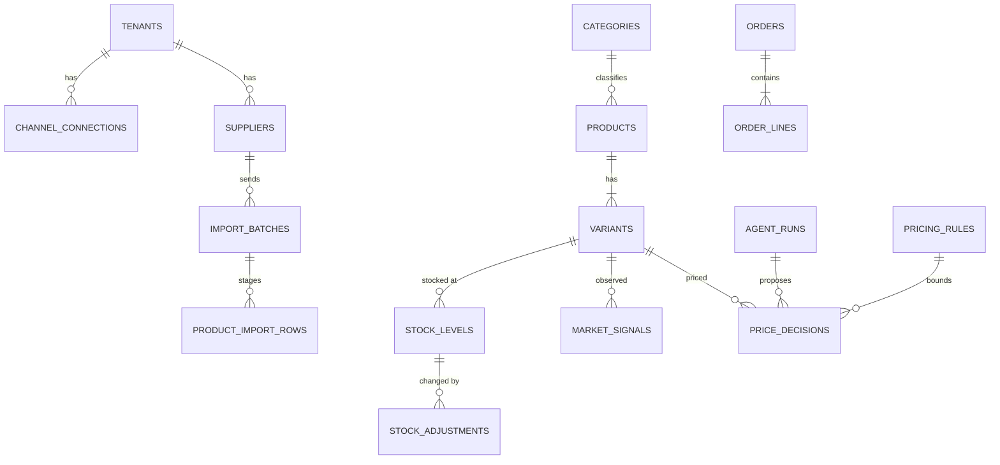

# Data Modeling & Storage

*Intelligent Commerce Automation Platform*

## Table of Contents

- [Storage Layout](#storage-layout)
- [Schema Design: core-db](#schema-design-core-db)
- [Schema Design: search-db](#schema-design-search-db)
- [Key-Value, Object and Event Stores](#key-value-object-and-event-stores)
- [Partitioning Strategy](#partitioning-strategy)
- [Capacity and Evolution Triggers](#capacity-and-evolution-triggers)

## Storage Layout

| Store | Engine | Holds | Consistency |
|---|---|---|---|
| `core-db` | [RDS](https://aws.amazon.com/rds/ "Amazon Relational Database Service — Managed hosting for relational databases such as PostgreSQL, with backups and failover") [PostgreSQL](https://www.postgresql.org/docs/current/ "PostgreSQL — Relational database storing and querying structured data with strong transactional guarantees") 16, Multi-[AZ](https://aws.amazon.com/about-aws/global-infrastructure/regions_az/ "Availability Zone — Isolated group of data centres within an AWS Region, used to survive a single-site failure"), `db.r6g.2xlarge`, plus `core-db-replica` | One schema per service: `platform`, `catalog`, `staging`, `inventory`, `orders`, `pricing`, `analytics`, `reco` | Strong on the primary; the replica lags by seconds |
| `search-db` | RDS PostgreSQL 16 + pgvector ≥ 0.8, Multi-AZ, `db.r6g.xlarge`, plus `search-db-replica` | `search.product_documents` | Eventual; built from events |
| `cap-redis` | ElastiCache for [Redis](https://redis.io/docs/latest/ "Redis — In-memory data store used as a cache and fast key-value store"), cluster mode, 3 shards × 1 replica | Caches and short-lived windows (key list in `05-reliability.md`) | Best-effort; can always be rebuilt |
| [DynamoDB](https://aws.amazon.com/dynamodb/ "Amazon DynamoDB — Managed key-value and document database with single-digit-millisecond reads and writes") | On-demand tables | `webhook-dedupe`, `llm-response-cache`, `conversation-state` | Single-item strong writes |
| [S3](https://aws.amazon.com/s3/ "Amazon Simple Storage Service — Durable object storage for files, datasets and archives") | `cap-supplier-feeds`, `cap-archive`, `cap-web-assets` | Raw, curated and chunked feeds; archived partitions; static bundles | Strong read-after-write |
| [Kafka](https://kafka.apache.org/documentation/ "Apache Kafka — Distributed log that stores partitioned, replicated streams of records for publish-subscribe and stream processing") | [MSK](https://aws.amazon.com/msk/ "Amazon Managed Streaming for Apache Kafka — Runs Apache Kafka clusters as a managed AWS service") `cap-events` | Domain events (topic list in `04-deep-dive.md`) | Ordered per key |

**One cluster, many schemas.** Each service connects with its own PostgreSQL role, which has privileges on its own schema only. So `order-service` cannot join `catalog.products`; it has to consume events. Sharing one `core-db` instance costs some noisy-neighbour risk. In exchange the team runs one Multi-AZ pair instead of eight. The trigger for splitting a schema onto its own instance is in [Capacity and Evolution Triggers](#capacity-and-evolution-triggers).

## Schema Design: core-db

Every tenant-scoped table starts its primary key with `tenant_id uuid`. Row-level security keys on this column (`06-security.md`). Mutable aggregates carry `version int` for optimistic concurrency.

**`platform` schema** (`tenant-service`)

| Table | Key columns | Other columns |
|---|---|---|
| `tenants` | `tenant_id` (primary key) | `name`, `plan`, `status`, `created_at` |
| `channel_connections` | (`tenant_id`, `connection_id`) | `channel`, `status`, `credentials_secret_arn` (the secret itself lives in Secrets Manager), `last_synced_at` |
| `onboarding_sessions` | (`tenant_id`, `session_id`) | `current_step`, `step_data jsonb`, `status`, `version`, `updated_at` |
| `notifications` | (`tenant_id`, `notification_id`) | `user_sub`, `kind`, `payload jsonb`, `read_at`, `created_at` |

**`catalog` and `staging` schemas** (`catalog-service`, `catalog-worker`)

| Table | Key columns | Other columns |
|---|---|---|
| `catalog.suppliers` | (`tenant_id`, `supplier_id`) | `name`, `feed_format`, `mapping_config jsonb` |
| `catalog.import_batches` | (`tenant_id`, `batch_id`) | `supplier_id`, `s3_key`, `status` (`awaiting_upload`, `normalizing`, `staged`, `merging`, `enriching`, `completed`, `failed`), `glue_job_run_id`, `rows_total`, `rows_changed`, `rows_rejected`, `created_at`, `completed_at` |
| `catalog.categories` | (`tenant_id`, `category_id`) | `parent_id`, `name`, `path text` (materialised, e.g. `apparel/footwear/running`) |
| `catalog.products` | (`tenant_id`, `product_id`) | `parent_sku` (unique per tenant), `title`, `brand`, `category_id`, `attributes jsonb`, `description_raw`, `seo_description`, `seo_prompt_version`, `content_hash bytea`, `status` (`draft`, `active`, `archived`), `enrichment_status`, `version`, `updated_at` |
| `catalog.variants` | (`tenant_id`, `variant_id`) | `product_id`, `sku` (unique per tenant), `gtin`, `option_values jsonb`, `price_amount numeric(12,2)`, `currency char(3)`, `price_decision_id`, `version`, `updated_at` |
| `staging.product_import_rows` | (`batch_id`, `supplier_sku`) | `tenant_id`, `parent_sku`, `payload jsonb`, `content_hash`, `chunk_keys text[]`; an `UNLOGGED` table, truncated per batch after the merge. A crash or Multi-AZ failover empties it, so a batch left in `staged` is re-run from `curated/` |
| `staging.product_affinities_load` | (`tenant_id`, `product_id`, `related_product_id`) | `score real`, `run_date`; written nightly by Glue `affinity-builder`, then swapped into `reco.product_affinities` per tenant by `recommendation-service` |

`content_hash` is a [SHA-256](https://csrc.nist.gov/pubs/fips/180-4/upd1/final "Secure Hash Algorithm 256-bit — Produces a fixed-size digest used to verify content integrity") of the normalised product fields, computed in Glue. The merge updates only rows whose hash changed. This is what reduces 1M re-sent rows to the ~5% that need enrichment. `description_raw` holds the full supplier text, so it grows beyond 2 KB and [TOAST](https://www.postgresql.org/docs/current/storage-toast.html "The Oversized-Attribute Storage Technique — Stores oversized column values out of line in a side table, compressed where possible") stores it out of line. Keeping it out of line keeps the heap row that the lookup path reads small.

**`inventory` schema** (`inventory-service`)

| Table | Key columns | Other columns |
|---|---|---|
| `stock_levels` | (`tenant_id`, `sku`, `location_id`) | `on_hand int`, `reserved int`, `version`, `updated_at` |
| `stock_adjustments` | (`tenant_id`, `adjustment_id`, `created_at`) | `sku`, `location_id`, `delta int`, `reason`, `actor_type` (`user`, `agent`, `channel`, `system`), `actor_id`, `agent_run_id`, `idempotency_key` |
| `idempotency_keys` | (`tenant_id`, `idempotency_key`) | `adjustment_id`, `response jsonb`, `created_at`; rows older than 48 h are deleted hourly |

`stock_adjustments` is append-only. It is written in the same transaction as the `stock_levels` update and the `idempotency_keys` insert, and it is the audit trail for every change an agent makes. It is partitioned on `created_at`, and PostgreSQL requires a unique key on a partitioned table to include the partition column. A unique idempotency key on `stock_adjustments` would therefore not catch a retry that arrives a second later with a new timestamp. The small, unpartitioned `idempotency_keys` table holds that guarantee instead. A retry hits its primary key, and the stored `response` is returned unchanged.

**`orders` schema** (`order-service`)

| Table | Key columns | Other columns |
|---|---|---|
| `orders` | (`tenant_id`, `order_id`, `placed_at`) | `channel`, `channel_order_id`, `status`, `total_amount`, `currency`, `shopper_ref`, `ship_country`, `updated_at`; unique (`tenant_id`, `channel`, `channel_order_id`, `placed_at`) |
| `order_lines` | (`tenant_id`, `order_id`, `placed_at`, `line_no`) | `sku`, `qty`, `unit_price` |

Orders keep no shopper name, address or payment data. `shopper_ref` is a pseudonymous [HMAC](https://datatracker.ietf.org/doc/html/rfc2104 "Hash-based Message Authentication Code — Verifies both the integrity and authenticity of a message using a shared secret key"), and `ship_country` is the only location field kept (see `06-security.md`).

**`pricing` schema** (`pricing-service`, `agent-worker`)

| Table | Key columns | Other columns |
|---|---|---|
| `pricing_rules` | (`tenant_id`, `rule_id`) | `category_id` or `sku` scope, `min_margin_pct`, `max_daily_change_pct`, `auto_apply_band_pct`, `map_floor`, `enabled` |
| `variant_costs` | (`tenant_id`, `sku`) | `unit_cost`, `currency`, `updated_at` (carried from supplier feeds on `catalog.product-events`, or set in the console) |
| `market_signals` | (`tenant_id`, `sku`, `observed_at`, `signal_type`) | `value numeric`, `source`; types: `competitor_price`, `buy_box_price`, `sales_velocity`, `days_of_cover` |
| `agent_runs` | (`tenant_id`, `run_id`) | `graph` (`pricing`, `trend`), `trigger`, `status`, `tokens_in`, `tokens_out`, `cost_usd`, `started_at`, `finished_at`; `run_id` is the LangGraph thread id |
| `price_decisions` | (`tenant_id`, `decision_id`) | `sku`, `agent_run_id`, `old_price`, `proposed_price`, `applied_price`, `status` (`auto_applied`, `pending_approval`, `approved`, `rejected`, `expired`, `blocked_by_guardrail`), `rationale`, `guardrail_results jsonb`, `model_id`, `decided_by`, `created_at`, `applied_at` |
| `trend_reports` | (`tenant_id`, `report_id`) | `category_id`, `period_start`, `period_end`, `summary`, `signals jsonb`, `created_at` |

The LangGraph Postgres checkpointer tables for pricing and trend runs also live in this schema. The library creates them, and [Alembic](https://alembic.sqlalchemy.org/en/latest/ "Alembic — Applies and versions database schema migrations for SQLAlchemy")'s `include_object` hook excludes them so autogenerate never tries to drop them.

**`analytics` and `reco` schemas** (`analytics-service`, `recommendation-service`)

| Table | Key columns | Other columns |
|---|---|---|
| `analytics.sales_daily_category` | (`tenant_id`, `day`, `channel`, `category_id`) | `orders`, `units`, `revenue` |
| `analytics.behavior_hourly` | (`tenant_id`, `hour_ts`, `category_id`, `stage_from`, `stage_to`) | `transitions int` |
| `reco.product_affinities` | (`tenant_id`, `product_id`, `related_product_id`) | `score real`, `computed_at` |

**Shared per schema: `outbox` and `inbox`.** Each service schema that publishes has an `outbox` table (`event_id` primary key, `topic`, `key`, `payload jsonb`, `created_at`, `published_at`), written in the same transaction as the state change. Each schema that consumes has an `inbox` table (`consumer_group`, `event_id`) primary key with `processed_at`, which makes every consumer idempotent. The mechanism is described in `04-deep-dive.md`.

## Schema Design: search-db

| Table | Key columns | Other columns |
|---|---|---|
| `search.product_documents` | (`tenant_id`, `product_id`, `chunk_no`) | `chunk_text`, `embedding halfvec(512)`, `tsv tsvector` (generated from `chunk_text`), `category_path`, `price_amount`, `in_stock bool`, `status`, `embedding_model`, `content_hash`, `updated_at` |

Chunk 0 is always the title plus key attributes. Chunks 1–n are ~512-token slices of descriptions and spec sheets with a 64-token overlap, written by the Glue job. Only `search-indexer` writes here. The table denormalises `price_amount`, `in_stock` and `category_path` so that filters never need a cross-database join.

## Key-Value, Object and Event Stores

| DynamoDB table | Partition / sort key | Attributes | [TTL](https://en.wikipedia.org/wiki/Time_to_live "Time To Live — Duration after which a cached or stored value expires") |
|---|---|---|---|
| `webhook-dedupe` | `pk = {channel}#{webhook_id}` | `received_at` | 7 days |
| `llm-response-cache` | `cache_key` = [SHA](https://csrc.nist.gov/pubs/fips/180-4/upd1/final "Secure Hash Algorithm — Family of cryptographic hash functions used to verify content integrity")-256 of (`model_id`, `prompt_version`, normalised input) | `output`, `tokens_in`, `tokens_out`, `created_at` | 180 days |
| `conversation-state` | `thread_id` / `checkpoint_id` | `tenant_id`, `shopper_ref`, `channel`, checkpoint blob, transcript turns | 30 days |

`conversation-state` has a [GSI](https://docs.aws.amazon.com/amazondynamodb/latest/developerguide/GSI.html "Global Secondary Index — DynamoDB index with its own partition key that serves an alternative access pattern") `by-shopper` (`shopper_ref`, `created_at`). It exists for one reason: erasing a shopper's threads on request (`06-security.md`).

S3 `cap-supplier-feeds` uses the prefixes `raw/{tenant_id}/{batch_id}/`, `curated/tenant_id=/batch_id=/` (Parquet, registered in the Glue Data Catalog), `chunks/{tenant_id}/{batch_id}/*.ndjson` and `rejected/`. A lifecycle rule moves `raw/` to Glacier after 90 days.

## Partitioning Strategy

| Table | Scheme | Why |
|---|---|---|
| `catalog.products`, `catalog.variants` | `HASH (tenant_id)`, 16 partitions | Every lookup includes `tenant_id`, so the planner prunes to one partition. Each partition's indexes are 1/16 the size, and a large import vacuums one partition instead of the whole table |
| `search.product_documents` | `HASH (tenant_id)`, 16 partitions | Each partition has its own [HNSW](https://arxiv.org/abs/1603.09320 "Hierarchical Navigable Small World — Graph index for approximate nearest-neighbour search over vectors") index. A tenant-filtered vector query searches ~750k chunks instead of 12M. This is the main reason search latency fell (`04-deep-dive.md`) |
| `orders.orders`, `orders.order_lines` | `RANGE (placed_at)`, monthly | Queries for recent orders touch one or two partitions. Partitions older than 24 months are detached, exported to `cap-archive` by Glue `orders-archive`, then dropped |
| `inventory.stock_adjustments` | `RANGE (created_at)`, monthly | Append-only; kept 13 months |
| `pricing.market_signals` | `RANGE (observed_at)`, daily | 30-day retention by `DROP PARTITION`, with no bulk `DELETE` and no vacuum debt |
| `analytics.*` rollups | `RANGE (day` / `hour_ts)`, monthly | Dashboards query bounded date ranges |

Partitions are created 3 periods ahead by a scheduled [Kubernetes](https://kubernetes.io/ "Kubernetes — Automates deployment, scaling and management of containerized applications") Job. A missing future partition would reject inserts, so the job alerts if fewer than 2 periods remain.

**Why not shard.** At 4,500 requests per second of mostly point lookups and ~300 writes per second, one `db.r6g.2xlarge` primary is sized to run at ≤ 40% CPU (`04-deep-dive.md` explains the headroom). Sharding by tenant would add routing, cross-shard analytics and rebalancing work for a team of this size. It stays an evolution trigger, not a day-one design.

> **Verify Before Build:** hash partitioning with 16 partitions leaves large tenants sharing a partition, and one tenant with 30% of all SKUs would unbalance its partition — check the tenant size distribution before fixing the modulus; a very large tenant can be moved to its own `LIST` partition in front of the hash partitions.

## Capacity and Evolution Triggers

| Trigger | Action |
|---|---|
| `core-db` primary CPU > 60% at peak for 7 days | Move the `pricing` and `analytics` schemas to their own RDS instance first (write-heavy, not latency-critical) |
| Write rate on `core-db` > 3,000 per second, sustained | Shard `catalog` and `inventory` by `tenant_id` |
| `search.product_documents` > 50M chunks, or HNSW rebuild > 4 h | Evaluate OpenSearch k-NN; keep the LangChain retriever interface unchanged |
| `core-db-replica` lag > 30 s at peak | Add a second replica, or move analytics reads to a Glue/Athena path |
| DynamoDB `conversation-state` item > 300 KB | Store transcripts in S3 and keep only pointers in the item |
