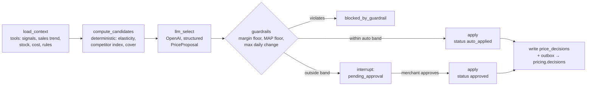
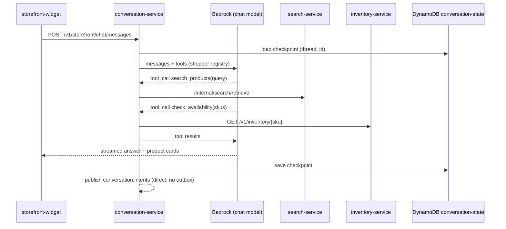

# Deep Dive & Bottlenecks

*Intelligent Commerce Automation Platform*

## Table of Contents

- [Communication Patterns](#communication-patterns)
- [Search Retrieval Path](#search-retrieval-path)
- [Pricing and Trend Agents](#pricing-and-trend-agents)
- [Conversational Agents and Tools](#conversational-agents-and-tools)
- [LLM Cost and Rate Control](#llm-cost-and-rate-control)
- [Failure Modes](#failure-modes)
- [Trade-offs](#trade-offs)

## Communication Patterns

**Rule:** a call is synchronous only when a person is waiting for its result. Every state change that other services care about travels as an event.

| Flow | Pattern | Why |
|---|---|---|
| Console / widget → services | Sync [REST](https://en.wikipedia.org/wiki/REST "Representational State Transfer — Architectural style for stateless, resource-oriented HTTP APIs") through [API](https://en.wikipedia.org/wiki/API "Application Programming Interface — Defines the contract by which software components exchange requests and data") Gateway | A user is waiting |
| `conversation-service` → `search-service`, `inventory-service`; `recommendation-service` → `search-service` | Sync internal REST, 300 ms timeout, one retry | Part of a live chat turn or recommendation |
| Service state change → other services | Async: transactional outbox → [Kafka](https://kafka.apache.org/documentation/ "Apache Kafka — Distributed log that stores partitioned, replicated streams of records for publish-subscribe and stream processing") | Decouples services; each service's data stays authoritative |
| Channel webhook → `order-service` | Async: Lambda → [SQS](https://aws.amazon.com/sqs/ "Amazon Simple Queue Service — Managed message queue that decouples producers from consumers") `order-ingest` | Absorbs channel bursts; channels retry on 5xx |
| Import merge, enrichment, agent runs | Async: [Celery](https://docs.celeryq.dev/en/stable/ "Celery — Distributed task queue that runs background and scheduled jobs outside the request cycle") tasks on SQS `celery-import`, `celery-enrich`, `celery-agents` | Long-running, retryable, rate-limited work |
| Glue completion → `catalog-service` | Async: [SNS](https://aws.amazon.com/sns/ "Amazon Simple Notification Service — Managed publish-subscribe topics that fan one message out to many subscribers") `catalog-batch-events` → SQS `catalog-batch-ready` | Glue has no consumer; SNS also feeds `ops-alerts` on failure |

**Kafka topics** ([MSK](https://aws.amazon.com/msk/ "Amazon Managed Streaming for Apache Kafka — Runs Apache Kafka clusters as a managed AWS service") `cap-events`, replication factor 3, `min.insync.replicas=2`, producers use `acks=all`)

| Topic | Key | Partitions | Retention | Producers → consumers |
|---|---|---|---|---|
| `catalog.product-events` | `tenant_id:product_id` | 24 | 7 d | `catalog-service` → `search-indexer`, `channel-connector`, `catalog-service` cache invalidator |
| `inventory.events` | `tenant_id:sku` | 12 | 7 d | `inventory-service` → `search-indexer`, `pricing-service`, `channel-connector` |
| `orders.events` | `tenant_id:order_id` | 12 | 14 d | `order-service` → `analytics-service`, `pricing-service`, `inventory-service` |
| `market.signals` | `tenant_id:sku` | 12 | 3 d | `channel-connector` → `pricing-service` |
| `pricing.decisions` | `tenant_id:sku` | 6 | 14 d | `pricing-service` → `catalog-service`, `channel-connector` |
| `shopper.interactions` | `tenant_id:shopper_ref` | 24 | 3 d | `analytics-service` collector → `recommendation-service`, `analytics-service` |
| `conversation.intents` | `tenant_id:thread_id` | 6 | 3 d | `conversation-service` → `analytics-service` |

**Transactional outbox.** A service writes its state change and an `outbox` row in one [PostgreSQL](https://www.postgresql.org/docs/current/ "PostgreSQL — Relational database storing and querying structured data with strong transactional guarantees") transaction. A relay Deployment per service polls `outbox WHERE published_at IS NULL` with `FOR UPDATE SKIP LOCKED` every 200 ms, publishes, and sets `published_at`. One relay replica holds a PostgreSQL advisory lock, so events for a key leave in commit order; a standby takes over within 10 s. Delivery is at least once. Consumers record `event_id` in their `inbox` table in the same transaction as their own write, so a redelivered event is a no-op. This avoids the dual-write failure where the database commits and Kafka never hears about it. It costs one poll per service, and changes of state reach Kafka ~200 ms later.

## Search Retrieval Path

`search-service` runs a custom LangChain retriever that combines vector and keyword search. It embeds the query with the same Bedrock model as the documents (Amazon Titan Text Embeddings, 512 dimensions). It then runs two queries in parallel on `search-db-replica`: [HNSW](https://arxiv.org/abs/1603.09320 "Hierarchical Navigable Small World — Graph index for approximate nearest-neighbour search over vectors") k-NN on `embedding` and full-text on `tsv`. Both queries filter on `tenant_id`, `status = 'active'` and optional `category_path` and `in_stock`. The two ranked lists are fused by reciprocal rank. The result is boosted by the categories in the shopper's session (`sess:` key), collapsed from chunks to products, and filled in from the `cat:` cache.

"Context-aware" means two things. The session boost uses what the shopper just viewed. In chat, the agent rewrites a follow-up ("cheaper ones in blue") into a standalone query before it calls retrieval. The rewrite is an [LLM](https://en.wikipedia.org/wiki/Large_language_model "Large Language Model — Neural network trained on text that generates and interprets natural language") step in the chat turn, so it is not counted in retrieval latency.

**Why average retrieval went from 450 ms to 110 ms**

| Stage | Before | After | What changed |
|---|---|---|---|
| Query embedding | 190 ms | ~50 ms | [Redis](https://redis.io/docs/latest/ "Redis — In-memory data store used as a cache and fast key-value store") `qemb:` cache (~50% hit rate on head queries, ~1 ms per hit); a 512-dim model instead of 1536 dims |
| Vector search | 170 ms | ~20 ms (in parallel with ~12 ms keyword search) | Per-tenant hash partition with its own HNSW index (`03-data-modeling.md`), instead of an IVFFlat index whose tenant post-filter returned too few rows and fell back to an exact scan |
| Fusion and session boost | none | ~3 ms | In-process |
| Filling in product data | 60 ms | ~12 ms | One `MGET` on `cat:` keys plus one batched `variants:batchGet` for misses, instead of an N+1 [ORM](https://en.wikipedia.org/wiki/Object%E2%80%93relational_mapping "Object Relational Mapper — Maps application objects to relational database rows and queries") loop |
| Framework and network | 30 ms | ~25 ms | Internal hop, serialisation |
| **Total (average)** | **450 ms** | **~110 ms** | p95 stays < 200 ms because it is an embedding-cache miss plus the usual tail |

> **Verify Before Build:** filtered HNSW recall depends on pgvector ≥ 0.8 iterative index scans (`SET hnsw.iterative_scan = relaxed_order`, `hnsw.ef_search = 40`) — confirm the [RDS](https://aws.amazon.com/rds/ "Amazon Relational Database Service — Managed hosting for relational databases such as PostgreSQL, with backups and failover") PostgreSQL minor version ships pgvector 0.8+, and measure recall@10 against exact search on a sample of real tenant queries; relaxed ordering also requires re-sorting by distance in an outer query.

> **Deep Dive Reference:** hybrid ranking weights — the fusion constant and session boost were set by hand; an offline click-log evaluation ([NDCG](https://en.wikipedia.org/wiki/Discounted_cumulative_gain "Normalized Discounted Cumulative Gain — Ranking metric that rewards relevant results appearing near the top") on held-out sessions) is the way to tune them per tenant.

## Pricing and Trend Agents

`pricing-service` consumes `market.signals`, `orders.events` and `inventory.events`. It keeps a 48-hour window per [SKU](https://en.wikipedia.org/wiki/Stock_keeping_unit "Stock Keeping Unit — Identifies one sellable variant of a product for inventory and pricing") in Redis (`sig:` sorted set) and persists signals to `pricing.market_signals`. A run is triggered when a competitor price moves > 2%, when sales velocity departs > 2σ from its 28-day mean, or when days of stock cover falls below the rule's threshold. Only one run per SKU can be pending at a time: a `pricing:inflight:` key taken with `SET NX` and a 15-minute [TTL](https://en.wikipedia.org/wiki/Time_to_live "Time To Live — Duration after which a cached or stored value expires"). The run is a Celery task on `celery-agents`, executed by `agent-worker`.

The LLM chooses between candidates and writes the rationale; it never sets a price on its own. `compute_candidates` produces 3–5 prices from arithmetic the team can test. `guardrails` is plain Python, so every price that ships has passed rules a unit test can prove. Approval waits use a LangGraph `interrupt`. The graph checkpoints to Postgres, the worker releases, and `POST …:approve` resumes the same thread hours later on any worker. Unapproved decisions expire after 24 h. `recursion_limit = 12` and a per-run token cap bound a runaway loop.

**Why five minutes is reachable.** Signal to trigger < 5 s. Queue wait p95 < 60 s at peak (sized worker concurrency). Graph run p95 ~40 s (3 LLM calls). Guardrails and commit < 1 s. The `pricing.decisions` consumer updates `catalog.variants.price_amount` < 5 s later, and `channel-connector` pushes to channels in < 60 s. Total p95 ≈ 2.8 min.

**Trend agent.** A [Kubernetes](https://kubernetes.io/ "Kubernetes — Automates deployment, scaling and management of containerized applications") CronJob enqueues one run per tenant and category each night. The graph reads category sales through a tool that calls `analytics-service` (`GET /v1/analytics/category-sales`), because `agent-worker`'s database role cannot read the `analytics` schema. It also reads recent `market_signals`, then writes a `trend_reports` row. The pricing graph reads the latest report as context, and the console shows it.

## Conversational Agents and Tools

The model returns a structured `intent` field (`browse`, `compare`, `purchase`, `support`) in the same final call, so intent analysis costs no extra LLM call. Intent events are analytics only. If one is lost, nothing breaks, so they are published directly instead of through an outbox. Tools are LangChain `StructuredTool`s whose argument schemas are [Pydantic](https://docs.pydantic.dev/latest/ "Pydantic — Python library that validates and parses data against typed models at runtime") models. The registry is chosen by principal type: shoppers get read-only tools; the merchant copilot adds `update_stock`. How tools stay inside the caller's permissions is set in `06-security.md`.

## LLM Cost and Rate Control

**The 35% saving on Bedrock [SEO](https://developers.google.com/search/docs/fundamentals/seo-starter-guide "Search Engine Optimization — Shapes page content so that search engines rank it higher") generation** comes from four mechanisms applied in this order:

1. **Unchanged content never reaches the model.** The merge skips rows whose `content_hash` did not change, so enrichment only sees the ~5% of products that really changed.
2. **Response cache.** A generation's cache key is the [SHA-256](https://csrc.nist.gov/pubs/fips/180-4/upd1/final "Secure Hash Algorithm 256-bit — Produces a fixed-size digest used to verify content integrity") of (`model_id`, `prompt_version`, normalised attributes). Lookup checks Redis `llm:` first, then [DynamoDB](https://aws.amazon.com/dynamodb/ "Amazon DynamoDB — Managed key-value and document database with single-digit-millisecond reads and writes") `llm-response-cache`. Variants of one parent product, and re-imports from other suppliers of the same [GTIN](https://www.gs1.org/standards/id-keys/gtin "Global Trade Item Number — GS1 identifier that labels the same product across sellers and suppliers"), hit the cache. Result: ~25% of the remaining calls are avoided.
3. **Token optimisation.** Attributes go in as compact `key: value` lines instead of [JSON](https://www.json.org/json-en.html "JavaScript Object Notation — Lightweight text format for structured data exchange"); [HTML](https://html.spec.whatwg.org/ "HyperText Markup Language — Markup format that structures content for web browsers") is stripped in Glue; supplier text is truncated to 1,500 tokens; `max_tokens` is 350; the static style guide sits in a cached prompt prefix. This cuts cost per call by ~13%.
4. **Net:** 0.75 × 0.87 ≈ 0.65 of the prior per-product spend, which is the 35% cut.

> **Verify Before Build:** Bedrock prompt caching applies only to specific models and a minimum prefix length — confirm the chosen model supports it in the deployment Region before counting it in the saving.

**Rate control.** Provider quotas, not pods, set throughput. Each Celery queue has a fixed concurrency. A Redis token bucket per provider and model (`ratelimit:` key) keeps the platform under its quota. A 429 schedules a Celery retry with exponential backoff and jitter. Each tenant has a daily token budget (`budget:` key), and enrichment for a tenant pauses when the budget is spent. Backfills (a new `prompt_version` across a catalog) use Bedrock batch inference rather than on-demand calls.

## Failure Modes

| Component | Failure | Mitigation | Effect on users |
|---|---|---|---|
| `core-db` primary | [AZ](https://aws.amazon.com/about-aws/global-infrastructure/regions_az/ "Availability Zone — Isolated group of data centres within an AWS Region, used to survive a single-site failure") or instance loss | Multi-AZ synchronous standby; failover 60–120 s; [SQLAlchemy](https://www.sqlalchemy.org/ "SQLAlchemy — Python SQL toolkit and ORM that maps objects to relational tables and builds queries") `pool_pre_ping` | Writes fail for ~2 min; reads keep working from Redis and the replica |
| `cap-redis` | Shard or cluster loss | Replica per shard with automatic failover; `core-db` sized for the full peak cold (below) | Lookups stay < 50 ms p95 but approach it; search average rises to ~160 ms |
| MSK broker | One broker down | Replication factor 3, min [ISR](https://kafka.apache.org/documentation/#design_replicatedlog "In-Sync Replicas — The set of partition replicas caught up with the leader and eligible to acknowledge a write") 2: produce and consume continue | None |
| MSK cluster | Unreachable | Events wait in `outbox` tables; alert when the oldest unpublished row is > 60 s old | Search, channels and analytics fall behind; transactions still commit |
| `search-db` | Replica loss | Reads fail over to the primary | Slightly higher latency |
| Amazon Bedrock | Throttling or outage | Celery retries up to 6 h, then the task goes to [DLQ](https://docs.aws.amazon.com/AWSSimpleQueueService/latest/SQSDeveloperGuide/sqs-dead-letter-queues.html "Dead-Letter Queue — Holds messages that failed processing repeatedly so they can be inspected and redriven"); chat switches to a cross-region inference profile scoped to the same geography, so shopper text stays in-region for [GDPR](https://gdpr-info.eu/ "General Data Protection Regulation — EU regulation governing the processing of personal data"), then to "assistant unavailable" plus plain search results | Enrichment is delayed; chat degrades gracefully |
| [OpenAI](https://platform.openai.com/docs/ "OpenAI — Provides GPT models through an API and official SDKs") API | Outage | Pricing fails static: no run, no change; runs are retried once the provider is back | Prices hold; nothing is shown as wrong |
| Glue job | Fails or bad feed | Batch marked `failed`; rows that fail validation go to `rejected/`; rerun from `raw/` | The merchant sees the reason in import status |
| `webhook-ingest` | Error | Returns 5xx; channels retry; `webhook-dedupe` makes the retry safe | Orders arrive late, never twice |
| Celery worker | Crash mid-task | `acks_late`; the SQS visibility timeout redelivers; tasks are idempotent by `content_hash` / cache key / `idempotency_key` | None |
| Pricing agent | Wrong proposal | Guardrails, max daily change, 24 h approval expiry, per-tenant kill switch (`pricing_rules.enabled`) and a global flag | A bounded price error at worst |
| Outbox relay | Leader dies | Advisory lock released; standby takes over ≤ 10 s | Events delayed |
| ingress-nginx | Pod loss | 3 replicas across AZs, PodDisruptionBudget `minAvailable: 2` | None |
| Region | Full loss | RDS cross-region automated backups; [S3](https://aws.amazon.com/s3/ "Amazon Simple Storage Service — Durable object storage for files, datasets and archives") replication on `cap-supplier-feeds`; [EKS](https://aws.amazon.com/eks/ "Amazon Elastic Kubernetes Service — Managed Kubernetes hosting on AWS") rebuilt from the pipeline. [RPO](https://en.wikipedia.org/wiki/Disaster_recovery "Recovery Point Objective — Maximum acceptable amount of data loss, measured in time since the last recovery point") ≤ 15 min, [RTO](https://en.wikipedia.org/wiki/Disaster_recovery "Recovery Time Objective — Maximum acceptable duration to restore a system after a disruption") ≤ 8 h | Full outage within the RTO |

**Capacity with Redis cold.** A covered point lookup on `core-db` costs ~0.3 ms of CPU. 4,500 per second is ~1.35 CPU-seconds per second, ~17% of 8 vCPUs. Writes at ~300 per second × ~2 ms add ~7%. Vacuum, replication and the outbox relays account for the rest, keeping the peak ≤ 40%. That is why Redis is not a single point of failure for capacity.

> **Verify Before Build:** the ~0.3 ms figure assumes the lookup index and hot heap pages stay in `shared_buffers` — confirm with a replayed peak load against a production-sized snapshot and check the buffer hit ratio in Performance Insights before relying on the cold-cache claim.

## Trade-offs

| Decision | Gain | Cost | Why accepted |
|---|---|---|---|
| Kafka for domain events **and** SQS/SNS for work | Replayable ordered log plus per-message retries and DLQs | Two messaging systems to run | Each covers what the other lacks; MSK and SQS are both managed |
| Schema-per-service on shared `core-db` | One Multi-AZ pair; simple backups | Noisy neighbours | Split trigger defined in `03-data-modeling.md` |
| pgvector instead of a dedicated vector store | Same [SQL](https://en.wikipedia.org/wiki/SQL "Structured Query Language — Queries and manipulates data in a relational database"), filters, transactions and backups | HNSW builds are memory-heavy and recall depends on version | 12M chunks fit; OpenSearch trigger at 50M |
| Bedrock for catalog and chat, OpenAI for agents | Shopper [PII](https://csrc.nist.gov/glossary/term/personally_identifiable_information "Personally Identifiable Information — Data that can identify a person and must be minimised and protected") stays in [AWS](https://aws.amazon.com/ "Amazon Web Services — Cloud provider whose managed compute, storage and messaging services host a system"); stronger tool use where prices are set | Two providers, two quotas, two data processing agreements | LangChain hides the model interface; each provider sees only what it needs |
| LLM chooses between computed candidates | Explainable and bounded | Misses prices outside the candidate set | Price errors cost money directly; accuracy loss is small |
| Answers from caches (SEO, embeddings) | 35% cost cut; ~140 ms off retrieval | Stale output until `prompt_version` changes | Cache keys include model and prompt version, so a change invalidates cleanly |
| `ef_search = 40` | ~20 ms vector search | Recall slightly below exact search | Hybrid fusion with keyword search recovers exact-term misses |
| Eventual consistency for prices across catalog, search and channels | No distributed transaction | A price can differ across surfaces for < 2 min | Channels own checkout and re-validate price there |
| Celery on SQS broker | Durable, managed, no broker to run | No Celery remote control or events; visibility timeout must exceed the longest task | Monitoring comes from Prometheus, not Flower |

> **Verify Before Build:** Celery's SQS transport requires `visibility_timeout` longer than the slowest task plus retry countdown (agent runs up to ~10 min), or a task is delivered twice while still running — set it per queue and confirm with a deliberately slow task.
