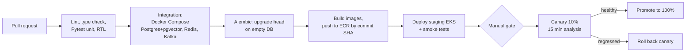

# Reliability & Observability

*Intelligent Commerce Automation Platform*

## Table of Contents

- [Read/Write Optimizations](#readwrite-optimizations)
- [Caching Strategy](#caching-strategy)
- [Telemetry](#telemetry)
- [Automation](#automation)

## Read/Write Optimizations

Each index below exists for a named query. An index nobody can name a query for is not built, because every extra index costs write throughput on the import merge.

| Table (`03-data-modeling.md`) | Index | Serves |
|---|---|---|
| `catalog.variants` | Unique (`tenant_id`, `sku`) `INCLUDE (product_id, price_amount, currency)` | `GET /v1/catalog/variants/{sku}` and `variants:batchGet` as index-only scans |
| `catalog.products` | Primary key (`tenant_id`, `product_id`); unique (`tenant_id`, `parent_sku`) | Second hop of the variant card (`title`, `status`); merge upsert target |
| `catalog.products` | (`tenant_id`, `category_id`) `WHERE status = 'active'` (partial) | Console category lists; `channel-connector` listing sync |
| `catalog.products` | (`tenant_id`, `updated_at`, `product_id`) | Cursor pagination of `GET /v1/catalog/products` |
| `catalog.categories` | (`tenant_id`, `path text_pattern_ops`) | Subtree queries (`path LIKE 'apparel/%'`) |
| `catalog.import_batches` | (`tenant_id`, `created_at DESC`) | Import history in the console |
| `inventory.stock_levels` | Primary key (`tenant_id`, `sku`, `location_id`) | `GET /v1/inventory/{sku}`; the tool `check_availability` |
| `inventory.stock_adjustments` | (`tenant_id`, `sku`, `created_at DESC`), per monthly partition | Adjustment history; the agent audit view |
| `orders.orders` | (`tenant_id`, `placed_at DESC`) per partition; (`tenant_id`, `shopper_ref`) `WHERE shopper_ref IS NOT NULL` | Recent orders; erasure requests |
| `pricing.market_signals` | Primary key (`tenant_id`, `sku`, `observed_at`, `signal_type`) | Signal windows in `load_context` |
| `pricing.price_decisions` | (`tenant_id`, `created_at`) `WHERE status = 'pending_approval'`; (`tenant_id`, `sku`, `created_at DESC`) | Approval queue; the max-daily-change guardrail |
| `reco.product_affinities` | (`tenant_id`, `product_id`, `score DESC`) | Top related products |
| every `outbox` | (`created_at`) `WHERE published_at IS NULL` | The relay poll stays small however large the table grows |
| `search.product_documents` | [HNSW](https://arxiv.org/abs/1603.09320 "Hierarchical Navigable Small World — Graph index for approximate nearest-neighbour search over vectors") (`embedding halfvec_cosine_ops`, `m = 16`, `ef_construction = 64`) per partition; [GIN](https://www.postgresql.org/docs/current/gin.html "Generalized Inverted Index — PostgreSQL index type suited to values containing multiple keys, such as arrays or text search") (`tsv`); (`tenant_id`, `category_path text_pattern_ops`) | Vector k-NN; keyword match; category filter |

**[TTL](https://en.wikipedia.org/wiki/Time_to_live "Time To Live — Duration after which a cached or stored value expires") indexes.** Expiry is handled outside [PostgreSQL](https://www.postgresql.org/docs/current/ "PostgreSQL — Relational database storing and querying structured data with strong transactional guarantees"): [DynamoDB](https://aws.amazon.com/dynamodb/ "Amazon DynamoDB — Managed key-value and document database with single-digit-millisecond reads and writes") TTL on all three tables and [Redis](https://redis.io/docs/latest/ "Redis — In-memory data store used as a cache and fast key-value store") TTL on every key. PostgreSQL retention is done by dropping partitions (`03-data-modeling.md`), never by a `DELETE` job.

**Write path**

- **Import merge:** `INSERT … ON CONFLICT (tenant_id, parent_sku) DO UPDATE … WHERE products.content_hash <> EXCLUDED.content_hash`, in batches of 5,000 rows from `staging.product_import_rows`. The `WHERE` clause turns an unchanged row into no write at all: no new tuple and no [WAL](https://www.postgresql.org/docs/current/wal-intro.html "Write Ahead Log — Sequential log written before data pages so committed transactions survive a crash").
- **Stock updates are [HOT](https://www.postgresql.org/docs/current/storage-hot.html "Heap Only Tuple — PostgreSQL update path that keeps the new row version on the same page and touches no index") updates.** `stock_levels` has `fillfactor = 80`, and no index covers `on_hand` or `reserved`. An update therefore stays on the same page and touches no index. It is the table's most frequent write.
- **Price updates are not HOT, on purpose.** `price_amount` is in the variant covering index's `INCLUDE` list, so each price change writes a new index entry. This is accepted: price changes run at ~20k per day, while lookups that the covering index turns into index-only scans run at thousands per second.
- **Autovacuum** on `stock_levels` and `variants`: `autovacuum_vacuum_scale_factor = 0.02` so dead tuples never reach millions before a pass. The visibility map must stay current, or index-only scans fall back to heap fetches.
- **Connection budget:** each pod's [SQLAlchemy](https://www.sqlalchemy.org/ "SQLAlchemy — Python SQL toolkit and ORM that maps objects to relational tables and builds queries") pool is `pool_size = 5`, `max_overflow = 5`. At peak replica counts the total is ~450 connections against `max_connections = 1,000`, so a scale-out cannot exhaust the primary.

**Catalog lookup budget (p95 < 50 ms at the service)**

| Step | Redis hit | Redis miss |
|---|---|---|
| Ingress → pod, auth middleware ([JWT](https://datatracker.ietf.org/doc/html/rfc7519 "JSON Web Token — Compact, signed token format for carrying claims between parties") verified from cached [JWKS](https://datatracker.ietf.org/doc/html/rfc7517 "JSON Web Key Set — Publishes the public keys a party needs to verify a signed token")) | 3 ms | 3 ms |
| `cap-redis` `GET cat:` | 1 ms | 1 ms (miss) |
| `core-db` covering-index scan + product primary-key lookup | none | 4–8 ms |
| Serialisation, response | 3 ms | 3 ms |
| **Typical** | **~7 ms** | **~15 ms** |

The margin between ~15 ms and 50 ms absorbs pool waits, event-loop stalls and replica fallbacks. [API](https://en.wikipedia.org/wiki/API "Application Programming Interface — Defines the contract by which software components exchange requests and data") Gateway adds ~10–15 ms, so the edge target is p95 < 80 ms.

## Caching Strategy

| Layer | What | Pattern and invalidation |
|---|---|---|
| CloudFront | `merchant-console` and `storefront-widget` bundles | Content-hashed file names cached for 1 year; `index.html` and `widget-loader.js` `no-cache`; the deploy invalidates only those two |
| In-process (per pod) | Tenant config, `pricing_rules`, Cognito JWKS | [LRU](https://en.wikipedia.org/wiki/Cache_replacement_policies "Least Recently Used — Cache eviction policy that discards the entry untouched for longest") with 30 s TTL; a staleness window of 30 s is accepted |
| `cap-redis` | Keys below | Mostly cache-aside |
| DynamoDB | `llm-response-cache` | Second tier behind Redis `llm:` |

**Redis keys**

| Key | Value | TTL | Invalidation |
|---|---|---|---|
| `cat:v1:{tenant_id}:{sku}` | Variant card | 600 s ± 10% jitter | Cache-aside. `catalog-service` deletes the key after commit; its `cache-invalidator` consumer on `catalog.product-events` deletes it again, catching changes from other writers |
| `qemb:{embedding_model}:{sha256(query)}` | Query embedding | 24 h | None needed: the model name is in the key |
| `llm:{cache_key}` | Generated text | 24 h | Write-through: written with the DynamoDB item; the prompt version is in the key |
| `sess:{tenant_id}:{shopper_ref}` | Last 20 product ids | 1 h sliding | Overwritten by the `shopper.interactions` consumer |
| `reco:{tenant_id}:{shopper_ref}:{context}` | Recommendation list | 5 min | Expiry only |
| `sig:{tenant_id}:{sku}` | Signal sorted set | 48 h | Trimmed by score on each write |
| `pricing:inflight:{tenant_id}:{sku}` | Run id | 15 min | Deleted when the run ends |
| `dash:{tenant_id}:{endpoint}:{sha256(params)}` | Dashboard response | 60 s | Expiry only; rollups refresh each minute |
| `ratelimit:{provider}:{model}`, `budget:{tenant_id}:{yyyymmdd}` | Token bucket; daily token counter | 1 s window; 48 h | Not a cache |
| `lock:{key}` | Single-flight lock | 2 s | Released after the fill |

**Why cache-aside and delete, not write-through, for `cat:`.** A write-through cache that fails after the database commits leaves a stale value until the TTL expires. Deleting the key twice (once inline, once from the event) bounds that staleness to the event lag. A miss is filled under `lock:` with `SET NX PX 2000`, so a hot [SKU](https://en.wikipedia.org/wiki/Stock_keeping_unit "Stock Keeping Unit — Identifies one sellable variant of a product for inventory and pricing") that expires during a flash sale causes one database read, not hundreds. **Inventory is not cached for correctness.** `in_stock` in search results comes from `search.product_documents`, which `search-indexer` updates from `inventory.events` within seconds. The authoritative check is the channel's own checkout.

## Telemetry

**SLIs and SLOs** (30-day windows; alerts on multi-window burn rate, 2% budget in 1 h and 5% in 6 h)

| [SLI](https://sre.google/sre-book/service-level-objectives/ "Service Level Indicator — Measured metric, such as latency or error rate, used to judge service health") | [SLO](https://sre.google/sre-book/service-level-objectives/ "Service Level Objective — Target value for a service level indicator that a service commits to meet") |
|---|---|
| Catalog lookup success rate, and p95 latency at ingress | 99.9%; p95 < 50 ms |
| Search retrieval average latency, and p95 | ~110 ms; p95 < 200 ms |
| Chat first-token p95; turn success rate | < 1.5 s; 99.5% |
| Price decision lag (signal → `applied_at`) | p95 < 5 min |
| Import completion (1M rows) | 95% within 2 h |
| [Kafka](https://kafka.apache.org/documentation/ "Apache Kafka — Distributed log that stores partitioned, replicated streams of records for publish-subscribe and stream processing") consumer lag per group | < 30 s at p95 |
| Oldest unpublished `outbox` row | < 60 s |

**Metrics (Prometheus, Grafana).** Services expose request rate, error rate and duration per route. [Celery](https://docs.celeryq.dev/en/stable/ "Celery — Distributed task queue that runs background and scheduled jobs outside the request cycle") and Kafka consumers expose queue depth, task duration and lag; [MSK](https://aws.amazon.com/msk/ "Amazon Managed Streaming for Apache Kafka — Runs Apache Kafka clusters as a managed AWS service") open monitoring exposes broker metrics. The **agent chain metrics** come from a LangChain callback handler in the chassis:

- `agent_node_duration_seconds{graph, node}` (histogram)
- `llm_request_duration_seconds{provider, model, cache}` and `llm_tokens_total{provider, model, direction}`
- `tool_call_duration_seconds{tool, outcome}`
- `agent_run_cost_usd_total{graph, tenant_tier}`

`tenant_id` is kept out of Prometheus labels because of cardinality; per-tenant detail lives in logs and in `pricing.agent_runs`. A Grafana panel shows p95 by node over time, so the node that holds a bottleneck is visible at a glance. Serial tool calls in `load_context`, for example, show up as one long node. The fix is a parallel LangGraph fan-out, whose effect the same panel then confirms. [AWS](https://aws.amazon.com/ "Amazon Web Services — Cloud provider whose managed compute, storage and messaging services host a system")-managed services ([RDS](https://aws.amazon.com/rds/ "Amazon Relational Database Service — Managed hosting for relational databases such as PostgreSQL, with backups and failover") Performance Insights, Glue, Lambda, [SQS](https://aws.amazon.com/sqs/ "Amazon Simple Queue Service — Managed message queue that decouples producers from consumers"), DynamoDB) report to CloudWatch, which Grafana reads as a second data source. That keeps one set of dashboards.

**Structured logging.** [JSON](https://www.json.org/json-en.html "JavaScript Object Notation — Lightweight text format for structured data exchange") to stdout, shipped by Fluent Bit to CloudWatch Logs. Every line has `ts`, `level`, `service`, `tenant_id`, `request_id`, `trace_id`, and for agents also `run_id` and `node`. Prompts and completions are not logged by default. A 1% sample, passed through a [PII](https://csrc.nist.gov/glossary/term/personally_identifiable_information "Personally Identifiable Information — Data that can identify a person and must be minimised and protected") redactor, is logged for evaluation. Retention is 30 days in CloudWatch, then 1 year in [S3](https://aws.amazon.com/s3/ "Amazon Simple Storage Service — Durable object storage for files, datasets and archives").

**Distributed tracing.** The OpenTelemetry [SDK](https://en.wikipedia.org/wiki/Software_development_kit "Software Development Kit — Packaged set of tools and libraries for building against a platform") auto-instruments [FastAPI](https://fastapi.tiangolo.com/ "FastAPI — Python web framework for building HTTP APIs with async support and automatic schema generation"), SQLAlchemy, Redis and [HTTP](https://datatracker.ietf.org/doc/html/rfc9110 "Hypertext Transfer Protocol — Application protocol used to request and transfer web resources") clients. Trace context travels in Kafka record headers and Celery task headers, so one trace follows an import from the upload request to the enrichment task. LangChain callbacks open one span per graph node, tool call and [LLM](https://en.wikipedia.org/wiki/Large_language_model "Large Language Model — Neural network trained on text that generates and interprets natural language") request. The AWS Distro for OpenTelemetry collector exports to X-Ray: head sampling at 10%, plus all traces with errors or > 2 s duration.

## Automation

- **Bitbucket Pipelines** authenticates to AWS through [OIDC](https://openid.net/developers/how-connect-works/ "OpenID Connect — Identity layer on top of OAuth 2.0 for authenticating users") to a deploy [IAM](https://aws.amazon.com/iam/ "AWS Identity and Access Management — Controls which principals may perform which actions on which AWS resources") role, with no stored keys (`06-security.md`). Images are tagged by commit [SHA](https://csrc.nist.gov/pubs/fips/180-4/upd1/final "Secure Hash Algorithm — Family of cryptographic hash functions used to verify content integrity"), never `latest`. [ECR](https://aws.amazon.com/ecr/ "Amazon Elastic Container Registry — Stores, scans and serves container images for deployment") scans on push, and a critical [CVE](https://www.cve.org/ "Common Vulnerabilities and Exposures — Public identifier for a known software security flaw") fails the build.
- **Tests.** Pytest unit tests treat LLM calls as recorded fixtures. Guardrail and candidate arithmetic have exhaustive table tests, because they are the part of pricing that must be deterministic. The tool [Pydantic](https://docs.pydantic.dev/latest/ "Pydantic — Python library that validates and parses data against typed models at runtime") schemas have negative tests: a cross-tenant `sku`, and a `delta` out of range. React Testing Library covers the onboarding wizard (step validation, resume after reload) and dashboard filters. [D3](https://d3js.org/ "D3.js — JavaScript library that binds data to SVG and HTML for custom visualisations") rendering is tested at the level of the data it is given, not pixels.
- **Migrations** use expand and contract. A pre-deploy [Kubernetes](https://kubernetes.io/ "Kubernetes — Automates deployment, scaling and management of containerized applications") Job runs `alembic upgrade head`, and a migration must be compatible with the previous release so a rollback never needs a downgrade.
- **Canary.** A `-canary` Deployment with 10% of the replicas shares the Service with stable. A Bash step queries Prometheus for 15 minutes. It promotes if the canary's 5xx rate is within 0.5 points of stable and its p95 within 1.2× of stable; otherwise it scales the canary to zero. The split is by replica count, not exact traffic weight, and that precision is enough at 10+ replicas. Agent and prompt changes follow the same path, and `prompt_version` in cache keys keeps canary output apart from stable.
- **Frontend and data jobs.** The [SPA](https://en.wikipedia.org/wiki/Single-page_application "Single Page Application — Web application that updates its content in place without full page reloads") and widget are deployed to S3 `cap-web-assets` plus a CloudFront invalidation. Glue scripts and Lambda packages are deployed by the same pipeline, versioned by commit SHA.
