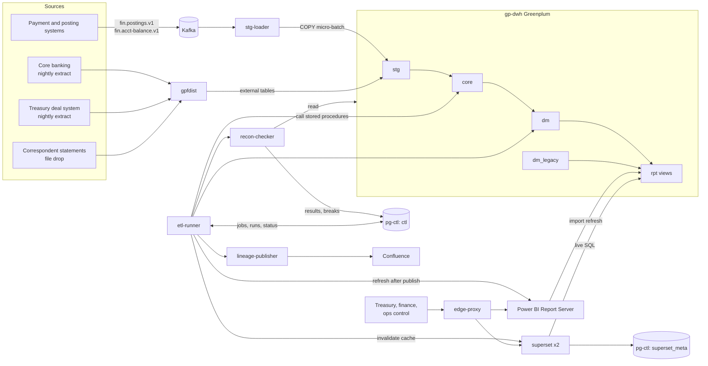

# High-Level Design

**Project:** Банковская платформа управления ликвидностью и финансовой аналитики (bank liquidity management and financial analytics platform)

## Table of Contents

- [Components and Naming](#components-and-naming)
- [Architecture Diagram](#architecture-diagram)
- [API Design](#api-design)
- [Technology Mapping](#technology-mapping)
- [Stack Gaps](#stack-gaps)

## Components and Naming

Every later file uses these names.

| Name | Kind | Role |
|---|---|---|
| `stg-loader` | Python daemon | Consumes [Kafka](https://kafka.apache.org/documentation/ "Apache Kafka — Distributed log that stores partitioned, replicated streams of records for publish-subscribe and stream processing") topics, validates the message schema, writes 60-second micro-batches into `stg` with their offsets in one transaction |
| `etl-runner` | Python daemon | Scheduler and executor: resolves job dependencies from `ctl`, runs extract, transform, reconcile, publish and refresh tasks, retries, records every run |
| `recon-checker` | Python package, run by `etl-runner` under its own role | Executes reconciliation rules against Greenplum and writes `PASS` / `FAIL` / `CANNOT_RUN` results and breaks to `ctl` |
| `lineage-publisher` | Python task, run by `etl-runner` | Derives object dependencies from the Greenplum catalog, renders lineage pages, publishes them to Confluence |
| `gp-dwh` | Greenplum cluster (coordinator, standby coordinator, mirrored segments) | Schemas `stg` (landing), `core` (conformed history), `dm` (marts), `dm_legacy` (marts being retired), `rpt` (report views) |
| `pg-ctl` | [PostgreSQL](https://www.postgresql.org/docs/current/ "PostgreSQL — Relational database storing and querying structured data with strong transactional guarantees") primary + streaming replica | Database `ctl` (control plane: jobs, runs, reconciliation, registries, adjustments, entitlements) and database `superset_meta` (Superset metadata and cache) |
| `gpfdist` | Greenplum file server | Serves source files to Greenplum external tables for parallel loading |
| Kafka topics | `fin.postings.v1`, `fin.acct-balance.v1` | Intraday events owned by the source systems; consumer group `stg-loader` |
| `superset` | Apache Superset, two instances | Operational control and intraday dashboards, [SQL](https://en.wikipedia.org/wiki/SQL "Structured Query Language — Queries and manipulates data in a relational database") Lab for analysts |
| Power [BI](https://en.wikipedia.org/wiki/Business_intelligence "Business Intelligence — Tools and practices that turn stored business data into reports and dashboards for decisions") Report Server | Single on-premise server | Treasury and finance reports on import models |
| `edge-proxy` | The bank's existing reverse proxy / load balancer | [TLS](https://datatracker.ietf.org/doc/html/rfc8446 "Transport Layer Security — Encrypts and authenticates data sent over a network connection") termination and routing for the two BI front ends |

**Layer rule — thin BI.** Every [KPI](https://en.wikipedia.org/wiki/Performance_indicator "Key Performance Indicator — Measurable value that tracks how well an operation meets its targets") and every figure a report shows is computed in SQL in `dm` and exposed through `rpt`. Power BI and Superset only filter, aggregate and format. With two BI tools this is the only way to keep one owner per KPI definition; its cost is that a new measure needs a mart change and a deployment rather than an edit inside a Power BI model.

## Architecture Diagram

**Flow, client to store.** A user's browser reaches `edge-proxy`, which terminates TLS and routes to one of two `superset` instances or to Power BI Report Server. Superset sends live SQL to the `rpt` views in `gp-dwh`, caching results in `superset_meta`; Power BI answers from its in-memory import model, which `etl-runner` refreshes after each publish. No user query ever reads `stg` or `core` through a BI tool.

**Flow, source to mart.** Nightly extracts land in `stg` through `gpfdist` external tables; intraday events land through `stg-loader`. `etl-runner` calls stored procedures that load `core` and build `dm` for one business date, runs `recon-checker`, and on a clean result publishes the date — first in `ctl.business_date_status`, then in `dm.published_date`, which the `rpt` views filter on.

## API Design

The platform has no custom [REST](https://en.wikipedia.org/wiki/REST "Representational State Transfer — Architectural style for stateless, resource-oriented HTTP APIs") service. Its consumers are BI tools and analysts that speak SQL, so a REST layer would be a second copy of the `rpt` contract. The interfaces are four contracts.

**1. Ingest contract — Kafka topics** (owned by producers; the platform validates)

| Topic | Key | Payload fields | Notes |
|---|---|---|---|
| `fin.postings.v1` | `account_id` | `schema_version`, `source_posting_id`, `account_id`, `business_date`, `value_date`, `amount`, `currency_code`, `direction`, `gl_account`, `event_ts` | Key by account keeps one account's postings ordered within a partition |
| `fin.acct-balance.v1` | `account_id` | `schema_version`, `account_id`, `balance_ts`, `balance`, `currency_code` | Source-side balance snapshots, used to cross-check the intraday position |

An unknown `schema_version` or a failed field check sends the message to `stg.kafka_rejected` instead of `stg`, and raises an alert. That is the first trigger of a source change impact analysis.

**2. Processing contract — Greenplum stored procedures** (called by `etl-runner`)

| Signature | Returns | Behaviour |
|---|---|---|
| `core.load_posting(p_batch_id bigint)` | `bigint` rows loaded | Deletes then inserts the batch's rows in one transaction; safe to rerun |
| `core.load_account_balance(p_batch_id bigint)` | `bigint` | Same pattern for balances |
| `dm.build_<mart>(p_business_date date)` | `bigint` | Rebuilds one business date of one mart; one per mart, e.g. `dm.build_cash_position_eod`, `dm.build_liquidity_gap` |
| `dm.build_cash_position_intraday(p_business_date date)` | `bigint` | Full recompute of today's intraday position every 5 minutes |

**3. Consumption contract — `rpt` views** (read by BI tools and analysts)

| View | Filter columns | Returns |
|---|---|---|
| `rpt.v_treasury_liquidity_pack` | `business_date`, `legal_entity_id`, `currency_code` | Positions, gap buckets, buffer, cumulative gap |
| `rpt.v_cash_position_intraday` | `legal_entity_id`, `currency_code` | `as_of_ts`, opening balance, intraday net flow, current position |
| `rpt.v_cash_flow_actual_vs_forecast` | `business_date`, `legal_entity_id` | Category, actual, forecast, variance |
| `rpt.v_fin_kpi` | `business_date`, `kpi_code`, `legal_entity_id` | Value, numerator, denominator |

One view per report, 25+ in total, recorded in `ctl.report_catalog`. A report never references a table; the view is the seam that lets a migration repoint it from `dm_legacy` to `dm` without touching the report.

**4. [HTTP](https://datatracker.ietf.org/doc/html/rfc9110 "Hypertext Transfer Protocol — Application protocol used to request and transfer web resources") endpoints the platform calls** (all existing product APIs)

| Caller | Endpoint | Purpose |
|---|---|---|
| `etl-runner` | Power BI Report Server `POST /reports/api/v2.0/CacheRefreshPlans({id})/Model.Execute` | Refresh an import model after a date is published |
| `etl-runner` | Superset `POST /api/v1/cachekey/invalidate` | Drop cached results for datasets on a published date |
| `etl-runner` | Superset `/api/v1/rowlevelsecurity/` | Sync row-level filters from `ctl.entitlement` |
| `lineage-publisher` | Confluence `PUT /rest/api/content/{id}` | Update a lineage page |

> **Verify Before Build:** each endpoint above exists in current releases — `CacheRefreshPlans` in the Power BI Report Server REST [API](https://en.wikipedia.org/wiki/API "Application Programming Interface — Defines the contract by which software components exchange requests and data") v2.0, the cache-invalidation and row-level-security APIs in Superset 3.x or later. Check against the installed versions; on an older Superset, row-level filters are maintained by hand and the sync task is dropped.

## Technology Mapping

| Technology | Role | Alternative not chosen, and why |
|---|---|---|
| Python | `stg-loader`, `etl-runner`, `recon-checker`, `lineage-publisher`, migration runner, ad-hoc analysis | Java/Scala consumers — no gain at ~150 msg/s, and the team's checks are already Python |
| SQL | All calculation logic in stored procedures and views; CTEs and window functions for balances over time, cumulative gaps and latest-state lookups | Logic in Power BI measures — two BI tools would need two copies |
| Greenplum | `gp-dwh`: [MPP](https://en.wikipedia.org/wiki/Massively_parallel "Massively Parallel Processing — Splits one query across many nodes that each process their own slice of the data at the same time") storage of history, parallel mart builds and report queries | ClickHouse — faster single-table aggregates, but weak multi-way joins and no stored procedure model, and the [DWH](https://en.wikipedia.org/wiki/Data_warehouse "Data Warehouse — Central store that integrates historical data from many sources for reporting and analysis") already runs on Greenplum |
| PostgreSQL | `pg-ctl`: transactional control plane with constraints and triggers; Superset metadata | Keeping control tables in Greenplum — its trigger and unique-constraint support is limited, and small frequent updates suit it poorly |
| Kafka | Intraday event transport from source systems | Polling source databases every minute — load on core banking, and no ordering per account |
| Power BI (Report Server) | Treasury and finance reports: pixel-stable packs, Excel-friendly, import models for sub-second visuals | Power BI Service — cloud, excluded by the on-premise constraint |
| Apache Superset | Operational control, intraday monitoring, SQL Lab | Only Power BI — Report Server has no live-refresh dashboard suited to 5-minute data and no SQL workbench |
| on-premise | All components on bank hardware or its private virtualisation | Cloud — excluded by the brief |
| GitLab | Source of SQL, Python, report definitions and adjustments; [CI](https://en.wikipedia.org/wiki/Continuous_integration "Continuous Integration — Automatically builds and tests code on every change")/[CD](https://en.wikipedia.org/wiki/Continuous_deployment "Continuous Deployment — Automatically releases every build that passes the pipeline's gates to production without a manual step") pipelines; merge-request approval as the four-eyes control | — |
| Jira | Change tickets, discrepancy tickets linked from `ctl.recon_break` and `ctl.source_change` | — |
| Confluence | Reader-facing lineage, KPI source and data-flow pages, generated from `ctl` | Hand-written pages — they drift from the SQL they describe |
| Codex, Claude Code | Developer tools for SQL analysis and documentation drafts, output reviewed by hand | No architectural implication |

Two BI tools cost two security models and two deployment paths; the split is kept because each covers a need the other does not, and the thin-BI rule keeps the KPI logic single.

## Stack Gaps

The brief lists no tool for these needs. Each is filled in the simplest way the listed stack allows.

| Gap | Choice | Evolution trigger |
|---|---|---|
| Orchestrator | `etl-runner`: a thin Python scheduler over `ctl.job`, `ctl.job_dependency` and `ctl.job_run`, started by a systemd timer | Adopt Airflow, or the bank's enterprise scheduler, when jobs exceed ~200 or other teams need to depend on these jobs |
| Metrics and alerting | Data-level telemetry in `ctl` views shown in Superset; alert e-mail from `etl-runner`; host metrics from the bank's existing monitoring | A dedicated metrics stack when service count or on-call rota grows |
| Secret store | Kerberos keytabs and `0600` credential files per service user; GitLab protected variables for deploy credentials | The bank's vault, if one exists — preferred from day one |
| Schema registry | `schema_version` field validated by `stg-loader` against schemas in the GitLab repository | A registry when producers exceed a handful of topics |
| Load balancer | `edge-proxy`, the bank's existing one | — |

> **Deep Dive Reference:** a hand-built scheduler — dependency resolution, stale-run recovery and backfill are where home-grown orchestrators fail. Prototype the stale-run and backfill paths before committing to it rather than Airflow.
