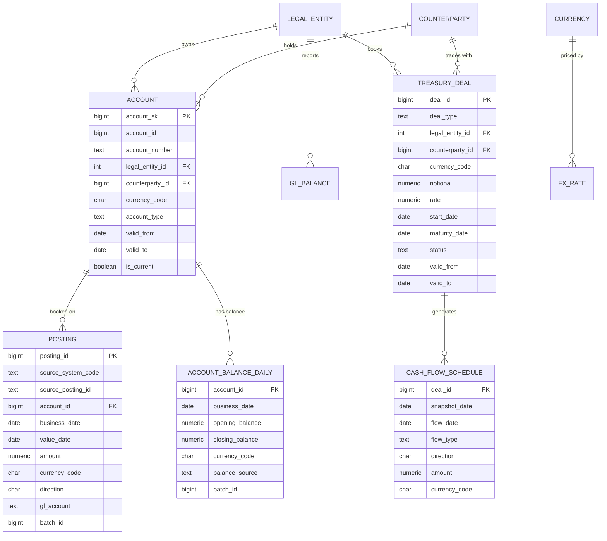
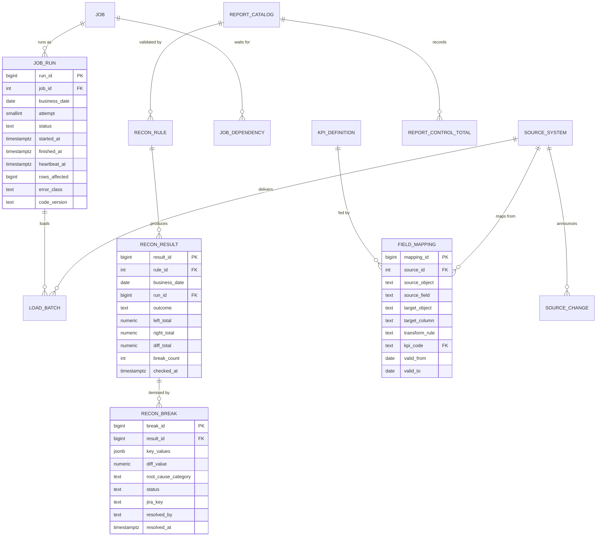

# Data Modeling & Storage

**Project:** Банковская платформа управления ликвидностью и финансовой аналитики (bank liquidity management and financial analytics platform)

## Table of Contents

- [Modeling Principles](#modeling-principles)
- [Schema Design: Greenplum](#schema-design-greenplum)
- [Schema Design: Control Plane](#schema-design-control-plane)
- [Storage Choice and Distribution](#storage-choice-and-distribution)
- [Partitioning and Retention](#partitioning-and-retention)

## Modeling Principles

- **Layers own one job each.** `stg` holds data as delivered, per load batch; `core` holds conformed, deduplicated history keyed by business identifiers; `dm` holds calculated, aggregated marts per business date; `rpt` holds views only — one per report, no storage.
- **Every row carries its origin.** `core` rows carry `batch_id` (→ `ctl.load_batch`); `dm` rows carry `build_run_id` (→ `ctl.job_run`). Any figure on a report can be traced back to the run and the source batch that produced it.
- **Money is exact.** Amounts are `NUMERIC(20,2)`, [FX](https://en.wikipedia.org/wiki/Foreign_exchange_market "Foreign Exchange — Conversion between currencies and the rates used to value amounts in another currency") rates `NUMERIC(18,8)`, control sums `NUMERIC(24,2)`. Floating point is forbidden: a reconciliation that compares floats reports breaks that are rounding noise.
- **No keys cross databases.** `gp-dwh` and `pg-ctl` are separate databases; identifiers such as `legal_entity_id` or `run_id` appear in both, but no foreign key spans them. `etl-runner` is the only component that writes to both, and every such pair of writes is ordered and idempotent (see `04-deep-dive.md`).
- **Mapping is data.** Source-to-target field mapping and [KPI](https://en.wikipedia.org/wiki/Performance_indicator "Key Performance Indicator — Measurable value that tracks how well an operation meets its targets") definitions live in `ctl.field_mapping` and `ctl.kpi_definition`, not in wiki prose, so impact analysis and lineage are queries.

## Schema Design: Greenplum

**`core` entities not drawn above:** `core.legal_entity` (`legal_entity_id`, `code`, `name`, `base_currency`), `core.currency` (`currency_code`, `minor_units`), `core.calendar` (`calendar_date`, `country_code`, `is_business_day`), `core.fx_rate` (`rate_date`, `currency_code`, `base_currency`, `rate`), `core.counterparty` (`counterparty_id`, `counterparty_type`, `name`, `tax_id`, `country_code` — `name` and `tax_id` are personal data for individuals), `core.v_counterparty_masked` (the same columns with `name` and `tax_id` masked), `core.gl_balance` (`gl_account`, `legal_entity_id`, `currency_code`, `business_date`, `closing_balance`, `batch_id`) and `core.manual_adjustment` (`adjustment_id`, `business_date`, `target_mart`, `legal_entity_id`, `currency_code`, `measure_code`, `amount_delta`, `reason_code`, `synced_at`). `core.account` and `core.treasury_deal` are type-2 [SCD](https://en.wikipedia.org/wiki/Slowly_changing_dimension "Slowly Changing Dimension — Warehouse dimension design that records how attribute values change over time; type 2 keeps each version with validity dates"): a change closes the current row's `valid_to` and inserts a new version.

**`stg` tables.** [Kafka](https://kafka.apache.org/documentation/ "Apache Kafka — Distributed log that stores partitioned, replicated streams of records for publish-subscribe and stream processing") landing: `stg.kafka_postings` and `stg.kafka_acct_balance` hold the typed payload fields from the topic contract in `02-high-level-design.md` plus `stg_batch_id`, `topic`, `partition_no`, `offset_no`, `payload` (`jsonb`) and `ingested_at`. `stg.kafka_offset` (`topic`, `partition_no`, `offset_no`, `stg_batch_id`, `updated_at`) holds the next offset to read and is written in the same transaction as the micro-batch. `stg.kafka_rejected` (`topic`, `partition_no`, `offset_no`, `payload`, `reject_reason`, `ingested_at`) holds messages that failed validation. Batch landing tables follow `stg.src_<system>_<object>` (e.g. `stg.src_cbs_posting`, `stg.src_tms_deal`, `stg.src_stmt_balance`) with the source's columns plus `batch_id`, `business_date` and `loaded_at`. They are filled from Greenplum external tables named `stg.ext_<system>_<object>`, which read the files `gpfdist` serves.

**`dm` marts** (representative 8 of 20+; the rest are regroupings — per desk, per product, monthly roll-ups — built the same way):

| Mart | Grain | Key measures |
|---|---|---|
| `dm.account_position_eod` | `business_date` × `account_id` | `closing_balance`, `closing_balance_base`, plus `legal_entity_id`, `currency_code`, `account_type` |
| `dm.cash_position_eod` | `business_date` × `legal_entity_id` × `currency_code` × `account_type` | `position_amount`, `position_amount_base`, `account_count` |
| `dm.cash_position_intraday` | `business_date` × `as_of_ts` × `legal_entity_id` × `currency_code` × `account_type` | `opening_balance`, `intraday_net_flow`, `current_position` |
| `dm.liquidity_gap` | `business_date` × `legal_entity_id` × `currency_code` × `time_bucket` | `bucket_order`, `inflow`, `outflow`, `net_gap`, `cumulative_gap` |
| `dm.liquidity_buffer` | `business_date` × `legal_entity_id` × `currency_code` × `asset_class` | `gross_amount`, `haircut_pct`, `buffer_amount` |
| `dm.cash_flow_actual` | `business_date` × `legal_entity_id` × `currency_code` × `flow_category` | `amount`, `amount_base` |
| `dm.cash_flow_forecast` | `business_date` × `flow_date` × `legal_entity_id` × `currency_code` × `flow_category` | `amount`, `amount_base` |
| `dm.fin_kpi_daily` | `business_date` × `legal_entity_id` × `kpi_code` | `value`, `numerator`, `denominator` |

Every mart also has `build_run_id`. `dm.published_date` (`business_date`, `published_at`, `publish_run_id`) lists the dates reports may show. `dm_legacy` holds the legacy marts as found; new code only reads it, for parallel-run comparison.

## Schema Design: Control Plane

| Table | Key columns not drawn above | Purpose |
|---|---|---|
| `ctl.source_system` | `source_id`, `source_code`, `delivery_mode` (`KAFKA`, `FILE`, `EXTRACT`), `owner_team` | Source registry |
| `ctl.load_batch` | `batch_id`, `source_id`, `business_date`, `source_object`, `status`, `source_row_count`, `source_control_sum`, `loaded_row_count`, `loaded_control_sum`, `run_id` | One row per delivered batch; the source-side counts come from the delivery manifest |
| `ctl.job` / `ctl.job_dependency` | `job_id`, `job_code`, `job_type`, `target_object`, `schedule`, `deadline_time`, `max_attempts`, `is_critical_path`, `is_active`; (`job_id`, `depends_on_job_id`) | The job graph `etl-runner` executes |
| `ctl.business_date_status` | `business_date`, `status` (`OPEN`, `LOADED`, `RECONCILED`, `PUBLISHED`, `REOPENED`), `loaded_at`, `reconciled_at`, `published_at`, `publish_run_id` | Publication gate |
| `ctl.recon_rule` | `rule_id`, `rule_code`, `level` (`SRC_STG`, `STG_CORE`, `CORE_DM`, `DM_RPT`, `LEGACY_NEW`, `INTRADAY_EOD`, `HISTORY`), `left_sql`, `right_sql`, `key_columns`, `measure_columns`, `tolerance_abs`, `severity` (`BLOCKING`, `WARNING`), `report_id`, `is_active` | Reconciliation rules as data |
| `ctl.report_catalog` | `report_id`, `report_code`, `bi_tool`, `rpt_view`, `legacy_object`, `target_object`, `migration_status` (`LEGACY`, `PARALLEL`, `VALIDATED`, `CUT_OVER`, `RETIRED`), `clean_days_count`, `month_end_covered`, `refresh_plan_id`, `owner_department`, `deadline_time` | Report inventory and migration state |
| `ctl.report_control_total` | `report_id`, `business_date`, `measure_code`, `value`, `code_version`, `computed_at` | Report-level control sums over time, for post-change comparison |
| `ctl.adjustment` | `adjustment_id`, `business_date`, `target_mart`, `legal_entity_id`, `currency_code`, `measure_code`, `amount_delta`, `reason_code`, `jira_key`, `git_commit_sha`, `prepared_by`, `approved_by`, `approved_at`, `synced_at`, `applied_run_id` | Approved manual corrections |
| `ctl.kpi_definition` | `kpi_code`, `kpi_name`, `unit`, `formula_description`, `owner_department`, `source_mart` | Business meaning of each KPI |
| `ctl.object_dependency` | `parent_object`, `child_object`, `dependency_type`, `derived_at` | Dependency graph derived from the Greenplum catalog |
| `ctl.source_change` | `change_id`, `source_id`, `changed_object`, `changed_fields`, `change_type`, `effective_date`, `jira_key`, `impact_assessed_at`, `impact_summary` | Announced source changes and their assessed impact |
| `ctl.entitlement` | `principal`, `legal_entity_id`, `granted_by`, `granted_at` | Which user sees which legal entity |
| `ctl.audit_log` | `audit_id`, `table_name`, `row_pk`, `operation`, `old_row`, `new_row`, `changed_by`, `changed_at` | Trigger-written change history |
| `ctl.schema_version` | `version`, `applied_at`, `git_commit_sha` | Applied migrations |

Read-only views over these tables feed the platform health dashboard: `ctl.v_run_health`, `ctl.v_freshness` and `ctl.v_recon_status`.

**Triggers live in [PostgreSQL](https://www.postgresql.org/docs/current/ "PostgreSQL — Relational database storing and querying structured data with strong transactional guarantees"), not Greenplum.** The "regulated operations" logic is enforced by `ctl` triggers: `trg_adjustment_four_eyes` rejects an adjustment whose `approved_by` equals `prepared_by` and freezes it once `synced_at` is set; `trg_business_date_transition` allows only `OPEN` → `LOADED` → `RECONCILED` → `PUBLISHED` (and `PUBLISHED` → `REOPENED` → `LOADED`), and refuses `PUBLISHED` while any `BLOCKING` rule's latest `recon_result` for that date is `FAIL` or `CANNOT_RUN`; `trg_report_migration_transition` refuses `CUT_OVER` unless `clean_days_count` ≥ 5 and `month_end_covered` is true; `trg_audit` writes `ctl.audit_log` for `field_mapping`, `recon_rule`, `entitlement`, `adjustment`, `report_catalog` and `kpi_definition`. Calculation logic lives in Greenplum stored procedures (the `core.load_*` and `dm.build_*` functions in `02-high-level-design.md`).

> **Verify Before Build:** trigger support in Greenplum is restricted — distributed tables and append-optimized tables limit what a trigger can do — which is why no business rule depends on a Greenplum trigger. Greenplum 6 also has functions but no `CREATE PROCEDURE` and no transaction control inside a function, so each `dm.build_*` call is one transaction and `etl-runner` sequences steps. Confirm both against the installed Greenplum major version.

## Storage Choice and Distribution

Greenplum spreads each table's rows across segments by a distribution key. The key decides whether a join runs locally on every segment or moves data across the interconnect, and whether a query for one day uses all segments or one.

| Table class | Storage | Distribution | Reason |
|---|---|---|---|
| Large facts: `core.posting`, `core.account_balance_daily`, `dm.account_position_eod` | Append-optimized columnar, zstd | `account_id` | High cardinality spreads rows evenly; facts and `core.account` join co-located with no motion |
| `core.account`, `core.counterparty` | Heap (SCD updates) | `account_id` / `counterparty_id` | Co-located with the facts that join to them |
| `core.gl_balance` | Append-optimized columnar | `gl_account`, `legal_entity_id` | Thousands of distinct keys; joins only to itself and reconciliation queries |
| `core.treasury_deal`, `core.cash_flow_schedule` | Heap / append-optimized columnar | `deal_id` | Deal and its flows join co-located |
| Small dimensions: `core.legal_entity`, `core.currency`, `core.calendar`, `core.fx_rate`, `dm.published_date` | Heap | `DISTRIBUTED REPLICATED` | A full copy per segment removes the broadcast motion on every join |
| Aggregated marts (`dm.cash_position_eod`, `dm.liquidity_gap`, etc.) | Heap | `DISTRIBUTED RANDOMLY` | A few million rows each, read by filter and aggregation rather than joined; their natural keys (entity, currency) have too few values to spread evenly |
| `stg` landing tables | Append-optimized row | `account_id` where present, else randomly | Loaded once, read once by the `core` load |

**Never distribute by `business_date`.** Every row of one date then lands on one segment, so a daily report runs on one segment while the others idle. The legacy marts are the likely place this mistake exists; `04-deep-dive.md` treats fixing it as one of the mechanisms behind the ~40% report-time reduction.

Sharding beyond Greenplum's own segments is not needed: the 5-year footprint in `01-requirements.md` is ~0.5 TB, a fraction of a typical [DWH](https://en.wikipedia.org/wiki/Data_warehouse "Data Warehouse — Central store that integrates historical data from many sources for reporting and analysis") cluster. `pg-ctl` stays single-primary; its largest table, `ctl.recon_result`, grows by ~40 rows per business date.

## Partitioning and Retention

| Table | Partitioning | Retention |
|---|---|---|
| `stg.kafka_postings`, `stg.kafka_acct_balance`, `stg.src_*` | Range on `business_date`, daily | Drop partitions older than 90 days |
| `core.posting`, `core.account_balance_daily`, `core.gl_balance`, `dm.account_position_eod` | Range on `business_date`, monthly | 5 years online; older partitions exported to archive files through a writable external table, then dropped |
| `core.cash_flow_schedule` | Range on `snapshot_date`, monthly | 5 years |
| Aggregated `dm` marts | None below ~10M rows | 5 years |
| `dm.cash_position_intraday` | None | Last 10 business days; older days are replaced by the end-of-day figure |

**Monthly, not daily, for 5-year tables.** An append-optimized columnar table keeps one file per partition, per column and per segment. With 48 segments and ~20 columns, daily partitions over five years would be ~1.75M files per table; monthly partitions are ~58K. A daily report still reads one monthly partition out of 60.

> **Verify Before Build:** partition elimination requires the date predicate to reach the planner as a constant or parameter; a predicate wrapped in a function or computed through a join may scan all partitions. Check `EXPLAIN` of each `rpt` view with a literal date and with the `dm.published_date` join, under the query optimizer the cluster runs by default.
