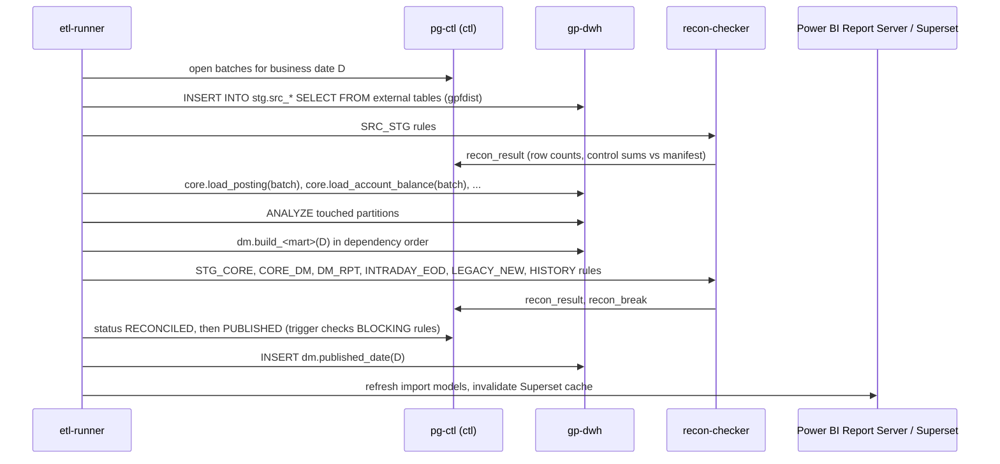
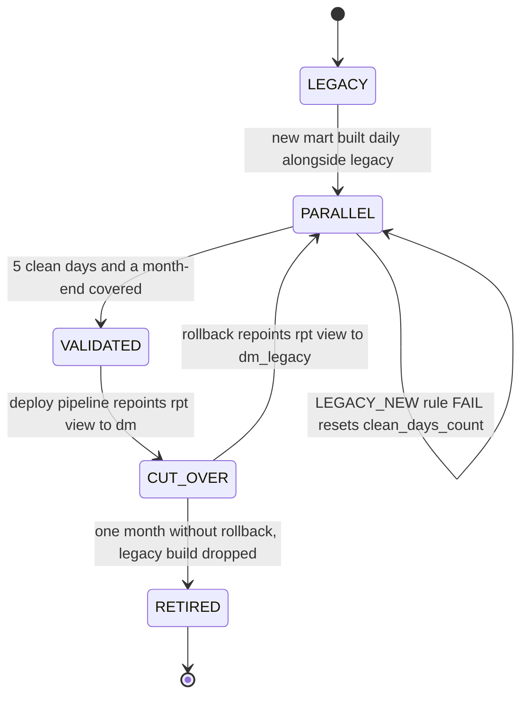

# Deep Dive & Bottlenecks

**Project:** Банковская платформа управления ликвидностью и финансовой аналитики (bank liquidity management and financial analytics platform)

## Table of Contents

- [Communication Patterns](#communication-patterns)
- [Daily Consolidation and Publication](#daily-consolidation-and-publication)
- [Intraday Path and Its Latency Budget](#intraday-path-and-its-latency-budget)
- [Bottleneck: Key Report Generation Time](#bottleneck-key-report-generation-time)
- [Report Migration Without a Missed Delivery](#report-migration-without-a-missed-delivery)
- [Source Change Impact Analysis](#source-change-impact-analysis)
- [Failure Modes](#failure-modes)
- [Run Success at 99.9%](#run-success-at-999)
- [Trade-offs](#trade-offs)

## Communication Patterns

| From → To | Pattern | Why |
|---|---|---|
| Payment and posting systems → `stg-loader` | Async, [Kafka](https://kafka.apache.org/documentation/ "Apache Kafka — Distributed log that stores partitioned, replicated streams of records for publish-subscribe and stream processing"), at-least-once delivery | Decouples source systems from [DWH](https://en.wikipedia.org/wiki/Data_warehouse "Data Warehouse — Central store that integrates historical data from many sources for reporting and analysis") availability; 7-day retention covers a weekend outage |
| `stg-loader` → `stg` | Micro-batch `COPY` every 60 s | Greenplum handles few large inserts well and many small ones badly |
| Nightly extracts → `stg` | Batch pull through `gpfdist` external tables | Parallel load into all segments at once |
| `etl-runner` → `gp-dwh` | Sync [SQL](https://en.wikipedia.org/wiki/SQL "Structured Query Language — Queries and manipulates data in a relational database") call per step, one transaction each | Each step's success is known before its dependants start |
| `etl-runner` → `pg-ctl` | Sync SQL | Job state, publication gate |
| `etl-runner` → Power [BI](https://en.wikipedia.org/wiki/Business_intelligence "Business Intelligence — Tools and practices that turn stored business data into reports and dashboards for decisions") Report Server, Superset | Sync [HTTP](https://datatracker.ietf.org/doc/html/rfc9110 "Hypertext Transfer Protocol — Application protocol used to request and transfer web resources") after publish | Refresh or invalidate only when new data exists |
| BI tools → `rpt` views | Sync SQL | Superset live queries with cache; Power BI import refresh |
| `lineage-publisher` → Confluence | Sync HTTP, nightly | Pages follow the deployed SQL |

**Effectively once into `stg`.** `stg-loader` writes a micro-batch and advances `stg.kafka_offset` in one Greenplum transaction; after a crash it seeks to the stored offsets, so a message is neither lost nor landed twice by the loader. Duplicates a producer sends under different offsets are removed on `source_posting_id` when the intraday build aggregates.

**Cross-database writes.** `etl-runner` writes to `pg-ctl` first where a `ctl` trigger must validate the step, then to `gp-dwh`; on restart it compares both sides and completes any half-done pair. Publishing sets `ctl.business_date_status` to `PUBLISHED` (the trigger checks reconciliation) and then inserts into `dm.published_date`. Adjustments are copied from `ctl.adjustment` into `core.manual_adjustment` keyed by `adjustment_id`, so a repeated copy overwrites rather than duplicates. The cost is a small repair routine instead of one atomic transaction; a distributed transaction across the two databases is not worth its operational weight here.

## Daily Consolidation and Publication

**Batch window.** Extracts arrive by 04:00; loads 04:00–04:45, `core` 04:45–05:30, marts 05:30–06:30, reconciliation 06:30–07:00, publish by 07:10, Power BI refresh by 07:45. The 20 minutes before the 07:30 publish target absorb one retry of any step up to ~15 minutes long; a failure in a longer step misses the target and pages on-call at 07:00.

**What the 500K+ consolidation actually costs.** At ~500K records the `core` load is minutes of Greenplum time. The hard part is not throughput but agreement: postings from the ledger extract, balances from core banking and from correspondent statements, and [GL](https://en.wikipedia.org/wiki/General_ledger "General Ledger — The accounting record of every account's balance, against which operational figures are reconciled") balances must reconcile to each other before a date is published. The `CORE_DM` rules compare the sum of account closing balances to `core.gl_balance` per GL account, entity and currency; an unexplained difference blocks the date.

## Intraday Path and Its Latency Budget

`dm.build_cash_position_intraday(D)` runs every 5 minutes, 07:00–20:00. It recomputes today's position from scratch — yesterday's `closing_balance` from `core.account_balance_daily` plus today's deduplicated `stg.kafka_postings` — and inserts it as a new `as_of_ts` snapshot. A full recompute over ≤ 400K rows takes seconds and needs no watermark, so a failed cycle is repaired by the next one.

| Stage | Worst case |
|---|---|
| Source system publishes the event (outside the platform) | 30 s |
| `stg-loader` micro-batch window | 60 s |
| `COPY` and commit | 10 s |
| Wait for the next 5-minute cycle | 300 s |
| Intraday build | 120 s |
| Superset cache [TTL](https://en.wikipedia.org/wiki/Time_to_live "Time To Live — Duration after which a cached or stored value expires") on intraday charts | 300 s |
| **Total** | **820 s ≈ 13.7 min** |

The worst case sits under the 15-minute p95 target in `01-requirements.md`; the typical case is about half. Intraday figures are indicative: the `INTRADAY_EOD` rule compares the day's Kafka postings with the ledger extract next morning, as a `WARNING`, to catch lost or late events.

## Bottleneck: Key Report Generation Time

The brief reports ~40% faster generation of key reports twice — once for Greenplum distribution, partitioning and query tuning, once for mart structure and SQL logic. These are one outcome with two groups of causes, not two savings; they must not be added. Without the before-and-after run history, the 40% cannot be split between them.

**What "key report" means here.** The critical path of the daily treasury liquidity pack: `dm.account_position_eod` → `dm.cash_position_eod` → `dm.liquidity_gap` → `rpt.v_treasury_liquidity_pack` → Power BI refresh. Its duration is measured from `ctl.job_run` (`finished_at` − `started_at` along `ctl.job_dependency`), as the median of 20 business days before and after, excluding month-ends. An illustrative 50 minutes → 30 minutes is the order of magnitude, not a figure from the brief.

**Physical design (Greenplum):**

- **Redistribution.** Legacy facts distributed by `business_date`, or randomly, are moved to `account_id`. A one-date query then runs on every segment instead of one, and the join to `core.account` needs no redistribute motion.
- **Monthly partitions on `business_date`.** A daily build reads one partition of 60.
- **Replicated small dimensions.** Currency, [FX](https://en.wikipedia.org/wiki/Foreign_exchange_market "Foreign Exchange — Conversion between currencies and the rates used to value amounts in another currency") rate, calendar and legal-entity joins stop broadcasting.
- **Columnar compression on wide facts.** A mart build reads ~6 of ~20 columns.
- **`ANALYZE` after each load.** Stale statistics make the optimizer choose broadcast or nested-loop plans for tables it believes are empty.

**Logical design (marts and SQL):**

- **Correlated "latest balance" subqueries → window functions.** `ROW_NUMBER() OVER (PARTITION BY account_id ORDER BY business_date DESC)` replaces a per-row lookup.
- **One pass instead of one scan per bucket.** A gap report that `UNION`s seven queries, one per time bucket, becomes one scan with a `CASE` bucket expression and `SUM(...) OVER (ORDER BY bucket_order)` for the cumulative gap.
- **An account-level mart under the aggregates.** `dm.account_position_eod` is built once; the entity- and currency-level marts aggregate it instead of re-reading postings.

> **Deep Dive Reference:** legacy SQL analysis — plans for the top 10 slowest steps should be captured with `EXPLAIN ANALYZE` before any rewrite, so the claimed saving is attributable per mechanism, and the rewritten output compared by the `HISTORY` reconciliation rule so faster also means unchanged.

## Report Migration Without a Missed Delivery

Each of the 25+ reports moves through this lifecycle on its own, tracked in `ctl.report_catalog`. The report's view name, schedule and refresh plan never change, so users and scheduled deliveries see no switch; only the view body does. The `LEGACY_NEW` rule compares every measure of the report between `dm_legacy` and `dm` for the same date. A difference that is an intended correction is accepted explicitly in `ctl.recon_break` with a reason, never by loosening the tolerance. The cost: legacy and new marts are both built during the parallel month — roughly double compute for the migrated slice.

## Source Change Impact Analysis

A change announced by a source team is recorded in `ctl.source_change` with its Jira key. A recursive [CTE](https://en.wikipedia.org/wiki/Hierarchical_and_recursive_queries_in_SQL "Common Table Expression — Named subquery declared with WITH and referenced within one statement") walks `ctl.field_mapping` (source field → target column) and then `ctl.object_dependency` (table → procedure → mart → `rpt` view) to list every affected mart, [KPI](https://en.wikipedia.org/wiki/Performance_indicator "Key Performance Indicator — Measurable value that tracks how well an operation meets its targets") and report, and writes the list to `impact_summary`. After the change ships, the `HISTORY` rule compares each affected report's `ctl.report_control_total` for past dates with the values recorded before the change: history that moves without an intended reason is a regression. Unannounced changes surface as `stg.kafka_rejected` rows or `SRC_STG` failures and enter the same path.

## Failure Modes

| Component | Failure | Impact | Mitigation | Recovery |
|---|---|---|---|---|
| `gp-dwh` coordinator | Host loss | All builds and BI queries stop | Standby coordinator with synchronous log replication; activated by runbook | [RTO](https://en.wikipedia.org/wiki/Disaster_recovery "Recovery Time Objective — Maximum acceptable duration to restore a system after a disruption") 30 min, [RPO](https://en.wikipedia.org/wiki/Disaster_recovery "Recovery Point Objective — Maximum acceptable amount of data loss, measured in time since the last recovery point") 0 |
| `gp-dwh` segment host | Host loss | Mirrors serve its segments; queries slow down | Mirror on a different host; fault detection promotes automatically | Degraded until the host is recovered |
| `pg-ctl` primary | Host loss | `etl-runner` pauses, Superset down; Power BI unaffected | Streaming replica, promoted by runbook | RTO 30 min; runs lost to replication lag are rerun, all idempotent |
| Kafka broker | Broker loss | None | Replication factor 3, `min.insync.replicas=2` | Automatic |
| `stg-loader` | Crash | Intraday data stops arriving | systemd restart; resumes from `stg.kafka_offset` | Minutes; freshness alert after 10 min |
| `etl-runner` | Crash mid-step | Step left `RUNNING` | On start, runs whose `heartbeat_at` is > 5 min old become `FAILED` and retry | Next scheduler tick |
| Power BI Report Server | Server loss | Treasury and finance reports unavailable | virtual machine restore; Superset still serves intraday and ops views | RTO 2 h |
| `superset` instance | Instance loss | None | Second instance behind `edge-proxy` | Automatic |
| Source extract | Late or missing | Date cannot publish | Dependency gate waits; alert at deadline; reports keep the previous date with a stale marker | When the source delivers |
| Source data | Silent schema or volume change | Wrong figures | `SRC_STG` count and control-sum rules, a volume check against the 20-day median, schema validation in `stg-loader` | Blocked before publish |
| Ad-hoc query | Runaway scan or spill | Starves builds | Resource groups and statement timeouts (`05-reliability.md`) | Query cancelled |

## Run Success at 99.9%

The [SLI](https://sre.google/sre-book/service-level-objectives/ "Service Level Indicator — Measured metric, such as latency or error rate, used to judge service health") is succeeded runs ÷ scheduled runs per month, after automatic retries, counting every cause including late sources; `error_class` separates platform failures from `SOURCE_LATE` so both rates are visible. With ~2,400 runs a month, 99.9% allows about two failures. The mechanisms that make that achievable:

- **Idempotent steps.** Every load deletes and reinserts its batch; every build rebuilds its date. A retry is always safe.
- **Classified retries.** `TRANSIENT` errors (connection loss, lock timeout, segment failover) retry up to `max_attempts` with backoff; `DATA` and `CODE` errors fail at once, because a retry cannot fix them.
- **Dependency gates.** A step never starts on an unloaded or unreconciled input, so failures do not cascade into many failed runs.
- **Resource isolation.** Builds run in their own resource group and cannot be starved by BI or ad-hoc load.

## Trade-offs

| Decision | Gain | Cost |
|---|---|---|
| Publish only reconciled dates | No unreconciled figure reaches a report | A failed rule delays the whole date, including unaffected reports |
| Intraday shown unreconciled | 15-minute visibility | Figures may move when the ledger extract arrives |
| 60 s micro-batches | Efficient Greenplum loads | Up to a minute of added latency |
| Rebuild a whole date per step | Simple, idempotent, easy to reason about | Recomputes unchanged rows; fine at ~500K records a day |
| Thin BI, logic in SQL | One owner per KPI across two BI tools | New measures need a SQL deployment |
| Thin Python scheduler over `ctl` | No new platform to run | Home-grown dependency, retry and backfill logic to maintain |
| Two-database control plane | Triggers and constraints where they work | Non-atomic cross-database writes need a repair routine |
| Parallel run per report | Zero-downtime migration with rollback | About double compute for the migrated slice for a month |
