# Reliability & Observability

**Project:** Банковская платформа управления ликвидностью и финансовой аналитики (bank liquidity management and financial analytics platform)

## Table of Contents

- [Read/Write Optimizations](#readwrite-optimizations)
- [Workload Isolation](#workload-isolation)
- [Caching Strategy](#caching-strategy)
- [Telemetry](#telemetry)
- [Automation](#automation)

## Read/Write Optimizations

In Greenplum the primary access paths are the distribution key and partition elimination defined in `03-data-modeling.md`; indexes are the exception, because a scan across all segments of one monthly partition is usually cheaper than an index lookup on each segment. Indexes exist only where a query pattern is selective and repeated.

**`gp-dwh` indexes**

| Index | Query pattern | Note |
|---|---|---|
| B-tree on `core.posting (source_posting_id)` | Discrepancy analysis looks up one posting by its source ID within a date | Built per partition; the date predicate prunes to one month first |
| B-tree on `dm.cash_position_intraday (business_date, as_of_ts)` | Intraday view selects the latest snapshot of today | Heap table, rewritten every 5 minutes; keeps the read at a few thousand rows |

**`pg-ctl` indexes**

| Index | Type | Query pattern |
|---|---|---|
| `ctl.job_run (job_id, business_date, attempt)` | Unique composite | One row per attempt; the scheduler's "has this step run for D" check |
| `ctl.job_run (heartbeat_at) WHERE status = 'RUNNING'` | Partial | Stale-run recovery on `etl-runner` start |
| `ctl.job_run (business_date, status)` | Composite | `ctl.v_run_health` and the monthly run-success [SLI](https://sre.google/sre-book/service-level-objectives/ "Service Level Indicator — Measured metric, such as latency or error rate, used to judge service health") |
| `ctl.recon_result (business_date, rule_id, checked_at DESC)` | Composite | Latest result per rule per date, read by `trg_business_date_transition` |
| `ctl.recon_break (status) WHERE status IN ('OPEN', 'INVESTIGATING')` | Partial | Open-break queue on the ops dashboard |
| `ctl.load_batch (source_id, business_date)` | Composite | `SRC_STG` rules fetch the manifest counts |
| `ctl.field_mapping (source_id, source_object, source_field)` and `(target_object, target_column)` | Composite, both directions | Impact analysis walks forward from a source field; lineage walks back from a target column |
| `ctl.object_dependency (child_object)` | B-tree | Reverse walk of the dependency graph; the primary key covers the forward walk |
| `ctl.adjustment (business_date) WHERE synced_at IS NULL` | Partial | Adjustments waiting for the next build |
| `ctl.audit_log (changed_at)` | [BRIN](https://www.postgresql.org/docs/current/brin.html "Block Range Index — Compact PostgreSQL index type suited to large, sequentially correlated tables") | Append-only and time-ordered, so a tiny BRIN index serves date-range audits |

**[TTL](https://en.wikipedia.org/wiki/Time_to_live "Time To Live — Duration after which a cached or stored value expires")-style expiry** is partition-based, never row-by-row `DELETE`: `stg` drops daily partitions older than 90 days; `core` exports and drops monthly partitions older than 5 years. `dm.cash_position_intraday` keeps 10 business days by a nightly `DELETE` on a small heap table. No full-text index: document search is Confluence's job.

**Write path.**

- Bulk loads only: `COPY` from `stg-loader`, `INSERT ... SELECT` from `gpfdist` external tables. No single-row inserts into Greenplum.
- `ANALYZE` of each touched partition right after its load, through `core.analyze_table(regclass)`, a security-definer function owned by `dwh_owner` that accepts only tables in `stg`, `core` and `dm` (see `06-security.md`).
- `VACUUM` of heap marts and `ctl` tables in a nightly maintenance job at 21:00, outside both the batch window and business hours.

## Workload Isolation

Greenplum resource groups keep one workload from starving another. With a per-role `CONNECTION LIMIT` (20 for each [BI](https://en.wikipedia.org/wiki/Business_intelligence "Business Intelligence — Tools and practices that turn stored business data into reports and dashboards for decisions") service account, 5 per analyst), they are this design's rate limit on the database.

| Resource group | Members | CPU share | Concurrency | Statement timeout |
|---|---|---|---|---|
| `rg_etl` | `svc_etl_runner`, `svc_stg_loader`, `svc_recon`, `svc_maint` | 40% | 10 | none; steps are bounded by `ctl.job.deadline_time` |
| `rg_bi` | `svc_superset`, `svc_pbirs` | 35% | 20 | 2 min |
| `rg_adhoc` | `grp_analyst`, `svc_lineage` | 15% | 5 | 15 min |
| `rg_admin` | `svc_deploy`, database administrators | 10% | 3 | none |

> **Verify Before Build:** resource groups need Linux cgroups configured on every host and `gp_resource_manager=group`; the default in Greenplum 6 is resource queues, which limit concurrency but not CPU. Check the cluster setting before relying on the CPU shares — on a shared [DWH](https://en.wikipedia.org/wiki/Data_warehouse "Data Warehouse — Central store that integrates historical data from many sources for reporting and analysis") the database team owns it.

## Caching Strategy

| Layer | What it holds | Invalidation |
|---|---|---|
| [CDN](https://en.wikipedia.org/wiki/Content_delivery_network "Content Delivery Network — Distributes cached content across edge locations to reduce latency") | Not used — internal users only, ~200 [DAU](https://en.wikipedia.org/wiki/Active_users "Daily Active Users — Count of distinct users who use a product on a given day"), static assets served by `superset` | — |
| Pre-computed marts in `dm` | Every figure a report shows | Rebuilt per business date by `dm.build_*`; the mart is the materialized result, so no report computes from postings |
| Power BI import models | Compressed in-memory copy of the `rpt` views | Refreshed by `etl-runner` after each publish through the report server's refresh-plan endpoint — write-through triggered by the publish, never on a timer |
| Superset data cache in `superset_meta` | Query results per chart | Cache-aside. TTL 5 min for intraday charts, 24 h for daily charts; on publish or reopen of a date, `etl-runner` calls the cache-invalidation endpoint for the affected datasets |
| Browser | Dashboard shell and static assets | Superset's versioned asset URLs |

**Why no [Redis](https://redis.io/docs/latest/ "Redis — In-memory data store used as a cache and fast key-value store").** Superset normally caches in Redis, which the stack does not list. At ≤ 5 [QPS](https://en.wikipedia.org/wiki/Queries_per_second "Queries Per Second — Throughput measure of how many requests a system serves each second") with ~50% hits, a cache table in `superset_meta` on `pg-ctl` is enough, and adds nothing to operate. The trigger to add Redis is cache reads showing in `pg-ctl`'s top queries or Superset p95 exceeding 5 s with a warm cache.

> **Verify Before Build:** Superset's metastore-backed cache (`SupersetMetastoreCache`) is documented for filter and form-state caches; using it for `DATA_CACHE_CONFIG` must be tested on the installed version for payload size limits and expiry behaviour. If it fails, the fallback is Redis, flagged as a stack addition.

**Reopened dates.** When an adjustment reopens date D, `etl-runner` removes D from `dm.published_date` before rebuilding, so no cache can refill with half-built figures; the date reappears only after it republishes, and both caches are refreshed then.

## Telemetry

The stack names no metrics or tracing product (see [Stack Gaps](02-high-level-design.md#stack-gaps)). Data-level telemetry lives in `ctl`, where it is already written as a by-product of running, and is shown on a Superset platform health dashboard; host-level metrics come from the bank's existing monitoring.

**Metrics — SLIs and SLOs**

| SLI | Source | [SLO](https://sre.google/sre-book/service-level-objectives/ "Service Level Objective — Target value for a service level indicator that a service commits to meet") |
|---|---|---|
| Run success rate | `ctl.v_run_health` over `ctl.job_run` | ≥ 99.9% per month, after retries (definition in `04-deep-dive.md`) |
| Daily publication time | `ctl.v_freshness` over `ctl.business_date_status.published_at` | By 07:30 on ≥ 99% of business days |
| Intraday freshness | `now() − max(as_of_ts)` of `dm.cash_position_intraday`, plus [Kafka](https://kafka.apache.org/documentation/ "Apache Kafka — Distributed log that stores partitioned, replicated streams of records for publish-subscribe and stream processing") consumer lag | p95 ≤ 15 min; consumer lag p95 < 2 min |
| Reconciliation | `ctl.v_recon_status` over `ctl.recon_result` | Invariant, not a percentage: no published date with a `BLOCKING` `FAIL` or `CANNOT_RUN` |
| Key report critical path | `ctl.job_run` durations along `ctl.job_dependency` | Tracked against the post-optimisation baseline; alert at +25% over the 20-day median |
| Dashboard latency | Superset event log in `superset_meta`; report server execution log | Power BI p95 < 3 s; Superset p95 < 5 s |

`stg-loader` commits consumed offsets to Kafka as well as to `stg.kafka_offset`, only so standard consumer-lag tooling can see its position; recovery uses the Greenplum copy.

**Structured logging.** Every Python component writes [JSON](https://www.json.org/json-en.html "JavaScript Object Notation — Lightweight text format for structured data exchange") lines through the standard `logging` module with a fixed field set: `ts`, `level`, `service`, `job_code`, `run_id`, `batch_id`, `business_date`, `step`, `rows`, `duration_ms`, `error_class`. Files rotate locally and are forwarded to the bank's log platform where one exists. No figures or personal data are logged — counts and control sums only.

**Tracing.** OpenTelemetry is not adopted: the platform has two long-running processes and batch [SQL](https://en.wikipedia.org/wiki/SQL "Structured Query Language — Queries and manipulates data in a relational database"), not a chain of synchronous services, so spans would mostly wrap single database calls. Correlation is by identifier instead. `run_id` and `batch_id` are stamped on every row (`build_run_id`, `batch_id`), in every log line, and in each Greenplum session's `application_name` (`etl-runner:<job_code>:<run_id>`), so a slow query in the Greenplum log, a log line and a mart row all resolve to the same run. The trigger to adopt tracing is a synchronous service in the request path.

**Alerting.** `etl-runner` e-mails on-call for a run `FAILED` after retries, a missed `deadline_time`, a `BLOCKING` reconciliation failure and an intraday freshness breach over 10 minutes. A dead `etl-runner` cannot report its own death, so the bank's host monitoring checks both the systemd unit and the age of the newest `heartbeat_at` in `ctl.job_run` — a dead-man's switch outside the process it watches.

## Automation

One GitLab repository holds SQL migrations and procedures, Python services, reconciliation rules, field mappings and [KPI](https://en.wikipedia.org/wiki/Performance_indicator "Key Performance Indicator — Measurable value that tracks how well an operation meets its targets") definitions ([YAML](https://yaml.org/spec/1.2.2/ "YAML Ain't Markup Language — Human-readable data serialisation format used for configuration and exported definitions"), loaded into `ctl`), Superset dashboard exports, Power BI report files, and adjustment files.

```mermaid
flowchart LR
    MR[Merge request] --> L[lint: sqlfluff, ruff, mypy]
    L --> U[unit: pytest for parsers and reconciliation logic]
    U --> T[deploy to test gp-dwh and pg-ctl]
    T --> F[build fixture business dates]
    F --> R[regression: HISTORY and LEGACY_NEW rules vs a prod-like snapshot]
    R --> A[approval: second reviewer and Jira change ticket]
    A --> P[deploy to prod, 20:00-03:00 window]
    P --> S[post-deploy reconciliation smoke run]
```

- **Regression is a data diff.** The regression stage rebuilds the fixture dates with the new code and compares each affected report's control totals against the values from the current code. This is the automated form of "check the figures after a logic change"; a difference fails the pipeline unless the merge request declares it.
- **Blue-green for marts.** A changed mart is built as `dm.<mart>__next`, filled for the recent dates, reconciled against the live mart, and switched by a single `CREATE OR REPLACE VIEW` on the `rpt` views in one transaction. The previous mart stays until the next release, so rollback is one view change. Canary releases have no meaning for a batch SQL build; the per-report parallel run in `04-deep-dive.md` is the data-platform equivalent.
- **Services.** `stg-loader` and `etl-runner` are restarted by the pipeline after the SQL deploy; both resume safely from `ctl` and `stg.kafka_offset`.
- **BI artefacts.** Superset dashboards are imported from their exported YAML; Power BI report files are uploaded through the report server's [REST](https://en.wikipedia.org/wiki/REST "Representational State Transfer — Architectural style for stateless, resource-oriented HTTP APIs") [API](https://en.wikipedia.org/wiki/API "Application Programming Interface — Defines the contract by which software components exchange requests and data"). Neither is edited by hand in production.
- **Adjustments as code.** A correction is a file in the repository; the merge request author is `prepared_by` and the approver is `approved_by`. On merge the pipeline inserts the row into `ctl.adjustment`, where `trg_adjustment_four_eyes` enforces that they differ.

> **Verify Before Build:** sqlfluff's Greenplum dialect must parse the repository's procedure bodies and distribution clauses; check on a sample before making lint a blocking stage.
