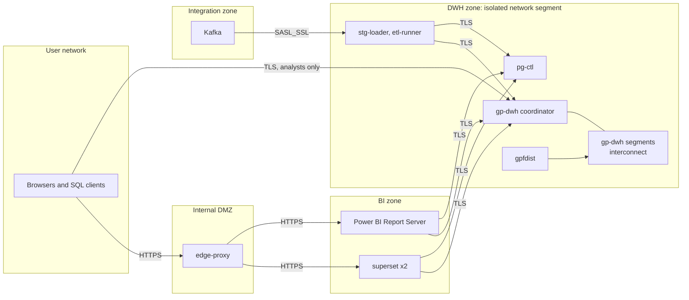

# Security & Compliance

**Project:** Банковская платформа управления ликвидностью и финансовой аналитики (bank liquidity management and financial analytics platform)

## Table of Contents

- [Trust Zones](#trust-zones)
- [Identity & Access](#identity--access)
- [Authorization and Grants](#authorization-and-grants)
- [Data Protection](#data-protection)
- [Regulatory/Compliance](#regulatorycompliance)
- [Perimeter Defense](#perimeter-defense)

## Trust Zones

The [DWH](https://en.wikipedia.org/wiki/Data_warehouse "Data Warehouse — Central store that integrates historical data from many sources for reporting and analysis") zone accepts connections only from the [BI](https://en.wikipedia.org/wiki/Business_intelligence "Business Intelligence — Tools and practices that turn stored business data into reports and dashboards for decisions") zone, the integration zone, analysts' [SQL](https://en.wikipedia.org/wiki/SQL "Structured Query Language — Queries and manipulates data in a relational database") clients on the analyst network, and the GitLab runner used for deployment. Segment hosts and `gpfdist` are reachable only from inside the zone.

## Identity & Access

**Authentication.** The bank's Active Directory is the only identity source; no component keeps its own password list for people.

| Principal | Mechanism |
|---|---|
| Superset users | [OIDC](https://openid.net/developers/how-connect-works/ "OpenID Connect — Identity layer on top of OAuth 2.0 for authenticating users") against the bank's [IdP](https://en.wikipedia.org/wiki/Identity_provider "Identity Provider — Service that authenticates users and issues identity assertions to relying applications") where one exists (single sign-on and [MFA](https://en.wikipedia.org/wiki/Multi-factor_authentication "Multi Factor Authentication — Requires more than one form of evidence to verify a user's identity") come from it); otherwise [LDAP](https://datatracker.ietf.org/doc/html/rfc4511 "Lightweight Directory Access Protocol — Queries and modifies directory services holding users and groups") bind against Active Directory. Superset roles are mapped from directory groups, not assigned by hand |
| Power BI Report Server users | Windows Integrated authentication (Kerberos); folder and report permissions granted to directory groups |
| Analysts on `gp-dwh` and `pg-ctl` | Kerberos or LDAP authentication in `pg_hba.conf`; no local database passwords; connections allowed only from the analyst network |
| Service accounts | One per component (table below). Kerberos keytabs where the client supports them, otherwise a `0600` credential file owned by the service's operating-system user; rotated every 90 days |
| Deployment | `svc_deploy` credentials held as protected, masked GitLab [CI](https://en.wikipedia.org/wiki/Continuous_integration "Continuous Integration — Automatically builds and tests code on every change") variables, usable only by pipelines on protected branches |

The stack has no secret store (see `02-high-level-design.md`); if the bank runs one, every credential above moves into it and the file-based fallback is dropped.

## Authorization and Grants

**[RBAC](https://en.wikipedia.org/wiki/Role-based_access_control "Role Based Access Control — Grants permissions to users based on assigned roles rather than individually")** through database roles, one per component, each granted only what `02`–`05` show it reading or writing. Object ownership sits with two `NOLOGIN` roles, `dwh_owner` (every object in `stg`, `core`, `dm`, `dm_legacy`, `rpt`) and `ctl_owner` (every object in `ctl`), so no runtime service can drop or alter what it uses.

| Role | `gp-dwh` | `pg-ctl` / external |
|---|---|---|
| `svc_stg_loader` | `INSERT` on `stg.kafka_postings`, `stg.kafka_acct_balance`, `stg.kafka_rejected`; `SELECT, INSERT, UPDATE` on `stg.kafka_offset` | [Kafka](https://kafka.apache.org/documentation/ "Apache Kafka — Distributed log that stores partitioned, replicated streams of records for publish-subscribe and stream processing"): read `fin.postings.v1`, `fin.acct-balance.v1`; commit offsets for group `stg-loader` |
| `svc_etl_runner` | `SELECT` on `stg.ext_*`; `SELECT, INSERT, DELETE` on `stg.src_*`; `SELECT` on `stg.kafka_postings`; `SELECT, INSERT, UPDATE, DELETE` on `core`, `dm` (including `dm.published_date`) and `dm_legacy` tables; `EXECUTE` on `core.load_*`, `dm.build_*`, `core.analyze_table` | `SELECT` on `ctl.job`, `ctl.job_dependency`, `ctl.source_system`, `ctl.report_catalog`, `ctl.recon_result`, `ctl.entitlement`; `SELECT, INSERT, UPDATE` on `ctl.job_run`, `ctl.load_batch`, `ctl.business_date_status`; `SELECT` and `UPDATE (synced_at, applied_run_id)` on `ctl.adjustment`. Report server: execute refresh plans; Superset: cache invalidation and row-level-security admin; mail relay |
| `svc_recon` | `SELECT` on `stg`, `core`, `dm` (default privileges, so `dm.<mart>__next` is covered), `dm_legacy`, `rpt` | `SELECT` on `ctl.recon_rule`, `ctl.load_batch`, `ctl.recon_result`, `ctl.report_control_total`, `ctl.report_catalog`; `INSERT` on `ctl.recon_result`, `ctl.recon_break`, `ctl.report_control_total`; `UPDATE (clean_days_count, month_end_covered, migration_status)` on `ctl.report_catalog` |
| `svc_lineage` | Catalog reads only (view definitions, dependencies) | `SELECT` on `ctl.field_mapping`, `ctl.kpi_definition`, `ctl.report_catalog`, `ctl.source_system`; `SELECT, INSERT, DELETE` on `ctl.object_dependency`. Confluence: edit rights on the lineage space only |
| `svc_superset` | `SELECT` on `rpt` | `SELECT` on `ctl.v_run_health`, `ctl.v_freshness`, `ctl.v_recon_status`; owner of database `superset_meta` |
| `svc_pbirs` | `SELECT` on `rpt` | `SELECT` on `ctl.entitlement` |
| `grp_analyst` | `SELECT` on `stg`, `core` (on `core.counterparty` only the columns other than `name` and `tax_id`, plus `core.v_counterparty_masked`), `dm`, `dm_legacy`, `rpt` | `SELECT` on `ctl`; `INSERT` on `ctl.source_change` and `UPDATE (impact_summary, impact_assessed_at)`; `UPDATE (status, root_cause_category, jira_key, resolved_by, resolved_at)` on `ctl.recon_break` |
| `grp_pii_reader` | `SELECT` on all of `core.counterparty` | — |
| `svc_deploy` | Member of `dwh_owner`: [DDL](https://en.wikipedia.org/wiki/Data_definition_language "Data Definition Language — The SQL statements that create and alter database objects"), `CREATE OR REPLACE VIEW` on `rpt`, builds `dm.<mart>__next` | Member of `ctl_owner`: migrations; writes `ctl.field_mapping`, `ctl.kpi_definition`, `ctl.recon_rule`, `ctl.job`, `ctl.job_dependency`, `ctl.report_catalog`, `ctl.entitlement`, `ctl.schema_version`; `INSERT` on `ctl.adjustment` |
| `svc_maint` | Member of `dwh_owner`: `VACUUM`, partition drop and archive export, the nightly `DELETE` on `dm.cash_position_intraday` | Member of `ctl_owner`: `VACUUM` |

`core.analyze_table(regclass)` is `SECURITY DEFINER`, owned by `dwh_owner`, and refuses any table outside `stg`, `core` and `dm`: `ANALYZE` needs table ownership, and granting `svc_etl_runner` ownership would let it drop the tables it builds. The `ctl` trigger functions (`trg_audit`, `trg_business_date_transition`, `trg_adjustment_four_eyes`, `trg_report_migration_transition`) are likewise `SECURITY DEFINER` under `ctl_owner`, so a writer needs no grant on `ctl.audit_log` and cannot write it directly. `svc_deploy` and `svc_maint` are the two over-privileged roles; both are used only by non-interactive jobs, and their sessions are identifiable in the logs by `application_name`.

**[ABAC](https://en.wikipedia.org/wiki/Attribute-based_access_control "Attribute Based Access Control — Grants access based on attributes of the subject, resource and environment rather than fixed roles") by legal entity.** `ctl.entitlement` is the single owner of which user sees which `legal_entity_id`. Power BI applies it through a dynamic row-level-security role that matches the viewer's user principal name against the imported entitlement table; Superset applies it through row-level-security rules that `etl-runner` regenerates from the same table. Both BI tools connect with service accounts, so the database cannot filter by viewer — the BI layer is where viewer-level filtering happens, and SQL access below it is limited to analysts, who see all entities but not personal data.

> **Verify Before Build:** Superset row-level-security rules apply to charts and datasets, not to SQL Lab. SQL Lab must be granted only to the analyst role, or an entity-restricted user can bypass the filter by typing a query. Also confirm that the installed Power BI Report Server version supports row-level security on import models.

## Data Protection

**In transit.**

- All client connections to `gp-dwh` and `pg-ctl` require [TLS](https://datatracker.ietf.org/doc/html/rfc8446 "Transport Layer Security — Encrypts and authenticates data sent over a network connection") (`hostssl` only in `pg_hba.conf`), TLS 1.3 where both ends support it and 1.2 as the floor.
- Kafka clients use `SASL_SSL` with Kerberos, so a consumer is both encrypted and identified by a directory principal.
- Browsers reach `edge-proxy` over [HTTPS](https://datatracker.ietf.org/doc/html/rfc9110 "HTTP Secure — HTTP encrypted with TLS to protect requests and responses in transit"); `edge-proxy` re-encrypts to Superset and the report server rather than forwarding plain [HTTP](https://datatracker.ietf.org/doc/html/rfc9110 "Hypertext Transfer Protocol — Application protocol used to request and transfer web resources") inside the network.
- Greenplum's segment interconnect and `gpfdist` traffic run inside the isolated DWH segment.

> **Verify Before Build:** the Greenplum interconnect between segments is not encrypted, and `gpfdist` serves plain HTTP unless `gpfdists` is configured. Network isolation is the control for the first; enable `gpfdists` for any source host outside the DWH zone. The bank's rules may also require certified national cryptography ([GOST](https://en.wikipedia.org/wiki/GOST "Gosudarstvenny Standart — Russian national standards, including the cryptographic algorithms certified protection tools must use") algorithms) instead of standard TLS on some links — confirm with information security before build.

**At rest.**

- [AES-256](https://csrc.nist.gov/pubs/fips/197/final "Advanced Encryption Standard with a 256-bit key — Symmetric encryption of data at rest and in transit") volume encryption (Linux `dm-crypt`) on the coordinator, segment, `pg-ctl`, Kafka and `gpfdist` landing hosts, and on backups.
- Personal data is minimised rather than field-encrypted: only `core.counterparty.name` and `core.counterparty.tax_id` hold it; no mart, `rpt` view, log line or Confluence page carries it; access is restricted to `grp_pii_reader`. Field-level encryption was not chosen because it breaks joins and matching on `tax_id` during discrepancy analysis; if policy requires it, `pgcrypto` with the key held outside the database is the path, at the cost of that matching.
- Landing files served by `gpfdist` are deleted after their batch reconciles at `SRC_STG`.

## Regulatory/Compliance

The brief states no jurisdiction. Its Russian-language wording suggests the Bank of Russia regime, and the items below are named with that caveat; on an EU bank the personal-data row maps to [GDPR](https://gdpr-info.eu/ "General Data Protection Regulation — EU regulation governing the processing of personal data") instead.

| Framework | What it requires of this design | How the design meets it |
|---|---|---|
| Federal Law 152-FZ on personal data | Minimisation, access restriction, protection of individuals' data | [PII](https://csrc.nist.gov/glossary/term/personally_identifiable_information "Personally Identifiable Information — Data that can identify a person and must be minimised and protected") confined to two `core.counterparty` columns; `grp_pii_reader` only; none in marts, logs or BI |
| Bank of Russia Regulation 683-P and GOST R 57580.1-2017 (information security of financial organisations) | Access control, event logging, integrity of processing, protection of information in transit | Directory-based identity, per-component roles, `ctl.audit_log`, reconciliation gate, TLS and network zoning; certified cryptography confirmed as above |
| Federal Law 402-FZ on accounting | Accounting records kept for at least 5 years | 5 years of `core` history online, archive files after |
| Basel III liquidity standards (as implemented locally) | A defined, stable methodology behind liquidity figures | Marts compute management metrics; [KPI](https://en.wikipedia.org/wiki/Performance_indicator "Key Performance Indicator — Measurable value that tracks how well an operation meets its targets") definitions are owned in `ctl.kpi_definition` and change only through a reviewed merge request with a `HISTORY` regression. If a mart ever feeds a regulatory ratio, that ratio's methodology needs its own sign-off |
| Internal controls over financial reporting | Segregation of duties, reproducibility, audit trail | Four-eyes adjustments enforced by `trg_adjustment_four_eyes`; every figure traceable through `build_run_id` → `ctl.job_run.code_version`; changes via Jira-linked merge requests |

> **Deep Dive Reference:** the controlled status of each of the 25+ reports — whether any is used in a filing or an audited disclosure changes its approval path, retention and change control. Classify reports in `ctl.report_catalog` before migration begins.

## Perimeter Defense

The platform has no internet exposure, so the threats are internal: a misused credential, an over-broad query, or a compromised workstation.

- **[WAF](https://owasp.org/www-community/Web_Application_Firewall "Web Application Firewall — Filters and blocks malicious HTTP traffic before it reaches an application").** Requests to Superset and the report server pass through `edge-proxy`, which applies the bank's WAF policy where one is deployed on internal applications. Superset's own [CSRF](https://owasp.org/www-community/attacks/csrf "Cross Site Request Forgery — Attack that makes a signed-in user's browser submit an unintended request") protection and secure session cookies stay enabled.
- **Rate limiting.** Superset's built-in rate limiter covers login and [API](https://en.wikipedia.org/wiki/API "Application Programming Interface — Defines the contract by which software components exchange requests and data") endpoints. At the database, resource groups, statement timeouts and a per-role `CONNECTION LIMIT` (see `05-reliability.md`) cap what any one principal can consume. Kafka quotas limit each client's throughput.
- **[DDoS](https://en.wikipedia.org/wiki/Denial-of-service_attack "Distributed Denial of Service — Attack that floods a system with traffic from many sources to make it unavailable").** Not internet-facing, so volumetric protection is the bank's network layer. The internal equivalent — a flood of dashboard refreshes or a runaway ad-hoc query — is absorbed by the Superset cache, `edge-proxy` connection limits and the `rg_bi` and `rg_adhoc` concurrency caps.
- **Administrative access.** Hosts in the DWH zone are reached only through the bank's jump host; database superuser is reserved for database administrators and is not granted to any service.
