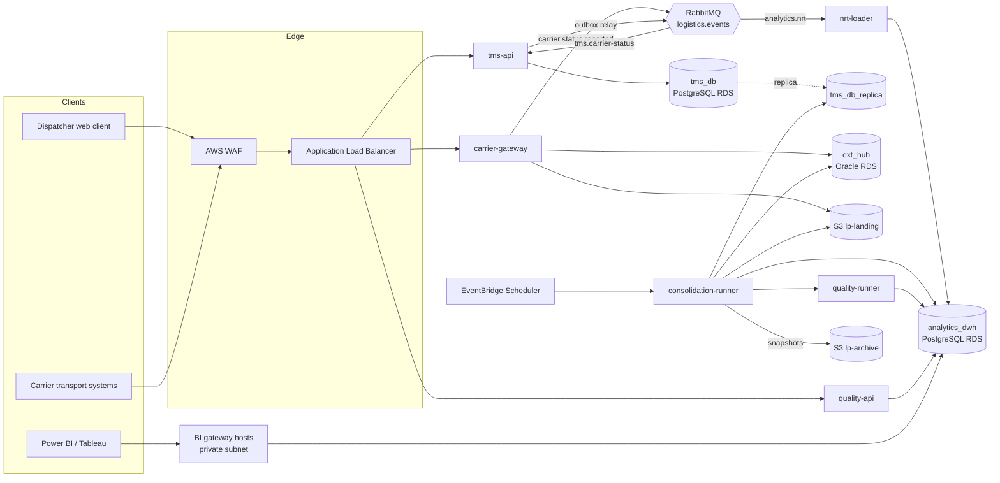

# High-Level Design

*Logistics Platform for Transport Management and Analytics*

## Table of Contents

- [Components and Naming](#components-and-naming)
- [API Design](#api-design)
- [Architecture Diagram](#architecture-diagram)
- [Technology Mapping](#technology-mapping)

---

## Components and Naming

These names are used unchanged in every file of this design.

| Component | Kind | Responsibility |
|---|---|---|
| `tms-api` | Python service ([ECS](https://aws.amazon.com/ecs/ "Amazon Elastic Container Service — Managed container orchestration on AWS; with Fargate it runs containers without managing servers") Fargate) | Orders, shipments, trips, routes; the shipment status state machine; an outbox relay that publishes domain events |
| `carrier-gateway` | Python service (ECS Fargate) | Intake from external transport systems: verifies signatures, stores raw payloads in `ext_hub`, stores files in `lp-landing`, publishes `carrier.status.reported` |
| `consolidation-runner` | Python batch task (ECS Fargate, EventBridge Scheduler) | The nightly run: extract, stage, conform, build marts, call `quality-runner`, publish, trigger [BI](https://en.wikipedia.org/wiki/Business_intelligence "Business Intelligence — Tools and practices that turn stored business data into reports and dashboards for decisions") refresh |
| `nrt-loader` | Python consumer (ECS Fargate) | Consumes `analytics.nrt` and upserts `nrt.shipment_status_current` |
| `quality-runner` | Python batch task (ECS Fargate) | Data-quality checks and reconciliation; writes `dq.*`; decides whether a mart may be published |
| `quality-api` | Python service (ECS Fargate) | Run status, discrepancy review and resolution, lineage queries for analysts |
| `tms_db` | [PostgreSQL](https://www.postgresql.org/docs/current/ "PostgreSQL — Relational database storing and querying structured data with strong transactional guarantees") on [RDS](https://aws.amazon.com/rds/ "Amazon Relational Database Service — Managed hosting for relational databases such as PostgreSQL, with backups and failover"), Multi-[AZ](https://aws.amazon.com/about-aws/global-infrastructure/regions_az/ "Availability Zone — Isolated group of data centres within an AWS Region, used to survive a single-site failure"), plus `tms_db_replica` | Operational system of record |
| `ext_hub` | Oracle on RDS | Raw carrier payloads ([JSON](https://www.json.org/json-en.html "JavaScript Object Notation — Lightweight text format for structured data exchange")); the existing integration hub |
| `analytics_dwh` | PostgreSQL on RDS, Multi-AZ | Schemas `stg`, `core`, `mart`, `mart_build`, `nrt`, `dq`, `meta` |
| `lp-landing`, `lp-archive` | [S3](https://aws.amazon.com/s3/ "Amazon Simple Storage Service — Durable object storage for files, datasets and archives") buckets | Carrier files and nightly extract snapshots; long-term archive |
| [RabbitMQ](https://www.rabbitmq.com/docs "RabbitMQ — Message broker that routes and queues messages between producers and consumers") | Amazon MQ for RabbitMQ, 3-node cluster | Topic exchange `logistics.events`; queues `tms.carrier-status`, `analytics.nrt` and their `.dlq` queues |
| Power BI, Tableau | BI tools | Dashboards over published `mart` and `nrt` objects only |

### Events on `logistics.events`

| Routing key | Producer | Consumers |
|---|---|---|
| `carrier.status.reported` | `carrier-gateway` | `tms-api` (queue `tms.carrier-status`) |
| `shipment.status.changed` | `tms-api` outbox relay | `nrt-loader` (queue `analytics.nrt`) |
| `order.created`, `order.updated`, `route.assigned` | `tms-api` outbox relay | `nrt-loader` (queue `analytics.nrt`) |

---

## API Design

All endpoints are [REST](https://en.wikipedia.org/wiki/REST "Representational State Transfer — Architectural style for stateless, resource-oriented HTTP APIs") over [HTTPS](https://datatracker.ietf.org/doc/html/rfc9110 "HTTP Secure — HTTP encrypted with TLS to protect requests and responses in transit") and JSON. Internal users authenticate with [OIDC](https://openid.net/developers/how-connect-works/ "OpenID Connect — Identity layer on top of OAuth 2.0 for authenticating users") bearer tokens; carriers sign requests (see `06-security.md`).

### `tms-api` — operational users

| Endpoint | Input | Returns |
|---|---|---|
| `POST /api/v1/orders` | `customer_ref`, `pickup_location_id`, `delivery_location_id`, `requested_pickup_at`, `promised_delivery_by`, `cargo {weight_kg, volume_m3, pallets}` | `201 {order_id, status}` |
| `GET /api/v1/orders/{order_id}` | — | Order with its shipments and current statuses |
| `POST /api/v1/trips` | `route_id`, `carrier_id`, `vehicle_id`, `shipment_ids[]` | `201 {trip_id}` |
| `POST /api/v1/shipments/{shipment_id}/status` | `status_code`, `event_ts`, `source`, `location_id` | `200 {shipment_id, status_code, version}`; `409` on an invalid transition |
| `GET /api/v1/shipments` | `carrier_id`, `status_code`, `from`, `to`, `cursor` | Paged shipment list |

### `carrier-gateway` — external transport systems

| Endpoint | Input | Returns |
|---|---|---|
| `POST /carrier/v1/messages` | Headers `X-Carrier-Code`, `X-Signature`, `Idempotency-Key`; body `message_type` (`status`, `eta`, `pod`, `invoice`), `external_ref`, `payload {…}` | `202 {message_id}` |
| `POST /carrier/v1/files` | Multipart [CSV](https://datatracker.ietf.org/doc/html/rfc4180 "Comma Separated Values — Plain text format for exchanging tabular data"), XLSX or JSON file plus `file_type` | `202 {file_id, s3_key}` |

`202` means the payload is durably stored, not that it has been applied. A repeated `Idempotency-Key` returns the original `message_id`.

### `quality-api` — analysts and the data team

| Endpoint | Input | Returns |
|---|---|---|
| `GET /quality/v1/runs/{run_id}` | — | Steps with status and row counts, check totals (passed, warning, failed), marts published |
| `GET /quality/v1/discrepancies` | `carrier_id`, `status`, `from`, `to`, `cursor` | `[{discrepancy_id, shipment_id, field_name, carrier_value, internal_value, detected_at}]` |
| `POST /quality/v1/discrepancies/{discrepancy_id}/resolution` | `decision` (`correct`, `accept_carrier`, `accept_internal`, `reject`), `corrected_value?`, `note` | `200 {status, correction_id?}` |
| `GET /quality/v1/lineage` | `object` (e.g. `mart.sla_compliance_daily`), `direction` (`upstream`, `downstream`) | `{nodes[], edges[]}` from `meta.lineage_edge` |
| `POST /quality/v1/runs` | `marts[]`, `reason` | `202 {run_id}` — a targeted rebuild, data-team role only |

### BI access

Power BI and Tableau do not call a REST [API](https://en.wikipedia.org/wiki/API "Application Programming Interface — Defines the contract by which software components exchange requests and data"). They read `analytics_dwh` over [TLS](https://datatracker.ietf.org/doc/html/rfc8446 "Transport Layer Security — Encrypts and authenticates data sent over a network connection") with the read-only role `bi_reader`, which is granted `SELECT` on `mart` and `nrt` only.

---

## Architecture Diagram

The request path is client → [WAF](https://owasp.org/www-community/Web_Application_Firewall "Web Application Firewall — Filters and blocks malicious HTTP traffic before it reaches an application") → load balancer → service → data store. Operational writes go to `tms_db` only. Analytics never reads the `tms_db` primary: the nightly extract reads `tms_db_replica`, and the near-real-time path receives events instead of querying.

### Two analytics paths

- **Daily (reconciled):** `consolidation-runner` → `stg` → `core` → `mart_build` → checks by `quality-runner` → swap into `mart` → BI refresh. This is the only path that feeds official reports.
- **Near-real-time (unreconciled):** `shipment.status.changed` → `nrt-loader` → `nrt.shipment_status_current`. It feeds one "deliveries today" view and is overwritten by the daily tier's truth each night.

---

## Technology Mapping

| Technology | Role | Why it fits | Alternative not chosen |
|---|---|---|---|
| **PostgreSQL** (RDS) | `tms_db` and `analytics_dwh` | [ACID](https://en.wikipedia.org/wiki/ACID "Atomicity, Consistency, Isolation, Durability — Names the four guarantees a database transaction provides") state machine for statuses; window functions, CTEs and partitioning cover the analytics workload at ~0.6 TB | A columnar warehouse (Redshift): better for scans over many terabytes, but at this size its cost and a second [SQL](https://en.wikipedia.org/wiki/SQL "Structured Query Language — Queries and manipulates data in a relational database") dialect buy little. Evolution trigger in `03-data-modeling.md` |
| **Oracle** (RDS) | `ext_hub`, raw carrier payloads | Pre-existing hub where partner feeds land; its JSON functions let analysts profile payloads whose shape varies by carrier | Moving the payloads into PostgreSQL [JSONB](https://www.postgresql.org/docs/current/datatype-json.html "JSON Binary — PostgreSQL type storing JSON documents in a decomposed binary form that can be indexed") is the greenfield choice, but it would mean migrating working partner integrations |
| **SQL** | All transformation logic, marts, checks | Set-based work stays in the database; each [KPI](https://en.wikipedia.org/wiki/Performance_indicator "Key Performance Indicator — Measurable value that tracks how well an operation meets its targets") has one SQL definition | Transformations in pandas: moves millions of rows out of the database for no gain |
| **Python** | Services, batch orchestration, checks | One language for services and data jobs; drives SQL steps, file parsing and REST calls to the BI tools | A dedicated orchestrator (Apache Airflow, managed on [AWS](https://aws.amazon.com/ "Amazon Web Services — Cloud provider whose managed compute, storage and messaging services host a system")): justified once the step graph outgrows one runner — trigger in `04-deep-dive.md` |
| **RabbitMQ** (Amazon MQ) | Carrier intake buffer and domain events | Routing by key, per-queue dead-lettering, and a load that is far below one node's capacity | [Kafka](https://kafka.apache.org/documentation/ "Apache Kafka — Distributed log that stores partitioned, replicated streams of records for publish-subscribe and stream processing"): replay and partitioned throughput are not needed at ~50 msg/s peak |
| **Power BI** | Management dashboards: cost, [SLA](https://en.wikipedia.org/wiki/Service-level_agreement "Service Level Agreement — Commitment between a provider and its customer on measurable service targets, such as delivery time"), KPIs | Import-mode datasets for fast pages; row-level security by region; the organisation's standard for management reporting | — |
| **Tableau** | Operations analysts' exploratory workbooks | Existing analyst workbooks on delivery, loading and routes | Consolidating on one BI tool would halve the refresh and access work; kept as two because the two audiences already use them |
| **AWS RDS** | Managed PostgreSQL and Oracle | Backups, point-in-time recovery, Multi-AZ failover without a DBA team | Self-managed databases on virtual machines |
| **AWS S3** | `lp-landing`, `lp-archive` | Durable, cheap storage for files and replayable nightly snapshots | — |
| **AWS CloudWatch** | Metrics, logs, alarms | Native for RDS, Amazon MQ, ECS and the Python jobs' custom metrics | A self-hosted Prometheus and Grafana stack |
| **Jira, Confluence** | Task tracking, documentation | Process tools; Confluence pages for mappings are generated from `meta` tables, so the tables stay the owner | — |

**Two BI tools, one KPI definition.** Every KPI is calculated in SQL in a mart. Power BI and Tableau only aggregate and filter it. Without that rule, the same "on-time rate" would be defined twice, in two languages, and the two tools would drift apart.

**Stack gaps, flagged.** The brief names no compute, scheduling, edge or secrets service. The design adds **ECS Fargate** (containers without managing servers), **EventBridge Scheduler** (cron for the nightly tasks), **AWS WAF** with an **Application Load Balancer**, **Amazon MQ** as the RabbitMQ host, and **Secrets Manager**, and reads them from "AWS (…and others)". No web framework is named; the Python services need one, and that choice has no architectural effect.
