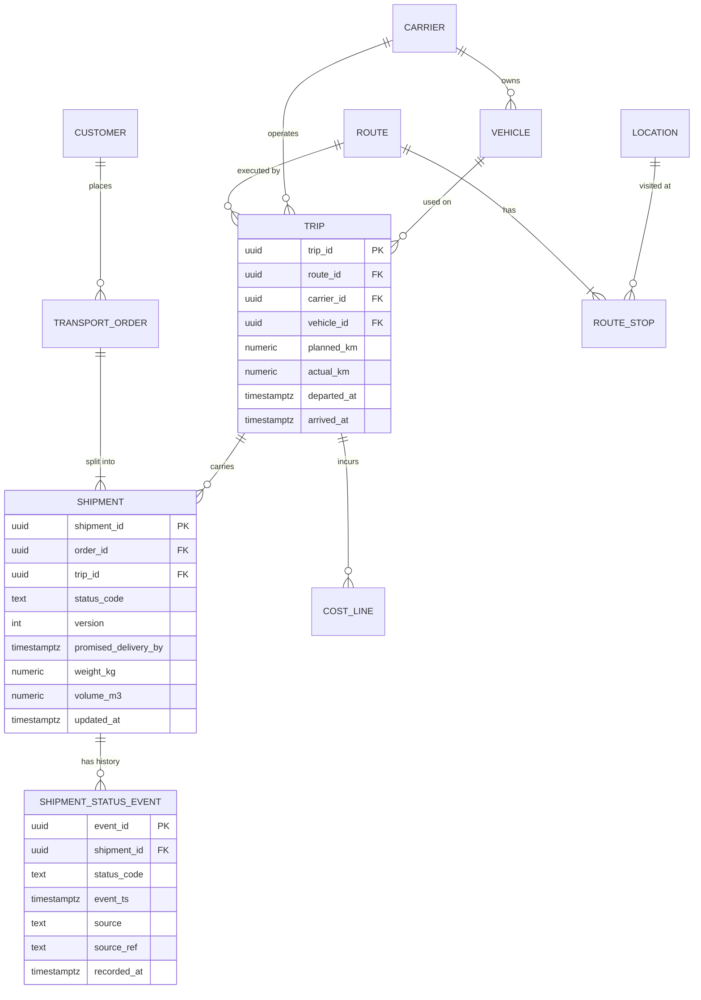

# Data Modeling & Storage

*Logistics Platform for Transport Management and Analytics*

## Table of Contents

- [Operational Schema — tms_db](#operational-schema--tms_db)
- [Raw Carrier Payloads — ext_hub](#raw-carrier-payloads--ext_hub)
- [Analytics Schema — analytics_dwh](#analytics-schema--analytics_dwh)
- [Data Marts](#data-marts)
- [Metadata, Quality and Lineage](#metadata-quality-and-lineage)
- [Storage Choice and Partitioning](#storage-choice-and-partitioning)

---

## Operational Schema — tms_db

| Table | Key points |
|---|---|
| `customer`, `location` | Reference data. `customer` holds the consignee's name and phone, which are personal data (see `06-security.md`) |
| `transport_order` | One customer request; `promised_delivery_by` is copied onto each shipment |
| `shipment` | Unit tracked end to end. `status_code` and `version` implement the state machine; `version` is an optimistic lock |
| `shipment_status_event` | Append-only history. `event_ts` is when it happened; `recorded_at` is when the platform learned about it. The gap between them is the carrier's reporting lag. `source_ref` holds the carrier `message_id` or the user request ID that caused the event |
| `trip`, `route`, `route_stop` | A vehicle run executing a planned route; `planned_km` and `actual_km` feed empty-mileage and cost-per-km marts |
| `carrier`, `vehicle` | `vehicle.capacity_kg` and `vehicle.capacity_m3` feed the vehicle-load mart |
| `cost_line` | Freight, fuel surcharge, waiting and other charges per trip, in `amount` and `currency` |
| `outbox_event` | `event_id`, `routing_key`, `payload`, `created_at`, `published_at`. Written in the same transaction as the business change; the outbox relay publishes it |

---

## Raw Carrier Payloads — ext_hub

`ext_hub.carrier_message` keeps every message exactly as received:

| Column | Type | Purpose |
|---|---|---|
| `message_id` | `RAW(16)` | Primary key, returned to the carrier |
| `carrier_code` | `VARCHAR2(32)` | Which integration sent it |
| `message_type` | `VARCHAR2(16)` | `status`, `eta`, `pod`, `invoice` |
| `idempotency_key` | `VARCHAR2(128)` | Unique per `carrier_code`; a repeat returns the original row |
| `payload_version` | `VARCHAR2(16)` | The carrier's own schema version, when it sends one |
| `payload` | [JSON](https://www.json.org/json-en.html "JavaScript Object Notation — Lightweight text format for structured data exchange") | The body, whose shape differs by carrier and version |
| `received_at` | `TIMESTAMP WITH TIME ZONE` | Intake time; the nightly extract's watermark |

`ext_hub.v_carrier_event_flat` projects the **mapped** fields of every payload version into columns (`carrier_code`, `external_ref`, `status_code`, `event_ts`, `amount`, `currency`). Fields with no approved mapping stay only in `payload`, so nothing is lost when a carrier adds a field.

---

## Analytics Schema — analytics_dwh

`analytics_dwh` is a star schema, in seven schemas:

| Schema | Holds | Written by |
|---|---|---|
| `stg` | Raw copies of each night's extract, one table per source object, kept 14 days | `consolidation-runner` |
| `core` | Conformed dimensions and facts; the reconciled model | `consolidation-runner` |
| `mart` | The published data marts that [BI](https://en.wikipedia.org/wiki/Business_intelligence "Business Intelligence — Tools and practices that turn stored business data into reports and dashboards for decisions") reads | Swapped in from `mart_build` |
| `mart_build` | The next set of marts, built and checked before publication | `consolidation-runner` |
| `nrt` | `nrt.shipment_status_current`, the near-real-time table | `nrt-loader` |
| `dq` | Check results, reconciliation results, discrepancies, [KPI](https://en.wikipedia.org/wiki/Performance_indicator "Key Performance Indicator — Measurable value that tracks how well an operation meets its targets") baselines | `quality-runner`, `quality-api` |
| `meta` | Source-to-target mappings, lineage, rules, run steps, publish state | The data team and `consolidation-runner` |

### Near-real-time table

`nrt.shipment_status_current` holds one row per shipment active today: `shipment_id` (primary key), `status_code`, `event_ts`, `carrier_id`, `region`, `promised_delivery_by`, `last_event_id` and `updated_at`. The `shipment.status.changed` event carries every column, plus the carrier message's `received_at` for the freshness metric, so `nrt-loader` never queries `tms_db`. Rows for shipments delivered before the current day are deleted nightly.

### Dimensions

`core.dim_date`, `core.dim_carrier` (type 2: history of name and contract terms), `core.dim_route` (type 2: tariff lane changes), `core.dim_location` (region, city), `core.dim_vehicle_type`, `core.dim_status`, and `core.dim_customer`, which holds only a pseudonymous `customer_key` and a region — no names or phones.

### Facts

| Fact | Grain | Main measures |
|---|---|---|
| `core.fact_shipment` | One row per shipment | `promised_delivery_by`, `delivered_ts`, `weight_kg`, `volume_m3`, `status_code`, `source_version` |
| `core.fact_status_event` | One row per status event | `event_ts`, `recorded_at`, `event_date`, `status_code`, `source` |
| `core.fact_trip` | One row per trip | `planned_km`, `actual_km`, `load_kg`, `load_m3`, `capacity_kg`, `capacity_m3` |
| `core.fact_transport_cost` | One row per cost line | `amount`, `currency`, `cost_type`, `trip_key` |

Every fact carries surrogate keys to its dimensions (`date_key`, `carrier_key`, `route_key`, `location_key`) and its own key (`shipment_key`, `trip_key`).

`core.data_correction` records every approved correction (`correction_id`, `discrepancy_id`, `target_table`, `target_key`, `field_name`, `old_value`, `new_value`, `approved_by`, `approved_at`). Marts apply corrections on top of the facts; the facts keep what the sources said.

---

## Data Marts

Sixteen marts, each rebuilt in full every night from `core`. All share the conformed dimensions, so "carrier" and "region" mean the same thing in every one.

| Mart | Grain | Answers |
|---|---|---|
| `mart.shipment_volume_daily` | day × carrier × region | How much was shipped |
| `mart.delivery_ontime_daily` | day × carrier × region | On-time delivery rate |
| `mart.sla_compliance_daily` | day × carrier × route | [SLA](https://en.wikipedia.org/wiki/Service-level_agreement "Service Level Agreement — Commitment between a provider and its customer on measurable service targets, such as delivery time") met, missed, and minutes late |
| `mart.vehicle_load_daily` | day × vehicle type × carrier | Weight and volume utilisation |
| `mart.route_performance` | route × month | Planned versus actual time and distance |
| `mart.carrier_scorecard_monthly` | carrier × month | On-time rate, reporting timeliness, open discrepancies, cost |
| `mart.transport_cost_daily` | day × carrier × cost type | Spend |
| `mart.cost_per_unit_monthly` | carrier × route × month | Cost per km and per tonne |
| `mart.order_lifecycle` | order | Time spent in each status |
| `mart.delivery_exceptions` | shipment | Late, failed and returned deliveries with reason |
| `mart.empty_mileage_daily` | day × carrier | Share of kilometres driven without load |
| `mart.carrier_status_timeliness` | day × carrier | Lag between `event_ts` and `recorded_at` |
| `mart.carrier_discrepancy` | day × carrier × field | Open and resolved carrier-versus-internal differences |
| `mart.ops_kpi_daily` | day | The management KPI summary |
| `mart.region_volume_monthly` | region × month | Volume and cost by region |
| `mart.order_backlog_daily` | day × region | Orders not yet assigned to a trip |

---

## Metadata, Quality and Lineage

| Table | Columns | Purpose |
|---|---|---|
| `meta.sttm_mapping` | `mapping_id`, `source_system`, `source_object`, `source_field`, `transform_rule`, `target_object`, `target_field`, `version`, `valid_from`, `valid_to` | The source-to-target mapping; one row per target field per version |
| `meta.lineage_edge` | `from_object`, `to_object`, `mapping_id` | The lineage graph from source tables through `core` to marts and BI datasets |
| `meta.dq_rule` | `rule_id`, `target_object`, `rule_type`, `check_sql`, `threshold`, `severity` | `rule_type` is `completeness`, `uniqueness`, `reference` or `divergence`; `severity` is `blocking` or `warning` |
| `meta.run_step` | `run_id`, `step`, `status`, `started_at`, `finished_at`, `row_count` | Checkpoints that make a failed run resumable |
| `meta.mart_publish_state` | `mart_name`, `published_run_id`, `published_at`, `is_stale` | What BI is currently reading, and whether it is out of date. BI reads it through the view `mart.data_freshness`, created with every build, because `bi_reader` has no access to `meta` |
| `dq.check_result` | `run_id`, `rule_id`, `status`, `observed_value`, `checked_at` | One row per rule per run |
| `dq.recon_result` | `run_id`, `recon_key`, `layer_pair`, `source_value`, `target_value`, `diff`, `status` | `layer_pair` is `source_core`, `core_mart` or `mart_report` |
| `dq.recon_discrepancy` | `discrepancy_id`, `carrier_id`, `shipment_id`, `field_name`, `carrier_value`, `internal_value`, `detected_at`, `status`, `resolution_note` | `status` is `open`, `corrected`, `accepted` or `rejected` |
| `dq.kpi_baseline` | `kpi_name`, `business_date`, `dimension_key`, `value`, `captured_run_id` | KPI values before a change, for regression comparison |

Confluence pages for mappings and lineage are **generated** from `meta.sttm_mapping` and `meta.lineage_edge`. The tables are the one owner; a hand-edited page would drift.

---

## Storage Choice and Partitioning

- **No sharding.** Every store stays under ~1 TB for five years (`01-requirements.md`), well within one [RDS](https://aws.amazon.com/rds/ "Amazon Relational Database Service — Managed hosting for relational databases such as PostgreSQL, with backups and failover") node. The evolution trigger for `analytics_dwh` is **mart rebuild time over 60 minutes or core facts over 2 TB**. At that point, first make the large marts incremental, then consider a columnar warehouse.
- **Range partitioning by month** on `tms_db.shipment_status_event` (`event_ts`), `core.fact_status_event` (`event_date`), `core.fact_shipment` (`promised_delivery_by`) and `core.fact_transport_cost`. The nightly 7-day reprocessing touches one or two partitions, and old months can be detached and archived to `lp-archive`.
- **Daily partitions on `stg`** tables, dropped after 14 days. [PostgreSQL](https://www.postgresql.org/docs/current/ "PostgreSQL — Relational database storing and querying structured data with strong transactional guarantees") has no row expiry, so a partition drop is how staging data expires cheaply.
- **`ext_hub`** is interval-partitioned by `received_at`; partitions older than two years are exported to `lp-archive` and dropped. This is subject to the Oracle team's licence: partitioning is an Oracle option.

> **Verify Before Build:** Oracle's `JSON` column type and `JSON_TABLE` behaviour depend on the version — the native `JSON` type needs 21c or later; earlier releases store JSON in `BLOB` or `VARCHAR2` with an `IS JSON` check. Confirm the `ext_hub` version, and whether the Partitioning option is licensed, before relying on either.
