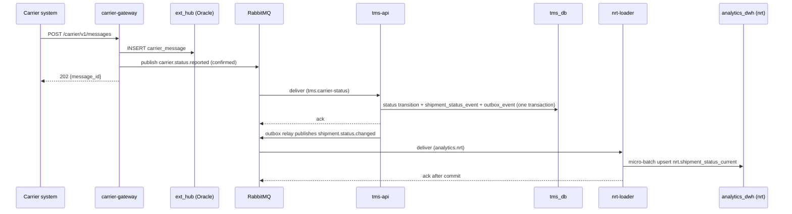
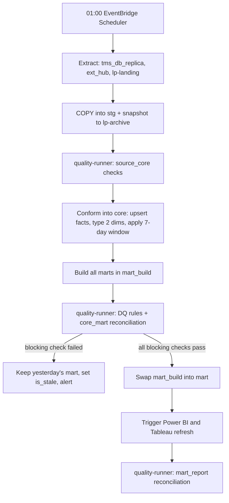

# Deep Dive & Bottlenecks

*Logistics Platform for Transport Management and Analytics*

## Table of Contents

- [Communication Patterns](#communication-patterns)
- [Near-Real-Time Path](#near-real-time-path)
- [Nightly Consolidation](#nightly-consolidation)
- [Calculating Logistics KPIs in SQL](#calculating-logistics-kpis-in-sql)
- [Reconciliation and Carrier Discrepancies](#reconciliation-and-carrier-discrepancies)
- [Changing Sources and Mappings Safely](#changing-sources-and-mappings-safely)
- [Failure Modes](#failure-modes)
- [Trade-offs](#trade-offs)

---

## Communication Patterns

| Flow | Pattern | Why |
|---|---|---|
| Dispatcher → `tms-api` | Sync [REST](https://en.wikipedia.org/wiki/REST "Representational State Transfer — Architectural style for stateless, resource-oriented HTTP APIs") | The user waits for the result of a status change or an order |
| Carrier → `carrier-gateway` | Sync REST, acknowledged with `202` after durable storage | The carrier needs a fast acknowledgement, not the processing result |
| `carrier-gateway` → `tms-api` | Async, `carrier.status.reported` on `tms.carrier-status` | Carrier intake keeps working while `tms-api` is down or slow |
| `tms-api` → analytics | Async, transactional outbox → `logistics.events` → `analytics.nrt` | A status change and its event commit together; no dual write |
| `consolidation-runner` → sources | Batch pull: [SQL](https://en.wikipedia.org/wiki/SQL "Structured Query Language — Queries and manipulates data in a relational database") over `tms_db_replica` and `ext_hub`, file reads from `lp-landing` | Set-based extraction of the day's delta; sources carry no extra load in daytime |
| `consolidation-runner` → [BI](https://en.wikipedia.org/wiki/Business_intelligence "Business Intelligence — Tools and practices that turn stored business data into reports and dashboards for decisions") tools | Sync REST calls to the Power BI and Tableau refresh APIs | Refresh starts only after publication, never on a timer |
| Analysts → `quality-api` | Sync REST | Review and resolve discrepancies |

**Delivery guarantee.** All [RabbitMQ](https://www.rabbitmq.com/docs "RabbitMQ — Message broker that routes and queues messages between producers and consumers") flows are at-least-once: publisher confirms, durable quorum queues, manual consumer acknowledgements, and a `.dlq` queue after 5 failed deliveries. Consumers are idempotent, so a redelivery changes nothing.

---

## Near-Real-Time Path



**Latency budget, steady state:** gateway store and publish ~50 ms + delivery to `tms-api` ~100 ms + transition transaction ~50 ms + outbox relay poll interval ≤ 1 s + delivery to `nrt-loader` ~100 ms + micro-batch flush every 15 s or 500 messages + upsert ~0.5 s. The worst case is **≈ 17 s**. The p95 ≤ 2 min target leaves room for a consumer restart or a backlog after a carrier's bulk flush.

**Ordering.** RabbitMQ does not guarantee order across redeliveries. `nrt-loader` upserts only when the incoming `event_ts` is newer than the stored one, and `tms-api` rejects a transition that is invalid from the current status with a logged `409`-equivalent, not a crash. A late "in transit" never overwrites "delivered".

**The near-real-time tier is not reconciled.** It skips data-quality checks and corrections on purpose, to stay fast. Each night, `quality-runner` compares `nrt.shipment_status_current` with `core.fact_shipment` and logs the difference as a metric. That number is the evidence for how far the fast view can be trusted.

---

## Nightly Consolidation



- **Python orchestrates, SQL transforms.** `consolidation-runner` runs SQL steps in dependency order, parses carrier files, calls the BI refresh APIs and records every step in `meta.run_step`. Rows never pass through Python except when a file is parsed into `stg`.
- **Incremental extraction with an overlap.** The watermark is `updated_at` (`tms_db`) and `received_at` (`ext_hub`). A row can commit after a later row with an earlier timestamp, so each extract re-reads the **last 2 hours** before the watermark and deduplicates on primary key and `version`. The upper bound is the replica's replay timestamp, not the clock, so replication lag cannot hide rows.
- **The 7-day window.** Carriers report late. Status events and costs from the last 7 days are re-conformed every night; older data is only changed by an approved `core.data_correction`.
- **Resumable.** A failed run restarts from the first step without a `succeeded` row for its `run_id`. Every step is idempotent: `stg` loads truncate their partition first, and `core` loads upsert.
- **Timing.** Extract ~20 min, conform ~20 min, marts ~25 min, checks ~20 min, BI refresh ~20 min: **≈ 1 h 50 min**. Starting at 01:00 it ends around 03:00. The 07:00 [SLO](https://sre.google/sre-book/service-level-objectives/ "Service Level Objective — Target value for a service level indicator that a service commits to meet") leaves room for one full retry.

> **Deep Dive Reference:** Orchestration — one runner with an explicit step list is right for one nightly graph. Move to a managed Apache Airflow when there are several schedules with cross-dependencies, or when steps need per-step retries and backfills that the runner would have to reimplement.

### Profiling carrier payloads in Oracle

New carrier formats arrive with fields nobody has mapped. Analysts query `ext_hub.carrier_message` with `JSON_TABLE`, `JSON_VALUE` and `JSON_EXISTS` to find which paths occur, how often, and in which `payload_version`. An approved field becomes a new `meta.sttm_mapping` version and a new column in `ext_hub.v_carrier_event_flat`. Until then, the field stays in `payload` and nothing downstream depends on it.

---

## Calculating Logistics KPIs in SQL

Each [KPI](https://en.wikipedia.org/wiki/Performance_indicator "Key Performance Indicator — Measurable value that tracks how well an operation meets its targets") has exactly one SQL definition, in its mart. A typical build uses CTEs to name each stage and window functions to work across one shipment's status history:

```sql
WITH ordered AS (
    SELECT e.shipment_key, e.status_code, e.event_ts,
           ROW_NUMBER() OVER (PARTITION BY e.shipment_key, e.status_code
                              ORDER BY e.event_ts) AS nth_time_in_status
    FROM core.fact_status_event e
    WHERE e.event_date >= current_date - 7
),
delivered AS (
    SELECT shipment_key, event_ts AS delivered_ts
    FROM ordered
    WHERE status_code = 'DELIVERED' AND nth_time_in_status = 1
)
SELECT s.promised_delivery_by::date AS business_date,
       s.carrier_key, s.route_key,
       COUNT(*)                                                  AS shipments,
       COUNT(*) FILTER (WHERE d.delivered_ts <= s.promised_delivery_by) AS sla_met,
       AVG(GREATEST(EXTRACT(EPOCH FROM d.delivered_ts - s.promised_delivery_by) / 60, 0))
           FILTER (WHERE d.delivered_ts IS NOT NULL)            AS avg_minutes_late
FROM core.fact_shipment s
LEFT JOIN delivered d USING (shipment_key)
GROUP BY 1, 2, 3;
```

`LEAD` over the same partition gives the time spent in each status for `mart.order_lifecycle`. `mart.vehicle_load_daily` stores summed `load_kg` and summed `capacity_kg` and computes utilisation as the ratio of the sums. Averaging per-trip ratios instead would give a half-empty van the same weight as a full 20-tonne truck.

---

## Reconciliation and Carrier Discrepancies

Reconciliation compares **the same number at two layers**, never two different numbers.

| `layer_pair` | Compares | Typical `recon_key` |
|---|---|---|
| `source_core` | `stg` row counts and sums against `core` | orders per day, delivered shipments, cost total per currency |
| `core_mart` | `core` aggregates against the mart that claims to hold them | shipments per carrier per day, spend per day |
| `mart_report` | Mart totals against the refreshed BI dataset, read through the Power BI `executeQueries` [API](https://en.wikipedia.org/wiki/API "Application Programming Interface — Defines the contract by which software components exchange requests and data") and the Tableau REST API | the headline KPIs on each dashboard |

A difference above a rule's `threshold` is a failed check. A **blocking** failure keeps yesterday's marts live and sets `is_stale`, and dashboards show a "data as of" banner from `mart.data_freshness`. A **warning** publishes and alerts.

**Carrier discrepancies** are a different comparison: what a carrier reported against what the internal systems hold, per shipment and field — delivery time, status, weight, freight amount. Each difference becomes a `dq.recon_discrepancy` row. An analyst resolves it through `quality-api`, and a `correct` decision writes `core.data_correction`, which the next build applies. Nothing overwrites source data.

> **Verify Before Build:** Mart-to-report reconciliation through the Power BI `executeQueries` endpoint requires the tenant setting that allows dataset queries through the REST API, and a service principal with dataset access. Confirm both with the Power BI administrator.

---

## Changing Sources and Mappings Safely

A source change is where reports break silently. Four mechanisms work together:

1. **Impact analysis.** `GET /quality/v1/lineage?object=<source table>&direction=downstream` lists every `core` table, mart and BI dataset that depends on it.
2. **Versioned mappings.** A change to `meta.sttm_mapping` is a new `version` with `valid_from`, so a rebuild of history uses the rule valid at that time.
3. **KPI regression.** Before release, `dq.kpi_baseline` captures the affected KPIs. The changed build runs in a staging copy, and `quality-runner` reports every KPI that moved more than its threshold. An expected move is signed off in the release; an unexpected one blocks it.
4. **Blue-green marts.** The schema swap (see `05-reliability.md`) means a bad build never reaches BI, and rollback is swapping the previous schema back.

---

## Failure Modes

| Component | Failure | Mitigation |
|---|---|---|
| `tms_db` | Primary instance or [AZ](https://aws.amazon.com/about-aws/global-infrastructure/regions_az/ "Availability Zone — Isolated group of data centres within an AWS Region, used to survive a single-site failure") loss | [RDS](https://aws.amazon.com/rds/ "Amazon Relational Database Service — Managed hosting for relational databases such as PostgreSQL, with backups and failover") Multi-AZ synchronous standby, automatic failover in 1–2 min |
| `tms_db_replica` | Lag or loss | Extract bounded by replay timestamp; on loss, the nightly extract falls back to the primary with a lower batch size |
| `ext_hub` | Owned by another team; may be down | Intake: `carrier-gateway` returns `503` and carriers retry, so gateway availability is capped by `ext_hub` availability. Nightly run: continues without carrier data and marks the affected marts `is_stale` |
| RabbitMQ | Node loss | 3-node Amazon MQ cluster with quorum queues |
| `carrier-gateway` | Oracle write fails | Returns `503`; carriers retry with the same `Idempotency-Key` |
| `consolidation-runner` | Crash mid-run | Resume from `meta.run_step`; yesterday's marts stay live |
| `nrt-loader` | Crash or bad message | Unacked messages redeliver; poison messages go to `analytics.nrt.dlq` after 5 attempts |
| BI gateway hosts | Host loss | Two gateway hosts in a cluster (see `06-security.md`) |
| `analytics_dwh` | Instance loss | Multi-AZ failover; worst case, rebuild from `lp-archive` snapshots and sources |

---

## Trade-offs

| Decision | Gain | Cost |
|---|---|---|
| Two analytics tiers (near-real-time and daily) | Operations see today's statuses in minutes | Two numbers for the same thing during the day; only the daily one is official |
| Full nightly mart rebuild, swapped in | Simple, atomic, easy rollback | Rebuild time grows with history; incremental marts become necessary at the trigger in `03-data-modeling.md` |
| Blocking data-quality gates | Wrong numbers never reach management | Some mornings show yesterday's data with a stale banner |
| [PostgreSQL](https://www.postgresql.org/docs/current/ "PostgreSQL — Relational database storing and querying structured data with strong transactional guarantees") as the warehouse | One engine and one SQL dialect; low cost | Large scans are slower than a columnar store |
| Corrections as overlay rows | Source data stays auditable | Every mart build must apply `core.data_correction` |
| 7-day reprocessing window | Late carrier data lands in the right day | Recent days' KPIs can shift after first publication |
