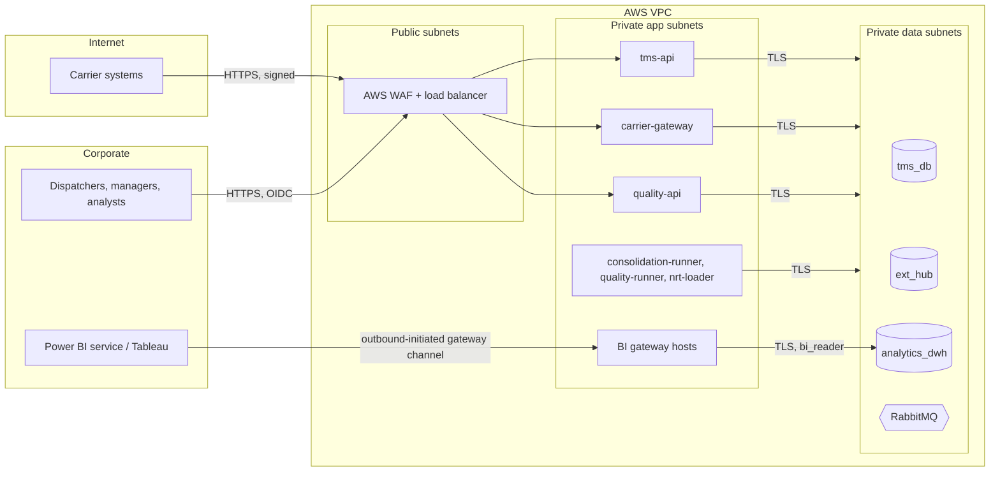

# Security & Compliance

*Logistics Platform for Transport Management and Analytics*

## Table of Contents

- [Trust Boundaries](#trust-boundaries)
- [Identity & Access](#identity--access)
- [Data Protection](#data-protection)
- [Regulatory/Compliance](#regulatorycompliance)
- [Perimeter Defense](#perimeter-defense)

---

## Trust Boundaries

Nothing in the data subnets is reachable from the internet. The [BI](https://en.wikipedia.org/wiki/Business_intelligence "Business Intelligence — Tools and practices that turn stored business data into reports and dashboards for decisions") gateway hosts are two Windows [EC2](https://aws.amazon.com/ec2/ "Amazon Elastic Compute Cloud — Virtual machines on AWS for workloads that need a full operating system") instances running the Power BI on-premises data gateway as a cluster, with Tableau Bridge on the same pattern. The BI tools reach `analytics_dwh` only through the gateway hosts, which open the connection **outbound** to the BI service, so no inbound port is opened for them.

---

## Identity & Access

### Authentication

| Principal | Mechanism |
|---|---|
| Internal users of `tms-api` and `quality-api` | [OIDC](https://openid.net/developers/how-connect-works/ "OpenID Connect — Identity layer on top of OAuth 2.0 for authenticating users") with the corporate identity provider (authorization code flow with [PKCE](https://datatracker.ietf.org/doc/html/rfc7636 "Proof Key for Code Exchange — Protects an OAuth authorization code exchange for clients that cannot hold a secret") for the web client); [JWT](https://datatracker.ietf.org/doc/html/rfc7519 "JSON Web Token — Compact, signed token format for carrying claims between parties") access tokens verified against the provider's [JWKS](https://datatracker.ietf.org/doc/html/rfc7517 "JSON Web Key Set — Publishes the public keys a party needs to verify a signed token"); [MFA](https://en.wikipedia.org/wiki/Multi-factor_authentication "Multi Factor Authentication — Requires more than one form of evidence to verify a user's identity") enforced by the provider |
| Power BI and Tableau viewers | The BI tools' own sign-in, federated to the same corporate identity provider |
| Carriers | Per-carrier [HMAC](https://datatracker.ietf.org/doc/html/rfc2104 "Hash-based Message Authentication Code — Verifies both the integrity and authenticity of a message using a shared secret key")-[SHA256](https://csrc.nist.gov/pubs/fips/180-4/upd1/final "Secure Hash Algorithm 256-bit — Produces a fixed-size digest used to verify content integrity") request signature over the body and a timestamp (`X-Signature`), with a secret issued per `carrier_code` and a 5-minute replay window. Chosen over [OAuth2](https://datatracker.ietf.org/doc/html/rfc6749 "OAuth 2.0 — Authorization framework that lets an application access resources on a user's behalf") client credentials because many carrier systems can sign a request but cannot run a token flow |
| Services and jobs | [ECS](https://aws.amazon.com/ecs/ "Amazon Elastic Container Service — Managed container orchestration on AWS; with Fargate it runs containers without managing servers") task roles ([IAM](https://aws.amazon.com/iam/ "AWS Identity and Access Management — Controls which principals may perform which actions on which AWS resources")); database credentials fetched from Secrets Manager at start-up and rotated |

### Authorization

**[RBAC](https://en.wikipedia.org/wiki/Role-based_access_control "Role Based Access Control — Grants permissions to users based on assigned roles rather than individually") in the services:**

| Role | Can |
|---|---|
| `dispatcher` | Create orders and trips; change statuses for shipments in their region |
| `logistics_manager` | Everything a dispatcher can, across regions; read `quality-api` |
| `analyst` | Read `quality-api`; resolve discrepancies up to a value limit |
| `data_engineer` | Everything an analyst can; start targeted rebuilds with `POST /quality/v1/runs` |
| `carrier:<code>` | Send messages and files for its own `carrier_code` only; the signature binds the request to the code |

**Attribute rules on top ([ABAC](https://en.wikipedia.org/wiki/Attribute-based_access_control "Attribute Based Access Control — Grants access based on attributes of the subject, resource and environment rather than fixed roles")):** a dispatcher's region is a token claim, and `tms-api` filters by it. A discrepancy correction above the analyst's value limit needs a second approver, and `core.data_correction.approved_by` records both.

**Database roles** (least privilege, one per writer):

| Role | Grants |
|---|---|
| `tms_app` | Read and write on `tms_db` business tables and `outbox_event` |
| `gateway_writer` | Insert into `ext_hub.carrier_message` only — `carrier-gateway` never reads or updates stored payloads |
| `etl_writer` | Read `tms_db_replica` and `ext_hub.v_carrier_event_flat`; write `stg`, `core`, `meta.run_step`, `meta.mart_publish_state`; owns the `mart`, `mart_build` and `mart_prev` schemas, because only an owner can rename a schema during the swap |
| `quality_writer` | Read everything in `analytics_dwh`; write `dq`, `core.data_correction` |
| `nrt_writer` | Write `nrt` only |
| `bi_reader` | `SELECT` on `mart` and `nrt` only — never `stg` or `core` |
| `analyst_ro` | Read `core`, `mart`, `dq`, `meta`; read `ext_hub.carrier_message` for payload profiling |

**Row-level security in the BI layer:** Power BI roles filter the regional dashboards by the viewer's region. Tableau user filters do the same for its workbooks. Because `bi_reader` is one shared database role, the filter lives in the BI layer, not in [PostgreSQL](https://www.postgresql.org/docs/current/ "PostgreSQL — Relational database storing and querying structured data with strong transactional guarantees").

---

## Data Protection

### In transit

- [TLS](https://datatracker.ietf.org/doc/html/rfc8446 "Transport Layer Security — Encrypts and authenticates data sent over a network connection") 1.2 or higher on every connection: client to load balancer, load balancer to services, services to [RDS](https://aws.amazon.com/rds/ "Amazon Relational Database Service — Managed hosting for relational databases such as PostgreSQL, with backups and failover") and Amazon MQ ([AMQPS](https://www.amqp.org/ "AMQP over TLS — Encrypts an AMQP broker connection in transit")), gateway hosts to `analytics_dwh`. TLS 1.3 wherever both ends support it.
- RDS parameter `rds.force_ssl = 1` on the PostgreSQL instances, and the equivalent SSL option on the Oracle instance, so an unencrypted connection is refused rather than just discouraged.
- Services in the private subnets talk to each other only through [RabbitMQ](https://www.rabbitmq.com/docs "RabbitMQ — Message broker that routes and queues messages between producers and consumers") or the data stores, never over plain [HTTP](https://datatracker.ietf.org/doc/html/rfc9110 "Hypertext Transfer Protocol — Application protocol used to request and transfer web resources"); mTLS is not needed for that topology.

### At rest

| Store | Encryption |
|---|---|
| `tms_db`, `analytics_dwh`, `ext_hub` | RDS storage encryption, [AES-256](https://csrc.nist.gov/pubs/fips/197/final "Advanced Encryption Standard with a 256-bit key — Symmetric encryption of data at rest and in transit"), with a customer-managed [KMS](https://aws.amazon.com/kms/ "AWS Key Management Service — Creates and controls the keys that encrypt data at rest, and logs every use") key per environment; snapshots inherit it |
| `lp-landing`, `lp-archive` | [S3](https://aws.amazon.com/s3/ "Amazon Simple Storage Service — Durable object storage for files, datasets and archives") default encryption with KMS keys; bucket policies deny unencrypted uploads and non-TLS access |
| RabbitMQ | Amazon MQ encrypts broker storage with KMS |
| Secrets | Secrets Manager, KMS-encrypted, rotated every 90 days |

### Sensitive fields

The personal data is the consignee's name, phone and address, and driver names in some carrier payloads. It lives in `tms_db.customer`, `tms_db.location` and `ext_hub.carrier_message.payload`.

- **Kept out of analytics.** `core.dim_customer` holds an HMAC of the customer ID (the key is in Secrets Manager), so marts can count distinct customers without identifying anyone. Street addresses stop at city and region in `core.dim_location`.
- **Raw payloads stay raw in `ext_hub`**, which is why `analyst_ro` access to it is logged and limited to the data team.
- **Freight rates and costs** are commercially sensitive. They are visible only in the cost marts, and Power BI restricts those datasets to the finance and logistics management groups.

---

## Regulatory/Compliance

- **Personal data law — jurisdiction not stated.** If the consignees are EU residents, [GDPR](https://gdpr-info.eu/ "General Data Protection Regulation — EU regulation governing the processing of personal data") applies: a documented lawful basis (contract performance), data minimisation (the pseudonymised analytics layer above), retention limits and subject-access handling on `tms_db`. If they are Russian residents, Federal Law 152-FZ applies. Its data-localisation rule requires the primary database of Russian citizens' personal data to be in Russia, which **no [AWS](https://aws.amazon.com/ "Amazon Web Services — Cloud provider whose managed compute, storage and messaging services host a system") region satisfies**. That is a blocking question for the whole hosting choice, not a detail.
- **Retention.** Operational personal data follows the retention period the legal team sets; payloads in `ext_hub` are kept two years (`03-data-modeling.md`). Archives in `lp-archive` contain payloads, so the same limit applies to them through S3 lifecycle rules.
- **Financial audit.** Cost figures feed financial reporting. Corrections are overlay rows with approver and time (`core.data_correction`), never in-place edits, and RDS audit logs record data-team access.
- **Change control.** The release sign-off in `05-reliability.md` is the evidence that a [KPI](https://en.wikipedia.org/wiki/Performance_indicator "Key Performance Indicator — Measurable value that tracks how well an operation meets its targets") change was intended.

---

## Perimeter Defense

- **AWS [WAF](https://owasp.org/www-community/Web_Application_Firewall "Web Application Firewall — Filters and blocks malicious HTTP traffic before it reaches an application")** on the load balancer with the managed core rule set (injection, known bad inputs). `carrier-gateway` paths accept only the carriers' registered IP ranges where a carrier can provide them.
- **Rate limiting in two places.** WAF rate-based rules per source IP stop floods. `carrier-gateway` also applies a per-`carrier_code` token bucket (default 10 messages/s with bursts of 100, raised per carrier on request; the total peak across all carriers is ~30/s in `01-requirements.md`) and returns `429` with `Retry-After`. The per-carrier limit matters because one misbehaving integration must not starve the others.
- **Upload limits.** `POST /carrier/v1/files` accepts at most 50 MB and only the declared types, and parsing happens in `consolidation-runner`, never in the request path.
- **[DDoS](https://en.wikipedia.org/wiki/Denial-of-service_attack "Distributed Denial of Service — Attack that floods a system with traffic from many sources to make it unavailable").** AWS Shield Standard protects the load balancer at the network layer by default. Shield Advanced is not justified for an internal [B2B](https://en.wikipedia.org/wiki/Business-to-business "Business to Business — Describes commerce conducted between organizations rather than to individual consumers") platform with a known partner list.
- **Internal endpoints** (`tms-api`, `quality-api`) are reachable only from the corporate network range at the WAF, in addition to OIDC.
