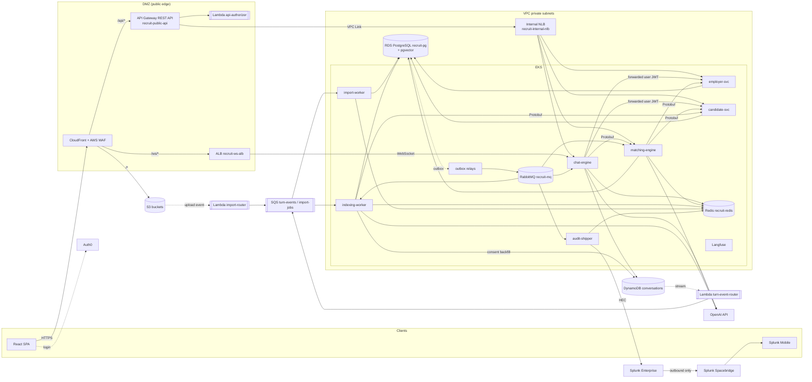

# High-Level Design

*[AI](https://en.wikipedia.org/wiki/Artificial_intelligence "Artificial Intelligence — Software that generates or assists with tasks such as writing code") Conversational Recruitment & Candidate Matching Ecosystem*

## Table of Contents

- [Service Map and Naming](#service-map-and-naming)
- [Architecture Diagram](#architecture-diagram)
- [API Design](#api-design)
- [Technology Mapping](#technology-mapping)
- [Stack Gaps](#stack-gaps)

---

## Service Map and Naming

All services live in one repository (a monorepo). They share libraries for the [LLM](https://en.wikipedia.org/wiki/Large_language_model "Large Language Model — Neural network trained on text that generates and interprets natural language") client, the outbox, deduplication, authorization and the Protobuf schemas. Each service owns its data. No service reads another service's schema.

| Component | Runs on | Owns | Role |
|---|---|---|---|
| `chat-engine` | [EKS](https://aws.amazon.com/eks/ "Amazon Elastic Kubernetes Service — Managed Kubernetes hosting on AWS"), namespace `edge` | [DynamoDB](https://aws.amazon.com/dynamodb/ "Amazon DynamoDB — Managed key-value and document database with single-digit-millisecond reads and writes") `conversations` | WebSocket runtime, dialogue orchestration with LangChain, draft extraction, confirm step |
| `employer-svc` | EKS, `core` | [PostgreSQL](https://www.postgresql.org/docs/current/ "PostgreSQL — Relational database storing and querying structured data with strong transactional guarantees") schema `employer` | Tenants, recruiters, jobs, applications, pipeline |
| `candidate-svc` | EKS, `core` | PostgreSQL schema `candidate`, [S3](https://aws.amazon.com/s3/ "Amazon Simple Storage Service — Durable object storage for files, datasets and archives") `recruit-cv-documents` | Profiles, [CV](https://en.wikipedia.org/wiki/Curriculum_vitae "Curriculum Vitae — Document summarizing a candidate's work history and qualifications") files, consent, import batches, erasure |
| `matching-engine` | EKS, `core` | PostgreSQL schema `matching` | Hybrid retrieval, LLM reranking, match runs, retrieval for the chat |
| `indexing-worker` | EKS, `workers` | writes `matching.chunks` | Chunks and embeds profile and dialogue text |
| `import-worker` | EKS, `workers` | writes `candidate` import rows | Pandas and [NumPy](https://numpy.org/doc/stable/ "NumPy — Array library that stores homogeneous numeric data in contiguous buffers and computes over it in native code") cleaning of legacy exports |
| `employer-outbox-relay`, `candidate-outbox-relay`, `matching-outbox-relay` | EKS, `workers` | each service's `outbox` table | Publish outbox rows to [RabbitMQ](https://www.rabbitmq.com/docs "RabbitMQ — Message broker that routes and queues messages between producers and consumers") |
| `audit-shipper` | EKS, `workers` | queue `audit.hec` | Sends audit events to Splunk [HEC](https://docs.splunk.com/Documentation/Splunk/latest/Data/UsetheHTTPEventCollector "HTTP Event Collector — Splunk endpoint that receives events over HTTPS, authenticated with a token") |
| `api-authorizer` | Lambda | — | Validates [Auth0](https://auth0.com/docs "Auth0 — Hosted identity platform that brokers sign-in, single sign-on and multi-factor authentication for applications") access tokens for [API](https://en.wikipedia.org/wiki/API "Application Programming Interface — Defines the contract by which software components exchange requests and data") Gateway |
| `turn-event-router` | Lambda | — | DynamoDB Streams to [SQS](https://aws.amazon.com/sqs/ "Amazon Simple Queue Service — Managed message queue that decouples producers from consumers") `turn-events` |
| `import-router` | Lambda | — | S3 upload event to SQS `import-jobs` |

**Messaging rule.** An event that starts in an [AWS](https://aws.amazon.com/ "Amazon Web Services — Cloud provider whose managed compute, storage and messaging services host a system") managed service (a DynamoDB stream record, an S3 upload) travels on **SQS**. An event that starts in a PostgreSQL transaction travels on **RabbitMQ** through the outbox. The rule gives each event exactly one bus, and both buses use the same Protobuf envelope and the same [Redis](https://redis.io/docs/latest/ "Redis — In-memory data store used as a cache and fast key-value store") deduplication (see `04-deep-dive.md`).

**Stateful systems.** Data services that the brief lists as AWS services are managed: [RDS](https://aws.amazon.com/rds/ "Amazon Relational Database Service — Managed hosting for relational databases such as PostgreSQL, with backups and failover") PostgreSQL `recruit-pg`, DynamoDB, S3, SQS. Redis `recruit-redis` and RabbitMQ `recruit-mq` are not in the AWS list, so they run on EKS through Helm charts on a dedicated `data` node group.

## Architecture Diagram

**Request flow.** CloudFront serves the [SPA](https://en.wikipedia.org/wiki/Single-page_application "Single Page Application — Web application that updates its content in place without full page reloads") from S3 and passes `/api/*` to API Gateway and `/ws/*` to the [ALB](https://docs.aws.amazon.com/elasticloadbalancing/latest/application/introduction.html "Application Load Balancer — AWS layer-7 load balancer that routes HTTP and WebSocket traffic to targets"). AWS [WAF](https://owasp.org/www-community/Web_Application_Firewall "Web Application Firewall — Filters and blocks malicious HTTP traffic before it reaches an application") runs on CloudFront, so both paths are filtered once. API Gateway calls `api-authorizer`, applies per-tenant throttling, and reaches services through a [VPC](https://aws.amazon.com/vpc/ "Virtual Private Cloud — Isolated private network in which cloud resources run") Link to the internal [NLB](https://docs.aws.amazon.com/elasticloadbalancing/latest/network/introduction.html "Network Load Balancer — Layer 4 load balancer that forwards TCP and TLS connections to targets"), with one listener per service. The ALB carries only WebSocket traffic to `chat-engine` and accepts connections only from CloudFront. Data stores sit in isolated subnets with no route to the internet.

## API Design

External APIs are [REST](https://en.wikipedia.org/wiki/REST "Representational State Transfer — Architectural style for stateless, resource-oriented HTTP APIs") with [JSON](https://www.json.org/json-en.html "JavaScript Object Notation — Lightweight text format for structured data exchange") bodies under `/api/v1`. Errors use `application/problem+json` ([RFC](https://www.rfc-editor.org/ "Request For Comments — Numbered document series that defines internet standards and protocols") 7807). Lists use cursor pagination. Writes that change a versioned record take `If-Match: <version>` and return `412` on conflict.

| Method and path | Service | Input | Returns |
|---|---|---|---|
| `POST /conversations` | chat-engine | `{kind: job_draft\|candidate_profile, job_id?}` | `201 {conversation_id}` |
| `GET /conversations?cursor=` | chat-engine | — | `{items: [ConversationSummary], next_cursor}` |
| `GET /conversations/{id}` | chat-engine | — | `{meta, draft, draft_version, turns[]}` |
| `POST /conversations/{id}/ws-ticket` | chat-engine | — | `{ticket, expires_in: 30}` |
| `POST /conversations/{id}/confirm` | chat-engine | `{draft_version}` | `201 {job_id}` or `{candidate_id}` |
| `POST /jobs` · `GET /jobs?status=` | employer-svc | `JobCreate` | `Job` · `{items: [Job]}` |
| `PATCH /jobs/{id}` · `POST /jobs/{id}:publish` | employer-svc | `JobPatch` + `If-Match` | `Job` |
| `POST /jobs/{id}/applications` | employer-svc | `{candidate_id?}` (candidate applies for self) | `201 Application` |
| `GET /jobs/{id}/applications` · `PATCH /applications/{id}` | employer-svc | `{stage}` | `Application` |
| `GET /candidates/me/profile` · `PUT /candidates/me/profile` | candidate-svc | `ProfileUpsert` + `If-Match` | `Profile` |
| `POST /candidates/me/cv` | candidate-svc | `{filename, content_type}` | `{upload_url, cv_id}` (presigned S3 upload) |
| `PUT /candidates/me/consents/{purpose}` | candidate-svc | `{granted, policy_version}` | `Consent` |
| `GET /candidates/me/export` · `DELETE /candidates/me` | candidate-svc | — | `202 {request_id}` |
| `GET /candidates/{id}` | candidate-svc | — | `CandidateView` (audited, see `06-security.md`) |
| `POST /imports` · `GET /imports/{id}` | candidate-svc | `{filename, column_map?}` | `{batch_id, upload_url}` · `ImportBatch` |
| `POST /jobs/{id}/match-runs` | matching-engine | `{reason}` | `202 {run_id}` |
| `GET /match-runs/{id}` | matching-engine | — | `{status, results: [{candidate_id, rank, score, rationale, evidence[]}]}` |
| `GET /candidates/me/job-matches` | matching-engine | — | `{items: [{job_id, score}]}` |

**WebSocket.** `wss://<app-domain>/ws/v1/conversations/{id}?ticket=<ticket>`. Frames are JSON: the client sends `user.message` and `resume {last_seq}`; the server sends `assistant.delta {msg_id, seq, text}`, `assistant.done`, `draft.patch {draft_version, ops}`, `turn.failed`, `server.draining`. The protocol and its resume rules are in `04-deep-dive.md`.

**Internal APIs.** These are REST over cluster-internal service names with `Content-Type: application/x-protobuf`, and are never routed through the NLB. JSON stays available through content negotiation for debugging.

| Endpoint | Service | Request → response message |
|---|---|---|
| `POST /internal/v1/candidates:batchGet` | candidate-svc | `CandidateFeaturesRequest` → `CandidateFeaturesBatch` |
| `GET /internal/v1/jobs/{id}/requirements` | employer-svc | — → `JobRequirements` |
| `POST /internal/v1/retrieve` | matching-engine | `RetrievalQuery` → `RetrievalResult` |

## Technology Mapping

| Technology | Role in this design | Alternative not chosen, and why |
|---|---|---|
| Python, [FastAPI](https://fastapi.tiangolo.com/ "FastAPI — Python web framework for building HTTP APIs with async support and automatic schema generation"), [Pydantic](https://docs.pydantic.dev/latest/ "Pydantic — Python library that validates and parses data against typed models at runtime") | All backend services and workers; Pydantic models are the REST contract and the extraction schema for drafts | Django: heavier, and its async support is not end to end |
| TypeScript, JavaScript, React, [HTML](https://html.spec.whatwg.org/ "HyperText Markup Language — Markup format that structures content for web browsers")/[CSS](https://developer.mozilla.org/en-US/docs/Web/CSS "Cascading Style Sheets — Describes how HTML elements are laid out and styled in a browser") | The SPA; TypeScript for app code, JavaScript only in build tooling | Server-side rendering: no [SEO](https://developers.google.com/search/docs/fundamentals/seo-starter-guide "Search Engine Optimization — Shapes page content so that search engines rank it higher") need behind a login |
| Zustand | Client state for streaming messages, draft patches and connection status | Redux Toolkit: more boilerplate for high-frequency token updates |
| Tailwind CSS | Styling of the SPA | CSS modules: slower to keep consistent across many chat states |
| REST API | Every external and internal endpoint | [GraphQL](https://graphql.org/ "GraphQL — Query language that lets a client choose which fields an API returns"): the client needs few, fixed views, so it gains little |
| WebSockets | Token streaming and draft patches, both directions | Server-sent events: one direction only; API Gateway WebSocket API: see `04-deep-dive.md` |
| Protobuf | Heavy internal payloads and every event envelope | [gRPC](https://grpc.io/docs/ "gRPC Remote Procedure Calls — Contract-first remote procedure call framework running over HTTP/2 with protocol buffer payloads"): a second remote-call framework and [HTTP](https://datatracker.ietf.org/doc/html/rfc9110 "Hypertext Transfer Protocol — Application protocol used to request and transfer web resources")/2 load balancing for three endpoints |
| [SQLAlchemy](https://www.sqlalchemy.org/ "SQLAlchemy — Python SQL toolkit and ORM that maps objects to relational tables and builds queries"), [Alembic](https://alembic.sqlalchemy.org/en/latest/ "Alembic — Applies and versions database schema migrations for SQLAlchemy") | Async [ORM](https://en.wikipedia.org/wiki/Object%E2%80%93relational_mapping "Object Relational Mapper — Maps application objects to relational database rows and queries"); one migration history per schema | Raw [SQL](https://en.wikipedia.org/wiki/SQL "Structured Query Language — Queries and manipulates data in a relational database") only: loses typed models shared with the outbox library |
| [OAuth2](https://datatracker.ietf.org/doc/html/rfc6749 "OAuth 2.0 — Authorization framework that lets an application access resources on a user's behalf"), Auth0, [SSO](https://en.wikipedia.org/wiki/Single_sign-on "Single Sign-On — Lets a user sign in once with one identity provider and reach several applications"), [SAML](https://docs.oasis-open.org/security/saml/v2.0/ "Security Assertion Markup Language — XML standard an identity provider uses to pass sign-in assertions to an application") 2.0, Active Directory, [TFA](https://en.wikipedia.org/wiki/Multi-factor_authentication "Two-Factor Authentication — Requires a second proof of identity besides a password at sign-in") | Auth0 is the identity broker: SAML 2.0 to each client's Active Directory for SSO, email and social login for candidates, TFA through Auth0 [MFA](https://en.wikipedia.org/wiki/Multi-factor_authentication "Multi Factor Authentication — Requires more than one form of evidence to verify a user's identity") | Amazon Cognito: per-tenant SAML connections through Auth0 Organizations need no custom code, Cognito needs more |
| [OpenAI](https://platform.openai.com/docs/ "OpenAI — Provides GPT models through an API and official SDKs") API, LangChain, [RAG](https://en.wikipedia.org/wiki/Retrieval-augmented_generation "Retrieval-Augmented Generation — Grounds a model's answer in documents retrieved at query time") | Reply, extraction and rerank models; embeddings; LangChain chains the retrieval and the prompts | Hand-written orchestration: LangChain gives retrievers, structured output and the Langfuse callback |
| Langfuse | Prompt versions, LLM traces, cost, evaluation datasets; self-hosted | Langfuse Cloud: candidate text would leave the VPC |
| PostgreSQL (RDS) | Domain records, outbox tables, vector and full-text search | A separate vector database: one more stateful system at 10 M vectors |
| DynamoDB | Conversation turns and drafts; its stream feeds indexing | PostgreSQL: a turn write on every message would load the primary for data that needs no joins |
| Redis | Deduplication, in-flight stream buffer, WebSocket tickets, rate limits, cache | Memcached: no streams, no atomic `SET NX` with a value check |
| RabbitMQ | Domain event bus from the outboxes, with routing and dead-lettering | [Kafka](https://kafka.apache.org/documentation/ "Apache Kafka — Distributed log that stores partitioned, replicated streams of records for publish-subscribe and stream processing"): replay is not needed, and the operating cost is higher |
| SQS | Buffer for events from Lambda (turn events, import jobs) | Sending into RabbitMQ from Lambda: couples serverless code to cluster health |
| Pandas, NumPy | Chunked cleaning and deduplication of legacy exports | Spark: disproportionate for batches of 20,000 to 1.5 M rows |
| HTTPx, Tenacity | Shared async client for every OpenAI call, with one retry layer | [SDK](https://en.wikipedia.org/wiki/Software_development_kit "Software Development Kit — Packaged set of tools and libraries for building against a platform") built-in retries: they would multiply with Tenacity |
| PyTest, Jest, React Testing Library | Backend, store and component tests; gates in [CI](https://en.wikipedia.org/wiki/Continuous_integration "Continuous Integration — Automatically builds and tests code on every change") | — |
| Splunk, Splunk HEC | Central logs, metrics, audit and security dashboards; HEC is the ingest path | CloudWatch: the security team already correlates everything in Splunk |
| Splunk Secure Gateway, Splunk Spacebridge | Mobile access to dashboards and alerts with outbound-only connections | A virtual private network for mobile staff: inbound exposure and device management cost |
| [FMC](https://www.cisco.com/c/en/us/support/security/defense-center/series.html "Cisco Secure Firewall Management Center — Central console that configures Cisco firewalls and streams their intrusion and connection events"), [SNA](https://www.cisco.com/c/en/us/support/security/stealthwatch/series.html "Cisco Secure Network Analytics — Analyses network flow telemetry to detect threats and unusual host behaviour"), eStreamer | Firewall intrusion events (FMC over eStreamer) and flow analytics (SNA) into Splunk | — (owned by the security team) |
| [Terraform](https://developer.hashicorp.com/terraform/docs "Terraform — Infrastructure as code tool that declares and provisions cloud infrastructure from configuration files") | All AWS resources, [IAM](https://aws.amazon.com/iam/ "AWS Identity and Access Management — Controls which principals may perform which actions on which AWS resources") roles and the EKS cluster | CloudFormation: the team already runs Terraform |
| AWS IAM, VPC, RDS, Lambda, EKS, [ECR](https://aws.amazon.com/ecr/ "Amazon Elastic Container Registry — Stores, scans and serves container images for deployment"), SQS, S3, API Gateway, DynamoDB | Identity, network, managed data, serverless routing, cluster, image registry | — |
| Docker, [Kubernetes](https://kubernetes.io/ "Kubernetes — Automates deployment, scaling and management of containerized applications") (EKS), Helm, Linux | Images, orchestration, one chart per service from a shared library chart | [ECS](https://aws.amazon.com/ecs/ "Amazon Elastic Container Service — Managed container orchestration on AWS; with Fargate it runs containers without managing servers"): Helm and Kubernetes skills are in the stack already |
| Claude Code, Gemini | Developer tools; no runtime role | — |

## Stack Gaps

These components are **not in the Environment**. Each fills a gap the listed stack cannot fill. They are flagged here once, and later files use them without repeating the flag.

| Added component | Gap it fills | Operational cost |
|---|---|---|
| CloudFront | [CDN](https://en.wikipedia.org/wiki/Content_delivery_network "Content Delivery Network — Distributes cached content across edge locations to reduce latency") for the SPA; one edge for WAF in front of both API Gateway and the ALB | Low |
| AWS WAF, AWS Shield Standard | Web filtering and [DDoS](https://en.wikipedia.org/wiki/Denial-of-service_attack "Distributed Denial of Service — Attack that floods a system with traffic from many sources to make it unavailable") protection that the template requires | Low; rule tuning |
| ALB and NLB (AWS Load Balancer Controller) | EKS needs a load balancer; the REST API VPC Link needs an NLB; WebSockets need an ALB | Low |
| AWS [KMS](https://aws.amazon.com/kms/ "AWS Key Management Service — Creates and controls the keys that encrypt data at rest, and logs every use"), [ACM](https://aws.amazon.com/certificate-manager/ "AWS Certificate Manager — Issues and renews the TLS certificates used by AWS load balancers, CloudFront and API Gateway"), Secrets Manager | Keys, certificates and secrets that any AWS design needs | Low |
| pgvector (PostgreSQL extension) | RAG needs a vector index; the extension keeps it in RDS | Low; index memory sizing |
| Linkerd | Automatic mTLS and workload identity between pods | Medium; one more control plane |
| OpenTelemetry SDK, Splunk OpenTelemetry Collector | Trace context and log shipping from pods to HEC | Low |
| ClickHouse | Required by self-hosted Langfuse, not a platform choice | Medium; a stateful system |
| `cryptography` (Python package) | Field-level [AES-256](https://csrc.nist.gov/pubs/fips/197/final "Advanced Encryption Standard with a 256-bit key — Symmetric encryption of data at rest and in transit") encryption of contact details | Low |
| A CI runner | The Environment names no CI system; any runner that can assume an AWS role through [OIDC](https://openid.net/developers/how-connect-works/ "OpenID Connect — Identity layer on top of OAuth 2.0 for authenticating users") works | — |

> **Verify Before Build:** REST API private integrations need an NLB behind the VPC Link — this was true for VPC Link v1. Check the current API Gateway documentation for REST APIs, because newer VPC Link versions may accept an ALB and remove the NLB.
