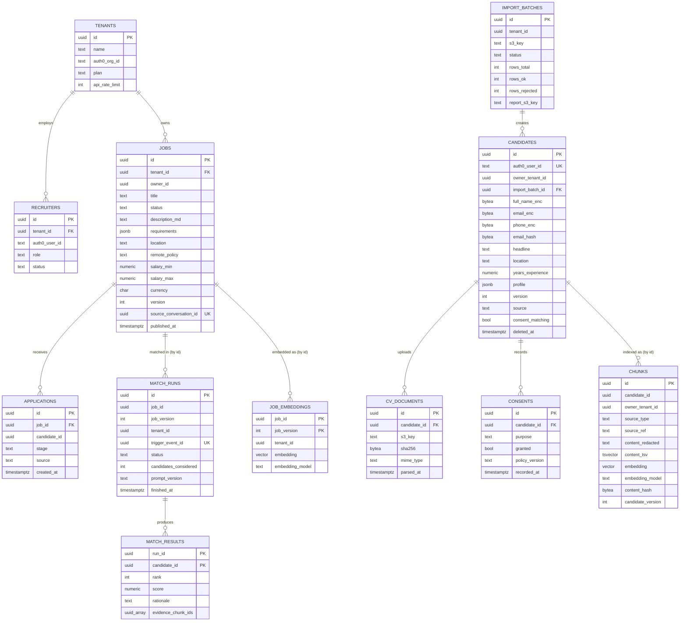

# Data Modeling & Storage

*[AI](https://en.wikipedia.org/wiki/Artificial_intelligence "Artificial Intelligence — Software that generates or assists with tasks such as writing code") Conversational Recruitment & Candidate Matching Ecosystem*

## Table of Contents

- [Ownership Rules](#ownership-rules)
- [Schema Design](#schema-design)
- [Conversation State in DynamoDB](#conversation-state-in-dynamodb)
- [Protobuf Contracts](#protobuf-contracts)
- [Redis Keyspace and S3 Layout](#redis-keyspace-and-s3-layout)
- [Storage Choice and Partitioning](#storage-choice-and-partitioning)

---

## Ownership Rules

- [RDS](https://aws.amazon.com/rds/ "Amazon Relational Database Service — Managed hosting for relational databases such as PostgreSQL, with backups and failover") `recruit-pg` holds three schemas: `employer`, `candidate` and `matching`. Each schema belongs to one service, and only that service's database roles can reach it (grants are in `06-security.md`).
- There are **no foreign keys across schemas**. A cross-schema reference is a plain [UUID](https://datatracker.ietf.org/doc/html/rfc9562 "Universally Unique Identifier — 128-bit identifier that can be generated without a central authority"), and the owning service's [API](https://en.wikipedia.org/wiki/API "Application Programming Interface — Defines the contract by which software components exchange requests and data") resolves it. This keeps a later split into separate databases a data move, not a redesign.
- Each schema has its own `outbox` table and its own [Alembic](https://alembic.sqlalchemy.org/en/latest/ "Alembic — Applies and versions database schema migrations for SQLAlchemy") history. Alembic stores its version table inside the schema (`version_table_schema`).
- Every aggregate that other services react to has a `version` column. Events carry that version, so a consumer can ignore an event older than the state it already holds.
- Langfuse uses a separate database, `langfuse`, on the same RDS instance, with its own role.

## Schema Design

**Key entities.**

| Entity | Schema | Notes |
|---|---|---|
| `jobs` | employer | `requirements` is [JSONB](https://www.postgresql.org/docs/current/datatype-json.html "JSON Binary — PostgreSQL type storing JSON documents in a decomposed binary form that can be indexed") validated by the `JobDraft` [Pydantic](https://docs.pydantic.dev/latest/ "Pydantic — Python library that validates and parses data against typed models at runtime") model. The unique `source_conversation_id` makes a repeated confirm create nothing new |
| `applications` | employer | Unique on `(job_id, candidate_id)`. `source` is `applied` or `sourced_match` |
| `candidates` | candidate | `owner_tenant_id` is null for pool profiles and set for a tenant's private imported applicants. Contact fields are encrypted in the application; `email_hash` is an [HMAC](https://datatracker.ietf.org/doc/html/rfc2104 "Hash-based Message Authentication Code — Verifies both the integrity and authenticity of a message using a shared secret key") blind index for deduplication and lookup |
| `consents` | candidate | Append-only history. `candidates.consent_matching` is the current value, updated in the same transaction |
| `chunks` | matching | One row per searchable text unit: a profile summary, an experience section, a [CV](https://en.wikipedia.org/wiki/Curriculum_vitae "Curriculum Vitae — Document summarizing a candidate's work history and qualifications") section or a dialogue answer. Text is stored with names and contact details removed. `embedding` is `vector(512)`; `content_tsv` is a generated column |
| `match_runs`, `match_results` | matching | One run per job version and trigger. Only the top 50 reranked results are stored. Runs older than 12 months are deleted |
| `outbox` (each schema) | all | `id bigserial`, `event_id uuid`, `aggregate_id`, `aggregate_version`, `event_type`, `payload bytea` (Protobuf), `headers jsonb`, `created_at`, `published_at` |

The `chunks.owner_tenant_id` copies `candidates.owner_tenant_id` at indexing time. This lets the matching query filter by visibility without a cross-schema join. A change of owner is rare and publishes `candidate.updated`, which re-indexes the rows.

## Conversation State in DynamoDB

Table `conversations`, on-demand capacity, Streams enabled with `NEW_IMAGE`, [TTL](https://en.wikipedia.org/wiki/Time_to_live "Time To Live — Duration after which a cached or stored value expires") on `expires_at`, point-in-time recovery on.

| Item | Partition key `PK` | Sort key `SK` | Main attributes |
|---|---|---|---|
| Conversation meta | `CONV#<conversation_id>` | `META` | `owner_user_id`, `tenant_id`, `subject_id` (candidate or job id), `kind`, `status`, `draft` (map), `draft_version`, `summary`, `last_seq`, `prompt_version`, `gsi1pk`, `gsi1sk`, `expires_at` |
| Turn | `CONV#<conversation_id>` | `TURN#<seq, zero-padded to 8>` | `role`, `content`, `token_count`, `model`, `langfuse_trace_id`, `status` (`complete` or `failed`), `created_at`, `expires_at` |

- **[GSI](https://docs.aws.amazon.com/amazondynamodb/latest/developerguide/GSI.html "Global Secondary Index — DynamoDB index with its own partition key that serves an alternative access pattern") `gsi1_owner`:** `gsi1pk = USER#<owner_user_id>`, `gsi1sk = <updated_at>`. Only `META` items carry these attributes, so the index is sparse and lists a user's conversations newest first.
- **Writes are conditional.** A turn is written with `attribute_not_exists(SK)`, so a retried write cannot create a second turn with the same sequence number. A draft update requires `draft_version = :expected`, so two extraction results cannot overwrite each other silently.
- **Retention.** `expires_at` is set to 180 days after last activity on every write. The confirmed result lives in [PostgreSQL](https://www.postgresql.org/docs/current/ "PostgreSQL — Relational database storing and querying structured data with strong transactional guarantees"), so the transcript is not needed after that.
- **Access patterns.** Load a conversation: one strongly consistent `Query` on the partition, newest 20 turns plus `META`. List conversations: `Query` on `gsi1_owner`. Erase a user: `Query` on `gsi1_owner`, then delete each partition.

## Protobuf Contracts

The internal APIs and events in `02-high-level-design.md` carry these messages. Each message maps to the entity that owns its data, so a field in a message always has a column or attribute behind it.

| Message | Built from | Main fields |
|---|---|---|
| `JobRequirements` | `employer.jobs` | `job_id`, `version`, `tenant_id`, `title`, repeated `must_have_skills`, repeated `nice_to_have_skills`, `seniority`, `location`, `remote_policy`, `salary_min`, `salary_max`, `currency` |
| `CandidateFeaturesRequest` | — | repeated `candidate_ids`, `tenant_id` of the caller |
| `CandidateFeaturesBatch` | `candidate.candidates` | repeated `CandidateFeatures`: `candidate_id`, `version`, `consent_matching`, `headline`, `location`, `years_experience`, repeated skills and experience entries from `profile`; never the encrypted contact fields |
| `RetrievalQuery` | — | `tenant_id`, `query_text`, `kind` (`candidates`, `past_jobs`), `top_k` |
| `RetrievalResult` | `matching.chunks`, `matching.job_embeddings` | repeated hits: `chunk_id` and `candidate_id`, or `job_id`; `score`; `content_redacted` |
| `events.v1.Envelope` | each `outbox` row, each [DynamoDB](https://aws.amazon.com/dynamodb/ "Amazon DynamoDB — Managed key-value and document database with single-digit-millisecond reads and writes") stream record | `event_id`, `event_type`, `aggregate_id`, `aggregate_version`, `occurred_at`, `traceparent`, `payload` |

Rules: fields are added, never renumbered; a removed field number goes into `reserved`. A consumer ignores fields it does not know, so producers can deploy first.

## Redis Keyspace and S3 Layout

| Key pattern | Type | TTL | Written by | Purpose |
|---|---|---|---|---|
| `dedup:<consumer>:<event_id>` | string | 300 s while `inflight`, 7 days when `done` | every consumer | Deduplication (see `04-deep-dive.md`) |
| `stream:<conversation_id>:<msg_id>` | stream | 15 min | chat-engine | Buffer of an in-flight reply, for resume on another pod |
| `wsticket:<ticket>` | string | 30 s | chat-engine | One-use WebSocket ticket, read with `GETDEL` |
| `ratelimit:<scope>:<id>` | string | window length | chat-engine, matching-engine, indexing-worker | Token buckets for turns per user, [LLM](https://en.wikipedia.org/wiki/Large_language_model "Large Language Model — Neural network trained on text that generates and interprets natural language") tokens per tenant and embedding tokens |
| `cache:job:<job_id>:v<version>` | string (Protobuf) | 1 h | matching-engine | Cached `JobRequirements` |
| `emb:<model>:<sha256>` | string | 30 days | matching-engine, indexing-worker | Embedding cache by content hash |

[Redis](https://redis.io/docs/latest/ "Redis — In-memory data store used as a cache and fast key-value store") runs with [AOF](https://redis.io/docs/latest/operate/oss_and_stack/management/persistence/ "Append Only File — Redis persistence mode that logs every write for durability") (`appendfsync everysec`), so a failover can lose up to about one second of writes. Nothing in Redis is the only copy of a fact (see `04-deep-dive.md`).

| Bucket | Prefixes | Versioning, lifecycle |
|---|---|---|
| `recruit-cv-documents` | `cv/<candidate_id>/<cv_id>` | Versioned; noncurrent versions expire after 30 days; replicated to the recovery region |
| `recruit-imports` | `imports/<tenant_id>/<batch_id>/`, `reports/<tenant_id>/<batch_id>/` | Source files expire after 30 days; reports after 180 days |
| `recruit-spa` | build output | Versioned; served only through CloudFront |
| `recruit-langfuse-events` | Langfuse event blobs | Expire after 30 days |

## Storage Choice and Partitioning

**PostgreSQL: no sharding.** The 5-year estimate in `01-requirements.md` is about 190 GB, and peak load is about 300 req/s plus a few vector queries per second. One Multi-[AZ](https://aws.amazon.com/about-aws/global-infrastructure/regions_az/ "Availability Zone — Isolated group of data centres within an AWS Region, used to survive a single-site failure") primary (`db.r6g.2xlarge`, 64 GB RAM) handles this. Storage is 500 GB gp3 with autoscaling.

- **Vector memory drives the instance size.** 10 M chunks at 512 dimensions need about 23 GB of [HNSW](https://arxiv.org/abs/1603.09320 "Hierarchical Navigable Small World — Graph index for approximate nearest-neighbour search over vectors") index today and about 52 GB after 5 years. The index must stay mostly in memory for the retrieval latency in `04-deep-dive.md`.
- **Evolution trigger 1:** when the HNSW index passes 70% of instance RAM, move up one instance size. When that is no longer enough, move `matching` to its own RDS instance. The schema already has no cross-schema keys, so this is a data move.
- **Evolution trigger 2:** when primary CPU stays above 60%, add a read replica for `matching` retrieval queries. Audited reads stay on the primary (see `06-security.md`).
- **Evolution trigger 3:** when `applications` passes about 100 M rows, partition it by hash of `job_id`.
- `match_runs` and `match_results` are deleted after 12 months with batched deletes. `outbox` rows are deleted 7 days after `published_at`.

**DynamoDB: partition key is the conversation.** One conversation receives at most about one write per second. This is far below the per-partition limit, so there is no hot key. Load is spread by the random conversation id, and on-demand capacity absorbs peaks with no planning.

**Why two stores for dialogue data.** A turn is written on every message and read only by its own conversation. It never joins other data. DynamoDB gives single-digit millisecond writes for this and removes about 360,000 writes per day from the PostgreSQL primary. The cost is a second store and a copy step: `confirm` moves the draft into PostgreSQL through the owning service's API, and only that copy is the business record.

> **Verify Before Build:** HNSW memory figures assume pgvector defaults (`m = 16`) and 4-byte floats. Check the real size with `pg_relation_size` on a 1 M-row sample before choosing the instance. `halfvec` storage would halve it, but it needs pgvector 0.7 or later on the RDS engine version you use.
