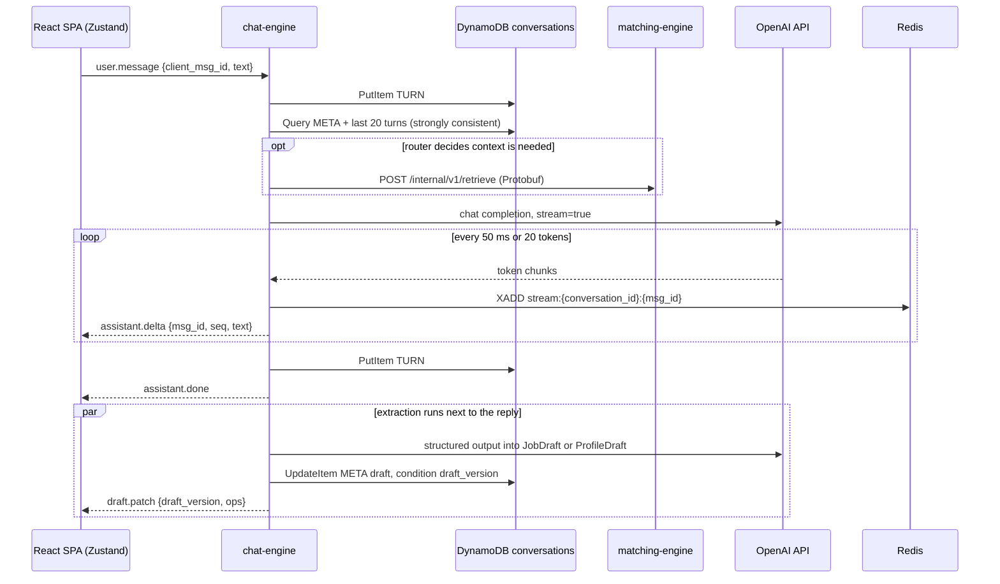
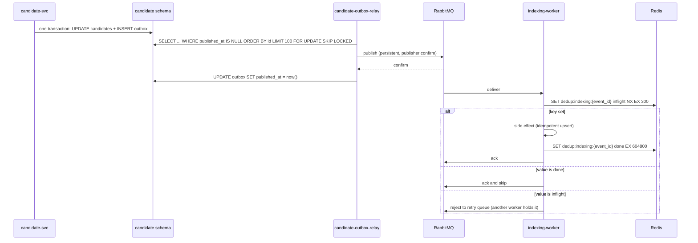

# Deep Dive & Bottlenecks

*[AI](https://en.wikipedia.org/wiki/Artificial_intelligence "Artificial Intelligence — Software that generates or assists with tasks such as writing code") Conversational Recruitment & Candidate Matching Ecosystem*

## Table of Contents

- [Communication Patterns](#communication-patterns)
- [Live Dialogue Path](#live-dialogue-path)
- [Event Delivery with Outbox and Deduplication](#event-delivery-with-outbox-and-deduplication)
- [RAG Indexing and Matching](#rag-indexing-and-matching)
- [LLM Client Resilience](#llm-client-resilience)
- [Failure Modes](#failure-modes)
- [Trade-offs](#trade-offs)

---

## Communication Patterns

| Flow | Style | Why |
|---|---|---|
| [SPA](https://en.wikipedia.org/wiki/Single-page_application "Single Page Application — Web application that updates its content in place without full page reloads") → services | Sync [REST](https://en.wikipedia.org/wiki/REST "Representational State Transfer — Architectural style for stateless, resource-oriented HTTP APIs") through [API](https://en.wikipedia.org/wiki/API "Application Programming Interface — Defines the contract by which software components exchange requests and data") Gateway | Request and answer; the user waits |
| SPA ↔ `chat-engine` | WebSocket, [JSON](https://www.json.org/json-en.html "JavaScript Object Notation — Lightweight text format for structured data exchange") frames | Tokens and draft patches go server to client, messages go client to server, on one socket |
| `chat-engine` → `employer-svc`, `candidate-svc` (confirm) | Sync REST with the forwarded user [JWT](https://datatracker.ietf.org/doc/html/rfc7519 "JSON Web Token — Compact, signed token format for carrying claims between parties") | The owning service makes its own authorization decision |
| `matching-engine` ↔ `candidate-svc`, `employer-svc`; `chat-engine` → `matching-engine` | Sync internal REST, Protobuf bodies | Large repeated fields; schema checked at both ends |
| Domain events (`job.published`, `candidate.confirmed`, `candidate.consent.changed`, `candidate.imported`, `candidate.erased`, `match.requested`, `audit.*`) | Async: outbox → [RabbitMQ](https://www.rabbitmq.com/docs "RabbitMQ — Message broker that routes and queues messages between producers and consumers") topic exchange `domain.events` | Written in the same transaction as the change, so no event is lost |
| Turn events, import jobs | Async: [DynamoDB](https://aws.amazon.com/dynamodb/ "Amazon DynamoDB — Managed key-value and document database with single-digit-millisecond reads and writes") Streams or [S3](https://aws.amazon.com/s3/ "Amazon Simple Storage Service — Durable object storage for files, datasets and archives") event → Lambda → [SQS](https://aws.amazon.com/sqs/ "Amazon Simple Queue Service — Managed message queue that decouples producers from consumers") | Starts in a managed service; follows the messaging rule in `02-high-level-design.md` |

**Protobuf.** Every event body and every heavy internal payload is a Protobuf message from `proto/` in the monorepo. A `CandidateFeaturesBatch` for 200 candidates carries skills, experience entries, locations and scores as repeated fields. JSON repeats every key name in every record, and Protobuf does not. Protobuf also gives a schema that fails at build time when a field changes type. Field numbers are never reused (`reserved`), and [CI](https://en.wikipedia.org/wiki/Continuous_integration "Continuous Integration — Automatically builds and tests code on every change") blocks breaking changes (`05-reliability.md`). The event envelope `events.v1.Envelope` holds `event_id`, `event_type`, `aggregate_id`, `aggregate_version`, `occurred_at`, `traceparent` and `payload`. SQS bodies carry the same envelope, base64-encoded.

> **Deep Dive Reference:** Protobuf versus JSON cost in Python — [Pydantic](https://docs.pydantic.dev/latest/ "Pydantic — Python library that validates and parses data against typed models at runtime") v2 parses JSON in Rust, so the parse-time gain may be smaller than the size gain. Benchmark a real `CandidateFeaturesBatch` for bytes on the wire and parse time before claiming either.

## Live Dialogue Path

**Real-time evaluation.** The extraction chain starts when the user message arrives, in parallel with the reply. It uses LangChain structured output bound to the `JobDraft` or `ProfileDraft` Pydantic model and a small model. Pydantic validates the result, and the chain computes which required fields are still missing. The next reply prompt receives that list, so the assistant asks about the gap instead of a fixed form question. A rejected extraction keeps the previous draft and logs a Langfuse score.

**Time to first token budget (p95).**

| Step | p95 |
|---|---|
| Frame receive, ticket-bound session check | 5 ms |
| DynamoDB user-turn write + strongly consistent `Query` | 20 ms |
| Retrieval (only on turns the router selects): query embedding, cached by hash when possible, 300 ms + hybrid query 50 ms + hop 10 ms | 360 ms |
| Prompt assembly, Langfuse prompt from local cache | 10 ms |
| [OpenAI](https://platform.openai.com/docs/ "OpenAI — Provides GPT models through an API and official SDKs") time to first token | 900 ms |
| First delta flush | 50 ms |
| **Total** | **1,345 ms, under the 1.5 s target** |

Only 155 ms is left in the budget. So a Tenacity retry before the first token always breaks the target, and that is counted as an [SLO](https://sre.google/sre-book/service-level-objectives/ "Service Level Objective — Target value for a service level indicator that a service commits to meet") miss. The 900 ms figure is an assumption about the provider and needs measurement per model.

**Frontend state.** Zustand keeps three stores: `conversationStore` (messages by id, streaming buffer, last `seq`, connection state), `draftStore` (fields, `draft_version`, fields updated in the last patch), `sessionStore` (user, tenant, ticket refresh). Deltas are appended to a buffer and flushed into the store once per animation frame. Components subscribe with selectors to one message, so one token re-renders one bubble, not the whole list. A `draft.patch` with an older `draft_version` than the store holds is dropped.

**Resume and draining.** The client sends `resume {last_seq}` after every reconnect. If a reply is still streaming, the new pod reads `stream:<conversation_id>:<msg_id>` from [Redis](https://redis.io/docs/latest/ "Redis — In-memory data store used as a cache and fast key-value store") after `last_seq` and follows it. The Redis stream is the only way a second pod can see tokens the first pod is still producing. If the first pod died, no one writes to the stream, so the new pod sends `turn.failed` after 10 s without new entries, and the UI offers "regenerate". On deploy, a pod sends `server.draining`, and clients reconnect to other pods. The pod then waits up to 120 s for its own replies to finish.

**Why not the API Gateway WebSocket API.** It would hold connections without pods. But every token batch would be a separate `PostToConnection` [HTTPS](https://datatracker.ietf.org/doc/html/rfc9110 "HTTP Secure — HTTP encrypted with TLS to protect requests and responses in transit") call from the pod, which adds latency and a charge per message on the hottest path. Direct sockets keep streaming inside the process. The cost is that the pods hold connections, which is why draining and resume exist.

## Event Delivery with Outbox and Deduplication

- **Why duplicates happen.** The relay can crash after the broker confirms and before it marks the row, so it publishes the row again. RabbitMQ also redelivers when a worker dies before its ack. Delivery is at-least-once by design.
- **Why the dedup key has two states.** An `inflight` key with a 300 s [TTL](https://en.wikipedia.org/wiki/Time_to_live "Time To Live — Duration after which a cached or stored value expires") stops two workers from running the same event at once. It also expires if the worker dies, so the event is not lost. Only a `done` key suppresses the event for good.
- **The backstop is the sink, not Redis.** A Redis failover can lose about one second of keys. Every side effect is therefore also idempotent on its own: chunks upsert on `(candidate_id, source_type, source_ref, content_hash)`, match runs are unique on `trigger_event_id`, [HEC](https://docs.splunk.com/Documentation/Splunk/latest/Data/UsetheHTTPEventCollector "HTTP Event Collector — Splunk endpoint that receives events over HTTPS, authenticated with a token") events carry `event_id`. Redis removes nearly all duplicates cheaply, and the sink catches the rest.
- **Ordering.** Competing consumers do not keep order. Consumers compare `aggregate_version` with the version they hold and drop older events.
- **Retries.** Each consumer queue is a quorum queue with a dead-letter exchange `domain.dlx`. A failed message goes to `<queue>.retry` with a 30 s message TTL and then back to the main queue. After 5 deliveries it goes to `<queue>.dlq`, which raises an alert.
- **Relay throughput.** 100 rows every 500 ms, and immediately again when a batch is full. This is far above the peak of about 50 domain events per second, and it drains a 1,000-row import batch in seconds.

## RAG Indexing and Matching

**Indexing.** `turn-event-router` sends user turns of `candidate_profile` conversations from DynamoDB Streams to SQS `turn-events`; recruiter turns are not indexed. `indexing-worker` reads the candidate's current consent through `candidates:batchGet`, and only then chunks, redacts and embeds the text. Without consent it skips the event. A later `candidate.consent.changed` event with `granted = true` makes the worker read that candidate's turns from DynamoDB and index them. `candidate.confirmed` replaces the profile-summary chunk. `job.published` makes `matching-engine` write the job's row in `job_embeddings`, which the chat uses to suggest wording from the tenant's past jobs. Embeddings use `text-embedding-3-small` at 512 dimensions, in batches of up to 100 texts, through the `ratelimit:openai:embed` token bucket.

Bulk imports publish to a separate queue, `indexing.bulk`, which has fewer consumers. Live dialogue indexing therefore keeps its 60 s freshness target while a 1.5 M-row import runs.

**Matching a job.** `job.published` or `POST /jobs/{id}/match-runs` starts a run in `matching-engine`. The REST call writes a `queued` run and a `match.requested` outbox row in one transaction, so both triggers arrive as events and a crashed run is redelivered.

1. Load `JobRequirements` (Redis `cache:job`, else `employer-svc` over Protobuf) and embed the requirement text.
2. Hybrid retrieval over `matching.chunks`: [HNSW](https://arxiv.org/abs/1603.09320 "Hierarchical Navigable Small World — Graph index for approximate nearest-neighbour search over vectors") vector search and full-text search on `content_tsv`, each with the visibility filter `owner_tenant_id IS NULL OR owner_tenant_id = :tenant`. The two ranked lists are merged with reciprocal rank fusion, then grouped by candidate, which gives the top 200.
3. `candidates:batchGet` for those 200. It returns features and the **current** consent from [PostgreSQL](https://www.postgresql.org/docs/current/ "PostgreSQL — Relational database storing and querying structured data with strong transactional guarantees"). Candidates without consent are dropped here, so a withdrawal counts at once, even before the index is updated.
4. Rerank the top 50 with the reply model, in 5 parallel calls of 10 candidates. Candidate text has names, contact details, photos and dates of birth removed. The model returns a score and a rationale that cites chunk ids.
5. Write `match_results` and set the run to `complete`, in one transaction. The SPA sees the result on its next `GET /match-runs/{id}`.

| Match run step | p95 |
|---|---|
| Requirements + embedding | 350 ms |
| Hybrid retrieval and grouping | 150 ms |
| `batchGet` for 200 candidates | 80 ms |
| Rerank: 5 parallel calls, about 1,000 output tokens each | 20 s |
| One `batch`-policy retry on one call (backoff up to 8 s + repeat) | +28 s |
| **Total with one retry** | **about 49 s, under the 60 s target** |

> **Deep Dive Reference:** Ranking quality and bias — the rerank prompt decides who a recruiter sees. Build a labelled evaluation set in Langfuse, track [NDCG](https://en.wikipedia.org/wiki/Discounted_cumulative_gain "Normalized Discounted Cumulative Gain — Ranking metric that rewards relevant results appearing near the top") and [MRR](https://en.wikipedia.org/wiki/Mean_reciprocal_rank "Mean Reciprocal Rank — Ranking metric scoring how high the first relevant result appears") per prompt version, and measure selection rates per group before release. The EU AI Act treats this as a high-risk system (`06-security.md`).

## LLM Client Resilience

The shared `llm_client` library owns one `httpx.AsyncClient` per process: pool of 100 connections, connect timeout 3 s, and a read timeout of 30 s for normal calls or 10 s between chunks for streams. The OpenAI [SDK](https://en.wikipedia.org/wiki/Software_development_kit "Software Development Kit — Packaged set of tools and libraries for building against a platform") and LangChain's `ChatOpenAI` receive this client with `max_retries=0`, so Tenacity is the **only** retry layer. With SDK retries also on, four Tenacity attempts would become up to twelve requests.

- **Retry on:** [HTTP](https://datatracker.ietf.org/doc/html/rfc9110 "Hypertext Transfer Protocol — Application protocol used to request and transfer web resources") 429, 500, 502, 503, 504, connect errors and timeouts. **Do not retry:** 400, 401, 403, and content-policy refusals.
- **Wait:** `wait_random_exponential(multiplier=0.5, max=8)`, or the `Retry-After` header when it is longer.
- **Stop, two policies:** `interactive` (chat replies and extraction) stops after 4 attempts or 20 s, whichever comes first. `batch` (rerank and embedding calls) stops after 5 attempts or 120 s, because one rerank call alone can take 20 s.
- **Streams:** a stream is retried only before its first token reaches the user. After that, a retry would repeat text on screen, so the turn is marked `failed`.
- **Circuit breaker:** per pod, it opens when at least half of the last 20 calls to one model fail within 30 s, and it half-opens after 15 s. Tenacity has no breaker, so this is about 40 lines in `llm_client`.
- **Degraded mode:** when the breaker for the reply model is open, chat replies use the small model with a notice in the UI. Match runs wait in the queue and are retried later.

> **Verify Before Build:** `ChatOpenAI` accepts `http_async_client` and `max_retries` — check both parameter names in the pinned `langchain-openai` version, because a silently ignored argument turns SDK retries back on.

## Failure Modes

| Component | Failure | Mitigation | Effect on users |
|---|---|---|---|
| OpenAI API | 429s, outage | Tenacity, breaker, small-model fallback, queued match runs | Slower or simpler replies; drafts and turns are kept |
| [RDS](https://aws.amazon.com/rds/ "Amazon Relational Database Service — Managed hosting for relational databases such as PostgreSQL, with backups and failover") `recruit-pg` | Primary loss | Multi-[AZ](https://aws.amazon.com/about-aws/global-infrastructure/regions_az/ "Availability Zone — Isolated group of data centres within an AWS Region, used to survive a single-site failure") automatic failover, 60–120 s; outbox rows wait | Writes fail for about 2 min; chat replies continue without retrieval context, and confirm fails until failover ends |
| `recruit-mq` | One of 3 nodes lost | Quorum queues keep a majority; publisher confirms | None |
| `recruit-mq` | Whole cluster down | Outbox rows stay unpublished and the relays catch up later | Index and matches lag; no loss |
| `recruit-redis` | Primary loss | Sentinel failover in 10–30 s; sinks stay idempotent; rate limiter falls back to per-pod limits | In-flight resume may fail; a few duplicate deliveries |
| `chat-engine` pod | Crash mid-stream | User turn already stored; resume sends `turn.failed` | One reply to regenerate |
| `api-authorizer` | Errors or cold start | [JWKS](https://datatracker.ietf.org/doc/html/rfc7517 "JSON Web Key Set — Publishes the public keys a party needs to verify a signed token") cached in memory, provisioned concurrency 2, API Gateway authorizer cache 300 s | API calls fail while it is down, so it has an alarm |
| [NAT](https://datatracker.ietf.org/doc/html/rfc3022 "Network Address Translation — Maps multiple private addresses to a shared public address") gateway | AZ loss | One NAT gateway per AZ | None |
| Splunk HEC | Unreachable | `audit.hec` queue holds audit events until HEC returns; operational logs buffer in the collector for a limited time | Audit is never dropped; some operational logs can be |
| Spacebridge | Outage | Not in any request path; desktop Splunk still works | Mobile monitoring only |
| Region | Loss | [Terraform](https://developer.hashicorp.com/terraform/docs "Terraform — Infrastructure as code tool that declares and provisions cloud infrastructure from configuration files") rebuild in a second region from daily cross-region RDS snapshot copies and replication of `recruit-cv-documents`; DynamoDB transcripts are not copied | [RTO](https://en.wikipedia.org/wiki/Disaster_recovery "Recovery Time Objective — Maximum acceptable duration to restore a system after a disruption") 24 h, [RPO](https://en.wikipedia.org/wiki/Disaster_recovery "Recovery Point Objective — Maximum acceptable amount of data loss, measured in time since the last recovery point") 24 h, as accepted in `01-requirements.md`; open conversations are lost, confirmed records are not |

## Trade-offs

- **Latency versus accuracy in matching.** The [LLM](https://en.wikipedia.org/wiki/Large_language_model "Large Language Model — Neural network trained on text that generates and interprets natural language") reranks only 50 of 200 retrieved candidates. Reranking all 200 would take about four times the calls and cost for results a recruiter rarely scrolls to.
- **512 versus 1,536 dimensions.** A shorter vector cuts index memory to one third. The price is some retrieval quality, and the hybrid full-text leg and the rerank are there to win it back. This must be checked on the evaluation set.
- **Extraction next to the reply.** The reply is not delayed, but the draft panel lags the reply by up to 3 s.
- **At-least-once plus deduplication versus exactly-once.** Exactly-once across PostgreSQL, RabbitMQ and OpenAI would need distributed transactions. Deduplication with idempotent sinks costs a Redis round trip per message.
- **Self-hosted Redis and RabbitMQ versus managed.** They follow the Environment list, but on-call must handle volume, upgrade and failover work. Moving to ElastiCache or Amazon's managed RabbitMQ broker is the evolution trigger if either causes a major incident.
- **Microservices in a monorepo versus a modular monolith.** Four services and five workers are a lot for 8–12 engineers. The split follows the domains in the brief and the different scaling profiles of the chat socket, the workers and the portal APIs. Shared libraries and one repository limit the cost.
- **Gemini as a second provider (not chosen).** A second vendor would survive a full OpenAI outage. But prompts, structured output and evaluations would need to exist twice. Embeddings cannot move anyway, because vectors from different models cannot be compared. Revisit if OpenAI outages use more than half of the monthly error budget of the chat turn SLO.
