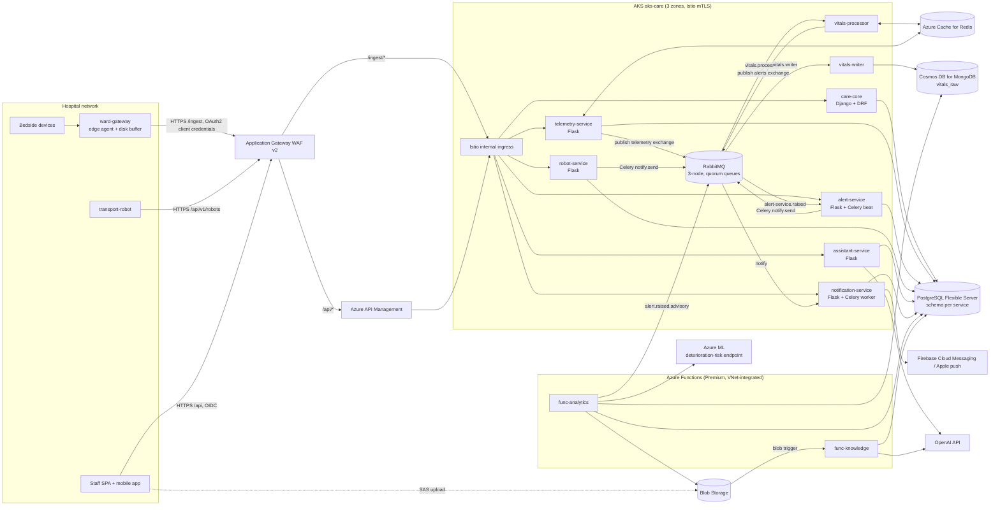

# High-Level Design

*Smart Healthcare System ([IoT](https://en.wikipedia.org/wiki/Internet_of_things "Internet of Things — Networked physical devices that report telemetry and receive commands over constrained links"))*

## Table of Contents

- [Architecture Overview](#architecture-overview)
- [Architecture Diagram](#architecture-diagram)
- [Service Catalogue](#service-catalogue)
- [API Design](#api-design)
- [Technology Mapping](#technology-mapping)
- [Stack Gaps and Unused Items](#stack-gaps-and-unused-items)

## Architecture Overview

The system is a set of Python microservices on one [AKS](https://learn.microsoft.com/en-us/azure/aks/ "Azure Kubernetes Service — Managed Kubernetes hosting on Azure") cluster, split along the responsibilities in the brief. Three request paths share the platform but are kept apart where their failure tolerance differs:

1. **Telemetry path** — ward gateway → Application Gateway [WAF](https://owasp.org/www-community/Web_Application_Firewall "Web Application Firewall — Filters and blocks malicious HTTP traffic before it reaches an application") → `telemetry-service` → [RabbitMQ](https://www.rabbitmq.com/docs "RabbitMQ — Message broker that routes and queues messages between producers and consumers") → `vitals-processor` (alerting) and `vitals-writer` (storage) as two independent consumers.
2. **Alert path** — `vitals-processor` → RabbitMQ → `alert-service` → [Celery](https://docs.celeryq.dev/en/stable/ "Celery — Distributed task queue that runs background and scheduled jobs outside the request cycle") `notify` queue → `notification-service` → push provider.
3. **Staff, robot and assistant path** — clients → Application Gateway WAF → Azure [API](https://en.wikipedia.org/wiki/API "Application Programming Interface — Defines the contract by which software components exchange requests and data") Management → the owning service.

Gateway ingest deliberately **bypasses API Management**. The alert path then depends on one less managed component, and API Management can run in a tier sized for staff traffic rather than for clinical-critical ingest. The cost is that `telemetry-service` validates tokens and rate limits itself; `06-security.md` covers both.

All services share one [PostgreSQL](https://www.postgresql.org/docs/current/ "PostgreSQL — Relational database storing and querying structured data with strong transactional guarantees") server with **one schema per owning service**. A service never writes another service's schema. Where a service must read another's data, it reads a named view that the owner publishes as an interface (for example `care.v_device_binding`), never the base tables.

## Architecture Diagram

**Request flow, client to store.** A staff client resolves the public hostname to the Application Gateway, which terminates [TLS](https://datatracker.ietf.org/doc/html/rfc8446 "Transport Layer Security — Encrypts and authenticates data sent over a network connection"), applies the [OWASP](https://owasp.org/ "Open Worldwide Application Security Project — Community effort publishing practices and tools for building secure software") rule set and forwards `/api/*` to API Management. API Management validates the Entra ID token, applies per-client rate limits and forwards to the Istio internal ingress, which routes by path to a service over mesh [mTLS](https://en.wikipedia.org/wiki/Mutual_authentication "Mutual TLS — TLS in which client and server both present certificates, so each authenticates the other"). The service authorizes the caller against patient access rules and reads PostgreSQL, [Redis](https://redis.io/docs/latest/ "Redis — In-memory data store used as a cache and fast key-value store") or Cosmos DB. File bytes never pass through a service: the service returns a short-lived [SAS](https://learn.microsoft.com/en-us/azure/storage/common/storage-sas-overview "Shared Access Signature — Time-limited token granting scoped access to an Azure Storage resource") [URL](https://datatracker.ietf.org/doc/html/rfc3986 "Uniform Resource Locator — Addresses the location and access method of a resource on the web") and the client uploads straight to Blob Storage.

## Service Catalogue

| Service | Framework | Owns | Runs as |
|---|---|---|---|
| `care-core` | Django + [DRF](https://www.django-rest-framework.org/ "Django REST Framework — Toolkit for building REST APIs on Django with serializers and permission classes"), Django [ORM](https://en.wikipedia.org/wiki/Object%E2%80%93relational_mapping "Object Relational Mapper — Maps application objects to relational database rows and queries") and migrations | Schema `care`: hospitals, wards, beds, patients, admissions, staff, devices, gateways, thresholds, patient files; Django admin for configuration | Deployment, [HPA](https://kubernetes.io/docs/tasks/run-application/horizontal-pod-autoscale/ "Horizontal Pod Autoscaler — Automatically adjusts the number of Kubernetes pod replicas to match load") on CPU |
| `telemetry-service` | Flask + [SQLAlchemy](https://www.sqlalchemy.org/ "SQLAlchemy — Python SQL toolkit and ORM that maps objects to relational tables and builds queries") + [Pydantic](https://docs.pydantic.dev/latest/ "Pydantic — Python library that validates and parses data against typed models at runtime") | Gateway ingest endpoint; vitals read APIs. Owns no tables; reads `telemetry` schema, `vitals_raw` and Redis | Deployment, HPA on CPU |
| `vitals-processor` | Python worker (kombu) | Rule evaluation (thresholds, [NEWS2](https://www.rcp.ac.uk/improving-care/resources/national-early-warning-score-news-2/ "National Early Warning Score 2 — Scores routine vital signs to detect clinical deterioration in adult patients"), sustain windows); latest-value cache | Deployment, [KEDA](https://keda.sh/ "Kubernetes Event-driven Autoscaling — Scales Kubernetes workloads on external event sources such as queue depth") on queue depth |
| `vitals-writer` | Python worker (kombu) | Raw telemetry persistence to `vitals_raw` | Deployment, KEDA on queue depth |
| `alert-service` | Flask + SQLAlchemy + [Alembic](https://alembic.sqlalchemy.org/en/latest/ "Alembic — Applies and versions database schema migrations for SQLAlchemy"); Celery beat | Schema `alerting`: alert lifecycle, dedup, escalation, gateway-silence detection | Deployment (API) + 1-replica beat |
| `notification-service` | Flask + Celery worker + SQLAlchemy + Alembic | Schema `notify`: push tokens, delivery log | Deployment, KEDA on `notify` depth |
| `robot-service` | Flask + SQLAlchemy + Alembic | Schema `robotics`: robots, locations, missions | Deployment |
| `assistant-service` | Flask + SQLAlchemy + Alembic + [OpenAI](https://platform.openai.com/docs/ "OpenAI — Provides GPT models through an API and official SDKs") [SDK](https://en.wikipedia.org/wiki/Software_development_kit "Software Development Kit — Packaged set of tools and libraries for building against a platform") | Schema `kb`: documents, chunks with embeddings, chat log | Deployment |
| `func-analytics` | Azure Functions (Python), Pandas, [NumPy](https://numpy.org/doc/stable/ "NumPy — Array library that stores homogeneous numeric data in contiguous buffers and computes over it in native code") | Rollups into `telemetry` (every 5 min), raw archive to Blob (daily), risk scoring (every 15 min), [ML](https://en.wikipedia.org/wiki/Machine_learning "Machine Learning — Algorithms that learn patterns from data rather than following explicit rules") dataset export and audit archive (monthly), partition maintenance (daily) | Timer triggers |
| `func-knowledge` | Azure Functions (Python) | Document ingest: extract, chunk, embed into `kb` | Blob trigger on `kb-documents` |

`telemetry` schema tables are written only by `func-analytics` and read by `telemetry-service`; the schema's owner is `func-analytics`, and its Alembic migrations live with it. The `audit` schema is owned by `care-core`, which publishes one insert-only table to every [PHI](https://www.ecfr.gov/current/title-45/subtitle-A/subchapter-C/part-160/subpart-A/section-160.103 "Protected Health Information — Individually identifiable health data that HIPAA regulates")-serving service.

## API Design

All staff endpoints sit under `/api/v1` behind API Management and take an Entra ID bearer token. Gateway ingest sits under `/ingest/v1` and takes a client-credentials token. Request and response bodies are [JSON](https://www.json.org/json-en.html "JavaScript Object Notation — Lightweight text format for structured data exchange") validated by Pydantic (Flask services) or DRF serializers (`care-core`).

| Method and path | Service | Input | Returns |
|---|---|---|---|
| `POST /ingest/v1/batches` | telemetry | `VitalsBatchV1 {batch_id: UUID, gateway_id, sent_at, frames: [{device_id, bed_id, ts, hr?, spo2?, rr?, sbp?, dbp?, temp_c?, quality}]}` | `202 {batch_id, accepted: int, duplicate: bool}` |
| `GET /api/v1/wards/{ward_id}/vitals/latest` | telemetry | — | `[{bed_id, patient_id, ts, hr, spo2, rr, sbp, dbp, temp_c, news2, data_age_s}]` |
| `GET /api/v1/patients/{patient_id}/vitals` | telemetry | `from, to, resolution=raw\|1m\|1h` | `{resolution, points: [...]}`; `raw` limited to 6 h and the last 30 days |
| `GET /api/v1/patients/{patient_id}/risk` | telemetry | — | `{score, scored_at, model_version}` |
| `GET /api/v1/wards/{ward_id}/census` | care-core | — | `[{bed, patient summary, admission_id, open_alerts}]` |
| `POST /api/v1/admissions` | care-core | `{patient_id, bed_id, admitted_at}` | `Admission` |
| `PUT /api/v1/admissions/{admission_id}/thresholds` | care-core | `[{signal, low, high, sustain_s}]` | `ThresholdSet` |
| `POST /api/v1/devices/{device_id}/binding` | care-core | `{bed_id}` | `DeviceBinding` |
| `POST /api/v1/patients/{patient_id}/files` | care-core | `{kind, content_type, size_bytes}` | `{file_id, upload_url (SAS, 10 min, write-only)}` |
| `POST /api/v1/patients/{patient_id}/files/{file_id}/complete` | care-core | — | `PatientFile` with `status = stored`, after checking the blob exists and matches `size_bytes` |
| `GET /api/v1/patients/{patient_id}/files/{file_id}` | care-core | — | `{download_url (SAS, 5 min, read-only)}` |
| `GET /api/v1/alerts` | alert | `ward_id, status, cursor` | `{items: [Alert], next_cursor}` |
| `POST /api/v1/alerts/{alert_id}/acknowledge` | alert | `{note?}` | `Alert` (409 if already acknowledged by someone else) |
| `POST /api/v1/alerts/{alert_id}/resolve` | alert | `{reason}` | `Alert` |
| `PUT /api/v1/me/push-token` | notification | `{platform, token}` | `204` |
| `POST /api/v1/robot/missions` | robot | `{from_location_id, to_location_id, patient_id?, priority}` | `Mission` |
| `GET /api/v1/robot/missions/{mission_id}` | robot | — | `Mission` with events |
| `GET /api/v1/robots/{robot_id}/missions/next` | robot | long-poll, `wait_s ≤ 20` | `Mission` or `204` |
| `POST /api/v1/robots/{robot_id}/heartbeat` | robot | `{location_id, battery_pct, state}` | `204` |
| `POST /api/v1/robot/missions/{mission_id}/events` | robot | `{kind, detail}` | `Mission` |
| `POST /api/v1/assistant/ask` | assistant | `{question, conversation_id?}` | server-sent event stream; final event `{answer, citations: [{document_id, chunk_id, title}]}` |
| `GET /api/v1/assistant/search` | assistant | `q, limit ≤ 20` | `[{chunk_id, document_id, title, snippet, score}]` |
| `POST /api/v1/assistant/documents` | assistant | `{title, source, content_type}` | `{document_id, upload_url (SAS)}` |

Idempotency: `batch_id` makes ingest safe to retry; `POST` endpoints for missions and admissions accept an `Idempotency-Key` header held in Redis for 24 h.

## Technology Mapping

| Technology | Role in this design | Alternative not chosen, and why |
|---|---|---|
| Python | Every service, worker, Function and the gateway agent | — one language keeps shared message contracts in one package |
| Django + Django [REST](https://en.wikipedia.org/wiki/REST "Representational State Transfer — Architectural style for stateless, resource-oriented HTTP APIs") Framework | `care-core`: richest relational model, admin UI for configuration, permission classes for [ABAC](https://en.wikipedia.org/wiki/Attribute-based_access_control "Attribute Based Access Control — Grants access based on attributes of the subject, resource and environment rather than fixed roles") | [FastAPI](https://fastapi.tiangolo.com/ "FastAPI — Python web framework for building HTTP APIs with async support and automatic schema generation") — no admin UI, and `care-core` is [CRUD](https://en.wikipedia.org/wiki/Create,_read,_update_and_delete "Create, Read, Update, Delete — Names the four basic operations of persistent storage")-heavy |
| Flask | Small, focused services with few endpoints | Django — too much framework for a 5-endpoint service |
| SQLAlchemy + Alembic | ORM and migrations for every Flask service and `func-analytics` | Django ORM — ties migrations to Django projects |
| Pydantic | Request validation in Flask; versioned RabbitMQ message contracts; parsing structured [LLM](https://en.wikipedia.org/wiki/Large_language_model "Large Language Model — Neural network trained on text that generates and interprets natural language") output | Marshmallow — Pydantic gives typed models shared by API and messages |
| OAuth (Entra ID) | [OIDC](https://openid.net/developers/how-connect-works/ "OpenID Connect — Identity layer on top of OAuth 2.0 for authenticating users") sign-in for staff; client credentials for gateways, robots and services | Self-hosted [IdP](https://en.wikipedia.org/wiki/Identity_provider "Identity Provider — Service that authenticates users and issues identity assertions to relying applications") — adds an identity system to operate |
| OpenAI | Chat completions for the assistant; embeddings for corpus search | Azure OpenAI Service — see `04` trade-offs |
| Celery | `notify.send` tasks with retries; beat for escalation and gateway-silence checks | Plain consumers — Celery gives retry, countdown and beat for free |
| RabbitMQ | Topic exchanges for domain events; Celery broker; quorum queues | Azure Service Bus — managed, but not the Celery broker already chosen, and topic routing is native in RabbitMQ |
| PostgreSQL (Azure Database for PostgreSQL Flexible Server) | System of record; stored procedures; partitioned rollups; `pgvector` and full-text search for the assistant | Azure [SQL](https://en.wikipedia.org/wiki/SQL "Structured Query Language — Queries and manipulates data in a relational database") Database — see gaps below |
| [MongoDB](https://www.mongodb.com/docs/ "MongoDB — Document database that stores schema-flexible JSON-like documents") API on Cosmos DB | `vitals_raw`: write-heavy, device-shaped documents with native [TTL](https://en.wikipedia.org/wiki/Time_to_live "Time To Live — Duration after which a cached or stored value expires"); local dev runs MongoDB in Docker Compose | Raw frames in PostgreSQL — workable, but pushes ~100M rows/day through the system-of-record server |
| Redis (Azure Cache for Redis Premium) | Latest vitals, rule windows, threshold and binding caches, dedup keys, rate limits, assistant answer cache | Memcached — no sorted sets, no persistence |
| Pandas | Resampling and unit sanity checks in rollups; data-quality inspection; ML dataset preparation | — |
| NumPy | Concatenating and sorting frame arrays, transposing to per-signal matrices for vectorised statistics and model features | — |
| Azure Functions | Scheduled and event-driven calculations off the request path | [Kubernetes](https://kubernetes.io/ "Kubernetes — Automates deployment, scaling and management of containerized applications") CronJobs — see `04` trade-offs |
| Azure Machine Learning | Training and hosting the `deterioration-risk` model as a managed online endpoint | Model inside a service — loses experiment tracking and model versioning |
| Blob Storage | Patient files, knowledge documents, telemetry and audit archives, ML datasets | — |
| AKS | Runs all services, workers and RabbitMQ across three zones | Azure Container Apps — less control over RabbitMQ and mesh |
| Container Registry ([ACR](https://learn.microsoft.com/en-us/azure/container-registry/ "Azure Container Registry — Stores and geo-replicates container images for Azure deployments"), Premium [SKU](https://en.wikipedia.org/wiki/Stock_keeping_unit "Stock Keeping Unit — Identifies one sellable variant of a product for inventory and pricing")) | Image store, geo-replicated to the [DR](https://en.wikipedia.org/wiki/Disaster_recovery "Disaster Recovery — Restores a system in another location after a failure too large for in-place redundancy") region | Docker Hub — images must stay in the tenant |
| API Management (Standard v2) | Staff, robot and assistant APIs: [JWT](https://datatracker.ietf.org/doc/html/rfc7519 "JSON Web Token — Compact, signed token format for carrying claims between parties") validation, rate limits, versioning | Premium tier — zone redundancy, but ~5× the cost, which is not needed once ingest bypasses it |
| Azure Monitor | Log Analytics for container logs, Application Insights for traces, managed Prometheus for metrics | Self-hosted Loki/Jaeger — more to run |
| Prometheus | Metrics format and alert rules ([PromQL](https://prometheus.io/docs/prometheus/latest/querying/basics/ "Prometheus Query Language — Queries and aggregates time series metrics collected by Prometheus")), via Azure Monitor managed service for Prometheus | Self-hosted kube-prometheus-stack — see `05` |
| Grafana (Azure Managed Grafana) | Dashboards over Prometheus metrics and Log Analytics logs | Azure Workbooks — less familiar to the team |
| [Terraform](https://developer.hashicorp.com/terraform/docs "Terraform — Infrastructure as code tool that declares and provisions cloud infrastructure from configuration files") | All Azure resources, Entra app registrations, RabbitMQ definitions | Bicep — Azure-only, and Terraform also manages Entra ID and RabbitMQ |
| Docker, Docker Compose | Service images; local stack of PostgreSQL, MongoDB, RabbitMQ and Redis | — |
| Kubernetes | Deployments, KEDA scaled objects, StatefulSet for RabbitMQ, PodDisruptionBudgets | — |
| GitHub, GitHub Actions | Source, [CI](https://en.wikipedia.org/wiki/Continuous_integration "Continuous Integration — Automatically builds and tests code on every change") with cached parallel jobs, [CD](https://en.wikipedia.org/wiki/Continuous_deployment "Continuous Deployment — Automatically releases every build that passes the pipeline's gates to production without a manual step") to AKS | Azure DevOps — code already on GitHub |
| Bash | Gateway provisioning, DR runbook scripts, CI glue | — |

## Stack Gaps and Unused Items

**Added outside the listed stack**, each because the design has a clear gap without it:

- **Azure Application Gateway WAF v2** — the perimeter WAF; API Management has none.
- **Azure Key Vault** — keys for customer-managed encryption and field-level encryption, plus the few secrets that cannot use managed identity.
- **Istio-based service mesh add-on for AKS** — mTLS between ingress and pods, and weighted traffic for canary releases.
- **KEDA add-on for AKS** — scales queue workers on RabbitMQ queue depth.
- **RabbitMQ Cluster Kubernetes Operator** — runs the RabbitMQ StatefulSet and its upgrades.
- **`pgvector` extension** and the **OpenTelemetry SDK** — libraries, not services.
- **Firebase Cloud Messaging and Apple push service** — any mobile push needs a provider.

> **Verify Before Build:** Private path from Application Gateway to API Management Standard v2 — this design assumes API Management takes inbound traffic through a private endpoint and reaches AKS through outbound VNet integration. Confirm both are available for Standard v2 in the chosen region; otherwise, the fallback is Premium tier in internal VNet mode, at the cost noted above.

**Listed but given no role:** **Azure SQL Database.** Every relational need is met by PostgreSQL, which the brief names for stored procedures and index tuning. A second relational engine would double backup, DR and tuning work for no functional gain. Were an existing hospital system to expose data only through Azure SQL Database, it would be read by an integration job, not adopted as a store.
