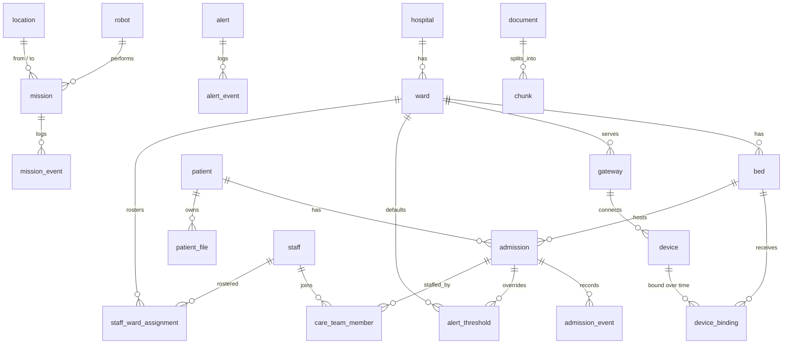

# Data Modeling & Storage

*Smart Healthcare System ([IoT](https://en.wikipedia.org/wiki/Internet_of_things "Internet of Things — Networked physical devices that report telemetry and receive commands over constrained links"))*

## Table of Contents

- [Storage Overview](#storage-overview)
- [Relational Schema](#relational-schema)
- [Stored Procedures and Views](#stored-procedures-and-views)
- [Raw Telemetry Documents](#raw-telemetry-documents)
- [Redis Key Space](#redis-key-space)
- [Blob Containers](#blob-containers)
- [Partitioning and Sharding Strategy](#partitioning-and-sharding-strategy)

## Storage Overview

| Store | Data | Why this store |
|---|---|---|
| [PostgreSQL](https://www.postgresql.org/docs/current/ "PostgreSQL — Relational database storing and querying structured data with strong transactional guarantees") `pg-care` (Flexible Server, General Purpose 8 vCore, 512 GB, zone-redundant [HA](https://en.wikipedia.org/wiki/High_availability "High Availability — System design goal of remaining operational despite component failure")) | Clinical records, alerts, missions, knowledge corpus, rollups, audit | Transactions, constraints, stored procedures, partitioning, `pgvector` |
| Cosmos DB for [MongoDB](https://www.mongodb.com/docs/ "MongoDB — Document database that stores schema-flexible JSON-like documents") ([RU](https://learn.microsoft.com/en-us/azure/cosmos-db/request-units "Request Unit — Azure Cosmos DB's currency for provisioned throughput, charged per request regardless of operation type")-based) `cosmos-vitals`, database `telemetry`, collection `vitals_raw` | Raw 1-second frames, 30 days | Write-heavy, device-shaped documents; native [TTL](https://en.wikipedia.org/wiki/Time_to_live "Time To Live — Duration after which a cached or stored value expires"); autoscaling throughput |
| Azure Cache for [Redis](https://redis.io/docs/latest/ "Redis — In-memory data store used as a cache and fast key-value store") Premium P1 `redis-care`, zone-redundant | Latest values, rule windows, caches, dedup and rate-limit keys | Sub-millisecond reads; sorted sets for time windows |
| Blob Storage `stcare` ([GZRS](https://learn.microsoft.com/en-us/azure/storage/common/storage-redundancy "Geo-Zone-Redundant Storage — Azure Storage redundancy that copies data across zones in one region and to a paired region")) | Files, knowledge documents, archives, [ML](https://en.wikipedia.org/wiki/Machine_learning "Machine Learning — Algorithms that learn patterns from data rather than following explicit rules") datasets | Cheap tiered object storage; [SAS](https://learn.microsoft.com/en-us/azure/storage/common/storage-sas-overview "Shared Access Signature — Time-limited token granting scoped access to an Azure Storage resource") upload |

**Cross-schema references** such as `alerting.alert.patient_id` are logical references, not foreign keys. Each schema has one owning service (see `02-high-level-design.md`), and a foreign key across owners would couple their migrations. Integrity across schemas is kept by events and by the published views below.

**Staff identity across services.** `care.staff.staff_id` is used only inside `care`. Every other schema, view and message identifies a staff member by `entra_object_id`, the Entra ID object ID that each access token carries. A service therefore needs no lookup to connect a caller to a roster row, a push token or an audit event, and columns named `*_by` or `actor_id` hold that ID.

## Relational Schema



### Schema `care` — owned by `care-core`

| Table | Key columns | Notes |
|---|---|---|
| `hospital` | `hospital_id` [PK](https://www.postgresql.org/docs/current/ddl-constraints.html#DDL-CONSTRAINTS-PRIMARY-KEYS "Primary Key — Column set that uniquely identifies each row in a table"), `name`, `timezone` | |
| `ward` | `ward_id` PK, `hospital_id` [FK](https://www.postgresql.org/docs/current/ddl-constraints.html#DDL-CONSTRAINTS-FK "Foreign Key — Constraint that makes a row reference an existing row in another table"), `name`, `kind` | |
| `bed` | `bed_id` PK, `ward_id` FK, `label`, `is_active` | |
| `patient` | `patient_id` [UUID](https://datatracker.ietf.org/doc/html/rfc9562 "Universally Unique Identifier — 128-bit identifier that can be generated without a central authority") PK, `mrn` UNIQUE, `full_name`, `date_of_birth`, `sex`, `national_id_enc` bytea, `national_id_hmac` bytea, `phone_enc` bytea, `created_at` | `_enc` columns hold field-level ciphertext, `_hmac` an exact-match lookup hash (see `06-security.md`) |
| `admission` | `admission_id` UUID PK, `patient_id` FK, `bed_id` FK, `status` (`active`, `discharged`), `admitted_at`, `discharged_at` | Partial unique index: one `active` admission per bed |
| `admission_event` | `event_id` PK, `admission_id` FK, `kind` (`rapid_response`, `icu_transfer`, `death`, `discharge`), `occurred_at` | Outcome labels for the risk model |
| `staff` | `staff_id` UUID PK, `entra_object_id` UNIQUE, `display_name`, `role` | Mirrors Entra ID users |
| `staff_ward_assignment` | PK (`staff_id`, `ward_id`, `shift_start`), `shift_end`, `escalation_level` smallint | The roster; level 1 = ward nurse, 2 = charge nurse, 3 = rapid-response |
| `care_team_member` | PK (`admission_id`, `staff_id`), `role` | Named clinicians for a patient |
| `gateway` | `gateway_id` PK, `ward_id` FK, `entra_client_id` UNIQUE, `cert_rotated_at` | One per ward |
| `device` | `device_id` PK, `gateway_id` FK, `vendor`, `model`, `serial` UNIQUE | |
| `device_binding` | `binding_id` PK, `device_id` FK, `bed_id` FK, `bound_at`, `unbound_at` | Partial unique index: one open binding per device |
| `alert_threshold` | `threshold_id` PK, `ward_id` FK NULL, `admission_id` FK NULL, `signal`, `low`, `high`, `sustain_s`, `updated_by`, `updated_at` | Exactly one of `ward_id` / `admission_id` is set (CHECK); `sustain_s` is between 0 and 60 (CHECK). Admission overrides ward default |
| `patient_file` | `file_id` UUID PK, `patient_id` FK, `kind`, `blob_path`, `content_type`, `size_bytes`, `uploaded_by`, `uploaded_at`, `status` (`pending`, `stored`) | Row created before the SAS is issued |

### Schema `alerting` — owned by `alert-service`

| Table | Key columns | Notes |
|---|---|---|
| `alert` | `alert_id` UUID PK, `dedup_key`, `patient_id` NULL, `admission_id` NULL, `ward_id`, `rule_code`, `severity` (`critical`, `urgent`, `advisory`), `status` (`open`, `acknowledged`, `escalated`, `resolved`), `raised_at`, `source_reading_ts`, `escalation_level`, `next_escalation_at`, `acknowledged_by`, `acknowledged_at`, `resolved_at` | `dedup_key` is `{admission_id}:{rule_code}` for patient alerts and `{gateway_id}:GATEWAY_SILENT` for ward-level ones. A partial unique index on `dedup_key` where `status <> 'resolved'` makes a duplicate raise a no-op. A key on (`admission_id`, `rule_code`) could not do this, because ward-level alerts have no admission and NULLs never collide |
| `alert_event` | `event_id` PK, `alert_id` FK, `kind`, `actor_id`, `at`, `note` | Append-only history |

### Schema `notify` — owned by `notification-service`

| Table | Key columns |
|---|---|
| `push_token` | `token_id` PK, `entra_object_id`, `platform`, `token`, `last_seen_at`; UNIQUE (`entra_object_id`, `platform`) |
| `delivery` | `delivery_id` PK, `alert_id` NULL, `mission_id` NULL, `entra_object_id`, `channel`, `status`, `attempts`, `provider_message_id`, `attempted_at` |

### Schema `robotics` — owned by `robot-service`

| Table | Key columns |
|---|---|
| `robot` | `robot_id` PK, `hospital_id`, `entra_client_id` UNIQUE, `name`, `status` (`idle`, `busy`, `charging`, `fault`, `offline`), `battery_pct`, `location_id`, `last_seen_at` |
| `location` | `location_id` PK, `hospital_id`, `name`, `floor`, `x`, `y` |
| `mission` | `mission_id` UUID PK, `hospital_id`, `patient_id` NULL, `requested_by`, `from_location_id` FK, `to_location_id` FK, `priority`, `status` (`queued`, `assigned`, `to_pickup`, `transporting`, `completed`, `aborted`), `robot_id` NULL, `requested_at`, `assigned_at`, `completed_at` |
| `mission_event` | `event_id` PK, `mission_id` FK, `kind`, `at`, `detail` [JSONB](https://www.postgresql.org/docs/current/datatype-json.html "JSON Binary — PostgreSQL type storing JSON documents in a decomposed binary form that can be indexed") |

### Schema `kb` — owned by `assistant-service`

| Table | Key columns |
|---|---|
| `document` | `document_id` UUID PK, `title`, `source`, `version`, `blob_path`, `status` (`processing`, `active`, `superseded`, `failed`), `uploaded_by`, `created_at` |
| `chunk` | `chunk_id` UUID PK, `document_id` FK, `ordinal`, `content`, `content_tsv` tsvector GENERATED, `embedding` vector(1536), `is_active` |
| `chat_log` | `log_id` PK, `entra_object_id`, `question_redacted`, `cited_chunk_ids` UUID[], `latency_ms`, `created_at` — 90-day retention |

### Schema `telemetry` — owned by `func-analytics`

| Table | Key columns | Notes |
|---|---|---|
| `vitals_minute` | PK (`patient_id`, `bucket_start`), `admission_id`, `hr_mean`, `hr_min`, `hr_max`, `spo2_mean`, `spo2_min`, `rr_mean`, `sbp`, `dbp`, `temp_c`, `news2`, `sample_count`, `artefact_ratio` | Range-partitioned monthly on `bucket_start`; 90 days kept |
| `vitals_hour` | Same columns as `vitals_minute` | Range-partitioned yearly; 5 years kept |
| `risk_score` | PK (`patient_id`, `scored_at`), `admission_id`, `score`, `model_version` | |
| `data_quality_daily` | PK (`day`, `device_id`), `gateway_id`, `expected_frames`, `received_frames`, `artefact_ratio`, `late_ratio` | Output of the Pandas inspection step |

### Schema `audit` — owned by `care-core`

| Table | Key columns | Notes |
|---|---|---|
| `access_event` | `event_id` bigint identity, `occurred_at`, `actor_id`, `actor_kind` (`staff`, `client`), `action`, `resource_type`, `resource_id`, `patient_id` NULL, `purpose` (`care`, `break_glass`), `request_id` | Range-partitioned monthly; insert-only for every writer; 13 months in the database |

Django owns migrations for `care` and `audit`; [Alembic](https://alembic.sqlalchemy.org/en/latest/ "Alembic — Applies and versions database schema migrations for SQLAlchemy") owns them for every other schema. Each migration history lives with its owning service.

## Stored Procedures and Views

**Views published as read interfaces** (granted by name in `06-security.md`):

- `care.v_device_binding` — `device_id`, `gateway_id`, `gateway_client_id`, `ward_id`, `bed_id`, `admission_id`, `patient_id` for every open binding. Used to map a frame to a patient.
- `care.v_on_duty_staff` — `ward_id`, `entra_object_id`, `escalation_level`, `shift_end` for rosters covering `now()`.
- `care.v_patient_access` — `patient_id`, `entra_object_id` for every active admission where the staff member is on the care team or rostered on the patient's ward. The [ABAC](https://en.wikipedia.org/wiki/Attribute-based_access_control "Attribute Based Access Control — Grants access based on attributes of the subject, resource and environment rather than fixed roles") source for services outside `care-core`.
- `care.v_effective_threshold` — `admission_id`, `signal`, `low`, `high`, `sustain_s` for every active admission, with the admission override applied over the ward default. The fallback when `thresholds:{admission_id}` is missing.
- `care.v_admission_outcome` — `admission_id`, `patient_id`, `admitted_at`, `discharged_at`, `event_kind`, `occurred_at`. Outcome labels for the ML dataset export.

**Stored procedures and functions**, all `SECURITY DEFINER` with a fixed `search_path`:

| Routine | Does | Why in the database |
|---|---|---|
| `alerting.acknowledge_alert(alert_id, entra_object_id, note)` | `UPDATE … WHERE status IN ('open','escalated')` plus `alert_event` insert; returns the row or nothing | One round trip; the conditional update is the concurrency control, so two nurses cannot both acknowledge |
| `alerting.claim_due_escalations(limit)` | `SELECT … WHERE next_escalation_at <= now() AND status IN ('open','escalated') FOR UPDATE SKIP LOCKED`, bumps level and next deadline | Safe if two beat processes ever run |
| `robotics.assign_next_mission(hospital_id)` | Picks the oldest highest-priority `queued` mission and the idle robot with the most battery above 30%, `FOR UPDATE SKIP LOCKED` on both | Assignment is a race between concurrent requests and heartbeats |
| `telemetry.upsert_minute_rollups(rows jsonb)` | `INSERT … ON CONFLICT (patient_id, bucket_start) DO UPDATE` from one [JSON](https://www.json.org/json-en.html "JavaScript Object Notation — Lightweight text format for structured data exchange") array | One statement per rollup run instead of ~6,000 round trips |
| `care.ward_census(ward_id)` | Beds, active admission and patient summary, open alert count from `alerting.alert` | One query per ward instead of one per bed; the function's owner role holds the read on `alerting.alert`, so `care-core`'s own role never gets it |
| `telemetry.create_next_partitions()` and `audit.create_next_partitions()` | Create the next period's partitions; detach and drop partitions past retention. Each is owned by its schema's owner role, because partition [DDL](https://en.wikipedia.org/wiki/Data_definition_language "Data Definition Language — The SQL statements that create and alter database objects") needs table ownership | Keeps DDL rights out of every runtime role |

## Raw Telemetry Documents

One document per patient per 10-second window, written by `vitals-writer`:

```json
{
  "_id": "3f1c…:1727712000",
  "patientId": "3f1c…",
  "admissionId": "9a0e…",
  "gatewayId": "gw-h1-w07",
  "windowStart": 1727712000,
  "frames": [
    {"ts": 1727712000.0, "deviceId": "d-1182", "hr": 92, "spo2": 95, "rr": 18, "q": 0},
    {"ts": 1727712001.0, "deviceId": "d-1182", "hr": 94, "spo2": 94, "rr": 19, "q": 0}
  ]
}
```

- `_id` is deterministic, so a redelivered message upserts into the same document. Frames are added with `$addToSet`, which makes a replay a no-op and lets two writer replicas contribute to one window without overwriting each other.
- Compound index on (`patientId`, `windowStart`) for timeline reads. TTL of 30 days on `_ts`.
- Frames arrive in canonical units (beats/min, %, breaths/min, mmHg, °C); the gateway converts vendor units, and `VitalsBatchV1` rejects anything else.

> **Verify Before Build:** TTL on the MongoDB [API](https://en.wikipedia.org/wiki/API "Application Programming Interface — Defines the contract by which software components exchange requests and data") — Cosmos DB's API for MongoDB (RU-based) supports a TTL index only on the `_ts` field, not on a custom date field. Confirm on the target server version before relying on `windowStart` for expiry.

## Redis Key Space

| Key | Type | TTL | Writer → reader |
|---|---|---|---|
| `vitals:latest:{patient_id}` | hash | 5 min | `vitals-processor` → `telemetry-service` |
| `vitals:win:{admission_id}:{signal}` | sorted set, score = ts | trimmed to 10 min | `vitals-processor` |
| `thresholds:{admission_id}` | hash from `care.v_effective_threshold` | 5 min | `care-core` (write-through) and `vitals-processor` (fill on miss) → `vitals-processor` |
| `devbind:{device_id}` | hash from `care.v_device_binding` | 5 min | same pattern |
| `gateway:{client_id}` | hash from `care.v_device_binding`: `gateway_id`, `ward_id` | 5 min | `care-core` (write-through) and `telemetry-service` (fill on miss) → `telemetry-service` |
| `replay:{gateway_id}` | string | set per [DR](https://en.wikipedia.org/wiki/Disaster_recovery "Disaster Recovery — Restores a system in another location after a failure too large for in-place redundancy") runbook, ≤ 2 h | operator runbook → `telemetry-service` |
| `gateway:lastseen:{gateway_id}` | string (epoch) | 1 h | `telemetry-service` → `alert-service` |
| `batch:{batch_id}` | string, `SET NX` | 24 h | `telemetry-service` |
| `access:{entra_object_id}:{patient_id}` | string | 60 s | services doing ABAC checks |
| `audit:seen:{actor_id}:{resource}:{window}` | string, `SET NX` | 15 min | [PHI](https://www.ecfr.gov/current/title-45/subtitle-A/subchapter-C/part-160/subpart-A/section-160.103 "Protected Health Information — Individually identifiable health data that HIPAA regulates")-serving services |
| `oncall:{ward_id}` | list from `care.v_on_duty_staff` | 60 s | `alert-service` |
| `robot:state:{robot_id}` | hash | 30 s | `robot-service` |
| `assistant:corpus_version` | counter | none | `func-knowledge` (INCR when a document becomes `active`) → `assistant-service` |
| `assistant:cache:{sha256(normalised question)}:{corpus_version}` | string | 24 h | `assistant-service` |
| `ratelimit:{scope}:{principal}:{minute}` | counter | 2 min | `telemetry-service`, `assistant-service` |
| `idem:{principal}:{key}` | string | 24 h | services accepting `Idempotency-Key` |

## Blob Containers

| Container | Content | Tiering and retention |
|---|---|---|
| `patient-files` | Wound photos, scans, documents | Hot 30 days → cool → cold after 1 year; soft delete 30 days |
| `kb-documents` | Source PDFs and text of the corpus | Hot; versioning on |
| `vitals-archive` | Daily Parquet of raw frames, path `yyyy/mm/dd/hospital_id/` | Cool → archive after 90 days |
| `audit-archive` | Monthly Parquet of `audit.access_event` | Time-based immutability policy, 6 years |
| `ml-datasets` | Pseudonymised training datasets | Hot; deleted after 1 year |

## Partitioning and Sharding Strategy

- **PostgreSQL is not sharded.** At ~200 GB and a few hundred writes per second (`01-requirements.md`) one primary is comfortably within a General Purpose server. Evolution trigger: split the `telemetry` schema onto its own server when primary CPU exceeds 70% for a week or storage passes 2 TB.
- **Time-range partitioning** on `vitals_minute`, `vitals_hour` and `access_event` makes retention a `DETACH` + `DROP` instead of a mass `DELETE`, and lets the planner prune partitions for time-bounded queries.
- **Cosmos DB shard key `patientId`.** Every read is a single-patient timeline, so every query targets one logical partition. One patient writes ~0.1 documents per second and ~15 MB per day, so a 30-day window stays far below the 20 GB logical-partition limit and no patient becomes a hot partition.
- **Redis is not clustered.** The working set is under 1 GB. Evolution trigger: enable clustering when memory passes 70% of the tier.
