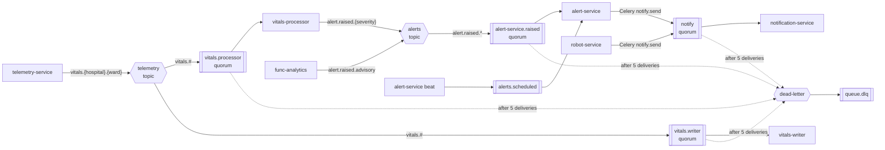
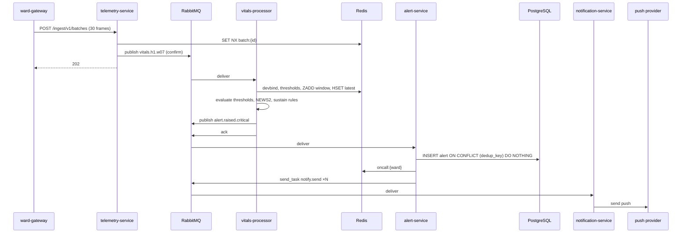

# Deep Dive & Bottlenecks

*Smart Healthcare System ([IoT](https://en.wikipedia.org/wiki/Internet_of_things "Internet of Things — Networked physical devices that report telemetry and receive commands over constrained links"))*

## Table of Contents

- [Communication Patterns](#communication-patterns)
- [RabbitMQ Topology](#rabbitmq-topology)
- [Alert Path and Latency Budget](#alert-path-and-latency-budget)
- [Failure Modes](#failure-modes)
- [Disaster Recovery for Kubernetes](#disaster-recovery-for-kubernetes)
- [Trade-offs](#trade-offs)

## Communication Patterns

| Flow | Style | Why |
|---|---|---|
| Staff clients → services | Sync [REST](https://en.wikipedia.org/wiki/REST "Representational State Transfer — Architectural style for stateless, resource-oriented HTTP APIs") through [API](https://en.wikipedia.org/wiki/API "Application Programming Interface — Defines the contract by which software components exchange requests and data") Management | Request/response UI; reads must reflect the latest committed state |
| Gateway → `telemetry-service` | Sync REST, 1 upload per second, `202 Accepted` after the broker confirms | The gateway must know the batch is durable before dropping it from its buffer |
| `telemetry-service` → processor and writer | Async events, topic exchange `telemetry` | Fan-out to two consumers with different speed and failure tolerance |
| `vitals-processor` / `func-analytics` → `alert-service` | Async events, topic exchange `alerts` | Producers must not wait on alert persistence |
| `alert-service` / `robot-service` → `notification-service` | Async [Celery](https://docs.celeryq.dev/en/stable/ "Celery — Distributed task queue that runs background and scheduled jobs outside the request cycle") task `notify.send` | Command to exactly one worker, with retries and backoff |
| Scheduled checks (escalation, gateway silence) | Celery beat → queue `alerts.scheduled` | Time-driven work inside the owning service |
| Robot → `robot-service` | Sync REST: long-poll for the next mission, heartbeat every 5 s | Robots sit behind hospital [NAT](https://datatracker.ietf.org/doc/html/rfc3022 "Network Address Translation — Maps multiple private addresses to a shared public address"); pull avoids inbound connections to robots |
| `assistant-service` → [OpenAI](https://platform.openai.com/docs/ "OpenAI — Provides GPT models through an API and official SDKs") | Sync [HTTPS](https://datatracker.ietf.org/doc/html/rfc9110 "HTTP Secure — HTTP encrypted with TLS to protect requests and responses in transit"), streamed | Answer is streamed to the user as it is generated |
| `func-analytics` → Azure [ML](https://en.wikipedia.org/wiki/Machine_learning "Machine Learning — Algorithms that learn patterns from data rather than following explicit rules") endpoint | Sync HTTPS, batched per run | Scoring is part of a scheduled run, not the request path |

**No synchronous calls between services inside the cluster.** A service that needs another's data reads a published view (`03-data-modeling.md`) or consumes an event. This keeps the alert path free of request chains, where one slow service would stall every caller. The cost is that views become contracts: a `care` migration that changes a view must keep its columns stable, which the view's owner tests in [CI](https://en.wikipedia.org/wiki/Continuous_integration "Continuous Integration — Automatically builds and tests code on every change").

**Events versus Celery tasks.** Both run on [RabbitMQ](https://www.rabbitmq.com/docs "RabbitMQ — Message broker that routes and queues messages between producers and consumers"). Domain events (`VitalsBatchV1`, `AlertRaisedV1`) go to topic exchanges, may have several consumers, and are consumed with kombu. Commands (`notify.send`) are Celery tasks with exactly one worker, retries and backoff. Producers call `send_task("notify.send", …)` by name, so no service imports another's code; the task signature is a [Pydantic](https://docs.pydantic.dev/latest/ "Pydantic — Python library that validates and parses data against typed models at runtime") contract in the shared `contracts` package.

**Shared rule logic.** [NEWS2](https://www.rcp.ac.uk/improving-care/resources/national-early-warning-score-news-2/ "National Early Warning Score 2 — Scores routine vital signs to detect clinical deterioration in adult patients") scoring and signal thresholds are computed live by `vitals-processor` and again over 1-minute buckets by `func-analytics`. Both import one `vitals_rules` package, so the score shown on a trend chart is the score that raised the alert.

**Alert routing data.** `vitals-processor` takes `ward_id` from `care.v_device_binding` and puts it in `AlertRaisedV1`. `func-analytics` knows only the admission, so `ward_id` is optional in the contract, and `alert-service` resolves a missing one from the same view before looking up the on-call list.

## RabbitMQ Topology

- **Quorum queues** replicate each queue on all three nodes (one per zone) and survive one node loss without losing confirmed messages.
- **Publisher confirms** on every publish; `telemetry-service` returns `202` only after the confirm. Consumers use manual acks.
- **Poison messages** go to the dead-letter exchange after 5 deliveries (quorum-queue delivery limit). A [DLQ](https://docs.aws.amazon.com/AWSSimpleQueueService/latest/SQSDeveloperGuide/sqs-dead-letter-queues.html "Dead-Letter Queue — Holds messages that failed processing repeatedly so they can be inspected and redriven") depth above zero pages the on-call engineer; it never silently grows.
- **Headers** on every message: `schema` (e.g. `VitalsBatchV1`), `traceparent` ([W3C](https://www.w3.org/ "World Wide Web Consortium — Develops open web standards such as trace context propagation") trace context), `batch_id` or `alert_id`, and `received_at` — the time `telemetry-service` accepted the batch. `AlertRaisedV1` and the `notify.send` arguments carry `received_at` forward, which is how `alert_delivery_seconds` is measured end to end.
- **Definitions** (exchanges, queues, bindings, policies, users) are managed by [Terraform](https://developer.hashicorp.com/terraform/docs "Terraform — Infrastructure as code tool that declares and provisions cloud infrastructure from configuration files")'s RabbitMQ provider, so a rebuilt cluster gets an identical topology.

> **Verify Before Build:** Celery on quorum queues — quorum queues do not support global [QoS](https://docs.oasis-open.org/mqtt/mqtt/v5.0/os/mqtt-v5.0-os.html "Quality of Service — Delivery guarantee level, such as MQTT's at-most-once, at-least-once and exactly-once modes"), and countdown/[ETA](https://en.wikipedia.org/wiki/Estimated_time_of_arrival "Estimated Time of Arrival — Predicted time a vehicle or shipment reaches its destination") tasks on them need Celery's quorum-queue detection. Confirm the Celery and kombu versions support `task_default_queue_type = "quorum"` before relying on it; this design uses no countdown tasks, only beat.

## Alert Path and Latency Budget

The [SLO](https://sre.google/sre-book/service-level-objectives/ "Service Level Objective — Target value for a service level indicator that a service commits to meet") clock starts when `telemetry-service` receives the reading that completes a rule. A rule's sustain time (for example [SpO2](https://en.wikipedia.org/wiki/Pulse_oximetry "Peripheral oxygen saturation — Percentage of haemoglobin carrying oxygen, measured by a pulse oximeter") below 90% for 30 s) is a clinical choice, not latency, and is excluded.

| Step | p95 |
|---|---|
| Gateway flush interval (1 s; counted in full, though the average wait is 0.5 s) | 1,000 ms |
| Hospital → Application Gateway → Istio → `telemetry-service` | 150 ms |
| Validate, dedup in [Redis](https://redis.io/docs/latest/ "Redis — In-memory data store used as a cache and fast key-value store"), publish with confirm | 30 ms |
| Wait in `vitals.processor` at normal depth (< 50 messages) | 100 ms |
| Binding lookup, window update, rule evaluation, publish | 60 ms |
| Wait in `alert-service.raised`, insert, on-call lookup, enqueue | 80 ms |
| Wait in `notify`, call push provider | 500 ms |
| **Sum** | **~1.9 s** against a 5 s target |

Summing p95s overstates the real p95, so the budget is conservative. The ~3 s headroom is what a queue backlog may use: at 40 messages/s, 3 s is ~120 messages in `vitals.processor`. [KEDA](https://keda.sh/ "Kubernetes Event-driven Autoscaling — Scales Kubernetes workloads on external event sources such as queue depth") adds processor replicas at a depth of 50, and the SLO alert fires at 120 (`05-reliability.md`). The dashboard sees the alert on its next 5-second poll, so dashboard visibility is ~1.4 s + 5 s ≈ 6.4 s against the 8 s target. Delivery from the push provider to the phone is outside the platform's control and outside the SLO.

**Why the writer is a separate consumer.** Raw persistence to Cosmos DB can throttle ([HTTP](https://datatracker.ietf.org/doc/html/rfc9110 "Hypertext Transfer Protocol — Application protocol used to request and transfer web resources") 429) or slow down. Sharing a consumer would put those delays in front of rule evaluation. With two queues, `vitals-writer` can fall minutes behind while alerts stay on budget. The writer buffers up to 10 s of messages, groups frames by patient and 10-second window, upserts each window once, then acks the whole buffer; its prefetch of 1,000 covers 10 s at 40 messages/s with 2.5× headroom. That gives ~180 upserts/s at ~10 [RU](https://learn.microsoft.com/en-us/azure/cosmos-db/request-units "Request Unit — Azure Cosmos DB's currency for provisioned throughput, charged per request regardless of operation type") each, ~1,800 RU/s, inside an autoscale ceiling of 4,000 RU/s.

**Late and replayed data.** Gateways stamp frames using [NTP](https://en.wikipedia.org/wiki/Network_Time_Protocol "Network Time Protocol — Synchronizes machine clocks over a network")-synchronised clocks. After an outage, a gateway replays its buffer in order, packing up to 60 s of frames into each batch at one extra request per second, so 24 h of backlog clears in ~25 minutes without raising the request rate the [WAF](https://owasp.org/www-community/Web_Application_Firewall "Web Application Firewall — Filters and blocks malicious HTTP traffic before it reaches an application") limits. `telemetry-service` rejects frames more than 5 s in the future. `vitals-processor` neither alerts on frames older than 120 s nor lets them overwrite `vitals:latest:*`; `vitals-writer` still stores them. Without this rule, a replay after an outage would fire a burst of alerts about the past. The outage itself was already reported by the gateway-silence alert below.

**Gateway silence.** Every 15 s, a beat task compares `gateway:lastseen:{gateway_id}` with the gateways in `care.v_device_binding`. A gateway silent for 30 s raises a ward-level `GATEWAY_SILENT` alert: its patients are not monitored remotely, and nurses must rely on bedside alarms until it clears.

## Failure Modes

| Component | Failure | Mitigation | Residual effect |
|---|---|---|---|
| Ward gateway | Device or power loss | Bedside alarms stay primary; `GATEWAY_SILENT` within 30 s; one spare gateway per hospital, re-bound through `care-core` | Remote monitoring gap for one ward until swapped |
| Hospital uplink | Network loss | Gateway disk buffer holds 24 h and replays it in order, in larger batches (see *Late and replayed data*) | Alerts suppressed for replayed data; history complete |
| Application Gateway | Instance or zone loss | WAF v2, autoscaling, minimum 2 instances across zones | None |
| API Management | Service outage | Ingest bypasses it, so alerts and push notifications continue | Dashboards and robot APIs down; within the 99.9% budget of the Standard v2 [SLA](https://en.wikipedia.org/wiki/Service-level_agreement "Service Level Agreement — Commitment between a provider and its customer on measurable service targets, such as delivery time") |
| [AKS](https://learn.microsoft.com/en-us/azure/aks/ "Azure Kubernetes Service — Managed Kubernetes hosting on Azure") node or zone | Node loss | 3 zones, topology spread, PodDisruptionBudgets; alert-path deployments run 3 replicas | Seconds of reduced capacity |
| RabbitMQ | One node lost | Quorum queues keep a majority (2 of 3) | Leader election of a few seconds |
| RabbitMQ | Two nodes lost | Queues unavailable; `telemetry-service` returns 503, gateways buffer | Alerts delayed until recovery; no data lost |
| Redis | Primary failover | Premium zone-redundant replica; thresholds and bindings fall back to [PostgreSQL](https://www.postgresql.org/docs/current/ "PostgreSQL — Relational database storing and querying structured data with strong transactional guarantees") views | Sustain windows restart, delaying sustained-condition alerts by at most their window (`sustain_s` ≤ 60 s); immediate-threshold rules unaffected |
| PostgreSQL | Primary failover | Zone-redundant [HA](https://en.wikipedia.org/wiki/High_availability "High Availability — System design goal of remaining operational despite component failure") with synchronous standby, 60–120 s failover | Alerts wait in `alert-service.raised` and are inserted after failover |
| Cosmos DB | Throttling or zone loss | Zone-redundant account; writer queue absorbs backlog | Raw history lags; alerts unaffected |
| Celery beat | Pod crash | Restarted by [Kubernetes](https://kubernetes.io/ "Kubernetes — Automates deployment, scaling and management of containerized applications"); `claim_due_escalations` uses `SKIP LOCKED`, so an overlap cannot escalate twice; heartbeat metric pages if no run for 60 s | Escalation delayed up to ~60 s |
| Push provider | Outage | 3 retries with backoff; unacknowledged alerts escalate on schedule regardless; dashboard feed still shows them | Phone alerts late |
| OpenAI API | Outage or rate limit | Assistant falls back to search-only answers from PostgreSQL | No generated answers |
| Azure Functions | Run fails | Rollups resume from a watermark; `upsert_minute_rollups` is idempotent | Trend charts stale; alert path unaffected |
| Azure ML endpoint | Outage | Scoring run skipped and logged | Advisory risk score stale |

**Persist before notify.** `alert-service` sends a notification only after the alert row commits. A nurse's acknowledgement needs a row to update, and a push for an alert that does not exist cannot be acknowledged or escalated. The cost is that a PostgreSQL failover delays new notifications by up to ~2 minutes, which the bedside alarm covers and the availability budget absorbs.

## Disaster Recovery for Kubernetes

| Scenario | Recovery | [RTO](https://en.wikipedia.org/wiki/Disaster_recovery "Recovery Time Objective — Maximum acceptable duration to restore a system after a disruption") | [RPO](https://en.wikipedia.org/wiki/Disaster_recovery "Recovery Point Objective — Maximum acceptable amount of data loss, measured in time since the last recovery point") |
|---|---|---|---|
| Zone loss | Automatic: pods reschedule to the other two zones, PostgreSQL fails over to its standby, quorum queues keep a majority | < 5 min | 0 |
| Cluster loss (failed upgrade, deleted namespace, corrupted control plane) | `terraform apply` creates a new AKS cluster; GitHub Actions redeploys the last released manifests; Azure Backup for AKS restores namespaced resources and RabbitMQ volumes; Terraform re-applies RabbitMQ definitions | 60 min | Clinical data 0 (external stores); in-flight messages covered by gateway replay |
| Region loss | Pilot light in the paired region: promote the cross-region PostgreSQL read replica; restore `vitals_raw` from Cosmos DB continuous backup while new frames go to a fresh collection; fail over [GZRS](https://learn.microsoft.com/en-us/azure/storage/common/storage-redundancy "Geo-Zone-Redundant Storage — Azure Storage redundancy that copies data across zones in one region and to a paired region") storage; [ACR](https://learn.microsoft.com/en-us/azure/container-registry/ "Azure Container Registry — Stores and geo-replicates container images for Azure deployments") is already geo-replicated; Terraform `dr` workspace builds AKS, Redis, RabbitMQ, API Management and Functions; public hostname repointed | ≤ 2 h | PostgreSQL ≤ 5 min (replica lag); raw telemetry history restored within hours |

**Gateway replay closes the messaging gap.** Gateways keep 15 minutes of batches the platform has already acknowledged. After a cluster or region rebuild, an operator opens a replay window (`replay:{gateway_id}` in Redis, at most 2 h) and triggers the replay. While the window is open, `telemetry-service` skips the `batch:{id}` check for that gateway: after a cluster loss, Redis still holds those keys and would otherwise drop the very batches that were lost with the broker. Replays stay safe because the downstream writes are idempotent: `$addToSet` upserts in `vitals_raw` and the `dedup_key` index in `alerting.alert`.

**Drills.** Every quarter, a backup is restored into a scratch cluster and checked with smoke tests. Every six months, a full region failover is rehearsed in staging. Runbooks are Bash scripts kept in the repository, each with a dry-run mode.

> **Verify Before Build:** Azure Backup for AKS — support depends on the AKS version and on volumes being [CSI](https://kubernetes-csi.github.io/docs/ "Container Storage Interface — Standard plugin interface through which Kubernetes attaches storage volumes")-driver Azure Disks. Confirm both for the RabbitMQ StatefulSet, and that restore into a different region is supported for the chosen vault redundancy.

> **Verify Before Build:** PostgreSQL HA plus cross-region replica — confirm that Flexible Server allows a geo read replica on a zone-redundant HA primary in the chosen region pair, and how replica promotion interacts with HA on the promoted server.

## Trade-offs

- **Latency vs accuracy — sustain windows.** Rules like "SpO2 < 90% for 30 s" add deliberate delay but filter probe-off and motion artefacts, the main cause of alarm fatigue. Hard limits (for example heart rate < 40) fire on one reading. The sustain values are clinical configuration in `care.alert_threshold`, not code.
- **Isolation vs uniform policy — ingest bypasses API Management.** The alert path loses one dependency and API Management can stay on Standard v2, at the cost of validating tokens and rate limiting inside `telemetry-service` and the WAF.
- **Cost vs isolation — two consumers of the same stream.** Each batch is delivered twice, a trivial broker cost at 40 messages/s, so that raw storage cannot slow alerts.
- **Operational cost vs one engine — Cosmos DB for raw frames.** PostgreSQL could hold them, but ~100 million rows/day of short-lived data would dominate vacuum, [WAL](https://www.postgresql.org/docs/current/wal-intro.html "Write Ahead Log — Sequential log written before data pages so committed transactions survive a crash") and backup on the system-of-record server. Cosmos DB adds an RU budget to watch: at most ~$0.35k/month for a 4,000 RU/s autoscale ceiling plus ~$0.1k/month for 450 GB, at list price.
- **OpenAI API vs Azure OpenAI Service.** The brief names OpenAI and [ChatGPT](https://openai.com/chatgpt/ "ChatGPT — OpenAI's conversational large language model product"), so the design calls the OpenAI API. That is acceptable only because the corpus holds no patient data and questions pass [PHI](https://www.ecfr.gov/current/title-45/subtitle-A/subchapter-C/part-160/subpart-A/section-160.103 "Protected Health Information — Individually identifiable health data that HIPAA regulates") redaction (`06-security.md`). If the chosen jurisdiction requires a [BAA](https://www.hhs.gov/hipaa/for-professionals/covered-entities/sample-business-associate-agreement-provisions/index.html "Business Associate Agreement — HIPAA contract under which a vendor may handle protected health information for a covered entity") or in-tenant data residency that the OpenAI contract cannot give, switch to Azure OpenAI Service; the [SDK](https://en.wikipedia.org/wiki/Software_development_kit "Software Development Kit — Packaged set of tools and libraries for building against a platform") change is an endpoint and credential swap.
- **Azure Functions vs Kubernetes CronJobs.** Functions give a native blob trigger for document ingest and keep batch CPU off the alert-path nodes. The cost is a second runtime and a Premium plan for VNet access (≈ one always-ready instance per app).
- **Pilot-light [DR](https://en.wikipedia.org/wiki/Disaster_recovery "Disaster Recovery — Restores a system in another location after a failure too large for in-place redundancy") vs warm standby.** A warm second cluster would cut region RTO to minutes but double compute cost. With bedside alarms primary and zone redundancy covering the common failures, a 2-hour region RTO is accepted.
- **Service mesh cost vs encryption.** The Istio add-on adds a sidecar to every pod (~0.1 CPU, 128 MB) and ties mesh upgrades to AKS revisions. It is kept because PHI crosses the ingress-to-pod hop and canary releases need weighted routing.

> **Deep Dive Reference:** Alarm fatigue and threshold tuning — sustain windows and NEWS2 bands decide how many alerts nurses receive per shift. Tune them with clinical staff on replayed `vitals-archive` data before go-live, measuring alerts per bed per day.
