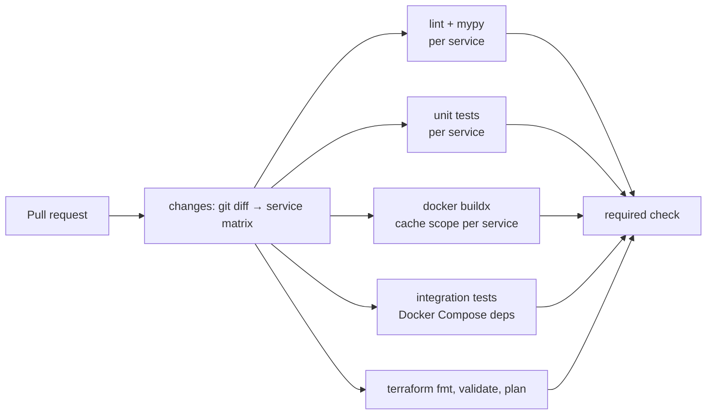

# Reliability & Observability

*Smart Healthcare System ([IoT](https://en.wikipedia.org/wiki/Internet_of_things "Internet of Things — Networked physical devices that report telemetry and receive commands over constrained links"))*

## Table of Contents

- [Read and Write Optimizations](#read-and-write-optimizations)
- [Query Optimization Practice](#query-optimization-practice)
- [Caching Strategy](#caching-strategy)
- [Telemetry](#telemetry)
- [Cluster Health and Maintenance](#cluster-health-and-maintenance)
- [Automation](#automation)

## Read and Write Optimizations

Every index below serves a named query. Column names are those declared in `03-data-modeling.md`.

| Table | Index | Type | Serves |
|---|---|---|---|
| `alerting.alert` | `(dedup_key) WHERE status <> 'resolved'` | Partial unique | Duplicate raise becomes `ON CONFLICT DO NOTHING` |
| `alerting.alert` | `(ward_id, raised_at DESC, alert_id DESC) WHERE status <> 'resolved'` | Partial composite | Ward alert feed with keyset pagination; resolved alerts, the vast majority, are not in the index |
| `alerting.alert` | `(next_escalation_at) WHERE status IN ('open','escalated')` | Partial | `claim_due_escalations` every 15 s |
| `care.admission` | `(bed_id) WHERE status = 'active'` | Partial unique | One active admission per bed; census joins |
| `care.admission` | `(patient_id, admitted_at DESC)` | Composite | Patient history |
| `care.device_binding` | `(device_id) WHERE unbound_at IS NULL` | Partial unique | One open binding per device; `v_device_binding` |
| `care.patient` | `(national_id_hmac)` | B-tree | Exact-match lookup on an encrypted field |
| `care.patient` | `full_name gin_trgm_ops` | [GIN](https://www.postgresql.org/docs/current/gin.html "Generalized Inverted Index — PostgreSQL index type suited to values containing multiple keys, such as arrays or text search") (`pg_trgm`) | Name search by typing part of a name |
| `care.staff_ward_assignment` | `(ward_id, shift_end)` | Composite | `v_on_duty_staff` filter on ward and `shift_end > now()` |
| `care.care_team_member` | `(staff_id)` | B-tree | `v_patient_access` lookup by staff member, joined through `care.staff` on `entra_object_id` (unique, so already indexed); the [PK](https://www.postgresql.org/docs/current/ddl-constraints.html#DDL-CONSTRAINTS-PRIMARY-KEYS "Primary Key — Column set that uniquely identifies each row in a table") covers lookup by admission |
| `telemetry.vitals_minute`, `vitals_hour` | PK `(patient_id, bucket_start)` per partition | Composite | Trend chart: one patient, time range |
| `telemetry.vitals_minute` | `(bucket_start)` | [BRIN](https://www.postgresql.org/docs/current/brin.html "Block Range Index — Compact PostgreSQL index type suited to large, sequentially correlated tables") | Dataset export and rollup-to-hour scans over whole time ranges; tiny because rows arrive in time order |
| `audit.access_event` | `(patient_id, occurred_at)` | Composite | "Who viewed this patient's record" for access reports and [DSAR](https://gdpr-info.eu/art-15-gdpr/ "Data Subject Access Request — Request by an individual to see the personal data an organization holds about them") responses |
| `audit.access_event` | `(occurred_at)` | BRIN | Monthly archive export |
| `robotics.mission` | `(hospital_id, priority DESC, requested_at) WHERE status = 'queued'` | Partial composite | `assign_next_mission` picks the next job |
| `robotics.robot` | `(hospital_id, battery_pct DESC) WHERE status = 'idle'` | Partial composite | Same routine picks the robot |
| `kb.chunk` | `embedding vector_cosine_ops WHERE is_active` | [HNSW](https://arxiv.org/abs/1603.09320 "Hierarchical Navigable Small World — Graph index for approximate nearest-neighbour search over vectors") (`pgvector`), partial | Semantic search |
| `kb.chunk` | `content_tsv` | GIN | Full-text search |
| `notify.delivery` | `(alert_id)` | B-tree | Delivery status per alert on the alert detail view |
| `vitals_raw` (Cosmos DB) | `{patientId: 1, windowStart: 1}` | Compound | Raw timeline, single partition |

**[TTL](https://en.wikipedia.org/wiki/Time_to_live "Time To Live — Duration after which a cached or stored value expires")-style expiry** is done by partition drop (`vitals_minute`, `access_event`), native TTL (`vitals_raw`), [Redis](https://redis.io/docs/latest/ "Redis — In-memory data store used as a cache and fast key-value store") key TTLs, and Blob lifecycle rules, never by `DELETE … WHERE ts < …` over large tables.

**Write path.** `vitals-writer` batches upserts per 10-second window; `func-analytics` writes a whole rollup run through one `upsert_minute_rollups` call; `telemetry-service` never writes to [PostgreSQL](https://www.postgresql.org/docs/current/ "PostgreSQL — Relational database storing and querying structured data with strong transactional guarantees") on ingest.

> **Verify Before Build:** Partial HNSW index — confirm the `pgvector` version on Flexible Server builds and uses an HNSW index with a `WHERE is_active` predicate, and check the plan with `EXPLAIN`. If it does not, delete superseded chunks instead of flagging them, because filtering after an approximate search returns fewer than `k` rows.

## Query Optimization Practice

- **Find the slow queries by evidence.** `pg_stat_statements` is reviewed weekly by total time, and `auto_explain` logs plans for statements over 500 ms. Each fix is checked with `EXPLAIN (ANALYZE, BUFFERS)` before and after.
- **Keyset instead of offset pagination** on the alert feed: `WHERE (raised_at, alert_id) < ($cursor_ts, $cursor_id)` reads one index range, while `OFFSET n` reads and discards `n` rows on every page.
- **Keep predicates sargable.** Trend queries compare `bucket_start` to literal bounds; wrapping it in `date_trunc()` would disable both the index and partition pruning.
- **One statement instead of N.** `ward_census` replaces one query per bed; `upsert_minute_rollups` unpacks a [JSON](https://www.json.org/json-en.html "JavaScript Object Notation — Lightweight text format for structured data exchange") array with `jsonb_to_recordset` into a single `INSERT … ON CONFLICT`.
- **Access checks as `EXISTS`** against `v_patient_access`, which stops at the first matching row.
- **Hybrid search in one query:** two CTEs take the top 20 chunks by cosine distance and the top 20 by `ts_rank`, then fuse them by reciprocal rank (k = 60). Keyword hits catch drug names and codes that embeddings blur; vectors catch paraphrases.

## Caching Strategy

| Layer | What | Policy and invalidation |
|---|---|---|
| Browser | [SPA](https://en.wikipedia.org/wiki/Single-page_application "Single Page Application — Web application that updates its content in place without full page reloads") static assets | Content-hashed file names, `Cache-Control: max-age=31536000, immutable`; a deploy changes the names |
| [CDN](https://en.wikipedia.org/wiki/Content_delivery_network "Content Delivery Network — Distributes cached content across edge locations to reduce latency") | None | Users are a few thousand staff on hospital networks close to the region; a CDN adds cost and a cache that could leak [PHI](https://www.ecfr.gov/current/title-45/subtitle-A/subchapter-C/part-160/subpart-A/section-160.103 "Protected Health Information — Individually identifiable health data that HIPAA regulates") if misconfigured. Evolution trigger: sites far from the region or a public-facing app |
| [API](https://en.wikipedia.org/wiki/API "Application Programming Interface — Defines the contract by which software components exchange requests and data") responses | None for PHI | `Cache-Control: no-store` on every `/api` response |
| Redis, write-through | `thresholds:*`, `devbind:*`, `gateway:*` | `care-core` writes Redis after the PostgreSQL commit. If that write fails it deletes the key instead, so readers fall back to the view. A 5-minute TTL bounds staleness if both fail |
| Redis, cache-aside | `access:*` (60 s), `oncall:*` (60 s), `assistant:cache:*` (24 h) | [ABAC](https://en.wikipedia.org/wiki/Attribute-based_access_control "Attribute Based Access Control — Grants access based on attributes of the subject, resource and environment rather than fixed roles") and roster changes take effect within 60 s. Assistant answers are keyed by `corpus_version`, bumped when a document becomes `active`, so old entries are never read again and expire on their own |
| Redis, primary store | `vitals:latest:*`, `vitals:win:*` | Not a cache of the database: the latest value exists only here and in the next rollup |
| Application | Entra ID signing keys, [NEWS2](https://www.rcp.ac.uk/improving-care/resources/national-early-warning-score-news-2/ "National Early Warning Score 2 — Scores routine vital signs to detect clinical deterioration in adult patients") tables | [JWKS](https://datatracker.ietf.org/doc/html/rfc7517 "JSON Web Key Set — Publishes the public keys a party needs to verify a signed token") refreshed hourly and on an unknown key ID; NEWS2 bands are code constants in `vitals_rules` |

**Why write-through for thresholds.** A threshold change must reach `vitals-processor` on the next batch; with cache-aside, a nurse's tighter limit could be ignored for a full TTL. The 5-minute TTL is only the safety net.

## Telemetry

### Metrics, SLIs and SLOs

Services expose Prometheus metrics at `/metrics`; Azure Monitor managed service for Prometheus scrapes them together with node, kube-state, Istio and [RabbitMQ](https://www.rabbitmq.com/docs "RabbitMQ — Message broker that routes and queues messages between producers and consumers") (`rabbitmq_prometheus` plugin) metrics.

| [SLO](https://sre.google/sre-book/service-level-objectives/ "Service Level Objective — Target value for a service level indicator that a service commits to meet") | [SLI](https://sre.google/sre-book/service-level-objectives/ "Service Level Indicator — Measured metric, such as latency or error rate, used to judge service health") ([PromQL](https://prometheus.io/docs/prometheus/latest/querying/basics/ "Prometheus Query Language — Queries and aggregates time series metrics collected by Prometheus") source) | Target |
|---|---|---|
| Alert delivery | `alert_delivery_seconds` histogram, measured from the ingest receive time carried in the message to push handoff | p95 ≤ 5 s; 99.9% ≤ 30 s |
| Ingest availability | `ingest_batches_total{status!~"5.."}` / total | 99.95% |
| Staff API | Istio request metrics at the ingress, 5xx ratio and p95 | 99.9%, p95 < 300 ms |
| Latest vitals | Same, route `/vitals/latest` | p95 < 100 ms |
| Assistant | `assistant_answer_seconds` | p95 ≤ 8 s; 99.5% availability |
| Processor backlog | `rabbitmq_queue_messages_ready{queue="vitals.processor"}` | < 120 (≈ 3 s of headroom, `04-deep-dive.md`) |

Alerts use multi-window burn rates (page at 14.4× over 1 h and 5 min; ticket at 3× over 6 h). Safety signals page directly, whatever the budget: `gateway_last_seen_age_seconds > 30` for any bound gateway, `escalation_check_last_run_timestamp` older than 60 s, and any [DLQ](https://docs.aws.amazon.com/AWSSimpleQueueService/latest/SQSDeveloperGuide/sqs-dead-letter-queues.html "Dead-Letter Queue — Holds messages that failed processing repeatedly so they can be inspected and redriven") depth above zero.

### Structured logging

- Every service logs one JSON object per line to stdout: `ts`, `level`, `service`, `trace_id`, `span_id`, `request_id`, `actor_id`, `event`, plus event fields.
- **No PHI in logs.** Patient UUIDs are allowed, as they are needed to debug; names, MRNs, vital values and chat text are not. A shared logging filter drops known PHI field names, and a [CI](https://en.wikipedia.org/wiki/Continuous_integration "Continuous Integration — Automatically builds and tests code on every change") test checks that sample requests produce no such field.
- Container Insights ships logs to the Log Analytics workspace `log-care` (30 days interactive, 1 year archive).
- **Grafana is the log front end.** Azure Managed Grafana queries `log-care` through the Azure Monitor data source in [KQL](https://learn.microsoft.com/en-us/kusto/query/ "Kusto Query Language — Query language for Azure Monitor Log Analytics and Azure Data Explorer"). Each service dashboard pairs its metrics with a log panel filtered by `trace_id`, so an engineer moves from a latency spike to the log lines of one slow request without switching tools.

### Distributed tracing

OpenTelemetry instrumentation for Django, Flask, [SQLAlchemy](https://www.sqlalchemy.org/ "SQLAlchemy — Python SQL toolkit and ORM that maps objects to relational tables and builds queries"), Redis, [Celery](https://docs.celeryq.dev/en/stable/ "Celery — Distributed task queue that runs background and scheduled jobs outside the request cycle") and kombu exports to Application Insights. The `traceparent` header travels in [HTTP](https://datatracker.ietf.org/doc/html/rfc9110 "Hypertext Transfer Protocol — Application protocol used to request and transfer web resources") headers and in RabbitMQ message headers, so one trace spans gateway upload → processor → alert-service → notification. Alert-path traces are kept at 100% (~5,000 a day); dashboard reads are sampled at 10%.

## Cluster Health and Maintenance

- **Signals:** node `NotReady` > 5 min, pods in `CrashLoopBackOff`, pods `Pending` > 5 min (capacity), persistent volume > 80% full, RabbitMQ memory or disk alarm, certificate expiry < 14 days, [HPA](https://kubernetes.io/docs/tasks/run-application/horizontal-pod-autoscale/ "Horizontal Pod Autoscaler — Automatically adjusts the number of Kubernetes pod replicas to match load") or [KEDA](https://keda.sh/ "Kubernetes Event-driven Autoscaling — Scales Kubernetes workloads on external event sources such as queue depth") at maximum replicas, [AKS](https://learn.microsoft.com/en-us/azure/aks/ "Azure Kubernetes Service — Managed Kubernetes hosting on Azure") version nearing end of support.
- **Node pools:** `system` (3 × D4s_v5), `apps` (3–9 × D8s_v5, cluster autoscaler), `stateful` (3 × D4s_v5, one per zone, RabbitMQ only, tainted). Separating RabbitMQ keeps a noisy application pod from starving the broker.
- **Upgrades:** planned maintenance window Sunday 02:00–06:00 local time; node image channel `NodeImage`; max surge 33%; PodDisruptionBudgets hold `minAvailable: 2` for alert-path deployments and `maxUnavailable: 1` for RabbitMQ.
- **Troubleshooting runbook:** events and `kubectl describe` first, then the pod's Grafana log panel, then its trace; each paging alert links to its runbook section.

## Automation

### CI — speed through caching and parallel jobs

The repository holds `services/*`, `functions/*`, `contracts/`, `vitals_rules/` and `infra/`.

- **Only what changed.** A Bash step maps changed paths to services; a change to `contracts/` or `vitals_rules/` selects every service that imports them.
- **Parallel matrix jobs** per service for lint, type checks, unit tests, image build and integration tests; a concurrency group cancels superseded runs on the same branch.
- **Dependency caching:** `actions/setup-python` pip cache keyed on each service's lock file; Docker Buildx layer cache (`type=gha`, scope per service); Dockerfiles install dependencies before copying code, so a code-only change reuses the dependency layer.
- **Build once.** `main` builds each image once, tags it with the commit [SHA](https://csrc.nist.gov/pubs/fips/180-4/upd1/final "Secure Hash Algorithm — Family of cryptographic hash functions used to verify content integrity") and pushes it to [ACR](https://learn.microsoft.com/en-us/azure/container-registry/ "Azure Container Registry — Stores and geo-replicates container images for Azure deployments") through GitHub [OIDC](https://openid.net/developers/how-connect-works/ "OpenID Connect — Identity layer on top of OAuth 2.0 for authenticating users"); later stages promote that exact image.

### CD — deployment strategy

1. **Migrations first**, as a [Kubernetes](https://kubernetes.io/ "Kubernetes — Automates deployment, scaling and management of containerized applications") Job, following expand-then-contract: a release only adds columns or views; removal waits for a later release. Any image can therefore be rolled back without a down-migration.
2. **Staging** deploys automatically and runs smoke tests, including a synthetic gateway that injects a breaching reading and asserts that a push reaches a test device within 5 s.
3. **Production canary for HTTP services:** Istio weights 10% → 50% → 100%, with a Bash gate querying Prometheus for 5xx ratio and p95 at each step; failure reverts the weights.
4. **Production canary for queue workers:** one new-version replica joins the existing consumers and takes ~1/N of messages; the gate watches DLQ depth, error rate and `alert_delivery_seconds` for 15 minutes before rolling the rest.
5. **Rollback** re-applies the previous SHA's manifests.
6. **Infrastructure:** [Terraform](https://developer.hashicorp.com/terraform/docs "Terraform — Infrastructure as code tool that declares and provisions cloud infrastructure from configuration files") plan on every pull request; apply on merge after environment approval. State lives in an Azure Storage backend with blob-lease locking, one state per environment plus `dr`.
7. **Functions** deploy as zip packages from the same pipeline. The AKS API server is private, so deploy jobs run on a self-hosted runner inside the VNet, while build jobs stay on GitHub-hosted runners.
