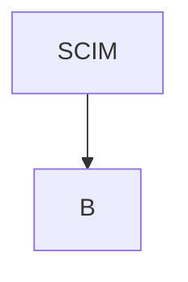

# Abbreviation Glossary and Link Enrichment Implementation Plan

> **For agentic workers:** REQUIRED SUB-SKILL: Use superpowers:subagent-driven-development (recommended) or superpowers:executing-plans to implement this plan task-by-task. Steps use checkbox (`- [ ]`) syntax for tracking.

**Goal:** Give every abbreviation in generated case documents a single owner and a clickable, hover-explained first occurrence, applied by a script rather than by hand.

**Architecture:** `.claude/glossary.md` owns four facts per term — expansion, purpose, official source, and whether the term is linked at all. A Python linker applies the glossary to Markdown files after generation, linking the first eligible occurrence per file; a `--check` mode reports divergence and is the guard. The linker runs *after* a skill writes, so no mode reads the glossary and `preflight.sh`'s input contract is untouched.

**Tech Stack:** Python 3.14 standard library only; bash + shellcheck 0.11 for the fixture harness.

**Spec:** `docs/superpowers/specs/2026-09-08-abbreviation-glossary-design.md`

## Global Constraints

- **Branch:** `docs/case-02-interview-packs`. Do not create another branch.
- **Commits require explicit authorisation from the user.** The repository rule is that nothing is committed unless the user has said so in the session. Commit steps below are written assuming that authorisation has been given; if it has not, stop at the commit step and ask.
- **Python is admitted for Markdown-aware tooling only.** Standard library only — no third-party dependencies, no `pip install`, no virtualenv. Shell owns every gate and fixture suite.
- **Shellcheck runs as a directory sweep, never on one file:** `shellcheck .claude/skills/interview-prep/scripts/*.sh .claude/scripts/*.sh`. A solo invocation silences findings the sweep reports.
- **Three states per check, never two:** pass, fail, and could-not-run. Exit codes are the contract; never dispatch on printed text.
- **Every fixture is built in a temp directory**, never inside `cases/`. A harness that reads live case content reports failures the code did not cause.
- **Markdown in `.claude/skills/` is unwrapped** — one long line per paragraph and per list item. Do not reflow it. `.claude/glossary.md` follows the same rule.
- **Never delete or regenerate content under `cases/`.** The back-fill tasks modify files in place and are reviewed as diffs.

---

## File Structure

| File | Responsibility |
|---|---|
| `.claude/glossary.md` | Sole owner of the convention statement, the linked-term table, and the recorded exclusions |
| `.claude/scripts/link-abbreviations.py` | Parses the glossary, applies it to Markdown, and reports divergence under `--check` |
| `.claude/scripts/link-abbreviations-check.sh` | Fixture harness proving the linker's behaviour, in the idiom of `gate-check.sh` |
| `CLAUDE.md` | Gains a "Where to find things" pair of rows, one Architectural Invariant, one forbidden pattern, and two testing commands |
| `.claude/skills/system-design/SKILL.md` | One line in Step 5 |
| `.claude/skills/interview-prep/SKILL.md` | One line in Step 4 |
| `.claude/skills/interview-prep/references/output-conventions.md` | One line under Language & style |
| `cases/02/projects/*/*.md` | Back-filled, 508 link sites across 16 files |

---

### Task 1: Glossary schema, parser, and harness scaffold

**Files:**
- Create: `.claude/glossary.md`
- Create: `.claude/scripts/link-abbreviations.py`
- Create: `.claude/scripts/link-abbreviations-check.sh`

**Interfaces:**
- Consumes: nothing.
- Produces: `load_glossary(path) -> tuple[list[Term], dict[str, str]]` returning linked terms and the exclusion map; `Term` is a `NamedTuple` with fields `term, expansion, purpose, source`; `GlossaryError(Exception)`. CLI: `link-abbreviations.py [--check] [--glossary PATH] FILE...` with exit codes `0` OK, `1` findings, `2` cannot-run.

- [ ] **Step 1: Write the failing harness**

Create `.claude/scripts/link-abbreviations-check.sh`:

```bash
#!/usr/bin/env bash
# Verification harness for link-abbreviations.py.
#
# The linker rewrites prose that is hours of work and not identically
# reproducible, so it gets more scrutiny than the documents it edits. Every
# fixture is built from scratch in a temp directory; the harness must never
# read the live contents of cases/.
#
# Three states per check, never two: PASS, FAIL, and ERROR for could-not-run.
#
# Exits 0 when every check passed, the self-test confirmed the harness can
# detect a wrong expectation, and nothing errored.

set -u

REPO="$(cd "$(dirname "${BASH_SOURCE[0]}")/../.." && pwd)"
LINKER="$REPO/.claude/scripts/link-abbreviations.py"

pass=0; fail=0; err=0

FIX="$(mktemp -d)"
cleanup() { rm -rf "$FIX"; }
trap cleanup EXIT

# check <want-exit> <want-substring|EMPTY> <args...>
check() {
    local want_exit="$1" want_text="$2"; shift 2
    local out rc label="$*"
    label="${label//$FIX/TMP}"
    if [ ! -f "$LINKER" ]; then
        printf 'ERROR  linker not found: %s\n' "$LINKER"; err=$((err+1)); return 1
    fi
    out="$(python3 "$LINKER" "$@" 2>&1)"; rc=$?
    if [ "$rc" -ne "$want_exit" ]; then
        printf 'FAIL   [%s] exit %s, wanted %s\n' "$label" "$rc" "$want_exit"; fail=$((fail+1)); return 1
    fi
    if [ "$want_text" != EMPTY ] && ! printf '%s' "$out" | grep -qF -- "$want_text"; then
        printf 'FAIL   [%s] exit %s ok, but output lacks: %s\n' "$label" "$rc" "$want_text"; fail=$((fail+1)); return 1
    fi
    printf 'PASS   [%s] exit %s\n' "$label" "$rc"; pass=$((pass+1)); return 0
}

# want_file <file> <HAS|LACKS> <substring>
want_file() {
    local file="$1" mode="$2" text="$3" label
    label="$(basename "$file") $mode: $text"
    if [ ! -f "$file" ]; then
        printf 'ERROR  [%s] no such file\n' "$label"; err=$((err+1)); return 1
    fi
    if grep -qF -- "$text" "$file"; then
        if [ "$mode" = HAS ]; then
            printf 'PASS   [%s]\n' "$label"; pass=$((pass+1)); return 0
        fi
        printf 'FAIL   [%s] present but must be absent\n' "$label"; fail=$((fail+1)); return 1
    fi
    if [ "$mode" = LACKS ]; then
        printf 'PASS   [%s]\n' "$label"; pass=$((pass+1)); return 0
    fi
    printf 'FAIL   [%s] absent but must be present\n' "$label"; fail=$((fail+1)); return 1
}

write_glossary() {
    mkdir -p "$(dirname "$1")"
    cat > "$1" <<'GLOSS'
# Glossary

## Linked terms

| Term | Expansion | Purpose | Source |
|---|---|---|---|
| SCIM | System for Cross-domain Identity Management | An open REST standard for provisioning users and groups between an identity provider and an application. | https://scim.cloud/ |
| ORM | Object-Relational Mapping | Maps relational rows onto objects so queries are written in the host language. | https://en.wikipedia.org/wiki/Object-relational_mapping |
| SHA | Secure Hash Algorithm | A family of cryptographic hash functions used for integrity checks and signatures. | https://csrc.nist.gov/projects/hash-functions |
| SHA-256 | Secure Hash Algorithm 256-bit | The 256-bit member of the SHA-2 family, the default choice for content hashing and HMAC. | https://csrc.nist.gov/projects/hash-functions |

## Deliberately not linked

| Term | Reason |
|---|---|
| CPU | Universally known; a link would be clutter. |
| PATIENT | A Mermaid node identifier, not prose. |
GLOSS
}

echo "--- malformed invocations are CANNOT-RUN, not findings ---"
write_glossary "$FIX/glossary.md"
printf '# Doc\n\nNothing to see.\n' > "$FIX/plain.md"
check 2 "usage" --glossary "$FIX/glossary.md"
check 2 "No such file" --glossary "$FIX/missing.md" "$FIX/plain.md"
check 2 "no such file" --glossary "$FIX/glossary.md" "$FIX/absent.md"

echo "--- a malformed glossary is CANNOT-RUN ---"
printf '# Glossary\n\n## Linked terms\n\n| Term | Expansion |\n|---|---|\n| X | Y |\n' > "$FIX/bad-cols.md"
check 2 "expected 4 columns" --glossary "$FIX/bad-cols.md" "$FIX/plain.md"

echo "--- a document with no glossary term is OK and unchanged ---"
check 0 EMPTY --glossary "$FIX/glossary.md" "$FIX/plain.md"
want_file "$FIX/plain.md" HAS "Nothing to see."

echo "--- self-test: the harness must be able to report a failure ---"
before=$fail
check 99 EMPTY --glossary "$FIX/glossary.md" "$FIX/plain.md" >/dev/null 2>&1
if [ "$fail" -eq $((before + 1)) ]; then
    fail=$before
    printf 'PASS   harness detects a wrong expectation\n'; pass=$((pass+1))
else
    printf 'ERROR  harness did NOT detect a planted wrong expectation\n'; err=$((err+1))
fi

printf '\npass=%s fail=%s error=%s\n' "$pass" "$fail" "$err"
[ "$fail" -eq 0 ] && [ "$err" -eq 0 ] || exit 1
echo "OK"
```

- [ ] **Step 2: Run it to verify it fails**

```bash
chmod +x .claude/scripts/link-abbreviations-check.sh
.claude/scripts/link-abbreviations-check.sh
```

Expected: every `check` reports `ERROR  linker not found`, the run ends with a non-zero `error=` count, and exit status is 1.

- [ ] **Step 3: Write the linker skeleton**

Create `.claude/scripts/link-abbreviations.py`:

```python
#!/usr/bin/env python3
"""Apply .claude/glossary.md to Markdown files.

The glossary owns what an abbreviation expands to, what it is for, and where
its official source lives. This script is the only thing that writes those
facts into a document, so no document restates them and none drifts.

Exit codes (dispatch on these, not on the printed text):
  0  OK          nothing to report; the files match the glossary
  1  FINDINGS    --check only: at least one divergence from the glossary
  2  CANNOT-RUN  the invocation, or the glossary itself, is malformed
"""

import argparse
import re
import sys
from pathlib import Path
from typing import NamedTuple

EXIT_OK = 0
EXIT_FINDINGS = 1
EXIT_CANNOT_RUN = 2

LINKED_HEADING = "## Linked terms"
EXCLUDED_HEADING = "## Deliberately not linked"

TABLE_ROW = re.compile(r"^\|(.+)\|\s*$")
SEPARATOR_ROW = re.compile(r"^[\s|:-]+$")


class Term(NamedTuple):
    term: str
    expansion: str
    purpose: str
    source: str


class GlossaryError(Exception):
    """The glossary cannot be trusted, so nothing may be written from it."""


def _table_after(lines, heading, want_columns):
    """Rows of the first Markdown table following `heading`, header dropped."""
    try:
        start = lines.index(heading) + 1
    except ValueError:
        raise GlossaryError(f"glossary has no {heading!r} section")
    rows, seen_header = [], False
    for line in lines[start:]:
        if not line.strip():
            if rows or seen_header:
                break
            continue
        match = TABLE_ROW.match(line)
        if not match:
            break
        if SEPARATOR_ROW.match(match.group(1)):
            continue
        cells = [cell.strip() for cell in match.group(1).split("|")]
        if len(cells) != want_columns:
            raise GlossaryError(
                f"{heading!r}: expected {want_columns} columns, got {len(cells)}: {line.strip()}"
            )
        if not seen_header:
            seen_header = True
            continue
        rows.append(cells)
    return rows


def _validate(term: Term) -> None:
    for label, value in (
        ("expansion", term.expansion),
        ("purpose", term.purpose),
    ):
        if not value:
            raise GlossaryError(f"{term.term}: {label} is empty")
        if '"' in value:
            raise GlossaryError(
                f'{term.term}: {label} contains a double quote, which would end the link title'
            )
        if "(" in value or ")" in value:
            # A parenthesis inside a rendered title ends the link early for the
            # regex that masks existing links, which would break idempotency.
            raise GlossaryError(
                f"{term.term}: {label} contains a parenthesis; rephrase without one"
            )
    if not term.source.startswith(("http://", "https://")):
        raise GlossaryError(f"{term.term}: source is not an http(s) URL: {term.source}")
    if "(" in term.source or ")" in term.source:
        raise GlossaryError(
            f"{term.term}: source contains a parenthesis, which would end the link target"
        )


def load_glossary(path: Path):
    """Return (linked terms, {excluded term: reason}). Raises GlossaryError."""
    try:
        lines = path.read_text(encoding="utf-8").split("\n")
    except OSError as exc:
        raise GlossaryError(f"cannot read glossary: {exc}")

    terms = []
    for term, expansion, purpose, source in _table_after(lines, LINKED_HEADING, 4):
        entry = Term(term, expansion, purpose, source)
        _validate(entry)
        terms.append(entry)

    excluded = {}
    for row in _table_after(lines, EXCLUDED_HEADING, 2):
        excluded[row[0]] = row[1]

    seen = {}
    for entry in terms:
        if entry.term in seen:
            raise GlossaryError(f"{entry.term}: listed twice under {LINKED_HEADING}")
        seen[entry.term] = True
    for term in excluded:
        if term in seen:
            raise GlossaryError(f"{term}: listed as both linked and not linked")

    # Longest first, so SHA-256 is attempted before SHA. Without this, the word
    # boundary after "SHA" in "SHA-256" is real and the shorter term wins.
    terms.sort(key=lambda entry: len(entry.term), reverse=True)
    return terms, excluded


def main(argv=None) -> int:
    parser = argparse.ArgumentParser(
        prog="link-abbreviations.py",
        description="Apply the abbreviation glossary to Markdown files.",
    )
    parser.add_argument("files", nargs="+", metavar="FILE")
    parser.add_argument("--check", action="store_true", help="report only; write nothing")
    parser.add_argument(
        "--glossary",
        default=".claude/glossary.md",
        help="path to the glossary (default: .claude/glossary.md)",
    )
    args = parser.parse_args(argv)

    try:
        terms, excluded = load_glossary(Path(args.glossary))
    except GlossaryError as exc:
        print(f"cannot-run: {exc}", file=sys.stderr)
        return EXIT_CANNOT_RUN

    targets = []
    for name in args.files:
        path = Path(name)
        if not path.is_file():
            print(f"cannot-run: no such file: {name}", file=sys.stderr)
            return EXIT_CANNOT_RUN
        targets.append(path)

    return EXIT_OK


if __name__ == "__main__":
    sys.exit(main())
```

Note: `argparse` exits `2` on a missing argument and prints `usage:`, which is exactly the cannot-run contract — the first harness check relies on that and needs no extra code.

- [ ] **Step 4: Run the harness to verify it passes**

```bash
chmod +x .claude/scripts/link-abbreviations.py
.claude/scripts/link-abbreviations-check.sh
```

Expected: `pass=7 fail=0 error=0` and `OK` — six explicit checks plus the self-test.

- [ ] **Step 5: Verify the missing-glossary path separately**

The `--glossary "$FIX/missing.md"` check asserts substring `no such file`, but that message comes from `GlossaryError(f"cannot read glossary: {exc}")`, whose text is the `OSError` string. Confirm by hand that it contains `No such file`:

```bash
python3 .claude/scripts/link-abbreviations.py --glossary /nonexistent.md README.md; echo "EXIT=$?"
```

Expected: a message containing `No such file or directory` and `EXIT=2`. If the case does not match, change the harness assertion to `No such file` rather than weakening the script.

- [ ] **Step 6: Lint**

```bash
shellcheck .claude/skills/interview-prep/scripts/*.sh .claude/scripts/*.sh
```

Expected: no output, exit 0.

- [ ] **Step 7: Commit**

```bash
git add .claude/glossary.md .claude/scripts/link-abbreviations.py .claude/scripts/link-abbreviations-check.sh
git commit -m "feat: add abbreviation glossary schema and linker skeleton"
```

---

### Task 2: Write mode — first eligible occurrence and skipped regions

**Files:**
- Modify: `.claude/scripts/link-abbreviations.py`
- Modify: `.claude/scripts/link-abbreviations-check.sh`

**Interfaces:**
- Consumes: `Term`, `load_glossary` from Task 1.
- Produces: `eligible_lines(text) -> Iterator[tuple[int, str]]`; `eligible_mask(line) -> list[bool]`; `link_first(text, term) -> tuple[str, bool]` returning the new text and whether a link was added; `render_title(term, inline_expanded) -> str`.

- [ ] **Step 1: Write the failing checks**

Append to `link-abbreviations-check.sh`, immediately before the `--- self-test:` block:

```bash
echo "--- write mode links the first eligible occurrence only ---"
cat > "$FIX/prose.md" <<'DOC'
# Heading with SCIM in it

SCIM is the provisioning standard. A second SCIM mention must stay bare.

| Feature | Note |
|---|---|
| Provisioning | SCIM in a table cell is eligible |
DOC
check 0 EMPTY --glossary "$FIX/glossary.md" "$FIX/prose.md"
want_file "$FIX/prose.md" HAS '[SCIM](https://scim.cloud/ "System for Cross-domain Identity Management — An open REST standard'
want_file "$FIX/prose.md" HAS 'A second SCIM mention must stay bare.'
want_file "$FIX/prose.md" HAS '# Heading with SCIM in it'

echo "--- fenced blocks, inline code, headings and existing links are skipped ---"
cat > "$FIX/skips.md" <<'DOC'
## SCIM heading



The `SCIM` service identifier is code, and [SCIM](https://example.com/) is already linked.

Only this bare SHA is eligible.
DOC
check 0 EMPTY --glossary "$FIX/glossary.md" "$FIX/skips.md"
want_file "$FIX/skips.md" HAS '  A[SCIM] --> B'
want_file "$FIX/skips.md" HAS 'The `SCIM` service identifier'
want_file "$FIX/skips.md" HAS '[SCIM](https://example.com/) is already linked'
want_file "$FIX/skips.md" HAS 'Only this bare [SHA](https://csrc.nist.gov/projects/hash-functions "Secure Hash Algorithm — A family'

echo "--- a term inside a longer token is not matched ---"
printf '# T\n\nThe value SHA-256 appears, and nothing else does.\n' > "$FIX/longest.md"
check 0 EMPTY --glossary "$FIX/glossary.md" "$FIX/longest.md"
want_file "$FIX/longest.md" HAS '[SHA-256](https://csrc.nist.gov/projects/hash-functions "Secure Hash Algorithm 256-bit'
want_file "$FIX/longest.md" LACKS '[SHA](https://csrc.nist.gov/projects/hash-functions "Secure Hash Algorithm —'
# SHA has no standalone occurrence here, so the only way it could appear is by
# matching inside SHA-256 -- which is exactly what longest-match-first prevents.
```

- [ ] **Step 2: Run to verify the new checks fail**

```bash
.claude/scripts/link-abbreviations-check.sh
```

Expected: the `want_file ... HAS '[SCIM](https://scim.cloud/ ...'` assertions FAIL because nothing is written yet. Confirm the failures name the link assertions, not the Task 1 checks.

- [ ] **Step 3: Implement region detection and linking**

Add to `link-abbreviations.py`, above `main`:

```python
FENCE = re.compile(r"^\s*(```|~~~)")
HEADING = re.compile(r"^\s{0,3}#{1,6}\s")
INLINE_CODE = re.compile(r"`[^`]*`")
MD_LINK = re.compile(r"\[[^\]]*\]\([^)]*\)")
HTML_TAG = re.compile(r"<[^>]+>")


def eligible_lines(text):
    """Yield (index, line) for lines whose prose may be linked.

    Fenced blocks hold Mermaid, SQL and code. Headings are skipped because a
    link changes the GitHub anchor slug and every generated document has a
    table of contents that depends on it. `<details>` bodies are *not* skipped:
    GitHub renders Markdown inside them and they hold most of an answer pack.
    """
    lines = text.split("\n")
    start = 0
    if lines and lines[0].strip() == "---":
        for index in range(1, len(lines)):
            if lines[index].strip() == "---":
                start = index + 1
                break
    in_fence, marker = False, None
    for index in range(start, len(lines)):
        line = lines[index]
        fence = FENCE.match(line)
        if fence:
            if not in_fence:
                in_fence, marker = True, fence.group(1)
            elif fence.group(1) == marker:
                in_fence, marker = False, None
            continue
        if in_fence or HEADING.match(line):
            continue
        if line.lstrip().startswith("<summary"):
            continue
        yield index, line


def eligible_mask(line):
    """True for each character of `line` that may take part in a match.

    Whole Markdown links are masked before inline code, because link text may
    itself contain backticks and masking the link first keeps both halves out.
    """
    mask = [True] * len(line)
    for pattern in (MD_LINK, INLINE_CODE, HTML_TAG):
        for match in pattern.finditer(line):
            for position in range(match.start(), match.end()):
                mask[position] = False
    return mask


def render_title(term: Term, inline_expanded: bool) -> str:
    """The link title. Purpose alone where the prose already expanded the term."""
    if inline_expanded:
        return term.purpose
    return f"{term.expansion} — {term.purpose}"


def already_linked(text: str, term: Term) -> bool:
    return re.search(r"\[" + re.escape(term.term) + r"\]\(", text) is not None


def link_first(text: str, term: Term):
    """Link the first eligible occurrence. Returns (text, linked?)."""
    if already_linked(text, term):
        return text, False
    pattern = re.compile(r"\b" + re.escape(term.term) + r"\b")
    expanded = re.compile(re.escape(term.expansion) + r"\s*\($")
    lines = text.split("\n")
    for index, line in eligible_lines(text):
        mask = eligible_mask(line)
        for match in pattern.finditer(line):
            if not all(mask[match.start():match.end()]):
                continue
            inline = bool(expanded.search(line[:match.start()]))
            link = f'[{term.term}]({term.source} "{render_title(term, inline)}")'
            lines[index] = line[:match.start()] + link + line[match.end():]
            return "\n".join(lines), True
    return text, False
```

Then replace the `return EXIT_OK` at the end of `main` with:

```python
    for path in targets:
        original = path.read_text(encoding="utf-8")
        updated = original
        for term in terms:
            updated, _ = link_first(updated, term)
        if updated != original:
            path.write_text(updated, encoding="utf-8")
    return EXIT_OK
```

- [ ] **Step 4: Run the harness to verify it passes**

```bash
.claude/scripts/link-abbreviations-check.sh
```

Expected: `fail=0 error=0` and `OK`.

- [ ] **Step 5: Lint and commit**

```bash
shellcheck .claude/skills/interview-prep/scripts/*.sh .claude/scripts/*.sh
git add .claude/scripts/
git commit -m "feat: link the first eligible abbreviation occurrence per file"
```

---

### Task 3: Inline-expansion tooltips and idempotency

**Files:**
- Modify: `.claude/scripts/link-abbreviations-check.sh`

**Interfaces:**
- Consumes: `link_first`, `render_title`, `already_linked` from Task 2.
- Produces: no new functions. This task proves two behaviours Task 2 implemented but did not test.

- [ ] **Step 1: Write the failing checks**

Append to `link-abbreviations-check.sh`, before the `--- self-test:` block:

```bash
echo "--- where the prose already expands the term, the title carries purpose only ---"
printf '# T\n\nWe use Object-Relational Mapping (ORM) throughout.\n' > "$FIX/inline.md"
check 0 EMPTY --glossary "$FIX/glossary.md" "$FIX/inline.md"
want_file "$FIX/inline.md" HAS 'Object-Relational Mapping ([ORM](https://en.wikipedia.org/wiki/Object-relational_mapping "Maps relational rows onto objects so queries are written in the host language."))'
want_file "$FIX/inline.md" LACKS 'Object-Relational Mapping — Maps relational rows'

echo "--- where it does not, the title carries expansion and purpose ---"
printf '# T\n\nThe ORM layer is generated.\n' > "$FIX/bare.md"
check 0 EMPTY --glossary "$FIX/glossary.md" "$FIX/bare.md"
want_file "$FIX/bare.md" HAS '[ORM](https://en.wikipedia.org/wiki/Object-relational_mapping "Object-Relational Mapping — Maps relational rows'

echo "--- slash compounds link on both sides ---"
printf '# T\n\nThe SCIM/SHA pairing appears once.\n' > "$FIX/slash.md"
check 0 EMPTY --glossary "$FIX/glossary.md" "$FIX/slash.md"
want_file "$FIX/slash.md" HAS '[SCIM](https://scim.cloud/'
want_file "$FIX/slash.md" HAS '[SHA](https://csrc.nist.gov/projects/hash-functions'

echo "--- a second run is a no-op ---"
cp "$FIX/prose.md" "$FIX/prose.first.md"
check 0 EMPTY --glossary "$FIX/glossary.md" "$FIX/prose.md"
if diff -q "$FIX/prose.first.md" "$FIX/prose.md" >/dev/null; then
    printf 'PASS   [idempotent: second run changed nothing]\n'; pass=$((pass+1))
else
    printf 'FAIL   [idempotent: second run modified the file]\n'; fail=$((fail+1))
    diff "$FIX/prose.first.md" "$FIX/prose.md" | head -5
fi
```

- [ ] **Step 2: Run to verify**

```bash
.claude/scripts/link-abbreviations-check.sh
```

Expected: PASS on all three groups. Task 2's implementation already satisfies them — `already_linked` gives idempotency and `expanded` gives the inline form. **If any fails, the defect is in Task 2's code, not in this task's checks.** Fix `link-abbreviations.py`, not the assertions.

- [ ] **Step 3: Commit**

```bash
git add .claude/scripts/link-abbreviations-check.sh
git commit -m "test: cover inline-expansion titles and linker idempotency"
```

---

### Task 4: `--check` mode

**Files:**
- Modify: `.claude/scripts/link-abbreviations.py`
- Modify: `.claude/scripts/link-abbreviations-check.sh`

**Interfaces:**
- Consumes: `Term`, `load_glossary`, `eligible_lines`, `eligible_mask`, `already_linked`, `render_title`.
- Produces: `findings(text, terms, excluded) -> list[str]`, each string a one-line human-readable finding.

- [ ] **Step 1: Write the failing checks**

Append to `link-abbreviations-check.sh`, before the `--- self-test:` block:

```bash
echo "--- --check reports and never writes ---"
printf '# T\n\nBare SCIM here.\n' > "$FIX/unlinked.md"
cp "$FIX/unlinked.md" "$FIX/unlinked.before.md"
check 1 "unlinked: SCIM" --check --glossary "$FIX/glossary.md" "$FIX/unlinked.md"
if diff -q "$FIX/unlinked.before.md" "$FIX/unlinked.md" >/dev/null; then
    printf 'PASS   [--check wrote nothing]\n'; pass=$((pass+1))
else
    printf 'FAIL   [--check modified the file]\n'; fail=$((fail+1))
fi

echo "--- --check reports a title that has drifted from the glossary ---"
printf '# T\n\n[SCIM](https://scim.cloud/ "Something else entirely.") here.\n' > "$FIX/drift.md"
check 1 "title differs from the glossary: SCIM" --check --glossary "$FIX/glossary.md" "$FIX/drift.md"

echo "--- --check reports a URL that has drifted ---"
printf '# T\n\n[SCIM](https://example.invalid/ "System for Cross-domain Identity Management — An open REST standard for provisioning users and groups between an identity provider and an application.") here.\n' > "$FIX/url.md"
check 1 "source differs from the glossary: SCIM" --check --glossary "$FIX/glossary.md" "$FIX/url.md"

echo "--- --check reports a link to a term the glossary does not hold ---"
printf '# T\n\n[LDAP](https://ldap.com/ "Lightweight Directory Access Protocol — A directory protocol.") here.\n' > "$FIX/unknown.md"
check 1 "not in the glossary: LDAP" --check --glossary "$FIX/glossary.md" "$FIX/unknown.md"

echo "--- a recorded exclusion is not a finding ---"
printf '# T\n\nThe [CPU](https://example.com/ "Central Processing Unit is the processor.") is linked but excluded, and PATIENT stays bare.\n' > "$FIX/excluded.md"
check 0 EMPTY --check --glossary "$FIX/glossary.md" "$FIX/excluded.md"

echo "--- an enriched document is clean under --check ---"
check 0 EMPTY --check --glossary "$FIX/glossary.md" "$FIX/inline.md"
```

- [ ] **Step 2: Run to verify the checks fail**

```bash
.claude/scripts/link-abbreviations-check.sh
```

Expected: the `--check` groups FAIL with `exit 0, wanted 1` — the flag is parsed but does nothing yet.

- [ ] **Step 3: Implement `findings`**

Add to `link-abbreviations.py`, above `main`:

```python
LINKED_TERM = re.compile(r"\[([A-Za-z0-9][A-Za-z0-9.+-]*)\]\((\S+?)\s+\"([^\"]*)\"\)")
ABBREVIATION = re.compile(r"^[A-Z][A-Za-z0-9]*[A-Z0-9](?:-[A-Z0-9]{1,5})?$")


def findings(text: str, terms, excluded) -> list:
    """Every divergence between a document and the glossary, as one line each."""
    by_term = {entry.term: entry for entry in terms}
    reported = []

    for match in LINKED_TERM.finditer(text):
        label, source, title = match.group(1), match.group(2), match.group(3)
        entry = by_term.get(label)
        if entry is None:
            if ABBREVIATION.match(label) and label not in excluded:
                reported.append(f"not in the glossary: {label}")
            continue
        if source != entry.source:
            reported.append(
                f"source differs from the glossary: {label} ({source} != {entry.source})"
            )
        if title not in (render_title(entry, True), render_title(entry, False)):
            reported.append(f"title differs from the glossary: {label}")

    for entry in terms:
        if already_linked(text, entry):
            continue
        pattern = re.compile(r"\b" + re.escape(entry.term) + r"\b")
        for _, line in eligible_lines(text):
            mask = eligible_mask(line)
            if any(
                all(mask[match.start():match.end()])
                for match in pattern.finditer(line)
            ):
                reported.append(f"unlinked: {entry.term}")
                break
    return reported
```

Then replace the write loop in `main` with:

```python
    found = False
    for path in targets:
        original = path.read_text(encoding="utf-8")
        if args.check:
            for line in findings(original, terms, excluded):
                print(f"{path}: {line}")
                found = True
            continue
        updated = original
        for term in terms:
            updated, _ = link_first(updated, term)
        if updated != original:
            path.write_text(updated, encoding="utf-8")
    return EXIT_FINDINGS if found else EXIT_OK
```

- [ ] **Step 4: Run the harness to verify it passes**

```bash
.claude/scripts/link-abbreviations-check.sh
```

Expected: `fail=0 error=0` and `OK`.

- [ ] **Step 5: Prove the two states are distinct**

The whole point of `--check` is that a clean document and a divergent one are told apart by exit status:

```bash
python3 .claude/scripts/link-abbreviations.py --check --glossary .claude/glossary.md README.md; echo "EXIT=$?"
```

Expected: exit `0` or `1`, never `2`. If `2`, the glossary is malformed — fix it before continuing.

- [ ] **Step 6: Lint and commit**

```bash
shellcheck .claude/skills/interview-prep/scripts/*.sh .claude/scripts/*.sh
git add .claude/scripts/
git commit -m "feat: add --check mode reporting divergence from the glossary"
```

---

### Task 5: Re-verify the harness by mutation

**Files:**
- Temporarily modify then restore: `.claude/scripts/link-abbreviations.py`

**Interfaces:**
- Consumes: the complete linker and harness.
- Produces: no code. The deliverable is evidence that the suite can fail.

A suite that only ever passes confirms whatever you already expected. Each mutation below must be **caught** — the harness must exit non-zero and name a failing check. Restore with `git checkout -- .claude/scripts/link-abbreviations.py` after each.

- [ ] **Step 1: Mutation 1 — fence tracking disabled**

In `eligible_lines`, change `if in_fence or HEADING.match(line):` to `if HEADING.match(line):`.

```bash
.claude/scripts/link-abbreviations-check.sh; echo "EXIT=$?"
git checkout -- .claude/scripts/link-abbreviations.py
```

Expected: FAIL naming the Mermaid assertion `A[SCIM] --> B`, `EXIT=1`.

- [ ] **Step 2: Mutation 2 — heading skip removed**

In `eligible_lines`, change the same line to `if in_fence:`.

```bash
.claude/scripts/link-abbreviations-check.sh; echo "EXIT=$?"
git checkout -- .claude/scripts/link-abbreviations.py
```

Expected: FAIL naming `# Heading with SCIM in it`, `EXIT=1`.

- [ ] **Step 3: Mutation 3 — idempotency broken**

In `link_first`, change `if already_linked(text, term):` to `if False:`.

```bash
.claude/scripts/link-abbreviations-check.sh; echo "EXIT=$?"
git checkout -- .claude/scripts/link-abbreviations.py
```

Expected: FAIL naming `idempotent: second run modified the file`, `EXIT=1`.

- [ ] **Step 4: Mutation 4 — title divergence not reported**

In `findings`, delete the two lines that append `title differs from the glossary`.

```bash
.claude/scripts/link-abbreviations-check.sh; echo "EXIT=$?"
git checkout -- .claude/scripts/link-abbreviations.py
```

Expected: FAIL on the drift check with `exit 0, wanted 1`, `EXIT=1`.

- [ ] **Step 5: Confirm the tree is clean and green**

```bash
git status --short .claude/scripts/
.claude/scripts/link-abbreviations-check.sh
```

Expected: no modifications listed, harness reports `OK`. If any mutation was **not** caught, add the missing check before continuing — an uncaught mutation means that behaviour is unguarded.

---

### Task 6: Populate the glossary

**Files:**
- Modify: `.claude/glossary.md`

**Interfaces:**
- Consumes: the schema from Task 1.
- Produces: 124 linked terms and 23 recorded exclusions.

- [ ] **Step 1: Enumerate the terms the corpus actually uses**

```bash
python3 - <<'EOF'
import re, glob, collections
token = re.compile(r'\b[A-Z][A-Za-z0-9]*[A-Z0-9](?:-[A-Z0-9]{1,5})?\b')
products = {'PostgreSQL','MongoDB','FastAPI','RabbitMQ','ArgoCD','SQLAlchemy','Alembic',
            'Poetry','Celery','Pydantic','OpenAPI','Kubernetes','Redis','Terraform'}
seen = collections.Counter()
for path in sorted(glob.glob('cases/02/projects/*/*.md')):
    fence = False
    for line in open(path):
        stripped = line.strip()
        if stripped.startswith('```'):
            fence = not fence
            continue
        if fence or stripped.startswith('#') or stripped.startswith('<summary'):
            continue
        clean = re.sub(r'`[^`]*`', '', line)
        clean = re.sub(r'\[[^\]]*\]\([^)]*\)', '', clean)
        for found in token.findall(clean):
            seen[found] += 1
        for product in products:
            if re.search(r'\b' + re.escape(product) + r'\b', clean):
                seen[product] += 1
for term, count in sorted(seen.items()):
    print(f"{count:5d}  {term}")
EOF
```

Expected: **147 distinct tokens**. Every one must end up in exactly one of the glossary's two tables — 124 linked, 23 excluded. That partition is the deliverable, and `--check` will name anything you miss.

- [ ] **Step 2: Write the convention statement**

Above the two tables, write the section that makes this file the owner. It is the only place the convention is stated; the skills cite it and never restate it. The parser ignores everything outside the two tables, so this prose is free-form:

```markdown
# Glossary

Sole owner of what every abbreviation in a generated document expands to, what it is for, and where its official source lives.

Links are written by `.claude/scripts/link-abbreviations.py`, never by hand. It links the **first eligible occurrence per file** — skipping fenced blocks, headings, inline code and existing links — and composes the hover title from context: where the prose already expands the term, the title carries the purpose alone; where it does not, the title carries `Expansion — purpose`. No fact is stated twice.

A term used in a generated document belongs in one of the two tables below. `--check` reports any that is in neither.
```

- [ ] **Step 3: Write the linked-term rows**

Fill `## Linked terms` with 124 rows. Expansion is what the term stands for; purpose is **one** sentence on what it is for; source is the official specification, standard body, or project homepage — not a blog post, not a vendor comparison page.

Anchors for the terms that carry the most weight in this corpus:

| Term | Source |
|---|---|
| SCIM | `https://scim.cloud/` |
| MQTT | `https://mqtt.org/` |
| AMQP | `https://www.amqp.org/` |
| JWT | `https://datatracker.ietf.org/doc/html/rfc7519` |
| JWKS | `https://datatracker.ietf.org/doc/html/rfc7517` |
| OIDC | `https://openid.net/developers/how-connect-works/` |
| PKCE | `https://datatracker.ietf.org/doc/html/rfc7636` |
| GDPR | `https://gdpr-info.eu/` |
| HIPAA | `https://www.hhs.gov/hipaa/index.html` |
| PCI-DSS | `https://www.pcisecuritystandards.org/` |
| OWASP | `https://owasp.org/` |
| RLS | `https://www.postgresql.org/docs/current/ddl-rowsecurity.html` |
| PITR | `https://www.postgresql.org/docs/current/continuous-archiving.html` |
| DICOM | `https://www.dicomstandard.org/` |

Where the term is a general computing concept with no standards body — `SPOF`, `CAP`, `EAV`, `ORM` — use its Wikipedia article. Where it is a product, use the project's own documentation homepage.

- [ ] **Step 4: Write the exclusion rows**

Fill `## Deliberately not linked` with the 23 remaining tokens and a reason each. Two reasons cover them all: *universally known; a link would be clutter* (`CPU`, `GPU`, `RAM`, `GB`, `TB`, `MB`, `KB`, `ID`, `DB`, `UI`, `UX`, `IP`, `IT`, `EU`, `US`) and *a Mermaid node identifier or SQL keyword, not prose* (`ER`, `ES`, `RU`, plus any the enumeration in Step 1 surfaces).

- [ ] **Step 5: Verify the glossary parses**

```bash
python3 .claude/scripts/link-abbreviations.py --check --glossary .claude/glossary.md README.md; echo "EXIT=$?"
```

Expected: `EXIT=0` or `EXIT=1`. **`EXIT=2` means the glossary is malformed** — read the message and fix the row it names.

- [ ] **Step 6: Verify every source URL resolves**

```bash
python3 - <<'EOF'
import re, urllib.request, urllib.error
rows = re.findall(r'^\|\s*([^|]+?)\s*\|[^|]*\|[^|]*\|\s*(https?://\S+?)\s*\|$',
                  open('.claude/glossary.md').read(), re.M)
bad = 0
for term, url in rows:
    request = urllib.request.Request(url, method='HEAD',
                                     headers={'User-Agent': 'Mozilla/5.0'})
    try:
        with urllib.request.urlopen(request, timeout=15) as response:
            status = response.status
    except urllib.error.HTTPError as exc:
        status = exc.code
    except Exception as exc:
        status = f"ERROR {exc}"
    if status != 200:
        bad += 1
        print(f"{term:12s} {status}  {url}")
print(f"\nchecked {len(rows)} urls, {bad} not 200")
EOF
```

Expected: `0 not 200`. Investigate every non-200 by opening it — some hosts reject `HEAD` and are fine on `GET`; a genuine 404 means the source moved and the row must be corrected. This is a **manual** step by design: `--check` cannot depend on the network, so link rot is caught here and nowhere else.

- [ ] **Step 7: Commit**

```bash
git add .claude/glossary.md
git commit -m "feat: populate the abbreviation glossary for the case 02 corpus"
```

---

### Task 7: Wire the convention into the skills and CLAUDE.md

**Files:**
- Modify: `.claude/skills/system-design/SKILL.md` (Step 5 block)
- Modify: `.claude/skills/interview-prep/SKILL.md` (Step 4 block)
- Modify: `.claude/skills/interview-prep/references/output-conventions.md` (Language & style)
- Modify: `CLAUDE.md`

**Interfaces:**
- Consumes: the working linker and populated glossary.
- Produces: nothing further tasks depend on.

Every line below is one long unwrapped line where it lands in `.claude/skills/` — do not reflow.

- [ ] **Step 1: `system-design/SKILL.md`**

At the end of the `## Step 5 — Cross-Document Consistency Review` bullet list, add:

```markdown
- Once the files are consistent, run `python3 .claude/scripts/link-abbreviations.py <project>/*.md` to link the first occurrence of every glossary term. Never write these links by hand: `.claude/glossary.md` owns what each abbreviation expands to, what it is for, and where its source lives. If the design uses a term the glossary does not hold, add the row first, then re-run.
```

- [ ] **Step 2: `interview-prep/SKILL.md`**

At the end of `## Step 4 — Review`, add:

```markdown
Then run `python3 .claude/scripts/link-abbreviations.py <the files you wrote>` to apply the abbreviation glossary. Never write these links by hand — `.claude/glossary.md` owns them, and a term it does not hold gets a row there before it gets a link.
```

- [ ] **Step 3: `output-conventions.md`**

Under `## Language & style`, immediately after rule 1, add rule text that does **not** restate the convention — it points at the owner:

```markdown
   Linking and hover text for abbreviations are owned by `.claude/glossary.md` and applied by `.claude/scripts/link-abbreviations.py` after the document is written. This rule and that file do not overlap: this rule governs the prose, the glossary governs the link.
```

- [ ] **Step 4: `CLAUDE.md` — Where to find things**

Add two rows to the table:

```markdown
| What an abbreviation means, and where its link points | `.claude/glossary.md` |
| How abbreviation links are applied and verified | `.claude/scripts/link-abbreviations.py` |
```

- [ ] **Step 5: `CLAUDE.md` — Architectural Invariants**

Add one invariant to the list:

```markdown
- **Abbreviation facts have one owner and are applied mechanically.** `.claude/glossary.md` owns the expansion, the one-sentence purpose and the official source of every linked term; no skill file and no generated document restates them, and no link is written by hand. *(guard: `link-abbreviations.py --check` — reports a glossary term left unlinked, a title or source that has drifted, and a link to a term the glossary does not hold; mutation-tested by `.claude/scripts/link-abbreviations-check.sh`)*
```

- [ ] **Step 6: `CLAUDE.md` — Forbidden patterns**

Add one bullet:

```markdown
- No hand-written abbreviation link. A term that needs one gets a glossary row first, then the linker writes it.
```

- [ ] **Step 7: `CLAUDE.md` — Testing**

Replace the commands block with:

```
shellcheck .claude/skills/interview-prep/scripts/*.sh .claude/scripts/*.sh
.claude/skills/interview-prep/scripts/gate-check.sh
.claude/scripts/link-abbreviations-check.sh
python3 .claude/scripts/link-abbreviations.py --check cases/*/projects/*/*.md
```

and add below the existing `gate-check.sh` paragraph:

```markdown
`link-abbreviations-check.sh` builds every fixture in a temp directory and ends with the same planted-wrong-expectation self-test. Four mutations of the linker must be caught: disabling fence tracking, removing the heading skip, breaking idempotency, and dropping the title-divergence finding.
```

- [ ] **Step 8: Re-parse the interview-prep frontmatter**

`SKILL.md`'s YAML frontmatter has been silently invalidated by a bulk edit before. Confirm it still has `name:` and `description:` on separate lines:

```bash
head -5 .claude/skills/interview-prep/SKILL.md
python3 -c "
import sys
text = open('.claude/skills/interview-prep/SKILL.md').read().split('---')[1]
keys = [line.split(':')[0] for line in text.strip().split('\n') if ':' in line]
print('keys:', keys)
assert 'name' in keys and 'description' in keys, 'frontmatter broken'
print('frontmatter OK')
"
```

Expected: `frontmatter OK`.

- [ ] **Step 9: Confirm the gate is untouched**

The whole design rests on the gate not changing. Prove it:

```bash
git diff --stat .claude/skills/interview-prep/scripts/
.claude/skills/interview-prep/scripts/gate-check.sh
```

Expected: **no output from `git diff`**, and `gate-check.sh` still reports `OK`.

- [ ] **Step 10: Commit**

```bash
git add CLAUDE.md .claude/skills/
git commit -m "docs: make the glossary the owner of abbreviation links across both skills"
```

---

### Task 8: Back-fill the design documents

**Files:**
- Modify: `cases/02/projects/*/0*.md` (14 files)

**Interfaces:**
- Consumes: the populated glossary and the verified linker.
- Produces: 412 link sites.

- [ ] **Step 1: Confirm the working tree is clean before writing**

```bash
git status --short cases/
```

Expected: no output. If anything is listed, stop — the diff review below depends on the only changes being the linker's.

- [ ] **Step 2: See what will change, before changing it**

```bash
python3 .claude/scripts/link-abbreviations.py --check cases/02/projects/*/0*.md | tee /tmp/before.txt | wc -l
```

Expected: roughly 412 `unlinked:` lines and no `not in the glossary:` lines. **Any `not in the glossary:` line means Task 6's partition missed a term** — add the row before proceeding.

- [ ] **Step 3: Apply**

```bash
python3 .claude/scripts/link-abbreviations.py cases/02/projects/*/0*.md; echo "EXIT=$?"
```

Expected: `EXIT=0`.

- [ ] **Step 4: Verify the result is clean and the diff is only links**

```bash
python3 .claude/scripts/link-abbreviations.py --check cases/02/projects/*/0*.md; echo "EXIT=$?"
git diff --stat cases/
git diff --word-diff=porcelain cases/ | grep '^-' | grep -v '^---' | head -20
```

Expected: `EXIT=0`; 14 files changed; **the word-diff shows no removed words other than the bare terms now wrapped in links.** A removed word that is not a glossary term means the linker damaged prose — revert with `git checkout -- cases/` and fix the linker.

- [ ] **Step 5: Confirm no anchor was touched**

Every document has a table of contents built from its headings. Headings are skipped, so no anchor may move:

```bash
git diff cases/ | grep -E '^[+-]\s*#{1,6}\s' || echo "no heading changed"
git diff cases/ | grep -E '^[+-].*\]\(#' || echo "no anchor link changed"
```

Expected: both print their "no ... changed" message.

- [ ] **Step 6: Read three files by eye**

Open `cases/02/projects/cancer-support-platform/00-overview.md`, `03-data-modeling.md`, and `06-security.md`. Confirm the linked term reads naturally in a table cell, that short terms (`AP`, `CP`, `GC`, `SAS`, `POS`) were linked at a site where they carry their glossary meaning and not a coincidental one, and that no link landed inside a Mermaid label.

- [ ] **Step 7: Commit**

```bash
git add cases/02/projects/*/0*.md
git commit -m "docs: link abbreviations in the case 02 system design documents"
```

---

### Task 9: Back-fill the answer packs

**Files:**
- Modify: `cases/02/projects/banking-software-marketplace/interview-questions.md`
- Modify: `cases/02/projects/cancer-support-platform/interview-questions.md`

**Interfaces:**
- Consumes: everything above.
- Produces: 96 link sites.

These two files are 4,456 lines of generated-then-reviewed content and are not identically reproducible. They are handled as their own diff for that reason.

- [ ] **Step 1: Confirm the tree is clean**

```bash
git status --short cases/
```

Expected: no output.

- [ ] **Step 2: Preview**

```bash
python3 .claude/scripts/link-abbreviations.py --check cases/02/projects/*/interview-questions.md
```

Expected: roughly 96 `unlinked:` lines. Any `not in the glossary:` line names a term the packs use that the design documents do not — 11 such terms are expected (`ASGI`, `BM25`, `ERP`, `Flake8`, `GIL`, `IRIS`, `MVCC`, `OpenID`, `PromQL`, `SHA-256`, `XML`). Add their rows to the glossary and re-run Task 6 Step 6's URL check for just those rows before continuing.

- [ ] **Step 3: Apply and verify**

```bash
python3 .claude/scripts/link-abbreviations.py cases/02/projects/*/interview-questions.md; echo "EXIT=$?"
python3 .claude/scripts/link-abbreviations.py --check cases/02/projects/*/interview-questions.md; echo "EXIT=$?"
```

Expected: `EXIT=0` from both.

- [ ] **Step 4: Confirm no question heading and no `<details>` block was damaged**

The packs' question titles are all headings, and their answers live inside `<details>`. Both are structural:

```bash
git diff cases/ | grep -E '^[+-]\s*#{1,6}\s' || echo "no heading changed"
git diff cases/ | grep -E '^[+-].*</?(details|summary)' || echo "no disclosure markup changed"
for f in cases/02/projects/*/interview-questions.md; do
  printf '%s open=%s close=%s\n' "$(basename "$(dirname "$f")")" \
    "$(grep -c '<details>' "$f")" "$(grep -c '</details>' "$f")"
done
```

Expected: both "no ... changed" messages, and `open` equal to `close` in each file.

- [ ] **Step 5: Confirm the tables of contents still resolve**

```bash
python3 - <<'EOF'
import re, glob
for path in glob.glob('cases/02/projects/*/interview-questions.md'):
    text = open(path).read()
    slugs = set()
    for heading in re.findall(r'^#{1,6}\s+(.+?)\s*$', text, re.M):
        plain = re.sub(r'\[([^\]]*)\]\([^)]*\)', r'\1', heading)
        plain = re.sub(r'[`*_]', '', plain).lower()
        slugs.add(re.sub(r'[^a-z0-9 -]', '', plain).replace(' ', '-'))
    broken = [a for a in re.findall(r'\]\(#([^)]+)\)', text) if a not in slugs]
    print(f"{path}: {len(broken)} broken anchors")
    for anchor in broken[:5]:
        print("   ", anchor)
EOF
```

Expected: `0 broken anchors` for both files. This is the check that would have caught the stray edit found earlier in the session.

- [ ] **Step 6: Full suite**

```bash
shellcheck .claude/skills/interview-prep/scripts/*.sh .claude/scripts/*.sh
.claude/skills/interview-prep/scripts/gate-check.sh
.claude/scripts/link-abbreviations-check.sh
python3 .claude/scripts/link-abbreviations.py --check cases/*/projects/*/*.md; echo "EXIT=$?"
```

Expected: shellcheck silent; `gate-check.sh` reports `OK`; the linker harness reports `OK`; the corpus check exits `0` for case 02. **Case 01 is out of scope and will report `unlinked:` findings** — that is expected, not a regression. If you want the command to be a clean gate, scope it to `cases/02/` until case 01 is done.

- [ ] **Step 7: Commit**

```bash
git add cases/02/projects/*/interview-questions.md
git commit -m "docs: link abbreviations in the case 02 answer packs"
```
